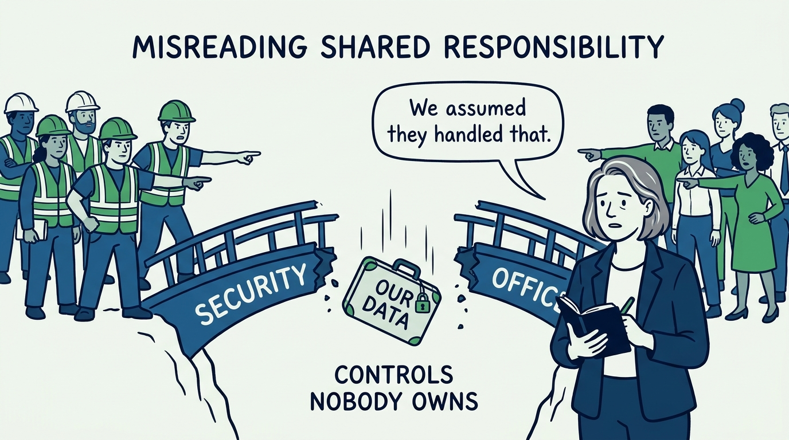
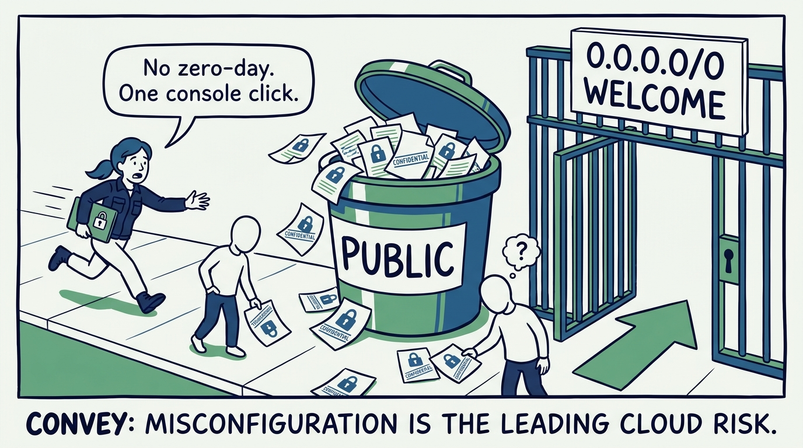
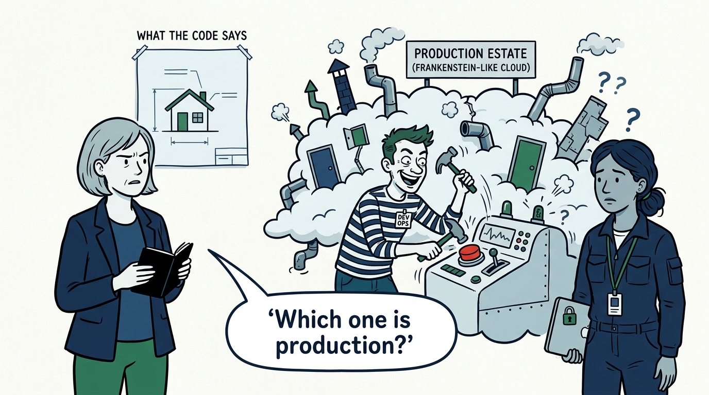
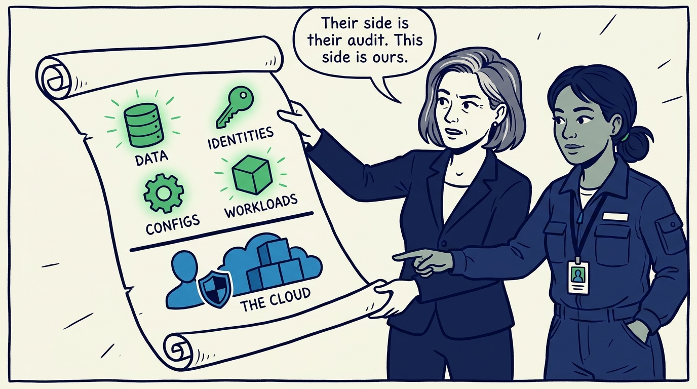
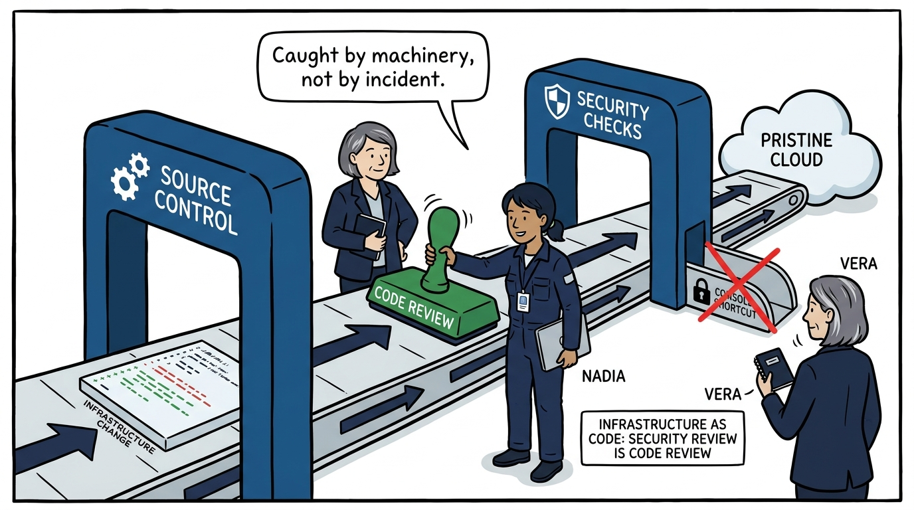
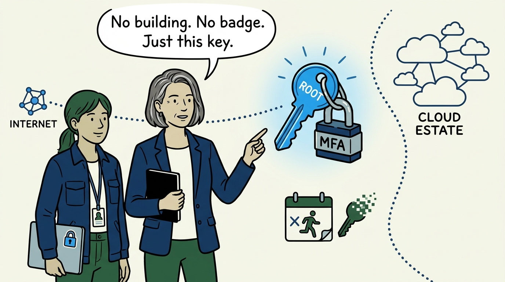
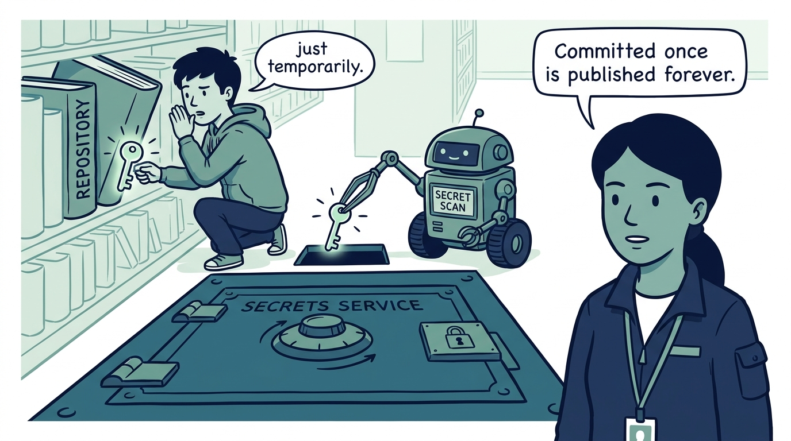
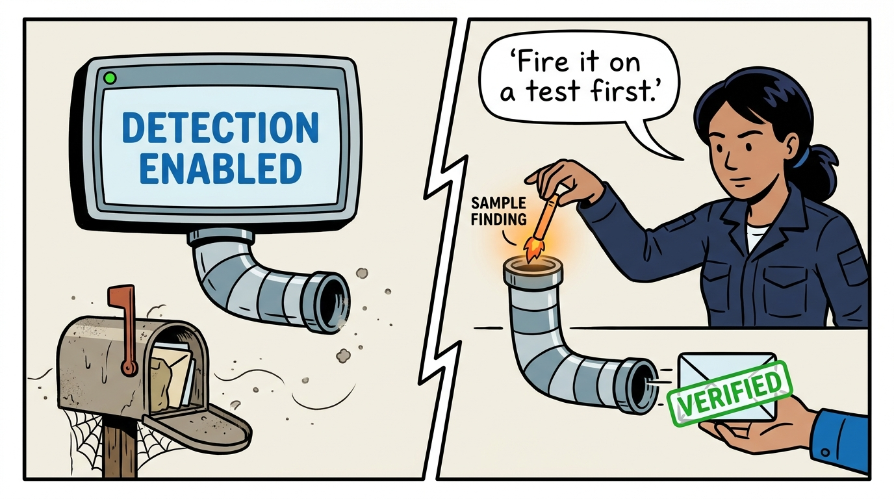
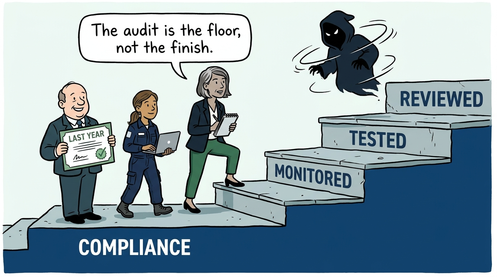

Why the provider secures the cloud while we secure what we put in it — in nine panels.

<!-- comic-style
{
  "cast": "VERA: a calm, seasoned engineering executive, short gray-streaked hair, dark blazer over a plain t-shirt, carries a small black notebook. NADIA: a hands-on defensive-security lead, shoulder-length dark hair tied back, navy utility jacket over a plain shirt, an access badge on a lanyard, laptop with a padlock sticker under one arm.",
  "style": "Clean two-tone explainer comic, thick ink outlines, flat colors with deep blue and green accents on a light background, generous white space, hand-lettered speech bubbles with SHORT readable text, no photorealism."
}
-->

**Panel 1:** *The hook: every postmortem that begins 'we assumed the provider handled that' is a responsibility-model failure — the control that belonged to nobody.*

**Panel 2:** *The problem: the public bucket and the open security group — cloud estates get breached by one unreviewed change, not exotic attacks; misconfiguration leads the threat model.*

**Panel 3:** *The wrong way: ClickOps drift — an estate shaped by years of unreviewed console changes is unreproducible, unauditable, and different from what the code says.*

**Panel 4:** *The principle: the shared responsibility model is a contract — the provider secures the cloud infrastructure; everything on our side — data, identities, configurations, workloads — has a named owner or it is unowned.*

**Panel 5:** *Practice: infrastructure is code — every change is a diff with an approver, a history, and pipeline security checks, so misconfiguration is caught before deployment, by machinery.*

**Panel 6:** *Practice: identity is the perimeter — MFA on root and every administrator, centralized SSO, and access that dies the day someone leaves, not at the next quarterly review.*

**Panel 7:** *Practice: no secret ever lands in source code — repositories are scanned, secrets live in a dedicated service, rotation is routine, and an exposure response process exists before the exposure.*

**Panel 8:** *The cost: 'GuardDuty enabled' is not detection — build the pipe, generate a sample finding, and watch the notification arrive end to end, before the day it fires for real.*

**Panel 9:** *The closer: auditors certify the past; attackers work in the present — compliance is the baseline the program never falls below, and never the program itself.*
