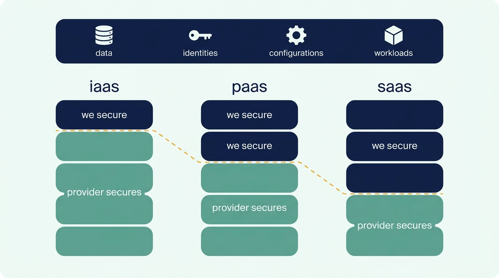
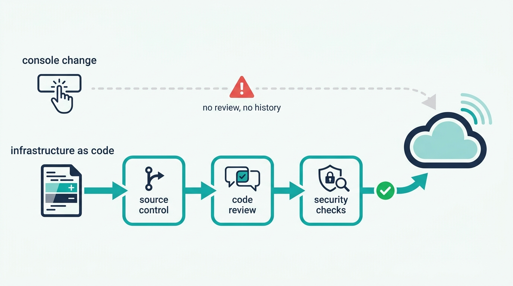
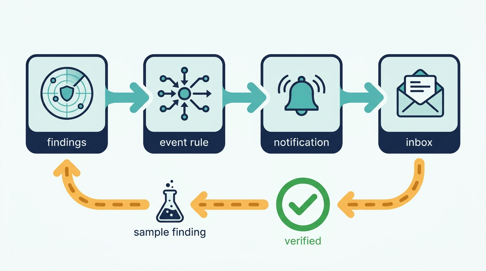

> **Status**: DRAFT
>
> **Principle**: The provider secures the cloud; my organization secures what it puts in the cloud — **the data, the identities, the configurations, and the workloads**. That split is a contract, read correctly for every service model, and everything else follows from it. **Misconfiguration is treated as the leading cloud risk**, countered with continuous audits, automated configuration monitoring, and **infrastructure as code in source control behind code review and pipeline security checks**; **MFA sits on every root and administrator account** and access is removed the day someone leaves; **IAM is least-privilege by role**, reviewed regularly, with alerts on unexpected escalation; **the old disciplines — inventory, patching, backups, encryption, logging — carry into the cloud undiminished**; **architecture follows established patterns and the provider Well-Architected frameworks**, reassessed as workloads change; and **no alert is trusted until it has fired on a test**. The rule that closes the record: **compliance is the baseline of the security program — never the end of it.**

## Statement

This is the bar every cloud account, subscription, and project in my organization is held to.

**The shared responsibility model is read correctly — per service model.**

- The differences between **SaaS, PaaS, and IaaS** are understood, and for each service model it is explicit what the provider secures and what my organization secures. The shared responsibility model is reviewed for AWS, Azure, and GCP — and the chapter's summary rule is mine: the provider generally secures the cloud infrastructure, while **we secure our data, identities, configurations, and workloads**.

**Figure 1:** *The responsibility line moves with the service model — but data, identities, configurations, and workloads stay on our side of the contract in every column.*

**Misconfiguration is the threat model's first entry.**

- Cloud configurations are audited regularly, with **automated configuration-monitoring tools** doing the continuous watching — AWS Config, Azure Policy and Defender for Cloud, and Google Security Command Center are the worked examples.
- **Least privilege is the default posture**: no overly permissive IAM roles, storage permissions, or firewall rules.
- **Infrastructure is code wherever possible** — stored in source control, changed only through code review, with security checks built into the CI/CD pipelines. An infrastructure change nobody reviewed is a misconfiguration waiting for its incident.

**Credentials and secrets are controlled end to end.**

- Strong password policies, a password vault, **MFA on root and administrator accounts** — extended to all user accounts where possible — centralized identity management and SSO, and **access removed immediately when employees or contractors leave**.
- **No secret ever lands in source code.** Repositories are scanned for exposed secrets, secrets live in a dedicated secrets-management service, rotation is regular, and a defined process exists for responding when a credential is exposed anyway.

**IAM is least privilege, by role, and watched.**

- Users and services get only the permissions their jobs require, through **role-based access control** with roles scoped to job function. Permissions are reviewed regularly across users, groups, services, and roles; unused and excessive privileges are removed; privileged permission changes are monitored; and **unexpected privilege escalation raises an alert**, not a retrospective.

**The old disciplines carry into the cloud undiminished.**

- An inventory of cloud assets; regular patching; continuous vulnerability scanning; critical data backed up **with restoration procedures tested**; a disaster recovery plan; sensitive data encrypted; network boundaries secured with firewalls, VPNs, and appropriate access controls; security logs collected, retained, and monitored for suspicious behavior — under recognized frameworks, with **CIS Controls and NIST CSF** as the named references.

**Architecture is deliberate, not improvised.**

- Established architecture patterns over designed-from-scratch; application layers separated in a **three-tier architecture** where appropriate; networks segmented so internal tiers are never directly internet-exposed; strict network ACLs and security groups.
- **Microservices where isolation and independent scaling pay** — with inter-service communication secured and dependencies and inherited risks reviewed; **event-driven architecture where appropriate** — with security controls on producers, consumers, and channels; provider reference architectures as the starting point.
- The **AWS Well-Architected Framework, Microsoft Azure Well-Architected Framework, and Google Cloud Architecture Framework** are reviewed, security is evaluated alongside reliability, performance, operations, and cost, and architecture is reassessed as workloads and threats change.

**Detection is wired, centralized — and tested before it is trusted.**

- Visibility into the overall security posture; cloud environments monitored for threats and vulnerabilities; alerts configured for the security events that matter; logs and alerts centralized in a SIEM where possible; incident-response procedures written for cloud security events.
- **Security alerts are tested before production relies on them.** The chapter's AWS GuardDuty exercise is the worked example: wire GuardDuty findings through EventBridge to an SNS email notification, then generate sample findings and verify the notification arrives — end to end, before the day it matters.

**Compliance is the baseline, not the destination.**

- The final review closes on the rule that frames this whole record: passing the audit is where the security program starts, not where it stops.

## How to Read This

This record closes the **Hardening the Estate** section of the journal — after [[endpoints]] and [[databases]], because the cloud is where an increasing share of both now lives. It is grounded in the Cloud Infrastructure chapter of the *Defensive Security Handbook*. Where the chapter names provider tools — AWS Config, Azure Policy and Defender for Cloud, Google Security Command Center, GuardDuty — the checklist keeps them verbatim, including the full GuardDuty exercise, and this article states the commitments at the capability level with the named services as the worked example. The full working checklist lives in the **Checklist** tab; the management summary is in the **TL;DR** tab and the conversation in the **Conversation** tab.

## Rationale

**The shared responsibility model is a contract, and misreading it creates controls nobody owns.** Every cloud breach postmortem that begins "we assumed the provider handled that" is a responsibility-model failure, not a technology failure. The split moves with the service model — the provider covers more of the stack in SaaS than in IaaS — which is why the record requires understanding it *per model* and *per provider*, not as a slogan. Read correctly, the model is actually clarifying: the provider's side is their problem and their audit; everything on my side — data, identities, configurations, workloads — has a named owner in my organization or it is unowned.

**Misconfiguration, not exotic attack, is how cloud estates get breached.** The public-bucket, open-security-group, over-permissive-role genre of incident requires no zero-day and no adversary sophistication — just one console change nobody reviewed. That is why the record leads its threat model with misconfiguration and answers it structurally: automated configuration monitoring watching continuously, because point-in-time audits cannot keep pace with an estate that changes hourly; and least privilege as the default posture, because the cost of an over-permissive role is invisible until the day it is catastrophic.

**Infrastructure as code turns security review into code review.** A console change is invisible, unreviewed, and unreproducible; the same change as code in source control is a diff with an approver, a history, and a rollback. Putting security checks into the CI/CD pipeline compounds the effect — misconfigurations get caught before deployment, by machinery, rather than after deployment, by incident. This is the single highest-leverage commitment in the record: it converts the leading cloud risk into an ordinary engineering workflow.

**Figure 2:** *A console change is invisible and unreproducible; the same change as code is a diff with an approver, a history, and security checks that catch misconfiguration before deployment.*

**In the cloud, identity is the perimeter.** There is no building, no badge reader, and no firewall between the internet and a leaked root credential — which is why MFA on root and administrator accounts is non-negotiable and extended to everyone where possible, why identity is centralized behind SSO, and why access is removed *immediately* on departure, not at the next quarterly review. The same logic drives the secrets discipline: a token in a repository is a credential published to whoever reads the repository, so repositories are scanned, secrets live in a dedicated service, rotation is routine, and — because prevention fails — an exposed-credential response process exists before the exposure.

**The cloud does not repeal the old disciplines; it accelerates the penalty for skipping them.** Inventory, patching, vulnerability scanning, backups, encryption, logging — none of this is cloud-native wisdom; it is the same hygiene the rest of this journal demands, carried into an environment where a forgotten asset is a public asset and drift happens at API speed. The frameworks the chapter names — CIS Controls, NIST CSF — matter here for the same reason: they keep the hygiene program shaped by an external standard rather than by whatever the team remembered.

**Architecture choices are security choices.** Established patterns, tiering, and segmentation are not aesthetics — they decide whether an internal tier is reachable from the internet and whether one compromised component means one compromised system. The record's microservices and event-driven clauses cut both ways deliberately: those styles buy isolation and independent scaling, and they multiply the surfaces — inter-service communication, producers, consumers, channels — that must each be secured. The provider Well-Architected frameworks earn their place because they institutionalize the review: security evaluated alongside reliability, performance, operations, and cost, and *reassessed* as workloads and threats change, because an architecture reviewed once is an architecture aging silently.

**An untested alert is not detection — it is decoration.** The gap between "GuardDuty is enabled" and "a finding reaches a human who acts" is exactly where detection programs die: the unconfirmed subscription, the misrouted rule, the mailbox nobody reads. The chapter's GuardDuty exercise is the discipline in miniature — build the pipe (GuardDuty → EventBridge → SNS), then *generate sample findings* and watch the email arrive. The principle generalizes past AWS: every alert the organization plans to rely on gets fired deliberately, end to end, before the day it fires for real.

**Figure 3:** *An untested alert is decoration: build the pipe, fire a sample finding through it, and watch the notification arrive — end to end, before the day it matters.*

**Compliance is the floor, because auditors certify the past and attackers work in the present.** A compliant estate is one that met a defined bar on the day of assessment; threats, workloads, and configurations all move faster than certification cycles. The record adopts the chapter's closing rule as its own frame: treat compliance as the baseline the program must never fall below — and never mistake it for the program.

## What This Means in Practice

| What this record says | What it does **not** say |
| --- | --- |
| Responsibility is explicit per service model: the provider secures the cloud, we secure data, identities, configurations, and workloads. | The provider handles security — "managed" moves the host, never the accountability for what we deploy. |
| Configurations are monitored continuously by automated tooling. | An annual audit is enough — the estate changes hourly; point-in-time checks certify the past. |
| Infrastructure changes go through code, source control, review, and pipeline security checks. | Console changes are fine if careful — an unreviewed change is a misconfiguration awaiting its incident. |
| MFA on root and admin accounts, extended to all users where possible; access removed immediately on departure. | MFA is for the security team — the leaked admin credential is the whole perimeter. |
| IAM is role-based least privilege, reviewed, with alerts on unexpected escalation. | Broad roles are acceptable to keep teams moving — the cost is invisible until it is catastrophic. |
| Backups exist and restoration is tested; DR is planned; hygiene follows CIS Controls or NIST CSF. | Cloud durability replaces backups — replication faithfully replicates the deletion too. |
| Alerts are tested end to end — sample findings generated, notification verified — before being relied on. | Enabling the detection service is detection — an unfired alert is a hypothesis. |
| Compliance is the baseline the program never falls below. | Passing the audit is the goal — auditors certify the past; attackers work in the present. |

Concretely: every cloud account in my organization has automated configuration monitoring on, MFA on root, infrastructure changes flowing through reviewed code, and a detection pipeline that has fired on a test — and the first audit question is *"show me the sample finding arriving, not the service being enabled."*

## Anti-Patterns

- **The responsibility gap.** "We assumed the provider handled that" — the control that belonged to nobody, discovered in the postmortem.
- **ClickOps drift.** An estate shaped by years of console changes nobody reviewed — unreproducible, unauditable, and different from what the IaC says.
- **The wildcard role.** Permissions granted with a `*` to unblock a sprint, never revisited — the compromised service account that could do everything.
- **Root without MFA.** The most powerful credential in the estate protected by a password alone — the whole perimeter, one phish wide.
- **The token in the repo.** An API key committed "temporarily" to a private repository — private is one fork, one leak, one contractor away from public.
- **The departed contractor's key.** Access that outlived the engagement because offboarding runs quarterly — a live credential in nobody's hands officially, somebody's actually.
- **The alert nobody tested.** GuardDuty enabled, notifications never verified — the finding fires on breach day and lands in an unconfirmed subscription.
- **Compliance as finish line.** The estate that passes the audit and stops there — certified against last year's bar, exposed to this year's attacker.

## Related Records

- [[databases]] — the data layer this estate hosts; cloud databases are held to that record's same-bar-as-on-premises rule.
- [[authentication]] — the organization-wide identity model behind this record's MFA, SSO, and centralized-identity commitments.
- [[network-segmentation]] — the design discipline behind this record's tiering, ACLs, and never-expose-internal-tiers rule.
- [[logging-and-monitoring]] — the SIEM pipeline this record's cloud logs and alerts centralize into.
- [[vulnerability-management]] — the continuous scanning this record requires, as an organization-wide loop.
- [[incident-response]] — the plan the cloud-specific response procedures written here plug into.
- [[compliance]] — the baseline this record's closing rule positions the whole program above.

## Scope and Revisiting

This record is `draft`. It applies to every cloud account, subscription, and project my organization operates, across providers, and as the audit bar for the existing estate. I revisit it if the provider mix or service-model mix shifts materially (each shift moves the responsibility line), if an audit finds infrastructure changing outside the code path (the IaC claim failing in practice), or if an alert that was never test-fired is found carrying production reliance — that is the record's central discipline failing silently.

## Authoritative References

- *Defensive Security Handbook*, 2nd edition — Lee Brotherston, Amanda Berlin, and William F. Reyor III (O'Reilly) — the Cloud Infrastructure chapter, whose checklist (including the AWS GuardDuty exercise and the final security review) this record distills.
- CIS Controls — named by the chapter as a recognized security framework for cloud hygiene.
- NIST Cybersecurity Framework — named by the chapter as a recognized security framework for cloud hygiene.
- AWS Well-Architected Framework, Microsoft Azure Well-Architected Framework, and Google Cloud Architecture Framework — the provider architecture frameworks the chapter directs reviews toward.
