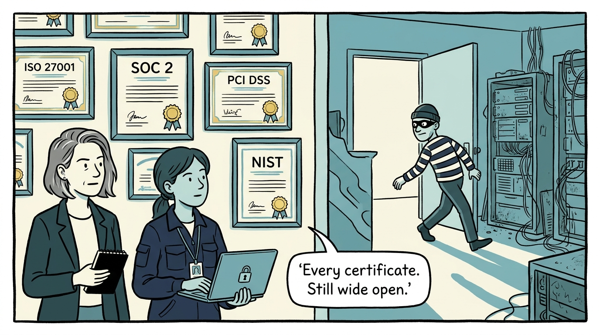
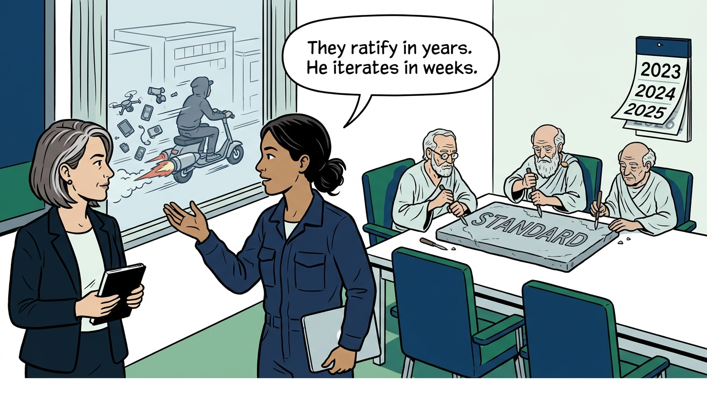
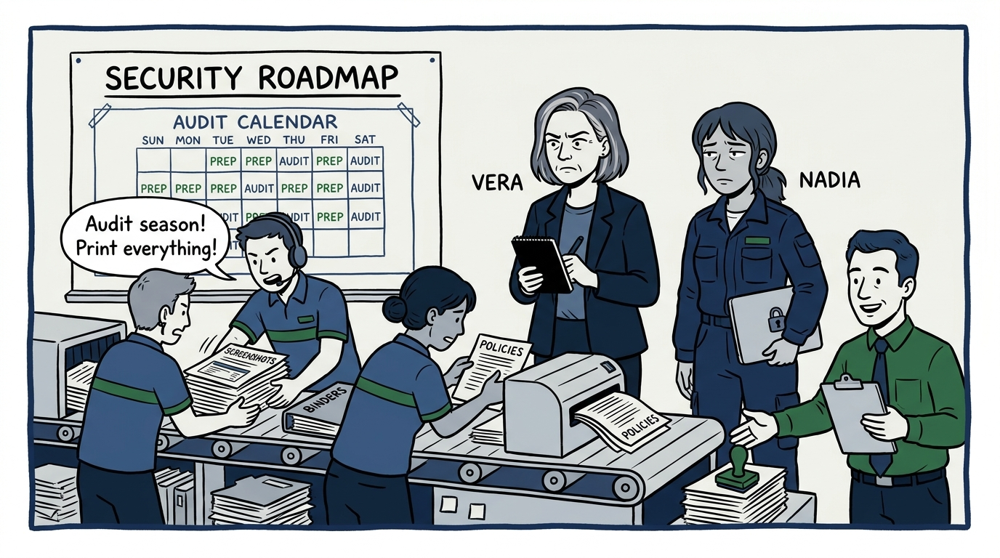
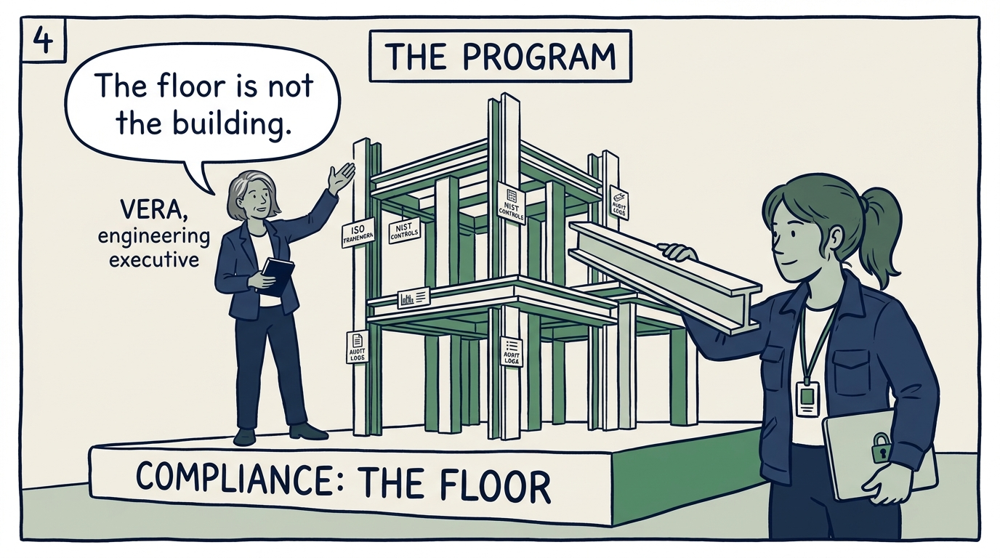
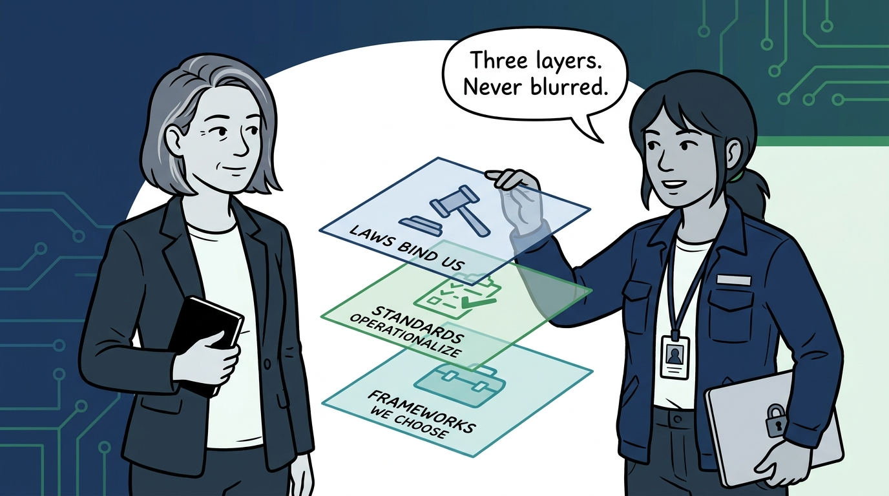
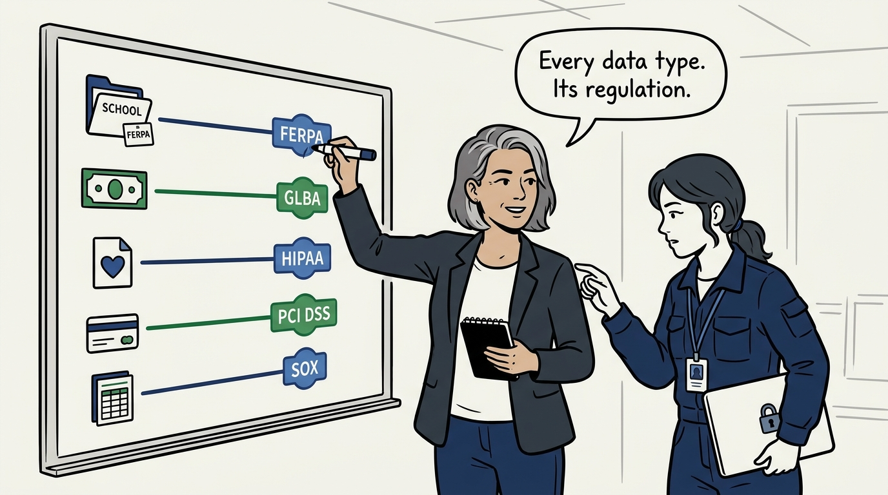
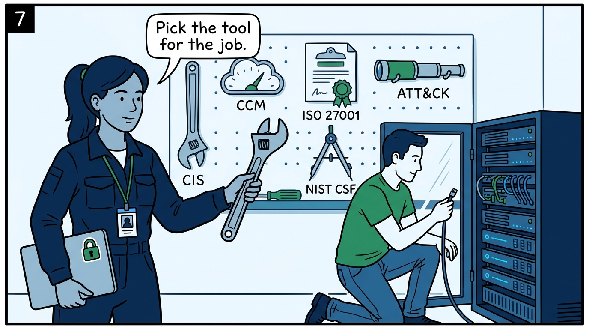
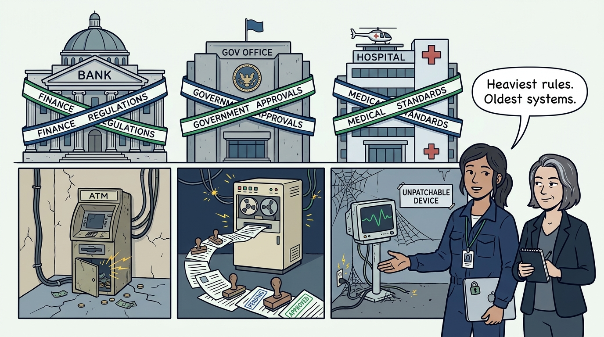
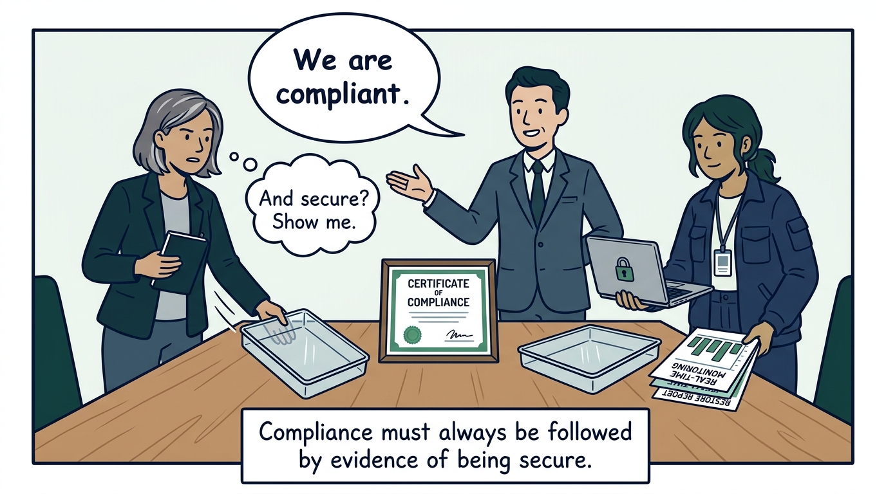

Why compliance is the floor of a security program and never the program itself — in nine panels.

<!-- comic-style
{
  "cast": "VERA: a calm, seasoned engineering executive, short gray-streaked hair, dark blazer over a plain t-shirt, carries a small black notebook. NADIA: a hands-on defensive-security lead, shoulder-length dark hair tied back, navy utility jacket over a plain shirt, an access badge on a lanyard, laptop with a padlock sticker under one arm.",
  "style": "Clean two-tone explainer comic, thick ink outlines, flat colors with deep blue and green accents on a light background, generous white space, hand-lettered speech bubbles with SHORT readable text, no photorealism."
}
-->

**Panel 1:** *The hook: every attestation current, and the back door open — an organization can hold every certificate and still be soft. Compliant and weak is a real state.*

**Panel 2:** *The problem: compliance standards are negotiated minimums — the least an industry could agree everyone must do, ratified at the speed of regulation while attackers iterate at the speed of weeks.*

**Panel 3:** *The wrong way: the certificate as strategy. The roadmap becomes the audit calendar, evidence is manufactured annually, and the team optimizes for the assessor instead of the adversary.*

**Panel 4:** *The principle: compliance is the floor, never the program. The floor is mandatory — but the program is built to the risk, and compliance falls out of a program built honestly, never the reverse.*

**Panel 5:** *Keep the map layers straight: laws and regulations bind us, compliance standards operationalize them into auditable requirements, and frameworks are instruments we choose in order to build — blur them and budget flows to attestation instead of defense.*

**Panel 6:** *The executive's minimum viable competence: student records mean FERPA, nonpublic personal information means GLBA, ePHI means HIPAA, cardholder data means PCI DSS, financial-reporting controls mean SOX — each with its own enforcement behind it.*

**Panel 7:** *Frameworks are how the floor becomes a program — CIS to harden, CCM for cloud, ISO 27001 to certify, ATT&CK for adversary behavior, NIST CSF for a common risk language. Using instruments, not collecting them.*

**Panel 8:** *Regulated does not mean secure: finance, government, and healthcare carry the heaviest rules and some of the oldest, softest infrastructure — understanding why the regulation exists shows where a merely compliant posture fails first.*

**Panel 9:** *The closer: being compliant is never mistaken for being secure — in every audit and budget conversation, 'we are compliant' must be followed by the evidence that we are also secure.*
