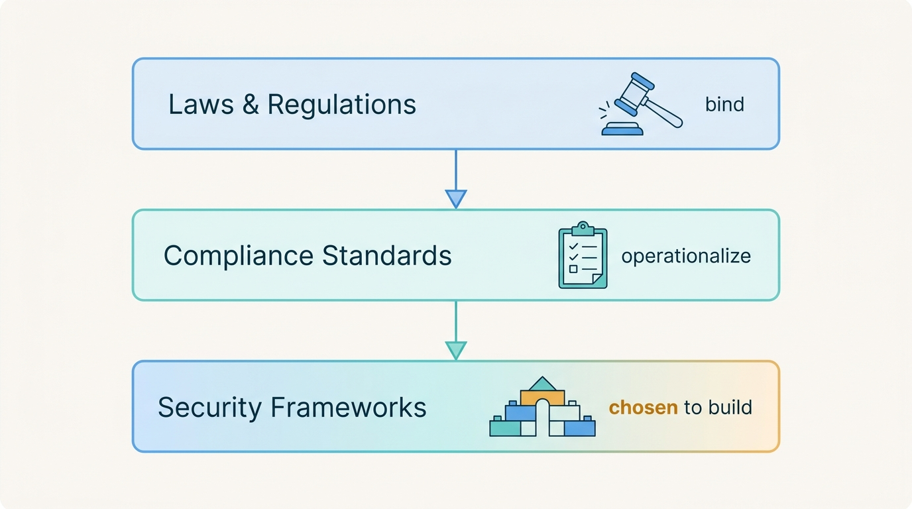
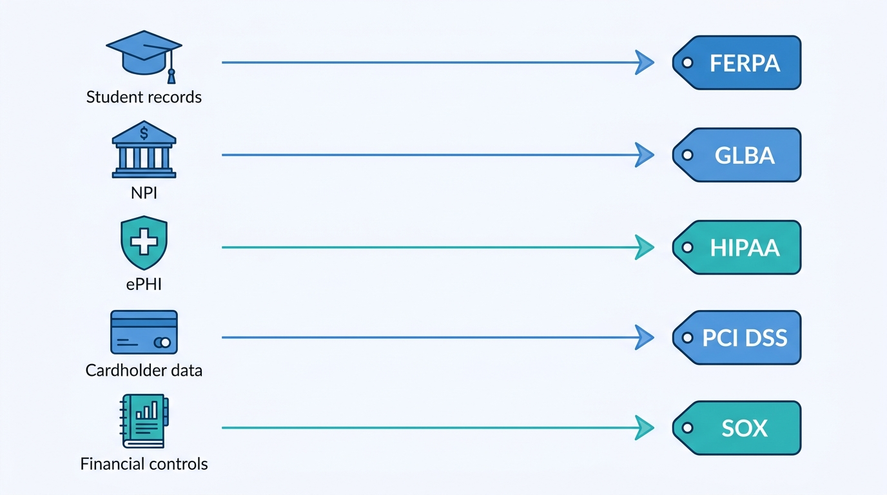
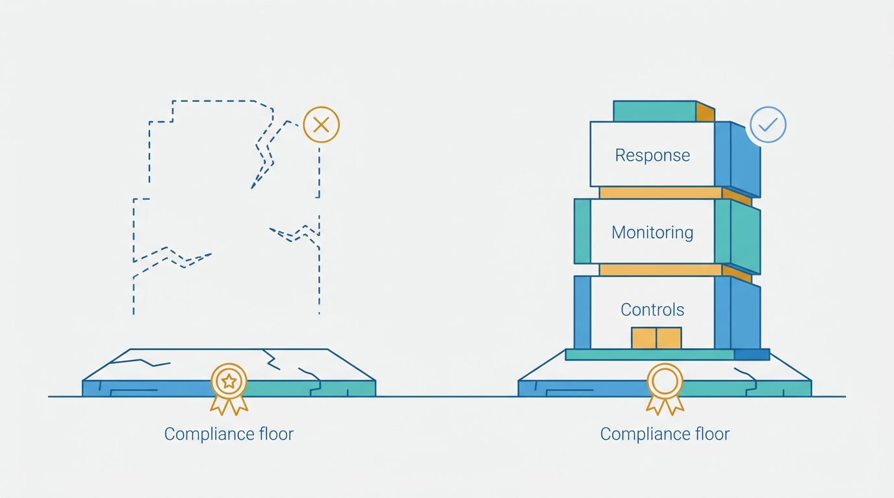

> **Status**: DRAFT
>
> **Principle**: My organization treats compliance as the floor, never the program. **Compliance standards are minimum requirements** — an organization can be fully compliant and still be weak — so we keep the map layers straight: **laws and regulations bind us, compliance standards operationalize them, and security frameworks are what we choose to actually build with**. **For every regulated data type we hold, we can name the regulation that governs it** — FERPA for student records, GLBA for nonpublic personal information, HIPAA for ePHI, PCI DSS for cardholder data, SOX for the controls behind financial reporting — and we know the enforcement and penalties behind each. **Frameworks — CIS, CCM, COSO, COBIT, ISO 27000, MITRE ATT&CK, NIST CSF — are how the floor becomes a program**, and the structural risks of regulated industries are understood, not just their paperwork. The test I hold the posture to: **being compliant is never mistaken for being secure** — effective security combines compliance requirements with established frameworks and security best practice.

## Statement

When my organization reasons about compliance, this is the literacy and posture it is held to.

**Compliance is understood as the floor.**

- **Compliance standards are minimum requirements**, not complete security programs; an organization can be compliant and still have serious security weaknesses.
- The difference between **regulatory compliance standards** and **security frameworks** is understood and never blurred; compliance requirements vary by industry, country, and governing body; compliance officers coordinate the regulatory requirements; and compliance obligations may involve administrative, technical, and physical controls.

**Figure 1:** *The map has three layers that are never blurred: laws bind, compliance standards operationalize, and security frameworks are chosen instruments for building the program.*

**Every regulated data type maps to its regulation.**

- **FERPA** — student education records at educational institutions: the education-records versus directory-information distinction, PII disclosure requiring authorization, what valid consent must identify, and the honest note that FERPA carries relatively few specific cybersecurity requirements.
- **GLBA** — financial institutions and **nonpublic personal information (NPI)**: an ongoing obligation to protect customer privacy and confidentiality; administrative, technical, and physical safeguards; a concrete control set (access controls, audit trails, change management, disposal, encryption, MFA, secure development, system inventory and monitoring, third-party standards, written risk assessments); third-party providers in scope; and enforcement by the FTC, FDIC, Federal Reserve, and OCC.
- **HIPAA** — **electronic protected health information (ePHI)** at providers, health plans, and clearinghouses: administrative, physical, and technical safeguards plus policies and documentation; the **required versus addressable** distinction; risk assessment and mitigation; breach reporting to HHS and in some cases the FTC; civil and criminal penalties.
- **PCI DSS** — **payment card and cardholder data** wherever it is stored, processed, or transmitted: required by the card brands, administered by the PCI Security Standards Council, covering the PAN, cardholder name, expiration date, and service code — with fines, penalties, or loss of card-processing capability behind failed validation.
- **SOX** — corporate governance and financial reporting at U.S. public companies: Section 302's safeguards for accurate reporting, Section 404's independently verifiable controls, disclosure of security weaknesses affecting financial information, and COSO or COBIT as the usual supporting structures.

**Figure 2:** *The executive's minimum viable competence: every regulated data type maps from memory to the regulation that governs it.*

**Frameworks are how the floor becomes a program.**

- **CIS** for benchmarks and system-hardening guidance that complement other frameworks; **CSA's Cloud Controls Matrix** for cloud security mapped to the major compliance standards; **COSO** for enterprise risk, internal controls, and fraud deterrence; **COBIT** (ISACA) for governance across its Plan-and-Organize, Acquire-and-Implement, Deliver-and-Support, and Monitor-and-Evaluate domains.
- **The ISO 27000 series** for information security management — 27001's ISMS requirements through 27006's certification requirements — and the ISMS as the organizing idea; **MITRE ATT&CK** for adversary tactics, techniques, and procedures across enterprise, cloud, mobile, and industrial systems, used by offense and defense alike; **NIST CSF** for managing cybersecurity risk through its Core, Profiles, and Implementation Tiers.

**Regulated industries are understood structurally, not just contractually.**

- **Financial**: highly valuable data and a specific risk list — account takeover, third-party payment-processor breaches, ATM skimming, point-of-sale vulnerabilities, mobile and internet banking attacks, supply-chain compromise — amplified by legacy systems.
- **Government**: large volumes of sensitive information under slow approval processes, legacy technology, and complex regulation — with **CMMC** (tiered maturity for the defense supply chain), **DoD Impact Levels** (sensitivity-based classification driving cloud-provider selection), **FedRAMP** (cloud security for federal use, built in part on NIST SP 800-53), and **FISMA** (federal information-security programs) as the operative programs.
- **Healthcare**: highly sensitive patient information on outdated and legacy medical systems where device patching and OS upgrades are genuinely hard, HIPAA's financial and criminal penalty exposure, and **HITRUST CSF** as the industry's harmonization of HIPAA, NIST, ISO, and PCI DSS.

**The posture is literacy, verified.**

- I can explain the difference between a law or regulation, a compliance standard, and a security framework; match FERPA, GLBA, HIPAA, PCI DSS, and SOX to the industries and data they protect; explain the purpose of CIS, CCM, COSO, COBIT, ISO 27000, MITRE ATT&CK, and NIST CSF; identify CMMC, FedRAMP, FISMA, and DoD Impact Levels; and explain why finance, government, and healthcare are heavily regulated — while holding the two closing commitments: **compliant does not automatically mean secure**, and effective security combines compliance requirements with established frameworks and best practice.

## How to Read This

This record closes **The Security Program** section of the journal — the external-obligations frame around [[security-program]], [[policies]], and [[standards-and-procedures]]. It is grounded in the Industry Compliance Standards and Frameworks chapter of the *Defensive Security Handbook* (Brotherston, Berlin, and Reyor), which is deliberately a literacy chapter: its checklist tests what the responsible executive can explain, match, and distinguish — because compliance failures usually start as category confusion at the top. The full working checklist — core concepts, the regulation map, the framework shelf, the regulated industries, and the final review — lives in the **Checklist** tab; the management summary is in the **TL;DR** tab and the conversation in the **Conversation** tab.

## Rationale

**The floor is not the building.** Compliance standards are negotiated minimums — the least an industry could agree that everyone must do, ratified on the timescale of regulation while attackers iterate on the timescale of weeks. That is why the chapter's very first item is that compliance standards are minimum requirements, and why an organization can hold every certificate and still be soft: the standard cannot anticipate our architecture, our threat model, or this quarter's attacker technique. I fund the program to the risk, and let compliance fall out of a program built honestly — never the reverse.

**Figure 3:** *The floor is not the building: an organization can hold every certificate and still be soft — the program is what gets built on top of the mandatory minimum.*

**Category confusion at the top becomes control failure at the bottom.** A law binds us whether we like it or not; a compliance standard operationalizes the law into auditable requirements; a security framework is a structure we *choose* because it helps us build. When an executive blurs these — treating a framework as if it were mandatory, or a passed audit as if it were protection — budgets flow to attestation instead of defense, and the security team optimizes for the assessor instead of the adversary. Keeping the three layers straight is not pedantry; it is what lets me say precisely which obligations are non-negotiable and which structures are instruments.

**The data-to-regulation map is the executive's minimum viable competence.** Student records mean FERPA; nonpublic personal information means GLBA; ePHI means HIPAA; cardholder data means PCI DSS; the controls behind financial reporting mean SOX. Each mapping carries its own enforcement reality — FTC and banking regulators for GLBA, HHS for HIPAA, the card brands' ability to switch off processing for PCI DSS, auditor-verified controls for SOX — and its own texture, like HIPAA's required-versus-addressable distinction or FERPA's thin cybersecurity specifics. An executive who cannot make these mappings from memory cannot triage a breach, scope an audit, or evaluate an acquisition.

**Frameworks are chosen instruments, and each does a different job.** The chapter's shelf is not a menu of equivalents. CIS tells a hardening engineer what good looks like on a specific system; the CCM maps cloud controls to the compliance standards that demand them; COSO and COBIT speak the language of boards and auditors; ISO 27001 turns security management into a certifiable system; ATT&CK describes what adversaries actually do; NIST CSF gives the whole program a common risk language through its Core, Profiles, and Tiers. Knowing which instrument answers which question — and that HITRUST exists precisely because healthcare needed several harmonized at once — is what separates using frameworks from collecting them.

**Regulated industries carry structural risk, not just paperwork.** Finance is heavily regulated because the attack list — account takeover, processor breaches, skimming, supply-chain compromise — is a standing business model, running on legacy systems that raise the risk further. Government carries sensitive data through slow approvals and old technology, which is why FedRAMP, FISMA, CMMC, and impact levels exist at all. Healthcare runs life-critical devices that cannot be patched on a normal cadence, holding data whose breach is uniquely damaging. Understanding *why* the regulation exists tells me where the real risk concentrates — and where a merely compliant posture will fail first.

**The audit is an output, not an objective.** Everything this record demands — the mappings, the framework fluency, the industry context — exists so that compliance evidence is a by-product of a real program, produced on request, rather than a deliverable manufactured annually. The chapter's closing self-test is written in the first person — *I can explain, I can match, I understand* — because this literacy cannot be delegated to the compliance function. Compliance officers coordinate; the executive must still comprehend.

## What This Means in Practice

| What this record says | What it does **not** say |
| --- | --- |
| Compliance standards are minimum requirements — the floor of the program. | Compliance is optional or unimportant — the floor is mandatory; it is just not the building. |
| For every regulated data type we hold, we name the governing regulation and its enforcement. | We hold every regulation's full text in our heads — counsel interprets statutes; we own the map. |
| Regulatory standards and security frameworks are distinct instruments, never blurred. | Frameworks are bureaucracy — a chosen framework is how the program gets structure and a common language. |
| Frameworks are selected by the job: CIS to harden, CCM for cloud, ISO 27001 to certify, ATT&CK for adversary behavior, NIST CSF for risk language. | We adopt every framework on the shelf — collecting frameworks is attestation theater with extra steps. |
| Regulated-industry risk is understood structurally — legacy finance systems, unpatchable medical devices, slow government approvals. | Regulated means secure — the most regulated industries carry some of the oldest and softest infrastructure. |
| Being compliant is never mistaken for being secure. | Audits are adversarial theater to be gamed — evidence flows honestly from a real program. |
| The literacy is the executive's own — explain, match, distinguish. | Compliance work is centralized in one heroic officer — they coordinate; accountability stays with the executive. |

Concretely: for every system and dataset in my organization, I expect one answer to *"which regulation governs this data, and which framework control satisfies it?"* — and in every audit and budget conversation, the sentence *"we are compliant"* is required to be followed by the evidence that we are also secure.

## Anti-Patterns

- **The certificate as strategy.** The security roadmap is the audit calendar; the program does exactly what the assessor checks and nothing the attacker does.
- **Compliant and soft.** Every attestation current, while unmonitored legacy systems, flat networks, and unmanaged data stores sit outside the audited scope — the exact state the chapter's first checklist item warns about.
- **The blurred map.** Frameworks treated as laws, standards treated as suggestions — budget flows to whatever document was most recently confused with an obligation.
- **The framework collector.** ISO, NIST, COBIT, and CIS all "adopted," none operationalized — four vocabularies, zero controls improved.
- **The unmapped data store.** Cardholder data, health records, or NPI discovered in a system nobody scoped — the regulation applied all along; only the awareness was missing.
- **The delegated brain.** Executives who cannot distinguish a regulation from a framework and route every question to the compliance officer — coordination mistaken for accountability.
- **The annual evidence factory.** Screenshots, exports, and policies manufactured in the weeks before the assessment, describing an organization that exists only during audit season.
- **Regulated-equals-secure.** Assuming a bank, hospital, or agency partner is safe because it is regulated — the industries with the heaviest rules run some of the oldest systems.

## Related Records

- [[security-program]] — the program that compliance attests; this record keeps the attestation from being mistaken for the program.
- [[policies]] — where compliance obligations become organizational rules with management endorsement.
- [[standards-and-procedures]] — the documentation layer that must be producible in any audit or compliance review.
- [[asset-management]] — you cannot map data to regulations until you know where the data lives; scope starts there.
- [[cloud-infrastructure]] — where CCM, FedRAMP, and impact-level thinking land on real infrastructure.
- [[logging-and-monitoring]] — audit trails and monitoring are recurring control requirements across GLBA, HIPAA, PCI DSS, and SOX.
- [[vulnerability-management]] — the discipline that keeps the gap between compliant and secure visibly measured.

## Scope and Revisiting

This record is `draft`. It applies to every executive and leader in my organization who owns systems or data touched by regulation, and as the literacy bar for compliance conversations at my level. I revisit it if the regulatory map changes materially (new obligations, new jurisdictions, or an acquisition bringing regulated data types we have not held before), if an audit or breach reveals regulated data outside the mapped scope (the unmapped-data-store anti-pattern occurring in practice), or if the framework shelf shifts — a major revision of NIST CSF, ISO 27001, or PCI DSS that changes what the instruments do.

## Authoritative References

- *Defensive Security Handbook*, 2nd edition (Lee Brotherston, Amanda Berlin, William F. Reyor III; O'Reilly) — the Industry Compliance Standards and Frameworks chapter, whose checklist (including the final review) this record distills.
- The regulations the chapter maps: FERPA, GLBA, HIPAA, PCI DSS (PCI Security Standards Council), and SOX (Sections 302 and 404).
- The frameworks and programs the chapter names: CIS benchmarks, CSA Cloud Controls Matrix, COSO, COBIT (ISACA), the ISO 27000 series (27001–27006), MITRE ATT&CK, NIST CSF, NIST SP 800-53, CMMC, DoD Impact Levels, FedRAMP, FISMA, and HITRUST CSF.
