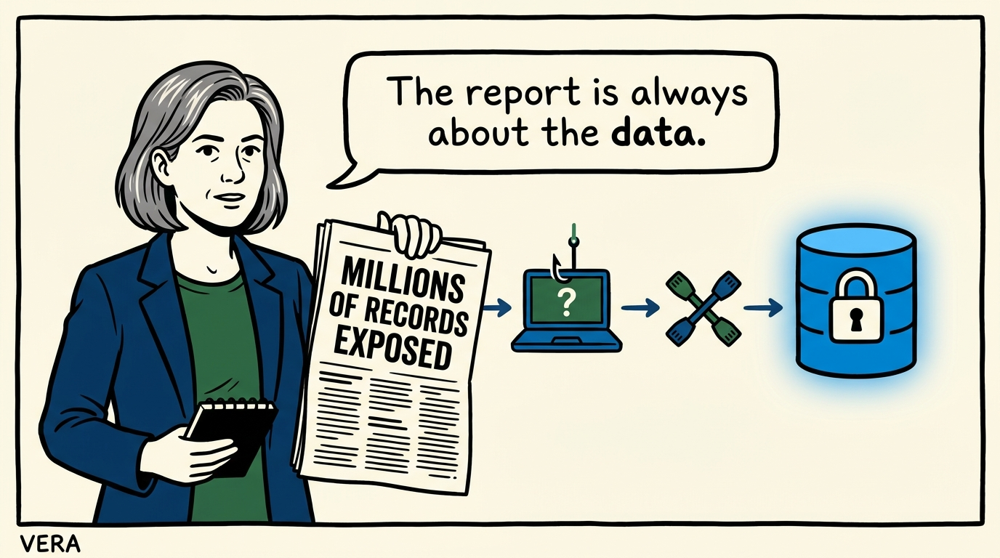
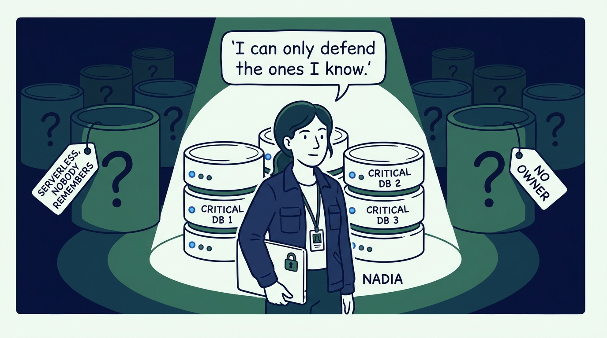
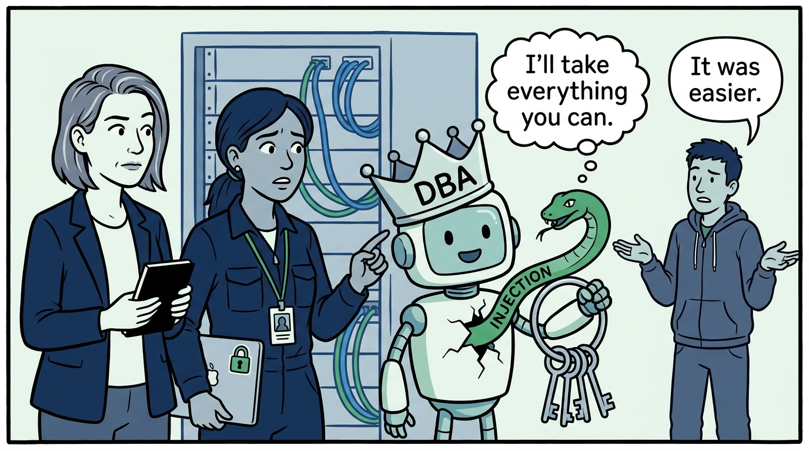
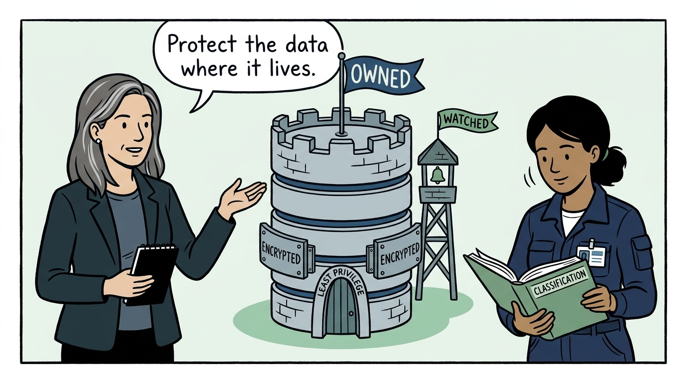
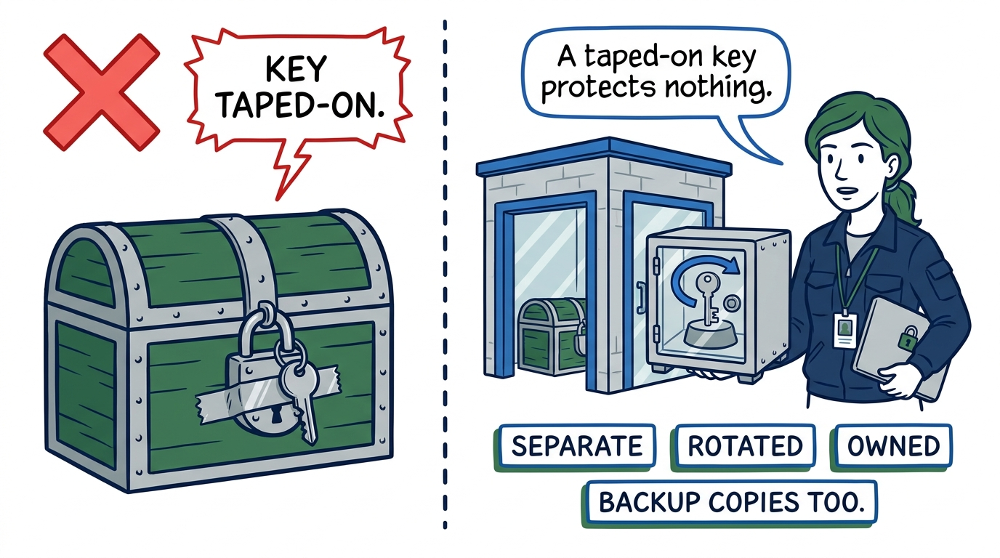
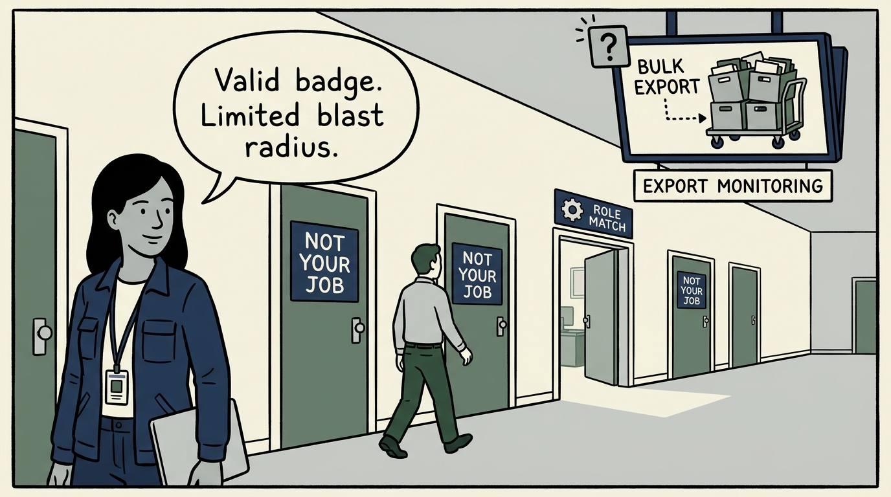
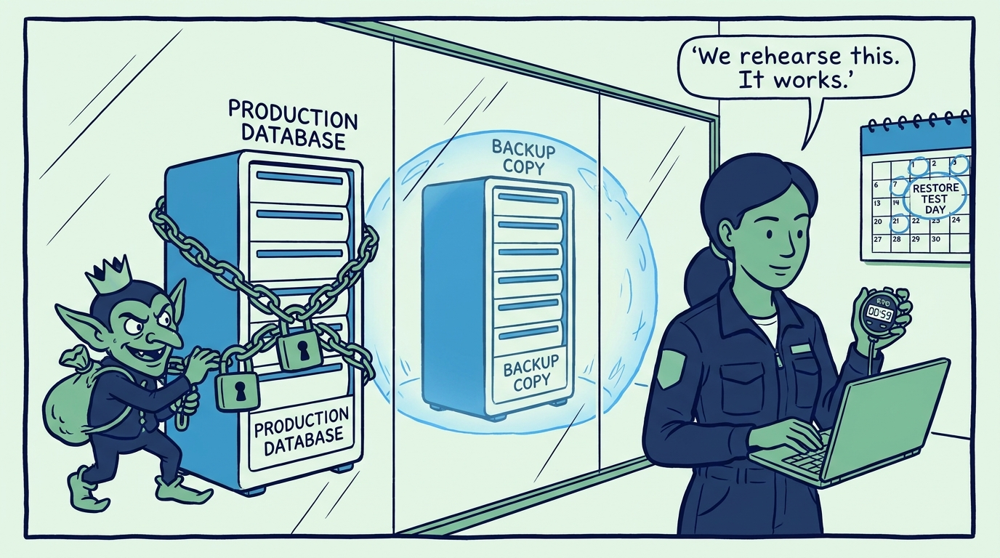
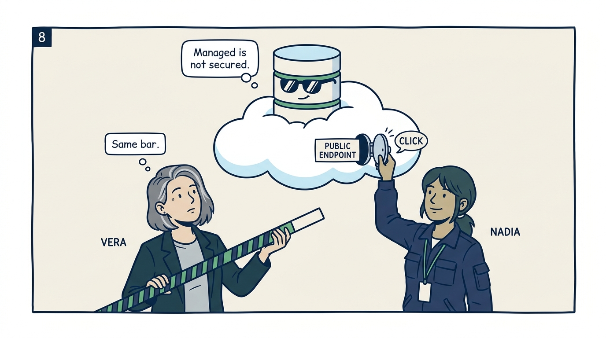
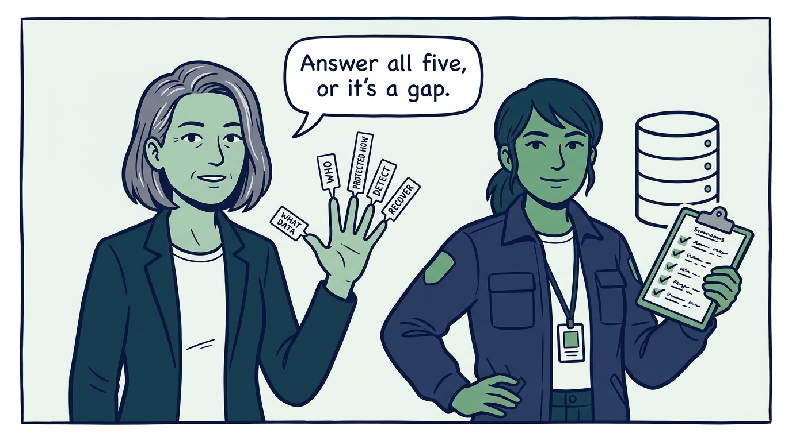

Why the database is where a breach becomes the headline — and the five questions that prove it is defended, in nine panels.

<!-- comic-style
{
  "cast": "VERA: a calm, seasoned engineering executive, short gray-streaked hair, dark blazer over a plain t-shirt, carries a small black notebook. NADIA: a hands-on defensive-security lead, shoulder-length dark hair tied back, navy utility jacket over a plain shirt, an access badge on a lanyard, laptop with a padlock sticker under one arm.",
  "style": "Clean two-tone explainer comic, thick ink outlines, flat colors with deep blue and green accents on a light background, generous white space, hand-lettered speech bubbles with SHORT readable text, no photorealism."
}
-->

**Panel 1:** *The hook: the database is where a security failure becomes the headline — the report that reaches the board is about how many records, whose, and how sensitive.*

**Panel 2:** *The problem: the database nobody owns — an organization that cannot name its critical databases is defending a sample of them and hoping the breach lands in the sample.*

**Panel 3:** *The wrong way: the app account with DBA rights — an injection attack is exactly as powerful as the account the application runs on, so 'it was easier' turns every flaw into a full-database compromise.*

**Panel 4:** *The principle: protect data where it lives — every critical database known, classified, and owned, behind least privilege, encrypted end to end, and watched.*

**Panel 5:** *Practice: encryption is only as good as key separation — keys stored apart from the data, rotated, access-controlled, and owned, and the quieter copies (backups, exports, snapshots, replicas) get the same protection as production.*

**Panel 6:** *Practice: the insider is a user with legitimate credentials — job-based access, separation of duties, and bulk-export monitoring limit the cost of both malice and accident, without presuming bad faith.*

**Panel 7:** *Practice: backups are a security control and attackers target them first — copies an attacker cannot modify or delete, defined RTO and RPO, and restoration tested on a schedule, because an untested restore is a hope.*

**Panel 8:** *The cost of complacency: cloud databases inherit convenience, not security — the provider patches the host, but the data, access, IAM, and configuration stay yours, and the bar is the same as on-premises.*

**Panel 9:** *The closer: five questions for every critical database — what data and where, who can access it and why, how it is protected, how misuse would be detected, and how quickly it recovers. Unanswered clearly, they are not a tooling gap but a governance gap.*
