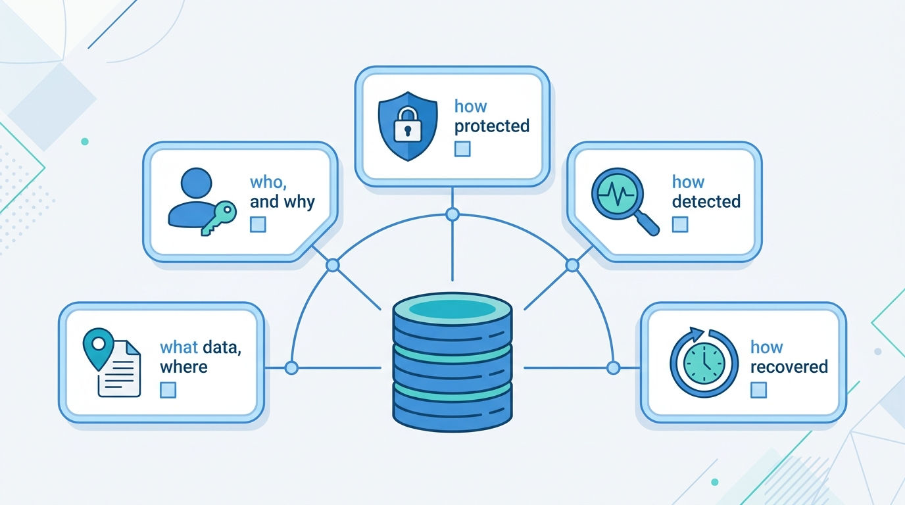
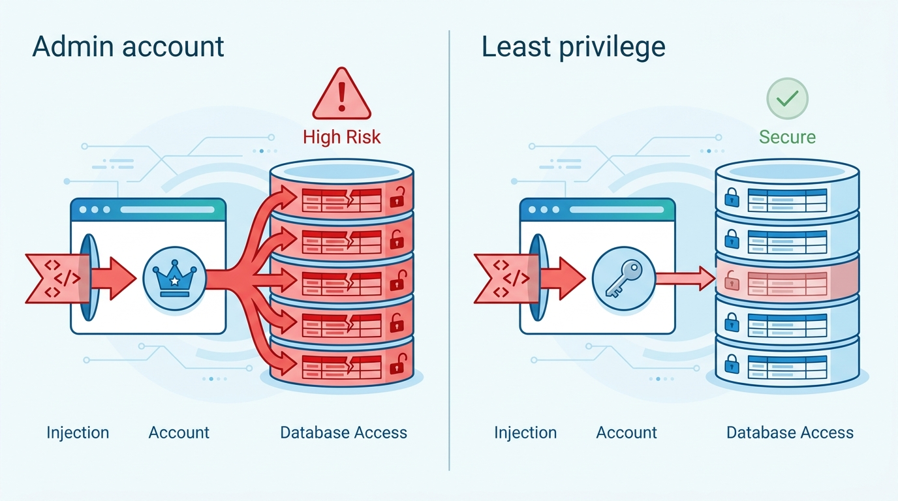
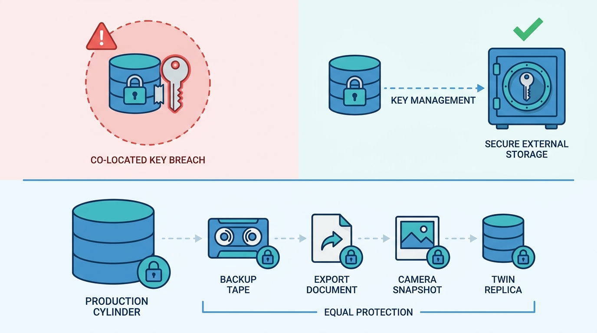

> **Status**: DRAFT
>
> **Principle**: The database is where a security failure becomes the headline, so my organization protects data where it lives. **Every critical database is known, classified, and owned**; **access follows least privilege**, with administrative privileges tightly restricted, privileged activity logged and reviewed, and no shared administrator accounts; **sensitive data is encrypted at rest, in transit, and in backups, with keys stored separately** from the data they protect; **secrets are never hardcoded and passwords never stored in plaintext**; **injection, credential attacks, and insiders are all planned for**, not just outsiders; **backups are encrypted, attacker-resistant, and restore on a tested clock**; and **cloud databases meet exactly the same bar as on-premises ones**. The test I hold every critical database to: **what data do we have and where is it, who can access it and why, how is it protected, how would we detect misuse or compromise, and can we recover quickly if something goes wrong** — if those five questions cannot be answered clearly, my organization has a database-security governance gap.

## Statement

This is the bar every database in my organization is held to — relational or NoSQL, self-managed or cloud-managed, and the serverless ones nobody remembers deploying.

**Figure 1:** *The five-question test: if any critical database cannot answer these clearly, the gap is governance, whatever the tooling.*

**I know my databases — and my data.**

- **Architecture is mapped.** Where critical and sensitive data is stored, which technologies are in use — relational, NoSQL, cloud-managed, serverless, self-managed — which databases are business-critical, and **who owns and operates each one**. MySQL, PostgreSQL, SQL Server, and MongoDB are the worked examples; the commitment covers whatever actually runs.
- **The cloud difference is understood.** The security implications of on-premises versus cloud-hosted databases, and the shared responsibility model for the cloud-managed ones.
- **Data is classified, and risk drives protection.** Databases holding customer, personal, financial, credential, intellectual-property, and operationally critical data are identified, and the highest-risk databases receive the strongest protection.

**Access is least privilege; privileged access is managed, not trusted.**

- Users and applications receive only the permissions they require; administrative privileges are tightly restricted; former employees and unnecessary accounts are removed promptly; privileged access requires strong authentication; service accounts and application credentials are securely managed; shared administrator accounts are avoided.
- **Privileged access is known, logged, monitored, and periodically reviewed** — with a Privileged Access Management solution considered for critical systems, and application accounts verified to hold no unnecessary administrator or system-level privileges.

**Encryption is end to end, and keys live apart from data.**

- Sensitive data is encrypted at rest and in transit over TLS; backups are encrypted; Transparent Data Encryption is understood where it applies. **Encryption keys are stored separately from the encrypted data**, rotated, access-controlled, and owned — through a real key-management or secrets-management solution.

**Secrets are managed; passwords are hashed.**

- Passwords are never stored in plaintext — they are protected with appropriate password-hashing algorithms and salts, and the difference between hashing and encryption is understood by the people making the choice.
- Database passwords, API keys, and connection strings are never hardcoded in application source; a centralized secrets manager holds them, and rotation happens without major operational disruption.

**Every attack mode has a plan — including the ones with valid credentials.**

- **Injection**: applications use parameterized queries, validate input, run on least-privileged database accounts — because SQL injection becomes dramatically more dangerous when the application has excessive privileges — and injection is covered by secure coding standards and application security testing.
- **Credential attacks**: brute force, credential stuffing, password reuse, dictionary attacks, and stolen credentials are countered with strong policies, MFA for administrative access, lockout and rate limiting, monitoring of abnormal authentication failures, and default credentials removed.
- **Insiders**: malicious and accidental insider risk are both recognized; access follows job responsibility, privileged-user activity is monitored, separation of duties holds for sensitive administrative operations, sensitive data cannot be copied or exported without controls, and access is reviewed on every role change.
- **Exfiltration**: databases are not unnecessarily exposed to the public internet; communications are protected from interception; backups, exports, snapshots, and replicas are secured; production data is restricted in development and test; unusual bulk downloads are monitored; and cloud misconfiguration is understood as a leading exposure path.

**Configuration is hardened and vulnerabilities are patched on a clock.**

- Databases follow documented hardening standards — least functionality, unnecessary services disabled, insecure defaults removed, network connectivity restricted to required systems, firewalls and segmentation applied — with **CIS Benchmarks and DISA STIGs** as the recognized references and regular configuration reviews.
- Platforms and versions are known, unsupported versions are identified and replaced, patch timelines for critical vulnerabilities are defined, exceptions carry compensating controls, and critical vulnerabilities are tracked through remediation.

**Activity is logged, alerts are owned, backups restore.**

- Important activity is logged: authentication successes and failures, privileged administrative actions, permission and configuration changes, unusual queries and large transfers — forwarded to centralized monitoring such as a SIEM or XDR platform, with defined alerts, sufficient retention, and **a named person responsible for reviewing and responding**.
- Critical databases are backed up regularly with encrypted, access-restricted backups and **copies an attacker cannot easily modify or delete**; RTO and RPO are defined; restoration is tested regularly — recovery procedures are proven before an incident, not during one. Redundancy, failover, and dependency mapping put databases inside disaster-recovery and business-continuity planning.

**Cloud databases meet the same bar; governance makes it durable.**

- Cloud-hosted databases are inventoried by provider, provider-versus-organization responsibilities are understood, IAM permissions reviewed regularly, public endpoints avoided, network controls applied, encryption, logging, backups, and monitoring enabled, and configurations continuously reviewed for misconfiguration.
- **Every critical database has an owner**; documented standards define minimum requirements for access control, authentication, encryption, logging, backups, network security, patching, and vulnerability management; reviews are periodic; exceptions are documented and approved; unresolved risks are tracked at the appropriate management level.
- Database breaches are in the incident-response plan; the organization can determine what data was accessed, who accessed it, when, how much was taken, and which credentials were compromised; and acquisitions, legacy systems, and third parties are held to the same scrutiny — inherited systems are never assumed to meet the standard.

## How to Read This

This record sits in the **Hardening the Estate** section of the journal — after [[endpoints]], which covers the devices where attacks land, and before [[cloud-infrastructure]], which covers the environment many of these databases now run in. It is grounded in the Databases chapter of the *Defensive Security Handbook*. Where the chapter names concrete technologies — MySQL, PostgreSQL, SQL Server, MongoDB — the checklist keeps them verbatim and this article states the commitments at the capability level, with the named platforms as the worked example. The full working checklist, including the chapter's seventeen closing questions and the five-question priority reminder, lives in the **Checklist** tab; the management summary is in the **TL;DR** tab and the conversation in the **Conversation** tab.

## Rationale

**The database is where the breach becomes the headline.** Endpoints get compromised and networks get crossed, but the incident report that reaches the board and the regulator is written about the data — how many records, whose, and how sensitive. That is why this record starts with knowledge rather than controls: where the critical data is, which databases hold it, and who owns each one. An organization that cannot name its critical databases is not defending them; it is defending a sample of them and hoping the breach lands in the sample.

**Least privilege matters most where the data lives — because injection inherits the application's privileges.** SQL injection has been on every top-risk list for two decades, and the chapter's sharpest observation is why it stays dangerous: an injection attack is exactly as powerful as the database account the application runs on. Parameterized queries and input validation are the front door; the least-privileged application account is the blast-radius control when the front door fails. The same layering runs through the whole access model — strong authentication for privileged access, no shared admin accounts, prompt removal of the departed — because every unnecessary privilege is a standing offer to whoever compromises the credential that carries it.

**Figure 2:** *Injection inherits the application's privileges: parameterized queries are the front door, and the least-privileged account is the blast-radius control when the door fails.*

**Encryption is only as good as key separation.** Encrypted data with the keys stored alongside it is a padlock with the key taped to it — the attacker who reaches the data reaches the keys in the same breach. That is why the record insists on the full key discipline: stored separately, rotated, access-controlled, and *owned*, through a real key-management solution. The same reasoning covers the quieter copies: backups, exports, snapshots, and replicas hold exactly the same data as production and historically get a fraction of the protection. An attacker does not care which copy leaks.

**Figure 3:** *Keys live apart from data, or the breach takes both — and every quiet copy of the data gets the protection production gets.*

**The insider is a user with legitimate credentials — so the controls must assume legitimacy.** Perimeter thinking fails completely against the employee, and most insider damage is accidental rather than malicious, which changes the design: job-based access limits what anyone *can* touch, separation of duties keeps single actors away from sensitive operations, export controls and bulk-download monitoring catch the unusual regardless of intent, and role-change reviews close the loophole where people accumulate access as they move through the organization. None of this presumes bad faith; all of it limits the cost of both kinds.

**Backups are a security control, and untested backups are a hope.** Ransomware converted backups from an operational nicety into the last line of defense — which is exactly why attackers now target them first. Hence the record's specific demand: copies that cannot easily be modified or deleted by an attacker, encrypted and access-restricted, with defined RTO and RPO and restoration *tested regularly*. The chapter's question is the right audit probe: when did we last successfully restore a critical database from backup? If the answer is a date nobody can produce, the backup strategy is a belief.

**Cloud databases inherit convenience, not security.** A managed database removes the patching of the host, not the responsibility for who can access the data, whether the endpoint is public, and whether the configuration has drifted. Misreading the shared responsibility model is the leading cause of the exposed-bucket-and-database genre of breach — which is why the record requires the same minimum bar for cloud as for on-premises, plus the cloud-specific disciplines: IAM review, no unnecessary public endpoints, and continuous misconfiguration review. The chapter's audit question is blunt and correct: do our cloud databases follow the same security requirements as our on-premises databases?

**Governance is what makes any of this durable.** Controls decay without owners, standards, and consequences. Every critical database has a named owner; documented standards set minimum requirements across access, authentication, encryption, logging, backups, network security, patching, and vulnerability management; exceptions are documented and approved rather than silently accumulated; and unresolved risks are tracked where management can see them. The chapter distills the whole record into five questions — what data do we have and where, who can access it and why, how is it protected, how would we detect misuse, can we recover quickly — and I adopt its verdict verbatim: if those cannot be answered clearly for every critical database, the organization has a governance gap, whatever its tooling.

## What This Means in Practice

| What this record says | What it does **not** say |
| --- | --- |
| Every critical database is known, classified, and has a named owner. | All databases get identical protection — the highest-risk databases get the strongest controls. |
| Access is least privilege; application accounts hold no admin or system-level rights. | Convenience justifies broad grants — an injection attack inherits every privilege the app account has. |
| Sensitive data is encrypted at rest, in transit, and in backups, with keys stored separately. | Encryption at rest is sufficient by itself — keys stored with the data protect nothing. |
| Secrets live in a centralized manager and rotate without major disruption. | Connection strings in source code are acceptable if the repo is private. |
| Insider risk is designed for: job-based access, separation of duties, export controls, role-change reviews. | Employees are suspects — most insider damage is accidental, and the same controls limit both kinds. |
| Backups are encrypted, attacker-resistant, and restoration is tested regularly. | A backup job that runs is a recovery capability — an untested restore is a hope. |
| Cloud databases meet the same requirements as on-premises ones. | The provider secures the data — managed means the host is theirs; the data, access, and configuration are mine. |
| Exceptions are documented, approved, and time-bound; risks are tracked at management level. | Exceptions are permanent — an undocumented exception is just an unmanaged risk. |

Concretely: every critical database in my organization can answer the five questions — what data, who accesses it and why, how it is protected, how misuse would be detected, how quickly it recovers — and the first audit question is *"when did we last successfully restore this database from backup?"*

## Anti-Patterns

- **The database nobody owns.** Business-critical data on a system with no named owner — every control decays, and the decay is discovered during the incident.
- **The app account with DBA rights.** An application connecting as an administrator "because it was easier" — every injection flaw is now a full-database compromise.
- **Keys under the doormat.** Encryption keys stored on the same system as the encrypted data — the breach that reaches one reaches both.
- **The plaintext password table.** Credentials stored unhashed, or "encrypted" reversibly — one dump exposes every user, here and everywhere passwords were reused.
- **Production data in the test environment.** Real customer records copied to systems with a fraction of production's controls — the same data, minus the protection.
- **The temporarily public endpoint.** A database exposed to the internet for a migration and never closed — misconfiguration, not malware, is how it leaks.
- **The backup the attacker deleted.** Backups reachable with the same credentials as production — ransomware encrypts both, and the last line of defense goes first.
- **Inherited and exempt.** The acquired company's legacy database, assumed compliant and never assessed — the standard applies to what you buy, not just what you build.

## Related Records

- [[cloud-infrastructure]] — the environment many of these databases run in; the shared responsibility model in full.
- [[authentication]] — the organization-wide identity model behind this record's MFA, lockout, and credential discipline.
- [[secure-software-development]] — the secure coding practice that prevents the injection attacks this record limits.
- [[disaster-recovery]] — the organization-wide RTO/RPO and recovery discipline this record's backup commitments plug into.
- [[logging-and-monitoring]] — the SIEM/XDR pipeline database logs are forwarded to.
- [[incident-response]] — the plan database breaches must be part of, and the exercises that rehearse them.
- [[vulnerability-management]] — the scanning-and-remediation loop that database patching answers to.

## Scope and Revisiting

This record is `draft`. It applies to every database in my organization holding sensitive or business-critical data — self-managed, cloud-managed, and serverless — and serves as the audit bar for the existing estate and for anything acquired. I revisit it if the data estate shifts materially (a new platform class at scale, a major migration), if an audit finds critical databases failing the five-questions test (the governance claim failing in practice), or if a restore test fails — a failed restore is not a checklist miss, it is the record's central promise broken.

## Authoritative References

- *Defensive Security Handbook*, 2nd edition — Lee Brotherston, Amanda Berlin, and William F. Reyor III (O'Reilly) — the Databases chapter, whose checklist (including the questions-you-should-be-able-to-answer set and the priority reminder) this record distills.
- CIS Benchmarks — named by the chapter as a recognized database-hardening standard.
- DISA STIGs — named by the chapter as a recognized database-hardening standard.
