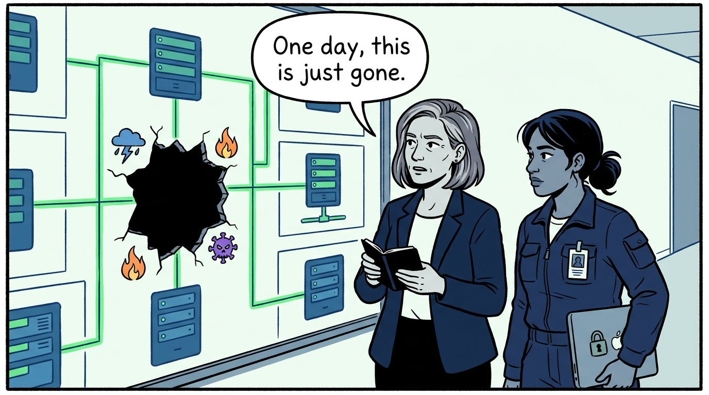
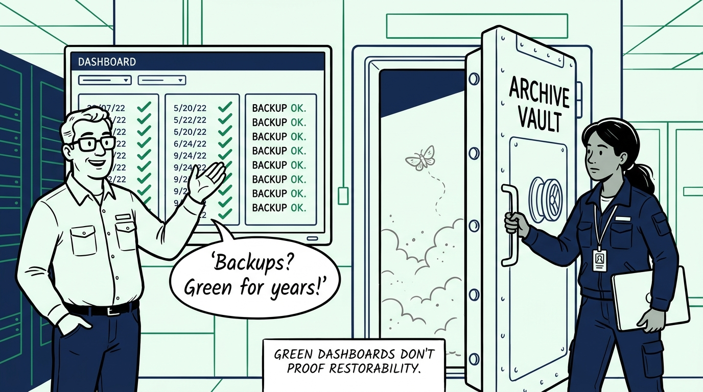
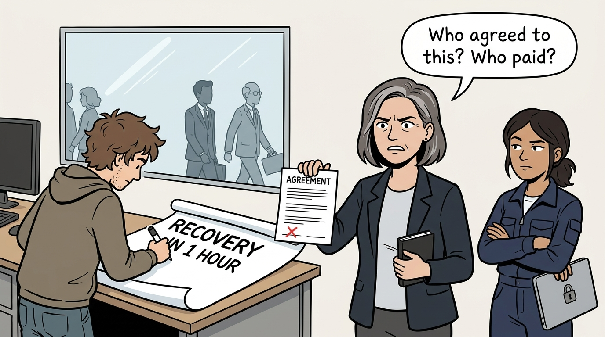
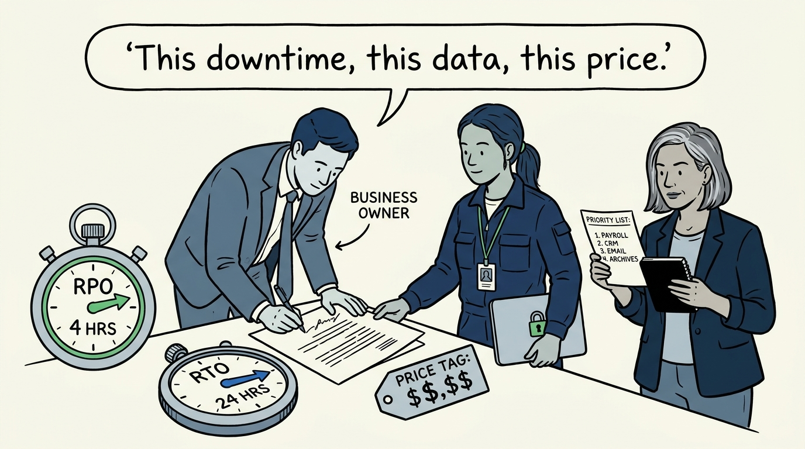
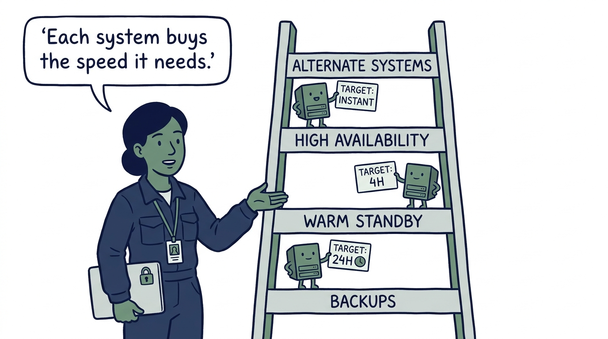
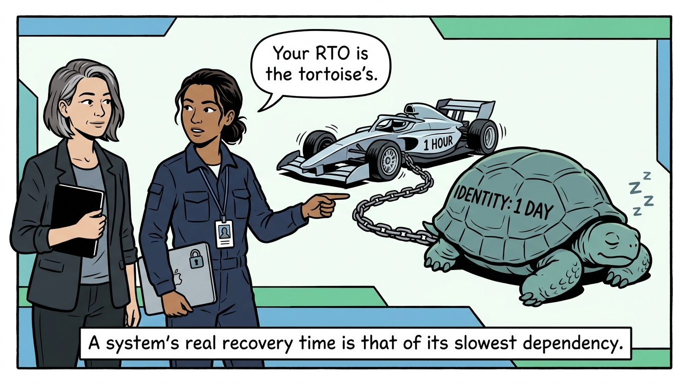
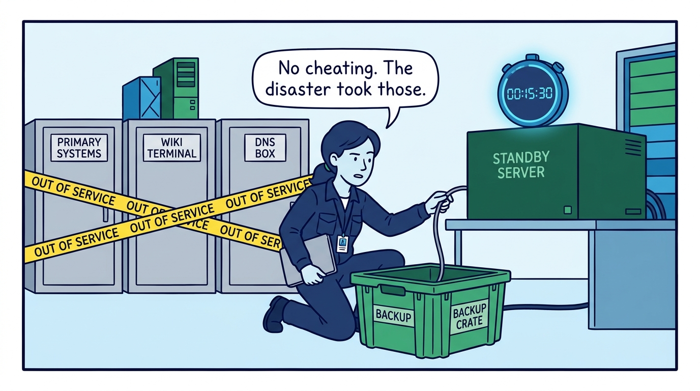
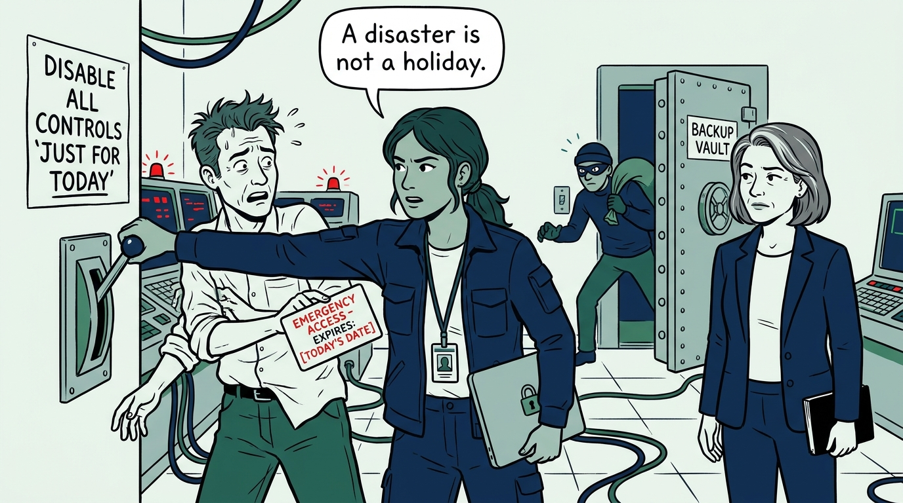
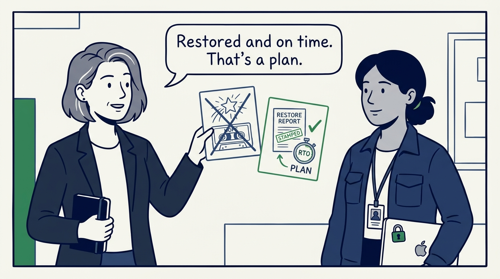

Why a backup that has never been restored is a hope, not a plan — in nine panels.

<!-- comic-style
{
  "cast": "VERA: a calm, seasoned engineering executive, short gray-streaked hair, dark blazer over a plain t-shirt, carries a small black notebook. NADIA: a hands-on defensive-security lead, shoulder-length dark hair tied back, navy utility jacket over a plain shirt, an access badge on a lanyard, laptop with a padlock sticker under one arm.",
  "style": "Clean two-tone explainer comic, thick ink outlines, flat colors with deep blue and green accents on a light background, generous white space, hand-lettered speech bubbles with SHORT readable text, no photorealism."
}
-->

**Panel 1:** *The hook: one day a system, a site, or a whole region is simply gone — taken by an attacker, a flood, or the power grid. The plan for that day is written now or never.*

**Panel 2:** *The problem: years of green backup jobs, zero restores — discovered to be empty, corrupt, or unrestorable at the exact moment they were the last copy. Untested recovery is a belief system.*

**Panel 3:** *The wrong way: the RTO nobody bought — a target written by IT alone, never priced, never signed by a business owner. Gold-plated where it did not matter, fictional where it did.*

**Panel 4:** *The principle: recovery starts from the business, not the backup tool. Every critical system carries an RPO and RTO that business owners agreed to and someone priced — with the recovery order decided before the disaster, not during it.*

**Panel 5:** *Strategy per system: backups, warm standby, high availability, alternate systems — uniformity wastes money at both ends, so each system buys exactly the recovery speed its targets demand.*

**Panel 6:** *Dependencies are mapped before targets are promised: the app that recovers in an hour but authenticates against a directory that takes a day has a one-day RTO — align the targets, or adjust the promise honestly.*

**Panel 7:** *The honest test: restore, don't assume — and run the exercise without the systems the disaster would have taken out, wiki and DNS included. Recovery is proven within the RTO or the plan is fiction.*

**Panel 8:** *The cost of shortcuts: attackers read DR plans too. Backups carry production-grade controls, standbys stay patched, and emergency access is documented and revoked — a recovery that reopens the breach is not a recovery.*

**Panel 9:** *The closer: backups are proven by restoring them and recovery is proven within the RTO — a backup that has never been restored is a hope, not a plan.*
