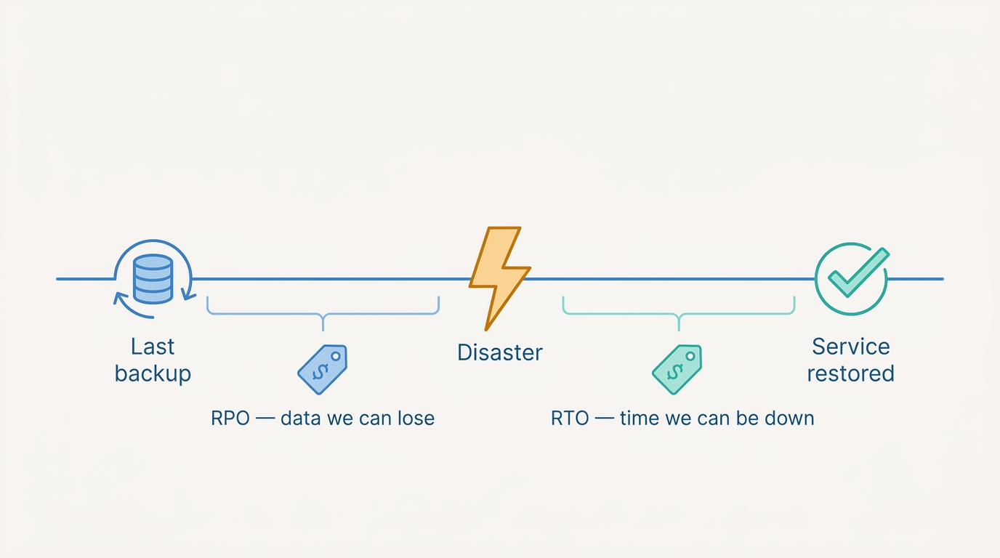
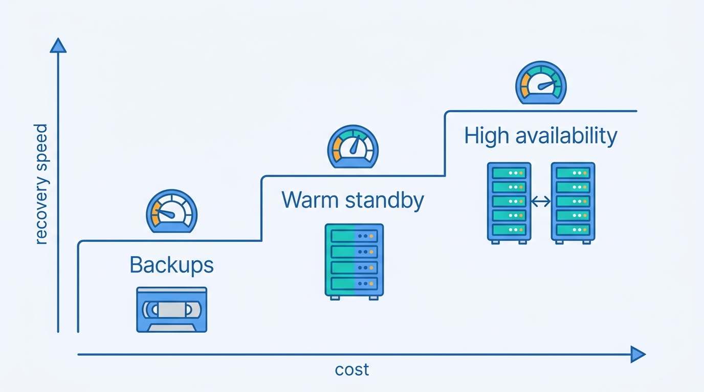
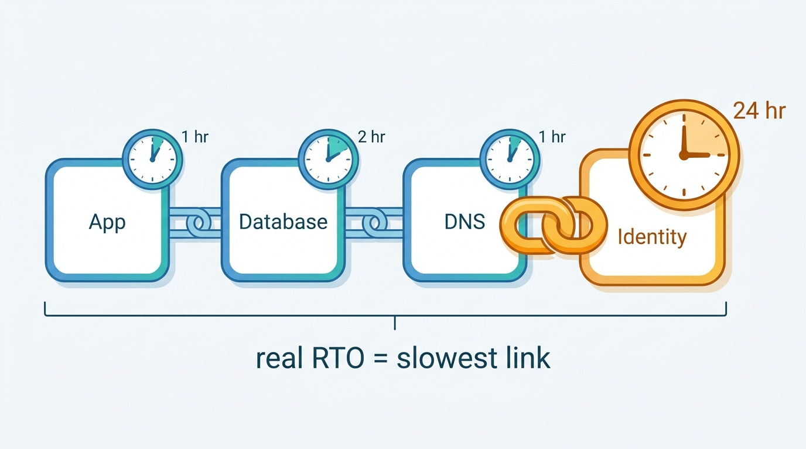

> **Status**: DRAFT
>
> **Principle**: My organization's disaster recovery starts from the business, not from the backup tool. **Every critical system carries an RPO and an RTO that business owners agreed to** and someone priced; **the recovery strategy is chosen per system** against those targets — physical backups, warm standby, high availability, alternate systems, or cloud-native replication recreated through infrastructure-as-code; **dependencies are mapped**, so no application claims a recovery time its authentication service cannot meet; **failover and failback have documented steps and named authority**; and **the plan is tested against real scenarios, without leaning on systems the disaster would have taken out** — with data protected and security controls intact throughout, because a disaster is not an excuse to drop them. The test I hold the plan to: **backups are proven by restoring them and recovery is proven within the RTO — a backup that has never been restored is a hope, not a plan.**

## Statement

When my organization plans for the day a system, a site, or a region is gone, this is the discipline I hold the plan to.

**Recovery objectives come from the business and carry a price tag.**

- **Critical services, applications, systems, and data are identified first**; each carries a Recovery Point Objective (how much data we can afford to lose) and a Recovery Time Objective (how long we can afford to be down), driven by business requirements — with the cost and technical complexity of each target reviewed, business owners' agreement obtained, and systems prioritized by business impact and recovery urgency.

**Figure 1:** *RPO and RTO on one timeline: how much data the business can afford to lose, and how long it can afford to be down — both agreed by business owners and priced.*

**The recovery strategy is chosen per system, not one-size-fits-all.**

- **Traditional backups** where they fit — media stored at a separate secure location, replacement hardware confirmed available, and transport-plus-restoration time honestly counted into the RTO.
- **Warm standby** for faster recovery — kept reasonably synchronized, geographically separated, with the DNS, routing, and traffic-redirection steps documented.
- **High availability** where RPOs and RTOs are very short — with enough spare capacity to actually survive a failure.
- **Alternate systems and function reassignment** where restoring the original is unnecessary — with reassigned systems verified able to carry production load.

**Cloud-native recovery is engineered, not assumed.**

- Critical applications and data replicate to another region or location, continuously or on schedule as a decision; **infrastructure-as-code recreates the recovery environment and is verified to reproduce production**; failover and failback are automated where possible, traffic reroutes to healthy regions, replication and readiness are monitored, cloud recovery is regularly tested, and **DR cost is reviewed for both normal and disaster operations**.

**Dependencies are mapped before targets are promised.**

- Every critical application's network, routing, DNS, authentication, directory, database, storage, API, and external-service dependencies are mapped; **dependent services must meet compatible RPO/RTO targets, or the targets are adjusted honestly**; dependencies are exercised in tabletop and technical tests.

**The plan is written against real scenarios.**

- Ransomware and cyberattack, mission-critical hardware failure, complete site loss, prolonged power outage, fire and flood and earthquake, pandemic or loss of site access — each reviewed with the IT and business teams it touches, each traced through systems, people, facilities, and communications, and each checked against what the plan actually covers.

**Failover and failback are procedures with named authority.**

- Clear criteria for declaring a disaster, a named authority to activate the plan, an escalation path for uncertain situations, exact documented failover steps with named actors, and confirmation that failover meets the RTO — plus an emergency communication plan.
- **Failback is planned with the same rigor**: primary stability confirmed, data synchronized, a maintenance window chosen, approval authority named, impacts communicated, services verified after the switch, and issues documented and resolved.

**The plan is tested — honestly.**

- Regular tabletop and technical exercises; **scenarios run without relying on systems the simulated disaster would have taken out**; recovery verified within the RTO and data within the RPO; **backup restoration tested rather than assumed**; dependencies tested; every test observed, documented, debriefed, and converted into corrective actions with owners and deadlines; major changes retested.

**Security does not take a disaster day off.**

- Backup and replicated data carry controls comparable to production — encrypted where appropriate, access-restricted, strongly authenticated — so **backups never become the weaker path to sensitive data**; replication traffic is encrypted, authenticated, and monitored; recovery systems stay patched and configuration-aligned with production; access during a disaster stays least-privilege with emergency access documented and revoked afterwards; secondary sites meet the physical bar of the primary.

**The plan lives.**

- Contact details, communication channels, and out-of-band access to procedures are maintained; roles, priorities, and decision authority documented; actions recorded during incidents; **communication happens during all outages, regardless of size**; and the plan is reviewed after significant changes, with RPO/RTO revisited with business owners, dependency maps updated, backup success monitored, lessons incorporated, and alignment with business continuity planning confirmed.

## How to Read This

This record sits in the **Response and Recovery** section, beside [[incident-response]]: that record governs the fight against a live adversary; this one governs survival when systems, sites, or data are simply gone — whether an attacker, a flood, or a power grid took them. It is grounded in the Disaster Recovery chapter of the *Defensive Security Handbook* (Brotherston, Berlin, Reyor), read as an executive operating record. The full working checklist — all fifteen sections, from objectives to ongoing review — lives in the **Checklist** tab; the management summary in the **TL;DR** tab; the conversation in the **Conversation** tab.

## Rationale

**RPO and RTO are business decisions wearing technical clothes.** How much data we can lose and how long we can be down are questions only the business can answer — and only the business can pay for. An RTO set by IT alone is either gold-plated (recovery capacity the business never asked to fund) or fictional (a number nobody validated against cost and complexity). That is why the record requires business owners' explicit agreement, a reviewed price tag, and a priority order: when everything is down, the recovery sequence must already be decided, because the worst moment to negotiate priority is during the disaster.

**Strategy per system, because uniformity wastes money at both ends.** Putting every system on high availability bankrupts the DR budget on systems that could tolerate a day of downtime; putting everything on tape leaves the revenue-critical path down for a week. The chapter's ladder — backups, warm standby, high availability, alternate systems, function reassignment — exists so each system buys exactly the recovery speed its RPO/RTO demands. The honesty requirement bites hardest at the bottom rung: if backup media must be transported and restored onto hardware that must first be procured, that time *is* the RTO, whatever the document says.

**Figure 2:** *The strategy ladder: each system buys exactly the recovery speed its RPO and RTO demand — uniformity overspends at one end and underdelivers at the other.*

**The cloud makes recovery cheaper to have and easier to fake.** Replication to another region and IaC that recreates the environment turn what once required a second datacenter into configuration — which is exactly why the record demands verification that the IaC actually reproduces production, that resources scale when DR activates, and that cost is understood in both normal and disaster modes. A recovery region that has never been stood up is the cloud version of the untested backup, with a better-looking architecture diagram.

**A system's real RTO is the RTO of its slowest dependency.** The application that recovers in one hour but authenticates against a directory that takes a day has a one-day RTO; the document claiming otherwise is fiction. Dependency mapping is where DR plans die or become real: network, DNS, identity, databases, storage, third-party APIs. The record's rule — align dependent targets or adjust the promise honestly — keeps the plan an instrument rather than an aspiration.

**Figure 3:** *A system's real RTO is the RTO of its slowest dependency — align the dependent targets, or adjust the promise honestly.*

**Scenarios keep the plan honest about what "disaster" means.** A plan written abstractly recovers an abstract disaster. Ransomware is not a hardware failure: it attacks the backups themselves and may make the "recovered" environment re-infectable. Site loss is not a server loss: it takes the runbooks, the badge readers, and possibly the people's ability to travel. A pandemic takes no systems and all of the hands. Walking each named scenario through systems, people, facilities, and communications — with the business in the room — is how a generic plan becomes my organization's plan.

**Untested recovery is a belief system.** The record's load-bearing test is blunt because the failure mode is universal: backups that ran green for years and restore nothing; failover that works except for the one manual step only a departed engineer knew; a DR runbook stored on the wiki that the disaster took down. Hence the double honesty rule — restore, don't assume, and run the exercise without the systems the disaster would have taken — and the closing loop: every test debriefed, every gap converted into an owned, deadlined corrective action, every major change retested.

**Attackers read DR plans too.** Backup and standby environments hold the same crown jewels as production, usually with less scrutiny — which makes an unencrypted backup store or an unpatched warm standby the cheapest path to the data. And the moment of recovery is the moment of maximum temptation to drop controls "just to get back up." The record refuses both: production-comparable controls on data at rest and in transit, patched and configuration-aligned recovery systems, least privilege maintained through the disaster, and temporary emergency access reviewed and revoked afterwards. A recovery that reopens the breach is not a recovery.

**Failback is the forgotten half.** Every plan fails over; few plan the return. Failback done casually — data unsynchronized, no approval authority, no verification — turns a survived disaster into a self-inflicted second outage. The record gives the return trip the same discipline as the outbound one, and the communication rule extends to every outage regardless of size, because silence during small outages is how organizations rehearse silence for the big one.

## What This Means in Practice

| What this record says | What it does **not** say |
| --- | --- |
| Every critical system has an RPO and RTO that business owners agreed to and someone priced. | Every system gets an aggressive target — tolerating a slow recovery is a legitimate, priced decision. |
| The recovery strategy is chosen per system against its targets. | One blessed DR architecture fits all — uniformity overspends and underdelivers at the same time. |
| Backups are proven by restoring them; recovery is proven within the RTO. | A green backup job is evidence of recoverability — only a restore is. |
| DR tests run without systems the simulated disaster would have taken out. | Tests must be full production failovers — tabletop and scoped technical exercises count, if they are honest. |
| Dependencies are mapped and their targets aligned, or the promise is adjusted. | Dependency mismatches are tolerable footnotes — they are corrections to the RTO. |
| Security controls hold during recovery; emergency access is temporary and revoked. | Speed justifies dropping controls — a recovery that reopens the breach is not a recovery. |
| Failback is planned, approved, synchronized, and verified like failover. | Getting back to primary is an afterthought once the standby works. |

Concretely: every system my organization calls critical can show its RPO, its RTO, the business owner who signed them, and the date of the last restore test that met them — and the DR runbook is reachable when the primary environment is not.

## Anti-Patterns

- **The untested backup.** Years of green backup jobs, zero restores — discovered to be empty, corrupt, or unrestorable at the exact moment they were the last copy.
- **The RTO nobody bought.** A recovery target written by IT, never priced, never signed by a business owner — gold-plated where it did not matter and fictional where it did.
- **The dependency surprise.** The flagship application restored in an hour, waiting a day for the identity provider — the real RTO was always the slowest dependency's.
- **The plan on the dead wiki.** DR procedures, contact lists, and runbooks stored only on systems the disaster took down with everything else.
- **The rotting standby.** A warm standby unpatched and configuration-drifted for a year — it fails over successfully into an environment that no longer runs the application, or runs it insecurely.
- **The security holiday.** Controls dropped "temporarily" to accelerate recovery — shared admin credentials, disabled MFA, wide-open firewall rules — converting an outage into a breach.
- **The convenient test.** A DR exercise that quietly uses production DNS, production identity, and the primary site's tooling — proving only that recovery works when nothing is actually wrong.
- **The one-way failover.** A standby that works, and no synchronized, approved, verified path back — the survived disaster followed by a self-inflicted second outage.

## Related Records

- [[incident-response]] — the neighboring discipline: when an attacker destroys rather than infiltrates — ransomware above all — response hands off to this record's objectives and procedures.
- [[cloud-infrastructure]] — the platform controls that cloud-native DR (cross-region replication, IaC-recreated environments) builds on.
- [[asset-management]] — you cannot set recovery objectives for critical systems you have not identified; the criticality inventory starts there.
- [[physical-security]] — secondary sites must meet the physical bar of the primary; that bar is defined there.
- [[network-security]] — the encrypted, authenticated replication paths and the DNS/routing changes failover depends on.
- [[security-program]] — DR is a pillar of the program's resilience commitment and stays aligned with business continuity planning there.

## Scope and Revisiting

This record is `draft`. It applies to every system my organization classifies as critical, and its testing bar applies to every claimed recovery capability. I revisit it if a real disaster or test misses an agreed RPO/RTO (the plan failed, or the target was fiction — either way the record must answer), if the architecture shifts materially toward or away from cloud-native recovery, if dependency maps go stale enough to surprise a test, or if business owners' continuity requirements change — the plan follows the business, never the reverse.

## Authoritative References

- *Defensive Security Handbook*, 2nd edition (Lee Brotherston, Amanda Berlin, William F. Reyor III; O'Reilly) — the Disaster Recovery chapter, whose checklist this record distills.
