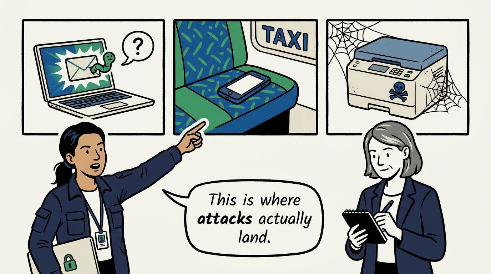
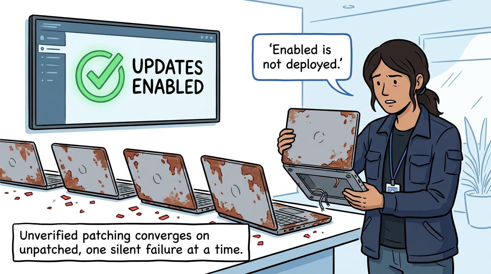
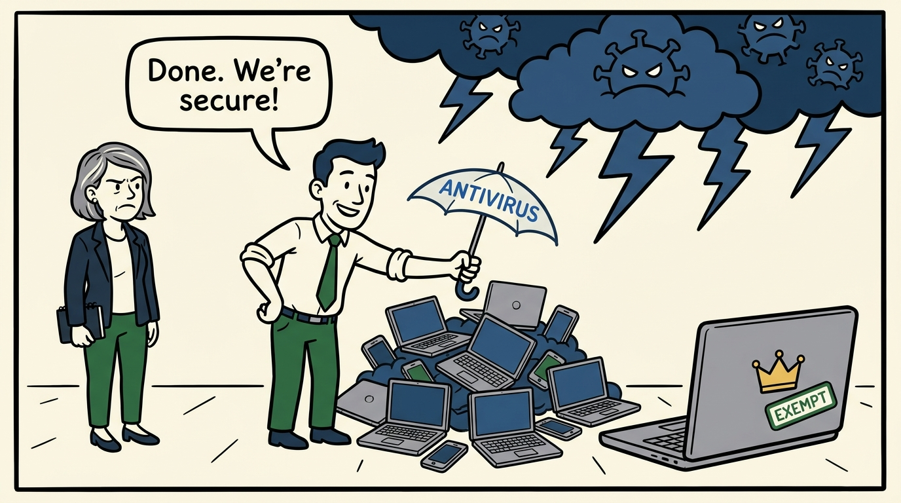
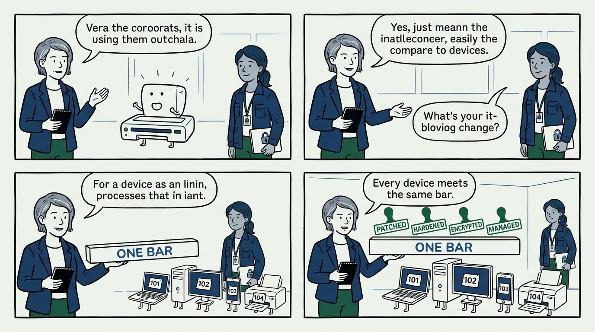
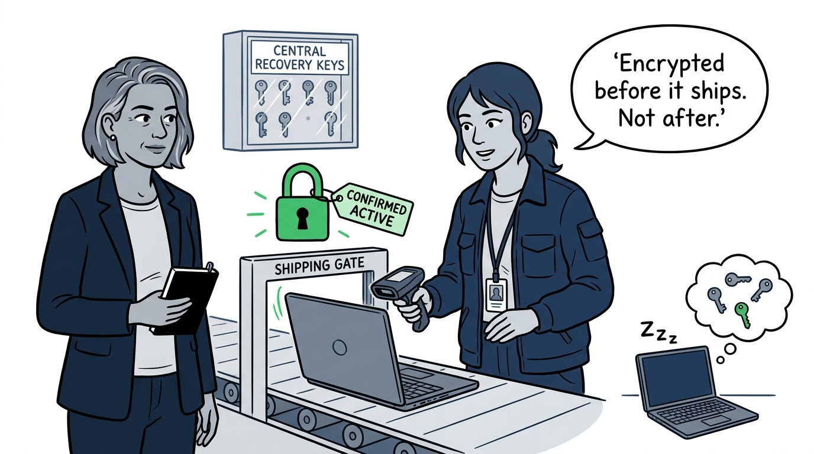
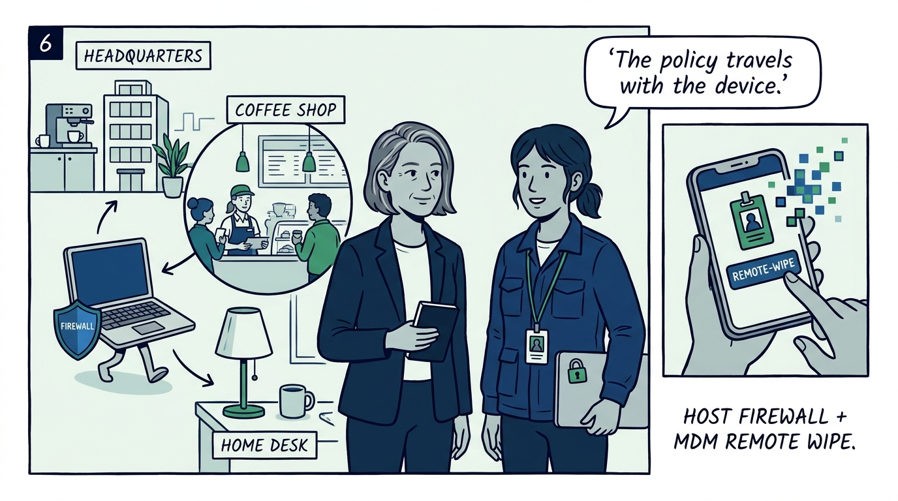
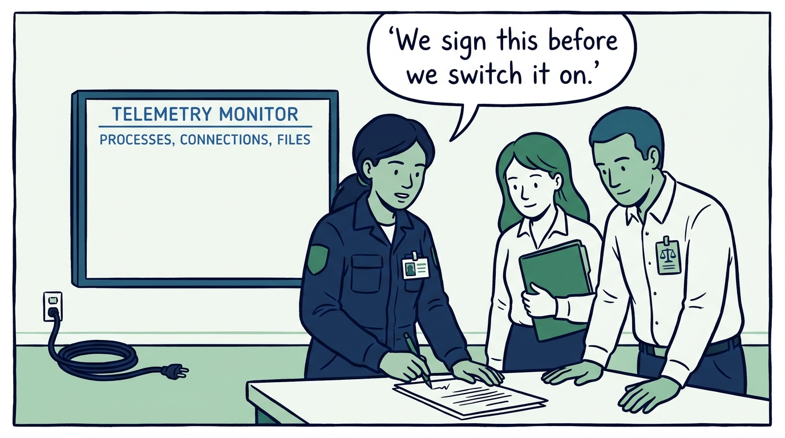
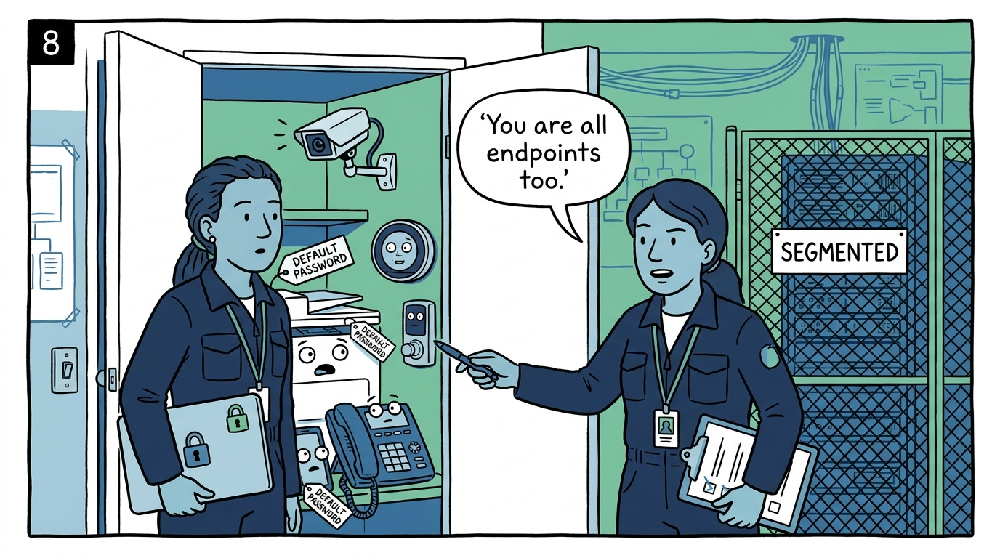
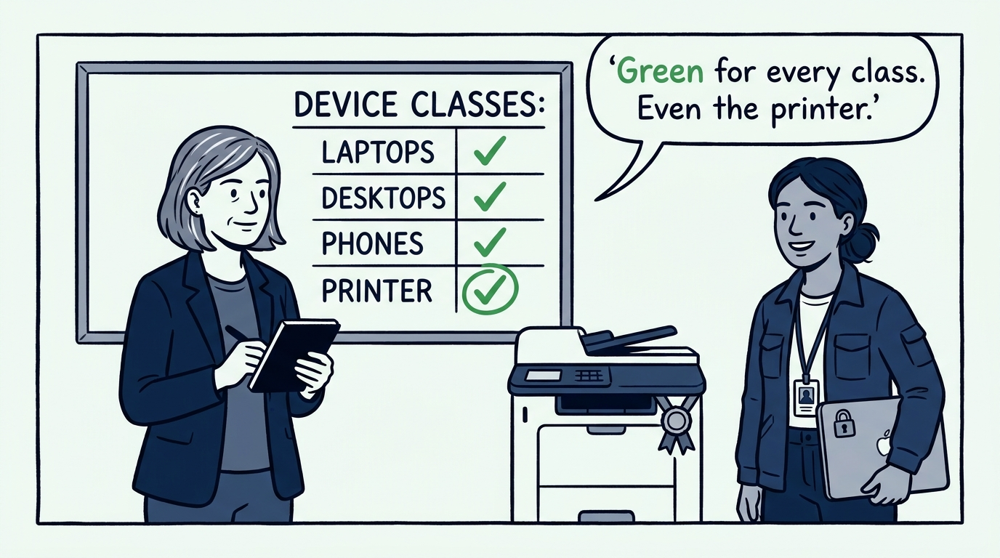

Why the endpoint is where the attack actually lands — and the one bar every device meets, in nine panels.

<!-- comic-style
{
  "cast": "VERA: a calm, seasoned engineering executive, short gray-streaked hair, dark blazer over a plain t-shirt, carries a small black notebook. NADIA: a hands-on defensive-security lead, shoulder-length dark hair tied back, navy utility jacket over a plain shirt, an access badge on a lanyard, laptop with a padlock sticker under one arm.",
  "style": "Clean two-tone explainer comic, thick ink outlines, flat colors with deep blue and green accents on a light background, generous white space, hand-lettered speech bubbles with SHORT readable text, no photorealism."
}
-->

**Panel 1:** *The hook: the endpoint is where the attack actually lands — the laptop that opens the attachment, the phone that leaves the taxi, the printer nobody patched.*

**Panel 2:** *The problem: the unverified patch job — updates enabled everywhere and checked nowhere, so the fleet drifts to unpatched while the dashboard stays green.*

**Panel 3:** *The wrong way: antivirus as strategy — one agent installed, box ticked, program declared done — while the executive's laptop skips the controls entirely.*

**Panel 4:** *The principle: one bar for every endpoint — patched and verified, hardened by subtraction, firewalled, encrypted, protected, managed, and monitored, whatever the device class.*

**Panel 5:** *Practice: full-disk encryption is a pre-deployment gate — confirmed active before the device ships, recovery keys centrally managed — and a sleeping laptop still holds keys in memory, so real physical threat means shut down.*

**Panel 6:** *Practice: protection travels with the device — the host firewall stays on across home and public networks, and mobile devices are enrolled, policy-managed, and remotely wipeable.*

**Panel 7:** *Practice: visibility with the privacy contract signed first — telemetry on processes, connections, and files is centralized for detection, but expectations are agreed with HR and legal before the monitoring starts.*

**Panel 8:** *Practice: the forgotten endpoints count — printers, cameras, HVAC, door locks, and telephony get inventoried, default passwords changed, firmware updated, and the ones that cannot meet the bar get segmented, not exempted.*

**Panel 9:** *The closer: the test the estate is held to — the final endpoint security review comes back green for every device class, including the printer.*
