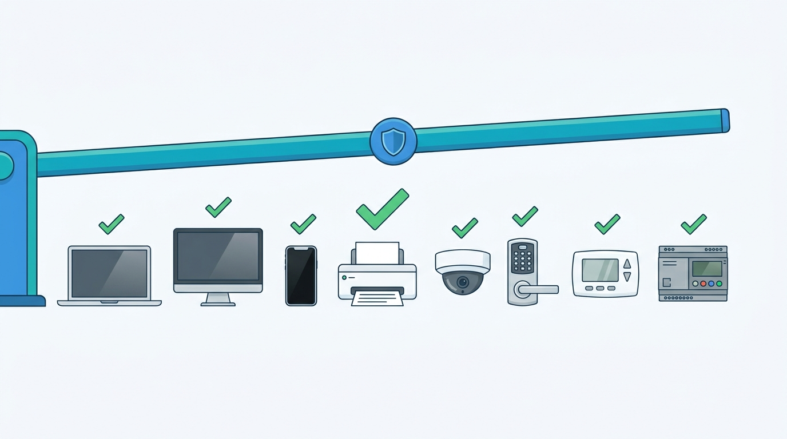
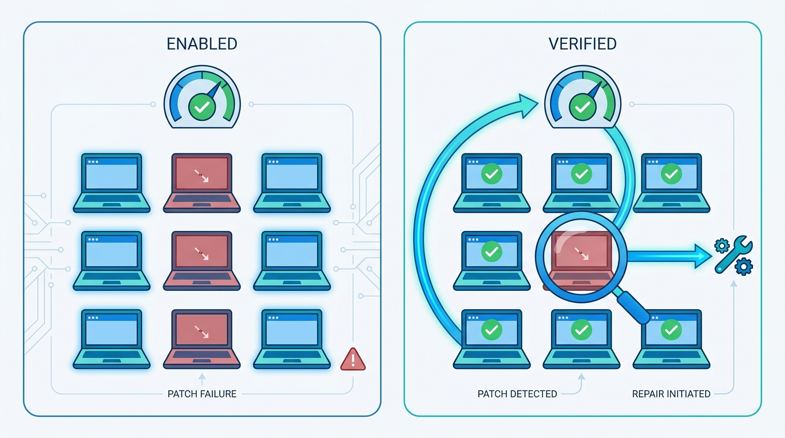
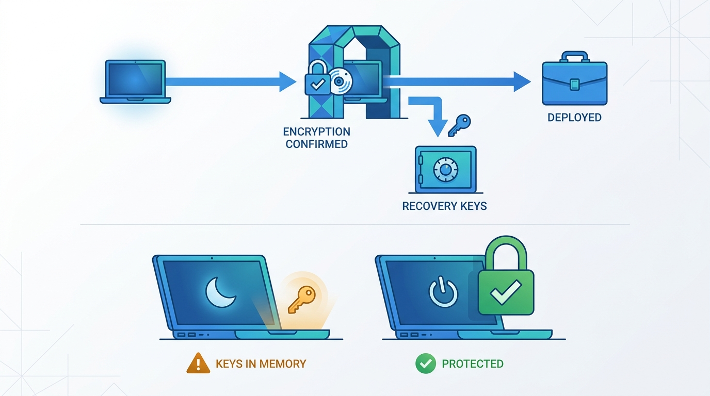

> **Status**: DRAFT
>
> **Principle**: The endpoint is where the attack actually lands, so every endpoint in my organization meets one bar. **Every device stays patched — and the patches are verified**, not assumed; **every endpoint type is hardened against a secure baseline** by removing what it does not need; **the host firewall is on everywhere**, including home and public networks; **full-disk encryption is confirmed active before a device is deployed**, with recovery keys centrally managed; **endpoint protection runs but is never the only control**; **mobile devices are enrolled, policy-managed, and remotely wipeable**; **endpoint activity is visible and centrally logged**, with privacy expectations set with HR and legal before the monitoring starts; and **the forgotten endpoints count** — printers, cameras, thermostats, door locks, telephony, and industrial controllers are inventoried, de-defaulted, and secured like everything else. The test I hold the estate to: **the final endpoint security review comes back green for every device class — including the printer.**

## Statement

This is the bar every endpoint in my organization is held to — laptop, desktop, phone, and everything with an IP address that is not a server.

**Figure 1:** *One bar for the whole estate: every device class passes the same endpoint review — including the printer.*

**Every endpoint stays current — and currency is verified.**

- **Patching is regular, centralized, and checked.** Operating system security updates are enabled everywhere, managed centrally where possible, and deployment is verified — a patch that did not land is a patch that did not happen.
- **Every platform has a managed channel.** Windows endpoints update through Windows Update for Business or an approved management platform; macOS devices receive updates through MDM; Unix and Linux desktops receive regular package updates; automation carries the load wherever appropriate.
- **The edges are covered.** Unmanaged and BYOD devices have a defined update process, third-party applications are patched and current, software without automatic updates is monitored for releases, and an inventory of installed applications and versions exists.

**Endpoints are hardened by subtraction.**

- Each endpoint type has a secure baseline configuration. Unnecessary services are removed or disabled — after confirming what they do — running services and processes are reviewed regularly, and unnecessary applications and components come off. Less functionality, less attack surface.

**The host firewall is on. Everywhere.**

- Every endpoint runs its host-based firewall, with inbound restrictions configured, outbound restrictions where appropriate, and rules reviewed periodically. The policy travels with the device: it applies on home, public, and otherwise untrusted networks, not just in the office.

**Disks are encrypted before deployment — and I know what encryption does not cover.**

- Full-disk encryption is enabled on every laptop and desktop holding organizational data — BitLocker on Windows, FileVault on macOS, an appropriate solution on Linux — with recovery keys stored or centrally managed, and **encryption confirmed active before the device is deployed**.
- A locked, sleeping, or hibernating device may still hold encryption keys in memory; where stronger protection against physical attack is required, the device is shut down.

**Endpoint protection runs — as one layer, never the strategy.**

- Approved antivirus, antimalware, or endpoint protection software is installed, its signatures current, its services confirmed running, and its alerts actually reviewed. It is never relied on as the only control.

**Mobile devices are managed devices.**

- Supported mobile devices are enrolled in MDM, with PIN and password requirements enforced, VPN enforced where required, application installation controlled, approved configuration policies applied, and remote wipe enabled. Which device types and platforms the organization supports is defined, and BYOD devices carry appropriate controls.

**Endpoint activity is visible — with the privacy contract signed first.**

- Endpoint telemetry is collected: open network connections, running processes, open files, and other relevant activity, centralized where possible and used for malware detection and incident investigation. Tools such as osquery or Sysmon are the worked example. **Before extensive monitoring is deployed, employee privacy expectations are defined and the policies coordinated with HR and legal.**

**The forgotten endpoints count.**

- Nontraditional endpoints and IoT devices are inventoried; default passwords are changed immediately and unnecessary default accounts removed; firmware stays updated; insecure or specialized devices are segmented from sensitive systems. Printers, IP cameras, thermostats and HVAC, electronic door locks, IP telephony, and SCADA and industrial-control devices are all in scope — documented, secured, and tested before production.

**Management is centralized, so the bar is enforceable.**

- Centralized consoles wherever practical: authentication, configuration and policy enforcement, patch and software management, security logging, and organizational file storage where appropriate. Similar endpoint types carry consistent configurations, and automation takes the administrative overhead out of keeping them consistent.

## How to Read This

This record sits in the **Hardening the Estate** section of the journal, alongside [[windows-infrastructure]] and [[unix-servers]] — those records cover the server estate; this one covers the devices people carry and the nontraditional endpoints around them, before the estate narrows to [[databases]] and widens to [[cloud-infrastructure]]. It is grounded in the Endpoints chapter of the *Defensive Security Handbook*. Where the chapter names concrete platforms — Windows Update for Business, BitLocker, FileVault, osquery, Sysmon — the checklist keeps them verbatim and this article states the commitment at the capability level, with the named platform as the worked example. The full working checklist lives in the **Checklist** tab; the management summary is in the **TL;DR** tab and the conversation in the **Conversation** tab.

## Rationale

**The endpoint is where the attack actually lands.** Phishing, malicious attachments, drive-by downloads, stolen laptops — the overwhelming majority of incidents begin on a device in someone's hands, not on a hardened server behind three firewalls. That is why this record refuses to treat endpoint security as the unglamorous cousin of infrastructure security. The estate of laptops, phones, and printers *is* the attack surface most adversaries see first, and the bar it is held to determines how most incidents start — or fail to.

**Patching is the highest-return control, and verification is the half that gets skipped.** Enabling updates is the easy part; the chapter's discipline is in the second step — verify that patches are successfully deployed. A fleet where updates are "enabled" but never verified converges on the same state as an unpatched fleet, one silent failure at a time. The same logic extends to the software nobody thinks about: third-party applications, and the tools with no auto-update channel that only stay current if someone is watching for releases. An inventory of installed applications and versions is what makes that watching possible at all.

**Figure 2:** *Enabling updates is the easy half: without verification the fleet converges on unpatched one silent failure at a time, while the dashboard stays green.*

**Hardening is subtraction, done with your eyes open.** Every service, application, and component an endpoint runs is functionality an attacker can potentially abuse; removing what is not needed shrinks the attack surface without buying a single product. But the chapter adds a caution I keep deliberately: confirm what a service does before disabling it. Hardening by guesswork produces outages, and outages produce rollbacks that quietly undo the hardening. Baselines per endpoint type, plus regular review of what is actually running, keep the subtraction honest over time.

**Full-disk encryption is a pre-deployment gate, not a post-incident wish.** The moment you need encryption is the moment the laptop is already gone, which is why the record requires confirming it is active *before* the device ships — an unencrypted device discovered after the theft is a breach notification, not an IT ticket. Recovery keys are centrally managed because encryption without recoverable keys converts a security control into a data-loss mechanism. And the caveat matters: a sleeping or locked device may still hold keys in memory, so FDE protects the powered-off laptop in the taxi, not the suspended one seized at the border. When the physical threat is real, the device is shut down.

**Figure 3:** *Encryption is a pre-deployment gate with centrally managed keys — and it protects the powered-off laptop in the taxi, not the sleeping one.*

**Endpoint protection is one layer, never the strategy.** The chapter says it plainly: do not rely on endpoint protection as the only security control. Signature-based and behavioral tools catch what they catch, and a fleet whose entire defense is an agent is one novel loader away from undefended. The agent earns its place in this record — installed, updated, running, alerts reviewed — precisely because it sits inside a stack of patching, hardening, firewalls, encryption, and monitoring, not instead of one.

**Visibility without a privacy contract backfires.** Telemetry on processes, connections, and files is what turns an endpoint estate from a blind spot into a detection surface, and centralizing it is what makes investigation possible. But monitoring the devices people work on — sometimes their own devices — is an act with employment-law and trust consequences. The chapter's ordering is the right one: define employee privacy expectations and coordinate with HR and legal *before* deploying extensive monitoring. A monitoring program discovered by the workforce rather than announced to it poisons exactly the trust an insider-aware security program depends on.

**The estate is bigger than the devices with keyboards.** Printers spool the documents, cameras watch the doors, HVAC controllers sit on the network, door locks decide who enters, and every one of them ships with a default password and a web interface from 2013. Attackers do not care that nobody thinks of the printer as a computer; it is one. So the record pulls the whole long tail into scope — inventoried, de-defaulted, firmware-updated, segmented where the device cannot be secured, and tested before production. The segmentation escape valve matters: some devices will never meet the bar, and for those the answer is isolation, not exemption.

**Centralization is what makes the bar enforceable at scale.** Every commitment above is achievable by hand on ten devices and impossible by hand on a thousand. Centralized authentication, configuration, patching, and logging — with consistent configurations across similar device types and automation absorbing the overhead — is the difference between a policy and a posture. Decentralized endpoint management does not fail loudly; it drifts, one special-case machine at a time, until the final review is green on paper and false in fact.

## What This Means in Practice

| What this record says | What it does **not** say |
| --- | --- |
| Every endpoint is patched, and patch deployment is verified. | Enabling auto-update is enough — unverified patching converges on unpatched. |
| Each endpoint type is hardened against a secure baseline by removing unneeded services. | Disable things blindly — confirm what a service does before turning it off. |
| The host firewall is on everywhere, including home and public networks. | The corporate perimeter protects devices — the policy travels with the device. |
| Full-disk encryption is confirmed active before deployment, keys centrally managed. | FDE protects a sleeping laptop — keys can persist in memory; shut down under real physical threat. |
| Endpoint protection is installed, current, running, and reviewed. | Endpoint protection is the security strategy — it is one layer, never the only control. |
| Mobile devices are MDM-enrolled with remote wipe; BYOD carries defined controls. | Personal devices are unmanageable — BYOD has a process, not an exemption. |
| Endpoint telemetry is centralized for detection and investigation. | Monitor first, explain later — privacy expectations are set with HR and legal before deployment. |
| Printers, cameras, HVAC, door locks, telephony, and SCADA are endpoints. | Only devices with keyboards count — the long tail is inventoried, secured, or segmented. |

Concretely: no device class in my organization is exempt from the endpoint review — a new device type entering the estate gets a baseline, a patch channel, and an owner before it gets a network port, and the first audit question is *"show me the verification, not the policy."*

## Anti-Patterns

- **The unverified patch job.** Updates "enabled everywhere," deployment checked nowhere — the fleet drifts to unpatched one silent failure at a time, while the dashboard stays green.
- **The gold image that rusted.** A hardening baseline built once, never reviewed — three years later the running services on real machines bear no resemblance to the baseline document.
- **The exempt executive.** The board member's laptop that skips MDM, encryption checks, and patching because asking felt awkward — the highest-value target with the weakest controls.
- **Antivirus as strategy.** One agent installed, box ticked, program declared done — the only control is the one every attacker rehearses against.
- **The sleeping-laptop defense.** Treating a suspended, FDE-enabled laptop as protected — the keys are in memory, and the protection you counted on never engaged.
- **The printer that wasn't an endpoint.** The device that spools every confidential document, running ten-year-old firmware with the default admin password, invisible to every review.
- **Surveillance by surprise.** Extensive endpoint monitoring deployed quietly, discovered by the workforce — the trust the program depends on, spent on its first day.
- **BYOD limbo.** Personal devices that touch organizational data with no enrollment, no controls, and no wipe capability — unmanaged by policy and unmanageable by design.

## Related Records

- [[windows-infrastructure]] — the Windows server estate; this record covers the Windows devices people carry.
- [[unix-servers]] — the Unix server estate; Unix and Linux desktops are held to this record's bar.
- [[asset-management]] — the inventory this record's application and device tracking plugs into; you cannot patch what you do not know you have.
- [[vulnerability-management]] — the organization-wide scanning-and-remediation loop that endpoint patching feeds and answers to.
- [[network-segmentation]] — where the insecure and specialized devices this record cannot harden get isolated instead.
- [[logging-and-monitoring]] — the central pipeline that endpoint telemetry flows into.
- [[physical-security]] — the shutdown-versus-sleep caveat is where endpoint security hands over to physical security.

## Scope and Revisiting

This record is `draft`. It applies to every endpoint in my organization — corporate-owned, BYOD, and nontraditional — and serves as the audit bar for the existing estate. I revisit it if the endpoint mix shifts materially (a new device class at scale, a move to virtual desktops), if an audit finds device classes outside the review's scope (the "including the printer" test failing in practice), or if monitoring practice and the agreed privacy expectations drift apart — either direction of that drift is a defect.

## Authoritative References

- *Defensive Security Handbook*, 2nd edition — Lee Brotherston, Amanda Berlin, and William F. Reyor III (O'Reilly) — the Endpoints chapter, whose checklist (including the final endpoint security review) this record distills.
