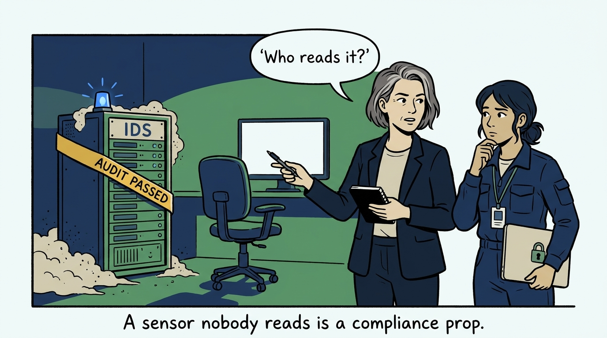
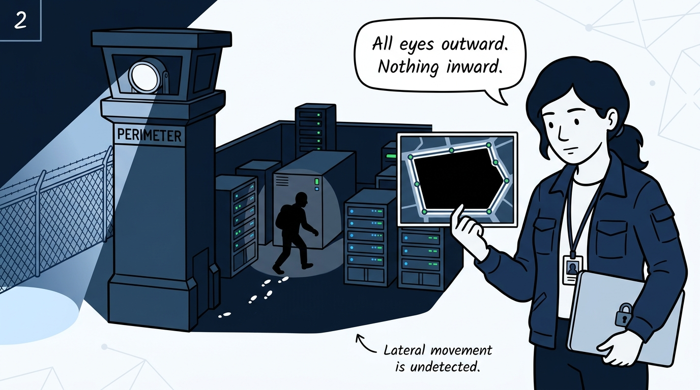
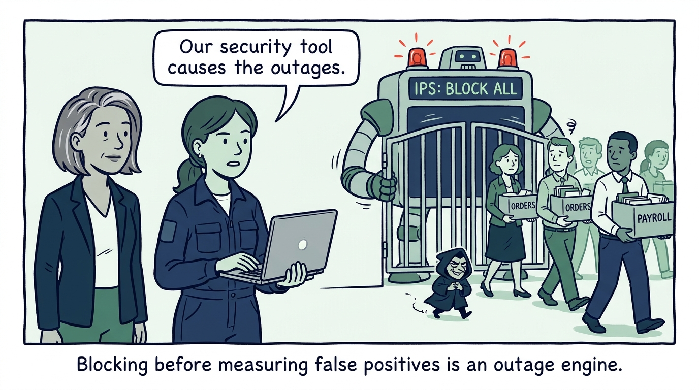
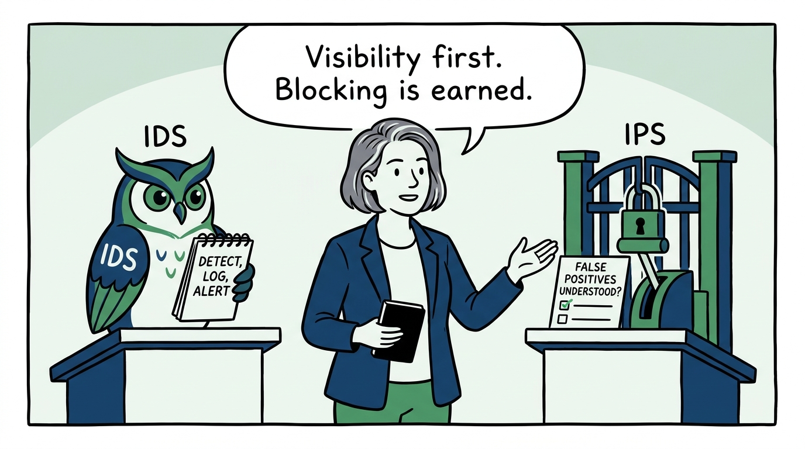
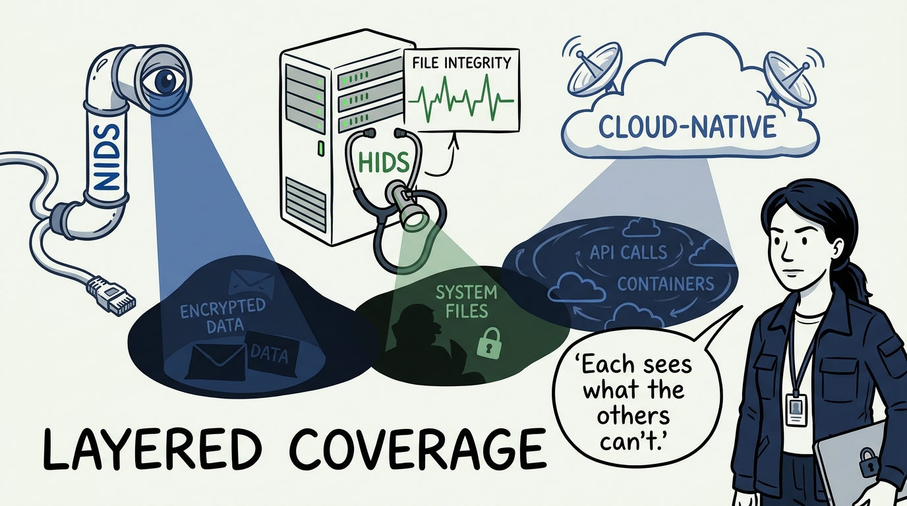
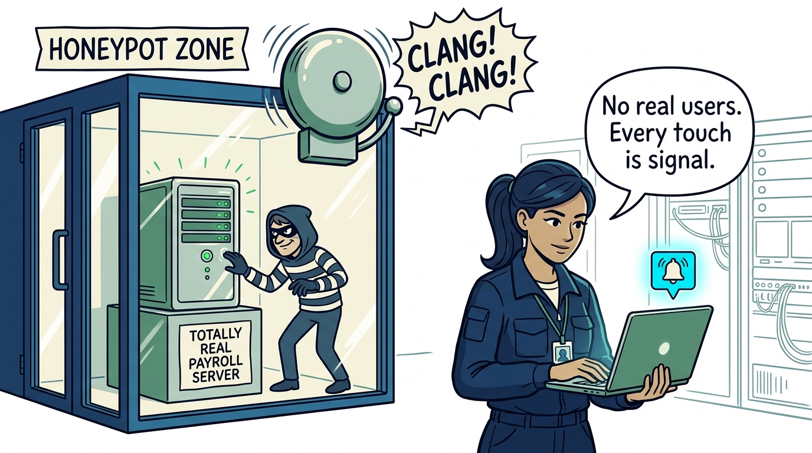
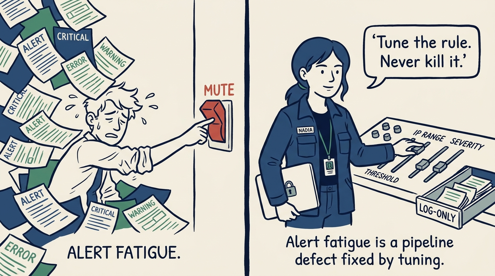
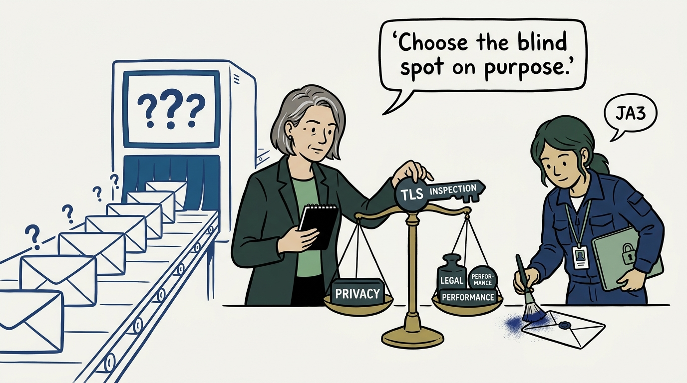
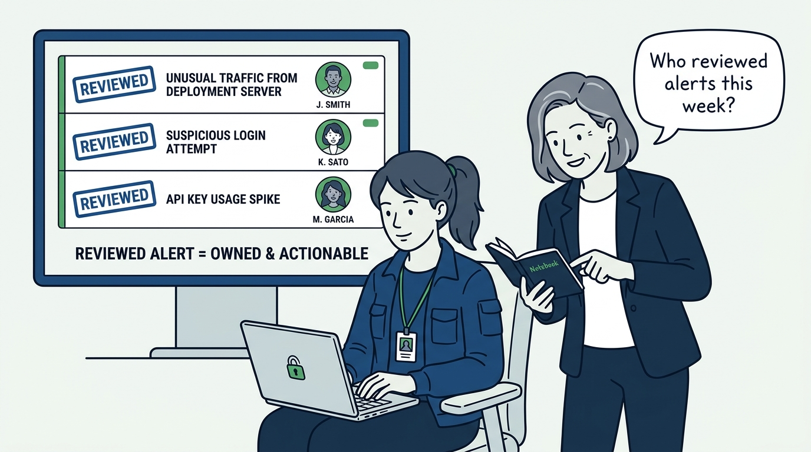

Why detection is a capability you operate, not a product you bought — in nine panels.

<!-- comic-style
{
  "cast": "VERA: a calm, seasoned engineering executive, short gray-streaked hair, dark blazer over a plain t-shirt, carries a small black notebook. NADIA: a hands-on defensive-security lead, shoulder-length dark hair tied back, navy utility jacket over a plain shirt, an access badge on a lanyard, laptop with a padlock sticker under one arm.",
  "style": "Clean two-tone explainer comic, thick ink outlines, flat colors with deep blue and green accents on a light background, generous white space, hand-lettered speech bubbles with SHORT readable text, no photorealism."
}
-->

**Panel 1:** *The hook: the shelfware sensor — bought for the audit, racked, blinking at an empty chair. Detection hardware is easy to buy; someone reviewing it is the actual control.*

**Panel 2:** *The problem: the perimeter-only story — inbound and outbound covered, while an attacker already inside moves laterally in a coverage hole shaped exactly like the network's interior.*

**Panel 3:** *The wrong way: day-one auto-block — an IPS switched inline before false positives were measured becomes an outage engine with a security badge.*

**Panel 4:** *The principle: an IDS detects, logs, and alerts; an IPS actively blocks — and the two are held apart, with blocking enabled only where false positives are understood.*

**Panel 5:** *Practice: layer the coverage — network sensors watch the wire, host monitoring sees what the network cannot, cloud-native detection moves at cloud speed; each layer's blind spot is another's field of view.*

**Panel 6:** *Practice: the honeypot economy — a decoy has no legitimate users, so nearly every interaction is signal: the cheapest high-fidelity alert in the estate, isolated and watched.*

**Panel 7:** *Practice: alert fatigue is an engineering defect, not analyst weakness — noisy rules get thresholds, ranges, and exclusions adjusted or demoted to log-only; tuning never ends.*

**Panel 8:** *The cost: encryption forced a choice — inspect deliberately where it is worth the performance, privacy, and legal price, and read the envelope's fingerprints everywhere else. The worst option is pretending the blind spot isn't there.*

**Panel 9:** *The closer: the first review question is never 'do we have an IDS?' — it is 'who reviewed its alerts this week, and what did they do about them?' Alerts only have value when someone reviews them and knows how to respond.*
