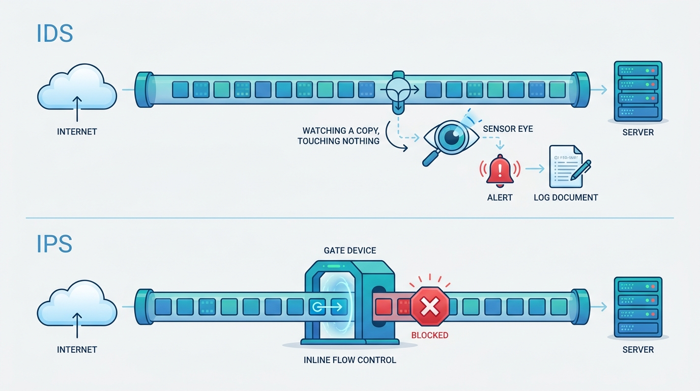
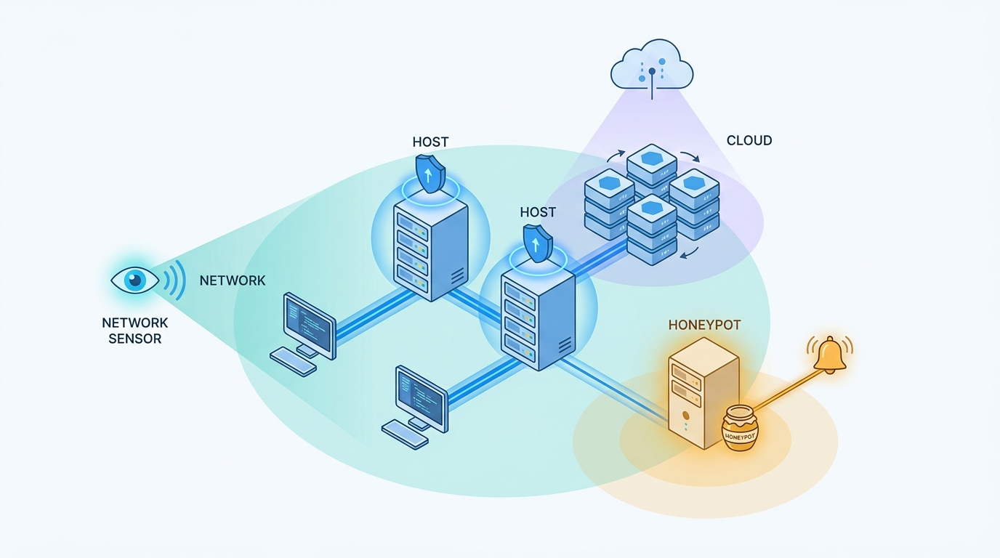
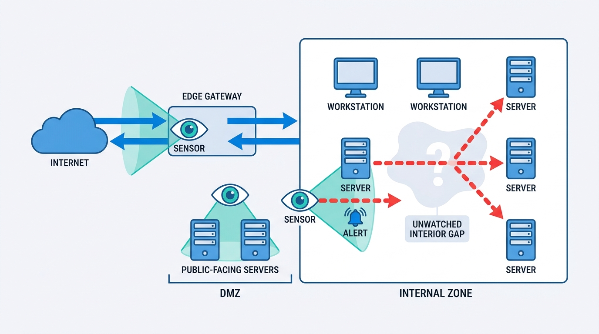

> **Status**: DRAFT
>
> **Principle**: My organization treats detection as a capability it operates, not a product it bought. **An IDS detects, logs, and alerts; an IPS detects and actively blocks** — and I keep those two commitments apart, enabling blocking only where false positives are understood, because an IPS that disrupts legitimate traffic is an outage engine with a security badge. **Coverage is layered** — network sensors, host-based monitoring, honeypots, and cloud-native detection each see what the others cannot — and **placement determines what can actually be inspected**: sensors sit at the choke points the threat model cares about, not where the rack had space. **Encrypted traffic limits visibility unless we deliberately choose inspection**, and **tuning is an ongoing process**, not a one-time configuration. The test the whole layer is held to: **logs and alerts only provide value when someone reviews them and knows how to respond.**

## Statement

When my organization deploys and operates intrusion detection and prevention, this is the bar it is held to.

**Detection and prevention are distinct commitments.**

- **An IDS detects, logs, and alerts** on suspicious activity; **an IPS can detect and actively block or disrupt** it. Visibility and alerting are the baseline; prevention is a separate, deliberate step.
- **IDS/IPS complements endpoint security** — antivirus and EDR — it does not replace them, and they do not replace it.
- **Alerts are reviewed in context** before anything is declared malicious, and **threat intelligence feeds** inform whether an IP address, domain, or behavior is actually suspicious.

**Figure 1:** *Two distinct commitments: the IDS watches a copy and alerts; the IPS sits inline and blocks — which is why prevention is earned, not defaulted.*

**Coverage is layered across network and host.**

- **Network sensors watch traffic, not computers.** NIDS sensors are placed where important traffic can be observed, using promiscuous-mode interfaces where needed; the engine — Snort for signature-based detection, Suricata for multithreaded high-speed monitoring with file extraction and TLS inspection, Zeek for network analysis and visibility — is chosen against the environment and the monitoring goals, and they can run alongside each other.
- **Host monitoring sees what the network cannot.** HIDS — OSSEC is the chapter's worked example — watches files, processes, system changes, and connections on the individual host; file integrity monitoring compares current files against known-good hashes, because unexpected changes to important files can indicate compromise; osquery gives administrators SQL-like queries over endpoint state. HIDS and EDR overlap — EDR normally adds stronger response and remediation.
- **Honeypots buy signal cheaply.** A decoy system designed to attract attackers is isolated, closely monitored, and treated as high signal — unexpected interaction with a honeypot is usually suspicious. Honeypots supplement other controls; they never replace them.

**Figure 2:** *Layered coverage: network sensors, host agents, honeypots, and cloud-native detection each see what the others cannot.*

**Prevention is earned, not defaulted.**

- An IPS is placed **inline** so traffic passes through it and malicious traffic can be stopped before it reaches its destination; TCP-reset interruption is recognized as less reliable than true inline blocking.
- **False positives are considered before automatic blocking is allowed.** Blocking decisions may draw on signatures, behaviors, and anomalies — but the possibility of blocking legitimate business is weighed first, every time.

**Next-generation firewalls are a choice, not a reflex.**

- An NGFW combines firewalling with application awareness, identity tracking, threat detection, and often built-in IDS/IPS — and it can reduce appliance sprawl in smaller environments. But **an NGFW is not automatically the best choice**: network size, architecture, security requirements, scalability, and budget decide.

**Cloud detection adapts to cloud dynamics.**

- Cloud environments change rapidly; static monitoring struggles with containers, microservices, and dynamically created workloads, so cloud IDS/IPS integrates with cloud-native platforms and orchestration, understands container and workload lifecycles, and uses virtual network taps where traffic must reach sensors.
- **The native services of each provider are known and used**: GuardDuty, CloudTrail, VPC Flow Logs, and EventBridge on AWS; Defender for Cloud, Sentinel, KQL, and the Activity/Resource/Monitor log layers on Azure; Event Threat Detection, Security Command Center, Cloud Audit Logs, and Cloud Logging on GCP — with firewall, network, and security logs reviewed together for context.

**Alerts are managed; tuning never ends.**

- **Alert fatigue is treated as a real failure mode.** Attention goes to alerts that are useful and actionable; a rule is never disabled simply because it is noisy — thresholds, IP ranges, ports, severity levels, and exclusions are adjusted instead, and low-priority events are logged rather than alerted.
- **Rules are engineered**: more specific rules produce fewer false positives, custom rules are tested — with PCAP files where useful — before broad deployment, and **tuning is an ongoing process, not a one-time configuration task**.

**Placement and encryption are faced honestly.**

- **Placement determines which traffic can actually be inspected.** Sensors sit at network choke points; internet-edge monitoring covers inbound and outbound, DMZ monitoring covers public-facing systems, and internal monitoring exists because perimeter-only monitoring misses lateral movement. Placement follows the topology and the threats that matter most, and microsegmented networks get multiple monitoring points or complementary technologies.
- **Encryption limits visibility, and we say so.** IDS/IPS cannot normally inspect encrypted payloads without decryption; where deeper visibility is required, SSL/TLS inspection is a deliberate choice weighed against its performance overhead and its privacy, compliance, and legal implications — and techniques like JA3 fingerprinting identify suspicious encrypted connections without reading the payload.

## How to Read This

This record closes the **Identity and Network** section of the journal: [[authentication]] decides who gets in, [[network-security]] and [[network-segmentation]] decide what can talk to what — and this record decides how my organization notices when something got in anyway. It is grounded in the Understanding IDSs and IPSs chapter of the *Defensive Security Handbook* (Brotherston, Berlin, and Reyor). The named tools — Snort, Suricata, Zeek, OSSEC, osquery, the cloud provider services — are the chapter's worked examples, not a mandate; my commitments hold at the capability level. The full working checklist lives in the **Checklist** tab, the management summary in the **TL;DR** tab, and the conversation in the **Conversation** tab.

## Rationale

**A sensor nobody reads is a compliance prop.** The chapter's final reminder is the whole record in one line: logs and alerts only provide value when someone reviews them and knows how to respond. Detection hardware is easy to buy and easy to point at during an audit; the operating commitment — a tuned alert queue that a named human works, with a response path they know — is the part that actually shortens an intrusion. That is why this record puts alert management and ownership on the same level as sensor selection, and why its finish line is a reviewed alert, not an installed appliance.

**Detection and prevention fail differently, so I govern them differently.** A false positive in an IDS costs an analyst minutes; a false positive in an inline IPS blocks legitimate business in real time. That asymmetry is why the record holds the two apart: visibility first, everywhere it matters; blocking only where the traffic is well understood and the false-positive rate has been measured, not assumed. The chapter's warning that TCP resets are less reliable than true inline blocking cuts the same way — if we choose prevention, we choose the honest version of it, placed inline, with eyes open.

**Placement is the real coverage decision.** An IDS inspects only the traffic that reaches it. Perimeter monitoring alone tells a comfortable story — inbound and outbound covered — while an attacker who is already inside moves laterally between internal systems in total silence. So placement is driven by topology and threat model: choke points, the DMZ for public-facing systems, internal sensors for lateral movement, and multiple monitoring points where microsegmentation fragments the view. The uncomfortable question — *which traffic can none of our sensors see?* — is asked on purpose, before an incident asks it for us.

**Figure 3:** *A sensor inspects only the traffic that reaches it: perimeter coverage tells a comfortable story while lateral movement crosses the interior — until internal sensors watch the choke points.*

**The network view and the host view lie in different ways.** Network sensors miss what happens on the box; host agents miss what happens on the wire; encrypted traffic blinds the first and a compromised kernel blinds the second. Layering NIDS, HIDS with file integrity monitoring, and queryable endpoint state is not tool accumulation — it is the only arrangement where each layer's blind spot is another layer's field of view. Honeypots earn their place in that arrangement on economics: a decoy has no legitimate users, so nearly every interaction with it is signal — the cheapest high-fidelity alert in the whole estate, provided it is isolated and someone is watching it.

**Encryption forced a choice, and pretending otherwise is the worst option.** Most traffic is now encrypted, which means most payloads are invisible to network inspection by default. The wrong responses are the common ones: ignore the blind spot, or decrypt everything without weighing the performance, privacy, compliance, and legal consequences. The record demands the deliberate middle: know where inspection is genuinely required, pay its costs knowingly, and use payload-free signals — connection metadata, JA3 fingerprints — everywhere else.

**Tuning is the job, not the setup.** Every network changes; every rule set ages. A detection layer tuned once at deployment converges on one of two failure states — silence, because someone disabled the noisy rules, or noise, because nobody did. The chapter's discipline is the sustainable one: adjust thresholds, ranges, and exclusions rather than disabling rules; log low-priority events instead of alerting on everything; treat tuning as standing work. Alert fatigue is not an analyst weakness — it is an engineering defect in the alert pipeline, and it gets fixed like one.

**Cloud detection must move at cloud speed.** Sensors built for stable networks fail quietly in environments where workloads live for minutes. Detection that integrates with orchestration and understands container lifecycles — plus the provider-native services that already sit in the control plane — is not a preference, it is the only version that keeps coverage as the environment changes. Static monitoring in a dynamic cloud does not degrade loudly; it just watches yesterday's topology.

## What This Means in Practice

| What this record says | What it does **not** say |
| --- | --- |
| Every environment that matters has detection coverage — network, host, and cloud — and a named owner for the alerts. | Every packet everywhere is inspected — placement follows the threat model, not completionism. |
| IPS blocking is enabled only where false positives are understood and measured. | Prevention is forbidden — an IPS on well-understood traffic is exactly where blocking belongs. |
| Noisy rules are tuned — thresholds, ranges, exclusions — or demoted to log-only. | Noisy rules are disabled, or every event deserves an immediate alert. |
| Encrypted traffic is a named visibility limit; SSL/TLS inspection is a deliberate, weighed choice. | We decrypt everything by default, or pretend encryption changed nothing. |
| Honeypots run as isolated, monitored tripwires that supplement other controls. | Honeypots substitute for real detection coverage anywhere. |
| Cloud detection uses native services and adapts to workload lifecycles. | The on-premises sensor architecture is copied into the cloud unchanged. |
| An NGFW is evaluated against size, architecture, requirements, scalability, and budget. | Consolidating onto an NGFW is always — or never — the right answer. |

Concretely: no detection deployment in my organization is complete when the appliance is racked. It is complete when the sensors sit where the threat model says traffic must be seen, the alert queue is tuned enough that a named owner actually works it, and that owner knows what to do when an alert is real. The first review question is not *"do we have an IDS?"* but *"who reviewed its alerts this week, and what did they do about them?"*

## Anti-Patterns

- **The shelfware sensor.** An IDS bought for the audit, racked, and never tuned — it satisfies the checkbox and detects nothing anyone hears about.
- **The unread queue.** Ten thousand alerts a day, zero owned; alert fatigue is treated as analyst weakness instead of the pipeline defect it is.
- **The silenced rule.** A noisy rule disabled outright instead of tuned — the one alert that mattered was in the category someone turned off.
- **Day-one auto-block.** An IPS switched to inline blocking before anyone measured false positives; the security tool becomes the most reliable cause of outages.
- **The perimeter-only story.** Monitoring at the internet edge and nowhere else — lateral movement between internal systems happens in a coverage hole shaped exactly like the network's interior.
- **The encrypted blind spot nobody names.** Dashboards imply full visibility while most payloads are encrypted and uninspected — a decision made by default instead of on purpose.
- **The forgotten honeypot.** A decoy deployed with enthusiasm and abandoned — unmonitored, unpatched, and now the attacker's most comfortable machine in the estate.
- **The static sensor in a dynamic cloud.** On-premises monitoring copied into an orchestrated environment; workloads are born and die unseen while the sensor watches a subnet that no longer means anything.

## Related Records

- [[network-security]] — the firewall and network-protocol baseline this detection layer sits on top of.
- [[network-segmentation]] — segmentation decides what can talk to what; this record places the listening posts, including in microsegmented networks.
- [[logging-and-monitoring]] — the pipeline that collects, retains, and correlates what these sensors emit; the "someone reviews it" half of this record's test lives there too.
- [[endpoints]] — antivirus and EDR, the endpoint controls that HIDS overlaps with and that IDS/IPS complements rather than replaces.
- [[cloud-infrastructure]] — the cloud estate whose native detection services (GuardDuty, Defender, Event Threat Detection) this record puts to work.
- [[incident-response]] — what happens when an alert is reviewed and turns out to be real.

## Scope and Revisiting

This record is `draft`. It applies to every environment my organization operates — on-premises, cloud, and hybrid — as the bar for detection and prevention coverage. I revisit it if an incident review finds the intrusion crossed a segment no sensor could see (the placement claim failing in practice), if alert volume grows past what the owning team can genuinely review (the record's own test failing quietly), if IPS blocking causes a business-impacting outage (the prevention bar was set too low), or if the encrypted share of traffic or the regulatory position on TLS inspection shifts enough to change the inspection trade-off.

## Authoritative References

- *Defensive Security Handbook*, 2nd edition (Lee Brotherston, Amanda Berlin, and William F. Reyor III; O'Reilly) — the Understanding IDSs and IPSs chapter, whose checklist (including its final reminders) this record distills.
