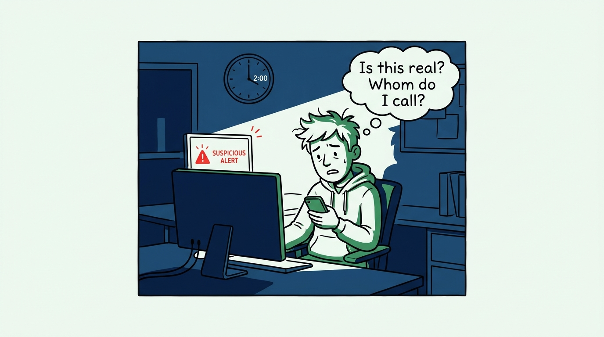
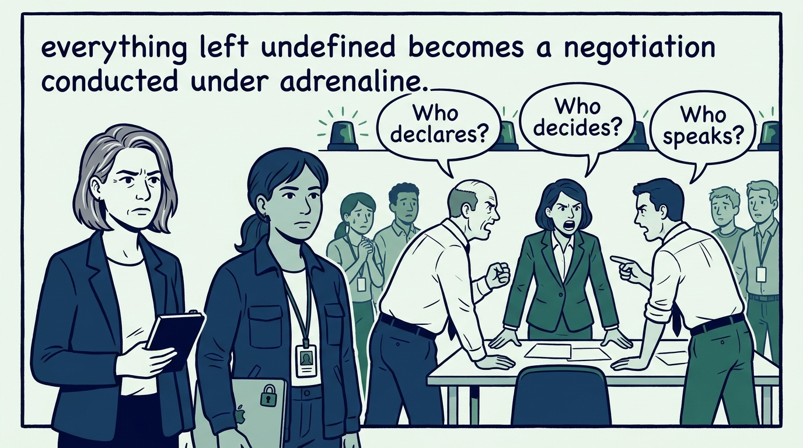
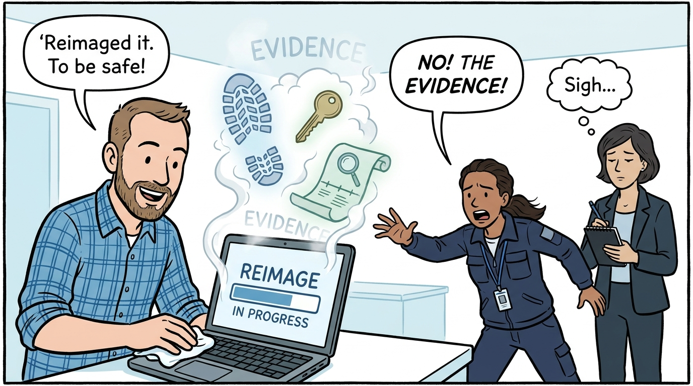
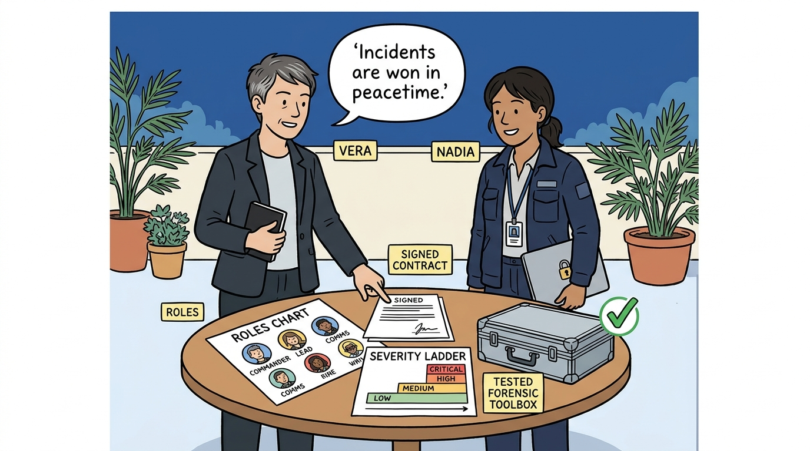
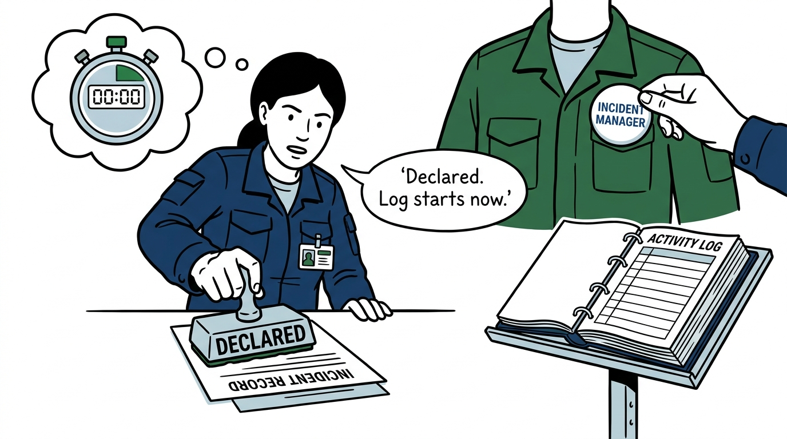
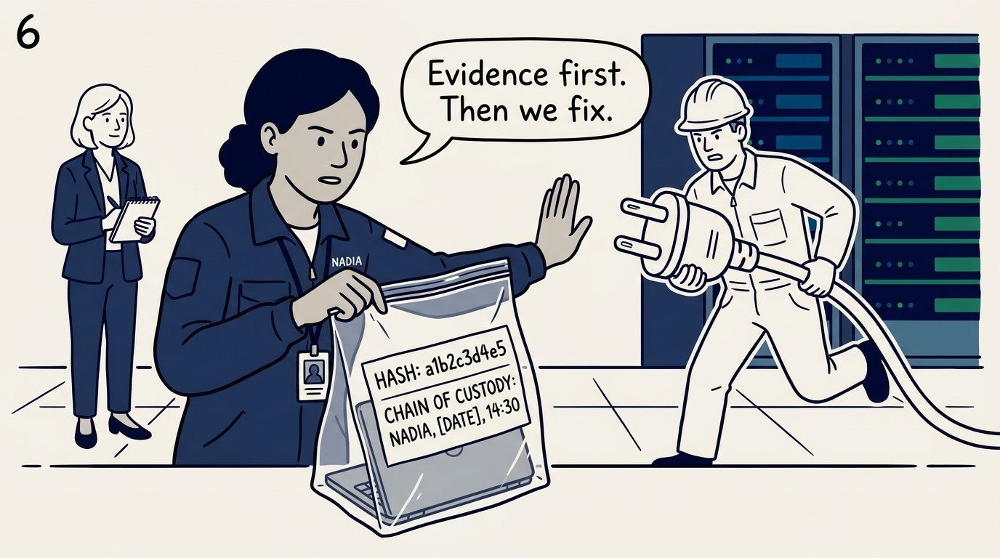
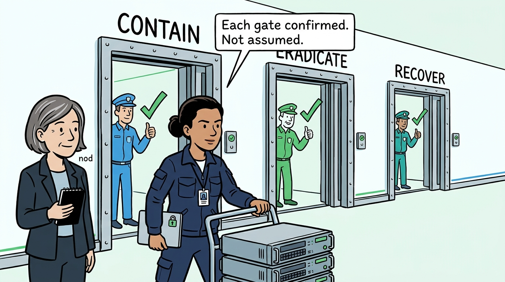
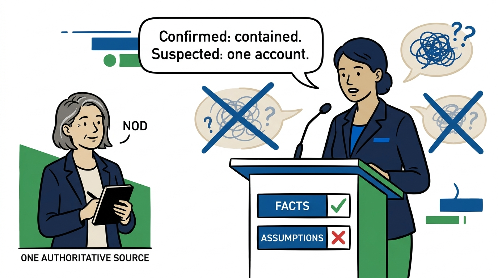
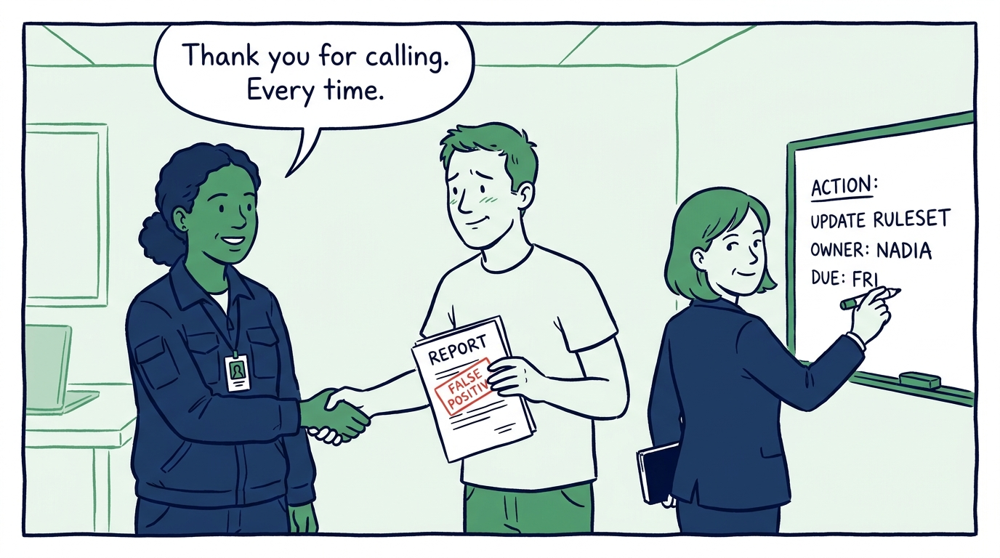

Why incident response is a practiced discipline, not an improvisation — in nine panels.

<!-- comic-style
{
  "cast": "VERA: a calm, seasoned engineering executive, short gray-streaked hair, dark blazer over a plain t-shirt, carries a small black notebook. NADIA: a hands-on defensive-security lead, shoulder-length dark hair tied back, navy utility jacket over a plain shirt, an access badge on a lanyard, laptop with a padlock sticker under one arm.",
  "style": "Clean two-tone explainer comic, thick ink outlines, flat colors with deep blue and green accents on a light background, generous white space, hand-lettered speech bubbles with SHORT readable text, no photorealism."
}
-->

**Panel 1:** *The hook: 2 a.m., one engineer, one suspicious alert. Whether the organization learns about the compromise in hours or in months is decided right here.*

**Panel 2:** *The problem: during an incident, every undefined thing becomes a negotiation under adrenaline — who declares, who decides, who talks to the outside. A contract negotiated mid-breach costs days when hours matter.*

**Panel 3:** *The wrong way: the wiped laptop. The instinct to fix it now destroys the memory, disk artifacts, and logs that would have answered how the attacker got in — and whether they are still here.*

**Panel 4:** *The principle: incidents are won in peacetime. Definitions, severity levels, declaration authority, roles, pre-signed external contracts, and tested forensic tooling — all finished before the incident starts.*

**Panel 5:** *Declaration is a formal act, not a mood: an incident manager is named, the start time is recorded, and the activity log begins immediately — one thread of command instead of a swarm.*

**Panel 6:** *Evidence is preserved before remediation destroys it: original logs, memory captures, forensic images, hashes, and chain of custody — the response's memory, and the only version that survives legal scrutiny.*

**Panel 7:** *Three distinct gates, each confirmed rather than assumed: contain deliberately, eradicate until the environment is clean — rebuilding where trust cannot be restored — and recover verifiably, with explicit approval.*

**Panel 8:** *Communications run from one authoritative source that labels facts apart from assumptions — because in every messy incident, the second incident is the communications incident.*

**Panel 9:** *The closer: the 2 a.m. test is cultural, not technical — the engineer who escalates is thanked for a false positive, never punished, and no incident closes without corrective actions that carry owners and deadlines.*
