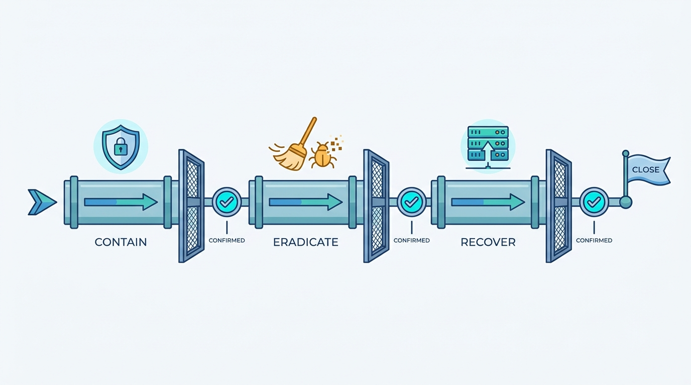
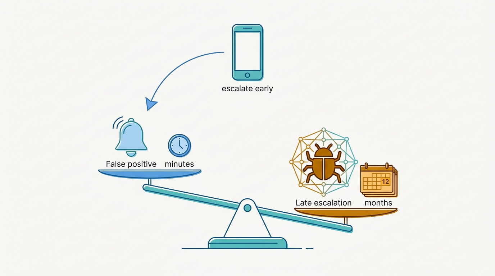
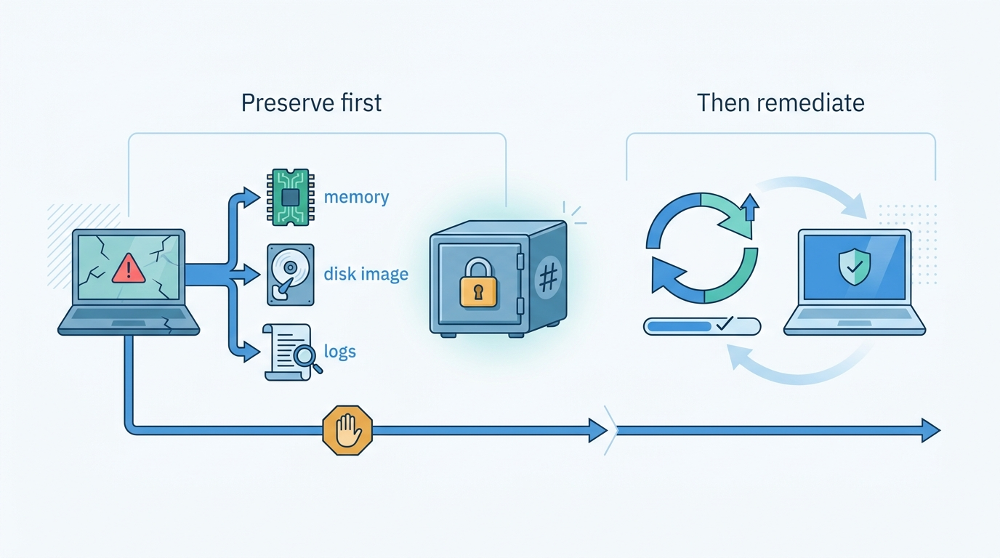

> **Status**: DRAFT
>
> **Principle**: When my organization suspects a security incident, the response is a **practiced discipline, not an improvisation**. Preparation is finished before the incident starts: definitions, severity levels, declaration authority, roles, pre-signed external contracts, and forensic tooling tested in peacetime. **A suspected incident is escalated early** — a false positive costs minutes, a late escalation costs the investigation. **Declaration is a formal act**: an incident manager is named, the start time is recorded, and the activity log begins immediately. **Evidence is preserved before remediation destroys it**; investigation correlates logs, endpoints, disk, memory, and network into one timeline; **containment, eradication, and recovery are distinct gates**, each confirmed rather than assumed. Communications flow from **one authoritative source** that separates facts from assumptions, and no incident closes without a review whose corrective actions have owners and deadlines. The test I hold the capability to: **the engineer who suspects a compromise at 2 a.m. knows exactly whom to call — and is thanked for a false positive, never punished for escalating.**

## Statement

When a security incident is suspected, declared, or worked in my organization, this is the discipline I hold the response to.

**Preparation is finished before the incident starts.**

- **Definitions and thresholds exist in peacetime.** What qualifies as a security incident, the severity levels, the escalation thresholds, and who has the authority to declare an incident are all defined before anything burns — and incident response is integrated with the existing outage, support, and operational processes rather than bolted beside them.
- **Everyone knows how to report.** Staff know how and when to report a suspected incident, and the standing instruction is to escalate early rather than delay over a possible false positive.
- **Roles are cast in advance.** Who can act as incident manager, what technical responders own, who talks to management, who handles external communications, and where legal, compliance, HR, and PR sit are decided before they are needed — and contracts, NDAs, and SLAs with external incident-response specialists are signed before an incident, not during one.
- **The technical floor is laid.** Centralized logging with retention long enough to support an investigation and protected from alteration by compromised systems; EDR/XDR/MDR coverage confirmed on critical systems; endpoint isolation, disk imaging, memory acquisition, and packet capture prepared; forensic tool access tested before it is needed; evidence-preservation and snapshot policies written down.

**Declaration is a formal act, not a mood.**

- A reported event is validated, its initial severity and scope determined, and the incident formally declared when escalation criteria are met. The team is notified, **an incident manager is assigned, the start time is recorded**, an incident record is created, and a detailed activity log begins immediately.

**Management is coordinated, sustained, and quiet.**

- A dedicated war room or secure channel is opened; **decision authority is explicit**; investigation and remediation tasks have named owners; updates run on a schedule through one person; and discussion through potentially compromised channels is limited.
- Goals are set — protect people, systems, and data; stop attacker access; find persistence; scope what was touched, modified, or stolen; minimize unnecessary downtime; preserve evidence.
- **Long incidents get shifts.** Prolonged responses run on responder rotations with clean handoffs and continuity of command — fatigue is a response risk, not a badge.

**Evidence is preserved before remediation destroys it.**

- Every significant action is recorded with who and when. Original logs are preserved before systems are modified; snapshots, memory captures, and forensic images are taken when appropriate; write-protection, hashes, and chain-of-custody documentation keep the evidence usable — technically and legally.

**Investigation is multi-lens and converges on one timeline.**

- Logs (OS, application, identity, network, SIEM), endpoint telemetry (processes, persistence, lateral movement), disk and file analysis, memory analysis, and network captures are collected and **correlated into a single timeline of the compromise** — including the gaps and unusual changes in logging that are themselves indicators.

**Containment, eradication, and recovery are distinct gates.**

- **Contain** deliberately: isolate endpoints, disable accounts, block indicators, restrict segments — after considering whether the action tips off the attacker and whether it breaks critical services, and with evidence preserved before anything destructive.
- **Eradicate** completely: malware, persistence, unauthorized accounts, and malicious changes removed; exploited vulnerabilities patched; credentials reset and secrets rotated; **systems rebuilt where trust cannot be restored**; the same compromise hunted across the wider environment.
- **Recover** verifiably: restore from trusted sources, validate integrity before production, reconnect gradually, monitor closely — and obtain explicit approval before declaring recovery complete.

**Figure 1:** *Containment, eradication, and recovery are distinct gates — each confirmed rather than assumed before the incident moves on.*

**Communications run from one authoritative source.**

- Internally: regular, concise updates that clearly distinguish confirmed facts from assumptions, with major decisions documented. Externally: customer, partner, insurer, regulator, and law-enforcement notifications decided deliberately, coordinated with legal and communications, against contractual and regulatory deadlines, with every notification recorded.

**Closure is explicit and the review is mandatory.**

- The incident closes only when attacker access is removed, persistence eliminated, systems recovered, and recurrence monitoring in place — with the incident manager's approval and a recorded end time.
- A lessons-learned session follows shortly after, once responders have recovered enough to be accurate: final timeline, root cause, attack vector, what worked, what did not, and process, technology, and training improvements — **every corrective action with an owner and a deadline, tracked through completion**, and an after-action report produced.

## How to Read This

This record opens the **Response and Recovery** section of the journal — what my organization does when the program described in [[security-program]] meets a live adversary. It is grounded in the Incident Response chapter of the *Defensive Security Handbook* (Brotherston, Berlin, Reyor), read as an executive operating record: the bar the organization is held to, not a forensics manual. The full working checklist — preparation through final verification — lives in the **Checklist** tab; the management summary in the **TL;DR** tab; the conversation in the **Conversation** tab.

## Rationale

**Incidents are won in peacetime.** The chapter's checklist opens with three full sections of pre-incident preparation before any incident exists — definitions, roles, contracts, logging, tooling — and that placement is the message. During an incident, every undefined thing becomes a negotiation conducted under adrenaline: who declares, who decides, who speaks. A contract with an external forensics firm negotiated mid-breach costs days at exactly the moment hours matter. Preparation converts the incident from an open-ended crisis into the execution of a rehearsed plan, which is the only version of incident response that scales beyond the heroics of whoever happens to be awake.

**Early escalation must be cheaper than silence.** The single most consequential line in the chapter is the preference for escalating a suspected incident early rather than delaying because of a possible false positive. Detection technology does not decide whether I learn about a compromise in hours or in months — the reporting culture does. If a false alarm embarrasses the reporter, people will sit on suspicions until they are certain, and certainty arrives long after containment mattered. So my organization prices the false positive at approximately zero and the late escalation as the expensive failure. The 2 a.m. test in the principle is cultural, not technical.

**Figure 2:** *The asymmetry behind the 2 a.m. test: a false positive costs minutes, a late escalation costs the investigation — so silence, not the false alarm, is priced as the failure.*

**Declaration creates the clock and the command.** The formal act — declare, assign an incident manager, record the start time, open the log — looks bureaucratic and is the opposite. It creates a single thread of command in place of a swarm of well-meaning engineers each half-fixing things, and it starts the record that every later question depends on: regulators ask when we knew; insurers ask what we did; the postmortem asks what happened in what order. An incident nobody declared is an incident nobody managed.

**Evidence discipline is the response's memory.** The strongest instinct in a breach is to fix it now — reimage the laptop, delete the account, reboot the server. Every one of those actions destroys evidence, and with it the answers to the questions that matter more than the fix: how they got in, what they touched, whether they are still here. That is why the record insists evidence is preserved *before* destructive remediation, why volatile memory is captured before shutdown, and why hashes and chain of custody are kept even when court seems unlikely — the option to involve law enforcement or insurers is only real if the evidence would survive scrutiny.

**Figure 3:** *Evidence is preserved before remediation destroys it: memory, disk, and original logs go into a hash-verified vault before anything is wiped.*

**Containment is a decision, not a reflex.** Isolating a machine, disabling an account, blocking an indicator — each action can tip off an attacker who then accelerates, destroys evidence, or detonates what they were staging. Each can also break a critical service in a way that costs more than the attacker has. The record therefore treats containment as a sequence of deliberate trade-offs made by someone with explicit authority — and it keeps monitoring after containment, because attackers with persistence treat your containment as their notification.

**Eradication ends when the environment is clean, not when the alert clears.** Removing the malware that fired the alert while the attacker's second foothold survives converts one incident into two — and the second one starts with the attacker knowing your playbook. Hence the record's insistence on hunting the same compromise across the wider environment, rotating every exposed credential and secret, and rebuilding systems where trust cannot be restored. A rebuilt system is expensive; a system you merely hope is clean is more so.

**One voice, facts separated from assumptions.** In every messy incident the second incident is the communications incident: three versions of status circulating, management repeating an assumption as fact, an external statement that has to be walked back. A single authoritative source of status, a named communicator, and the discipline of labeling what is confirmed versus what is suspected are cheap controls against an expensive failure mode — and externally, where notification deadlines are contractual and regulatory, they are not optional.

**The postmortem is where the security program improves.** Detection gaps, coordination failures, missing runbooks, training needs — an incident surfaces in one week what an audit would take a year to find. The review is blameless and slightly delayed so responders can be accurate rather than defensive; its output is not a document but a tracked list of corrective actions with owners and deadlines. An incident whose lessons were not converted into changed controls will be rerun, at full price, by the next attacker.

## What This Means in Practice

| What this record says | What it does **not** say |
| --- | --- |
| Anyone who suspects an incident escalates early; false positives are welcomed. | Every escalation becomes a declared incident — validation and severity triage still happen. |
| Declaration formally names an incident manager and starts the activity log. | The incident manager does the technical work — they command, coordinate, and communicate. |
| Evidence is preserved before destructive remediation. | Response waits for forensics on every machine — preservation is proportionate to severity and legal need. |
| Containment weighs attacker awareness and service impact before acting. | Containment is delayed until the picture is complete — protecting people, systems, and data comes first. |
| Systems are rebuilt where trust cannot be restored. | Every touched system is reimaged — the standard is restored trust, evidenced, per system. |
| One authoritative status source; facts labeled apart from assumptions. | Information is hoarded — updates are regular and scheduled, just single-sourced. |
| Closure requires confirmed eradication, recovery, monitoring, and a review with tracked actions. | The review assigns blame — it assigns owners to fixes. |

Concretely: every team in my organization can answer "whom do you call when you suspect a compromise?" without looking it up; every declared incident has a named incident manager and an activity log within the first hour; and no incident is closed until its after-action items have owners, deadlines, and a tracker entry someone will chase.

## Anti-Patterns

- **The heroic improvisation.** No definitions, no roles, no runbooks — every incident handled from scratch by whoever is loudest, with quality determined by who happened to be on call.
- **The punished false positive.** An engineer escalates in good faith, gets mocked or interrogated, and the whole organization learns to sit on suspicions until they are undeniable — and unrecoverable.
- **The wiped laptop.** The compromised machine is reimaged within the hour "to be safe," taking with it the memory, disk artifacts, and logs that would have answered how the attacker got in and where else they are.
- **The swarm without a commander.** Five engineers fixing five things in parallel, no incident manager, no log — actions collide, evidence evaporates, and afterwards nobody can reconstruct what was done.
- **The tip-off containment.** Indicators blocked one by one as they are found, alerting the attacker mid-investigation; they rotate infrastructure, burn their noisy foothold, and keep the quiet one.
- **The premature all-clear.** Recovery declared when the alert stops firing — no eradication verification, no recurrence monitoring — and the attacker's second foothold turns one incident into a worse sequel.
- **Status by rumor.** No authoritative source, so three versions of the incident circulate; management repeats an assumption to a customer, and the correction costs more trust than the breach.
- **The unread postmortem.** A lessons-learned document written, filed, and never converted into owned, deadlined corrective actions — the next incident replays this one with a new date.

## Related Records

- [[security-program]] — the program that funds, staffs, and governs this capability; incident response is its sharpest test.
- [[disaster-recovery]] — the neighboring discipline: when an incident (ransomware above all) destroys rather than infiltrates, response hands off to recovery.
- [[phishing-response]] — the most common on-ramp to an incident; its report-fast culture is this record's escalation culture applied to everyone.
- [[logging-and-monitoring]] — the telemetry this record's investigation phase presumes; retention and tamper-protection decisions are made there.
- [[ids-ips]] — a primary detection source feeding declaration, and the network evidence used in analysis.
- [[endpoints]] — EDR coverage, isolation capability, and endpoint hygiene determine whether containment is a click or a scramble.
- [[user-education]] — the training that makes "know how and when to report" true for the whole organization, not just engineers.

## Scope and Revisiting

This record is `draft`. It applies to every suspected or declared security incident in my organization, whatever the affected system. I revisit it if a real incident or exercise shows the escalation path failing the 2 a.m. test, if evidence preserved under these procedures fails legal or insurer scrutiny, if regulatory notification obligations change materially, or if post-incident reviews stop producing tracked corrective actions — a review that changes nothing is this record failing in practice.

## Authoritative References

- *Defensive Security Handbook*, 2nd edition (Lee Brotherston, Amanda Berlin, William F. Reyor III; O'Reilly) — the Incident Response chapter, whose checklist this record distills.
