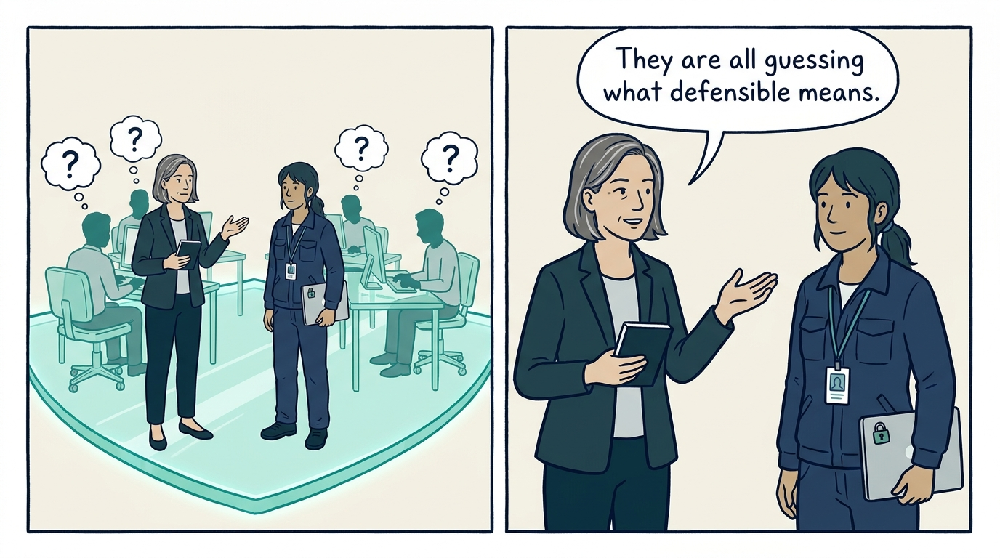
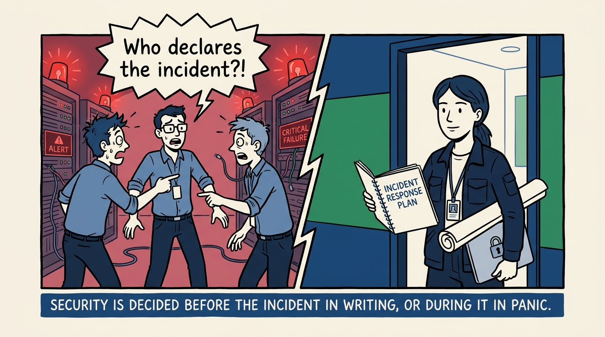
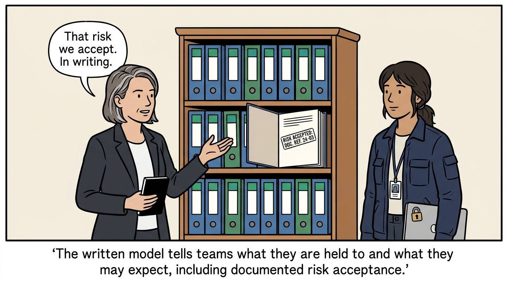
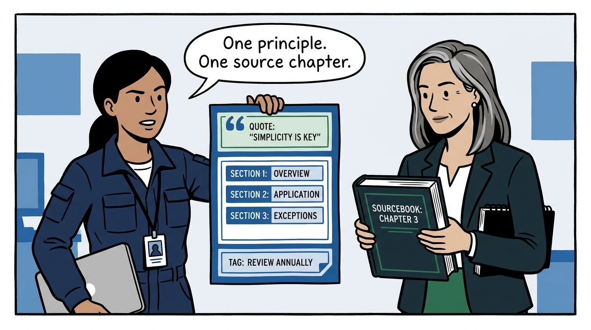
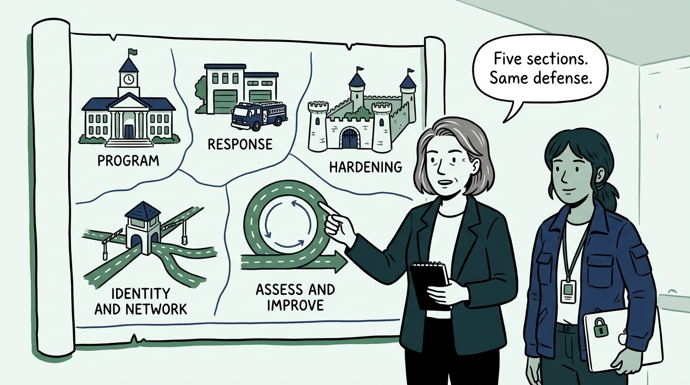
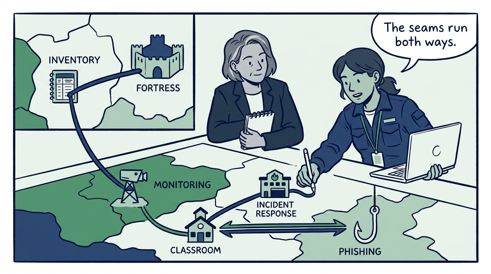
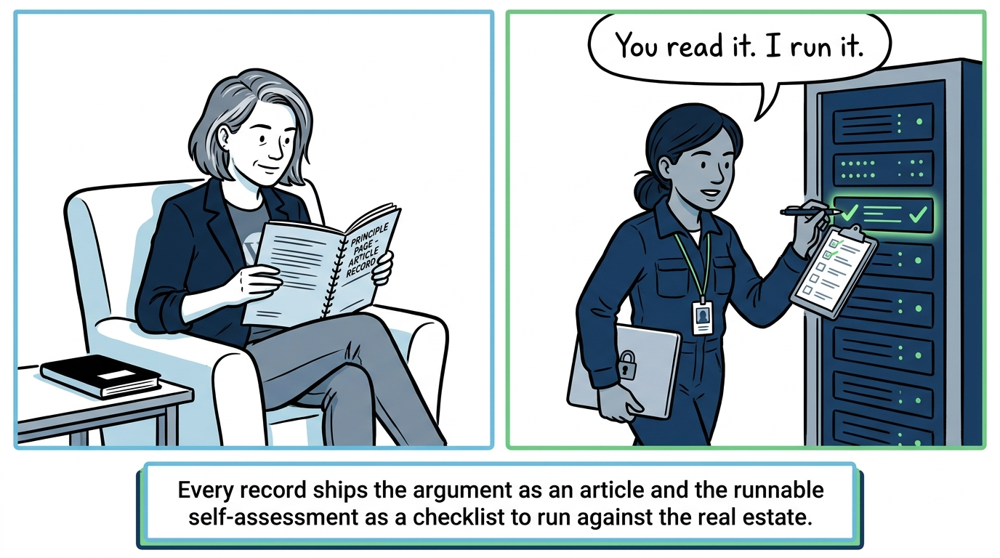
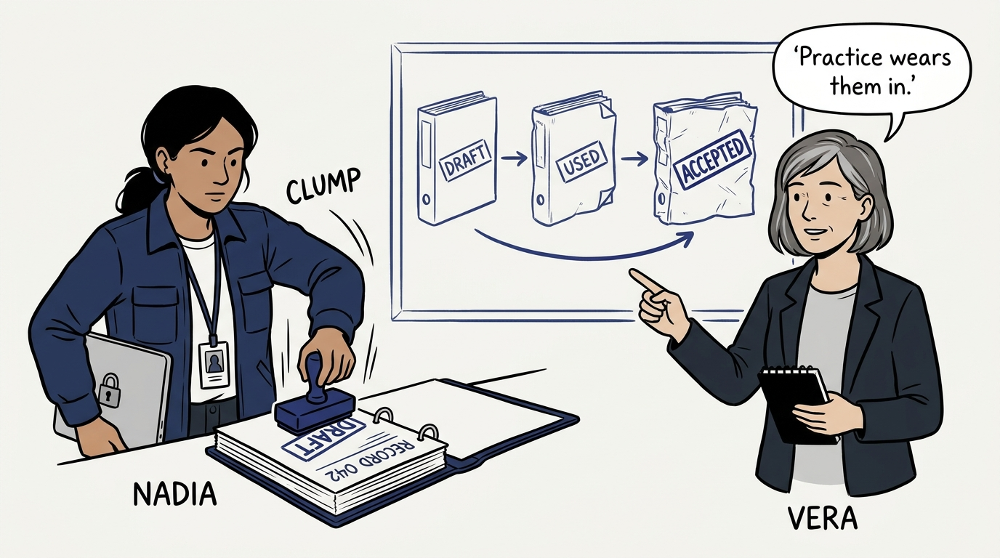

Why a defensive-security operating model gets written down instead of lived in the security team's heads — in eight panels.

<!-- comic-style
{
  "cast": "VERA: a calm, seasoned engineering executive, short gray-streaked hair, dark blazer over a plain t-shirt, carries a small black notebook. NADIA: a hands-on defensive-security lead, shoulder-length dark hair tied back, navy utility jacket over a plain shirt, an access badge on a lanyard, laptop with a padlock sticker under one arm.",
  "style": "Clean two-tone explainer comic, thick ink outlines, flat colors with deep blue and green accents on a light background, generous white space, hand-lettered speech bubbles with SHORT readable text, no photorealism."
}
-->

**Panel 1:** *The hook: everyone who builds or runs systems makes security decisions daily — and without a written model, they all have to guess what defensible looks like.*

**Panel 2:** *Why write it down: security is decided before the incident, in writing — or during the incident, in panic. An incident is the worst time to discover nobody agreed who declares one.*

**Panel 3:** *The move: write the model down as twenty-four records — what security work is held to, and what everyone else is entitled to expect, including the right to hear 'no, that risk we accept, in writing.'*

**Panel 4:** *What a record is: one quotable principle up top, an ADR-shaped body below, a revisit condition at the bottom — each adapted from one chapter of a single credited source, the Defensive Security Handbook.*

**Panel 5:** *The map: five sections answer different questions about the same defense — The Security Program, Response and Recovery, Hardening the Estate, Identity and Network, and Assess and Improve.*

**Panel 6:** *The seams: asset inventory is the ground under every hardening baseline, logging is what turns incident response into investigation, and user education and phishing response are the same threat before and after the click.*

**Panel 7:** *How to read it: the article states the principle and why it holds; the record's checklist is the runnable part — written to be run against a real estate, some of them under pressure.*

**Panel 8:** *The closer: every record starts as a draft on purpose — adopted ahead of being worn in, each naming its own revisiting conditions, and moved to accepted only as practice wears it in.*
