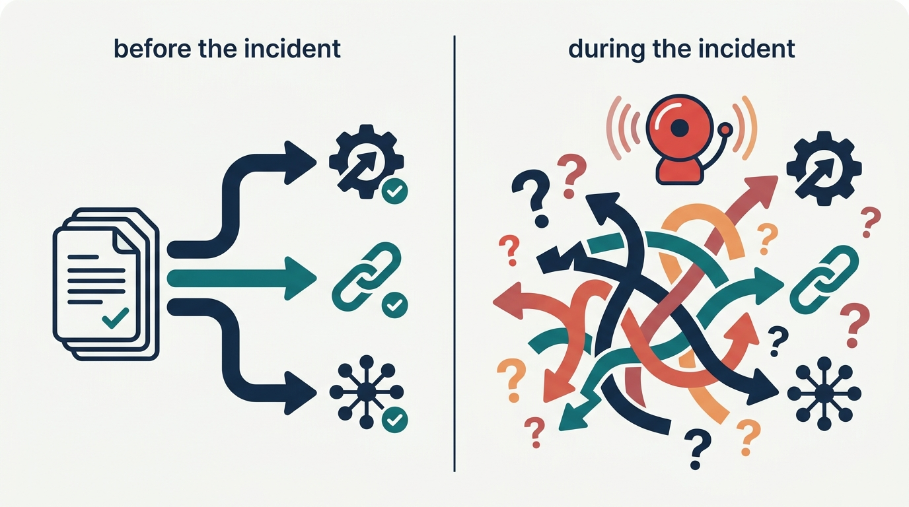
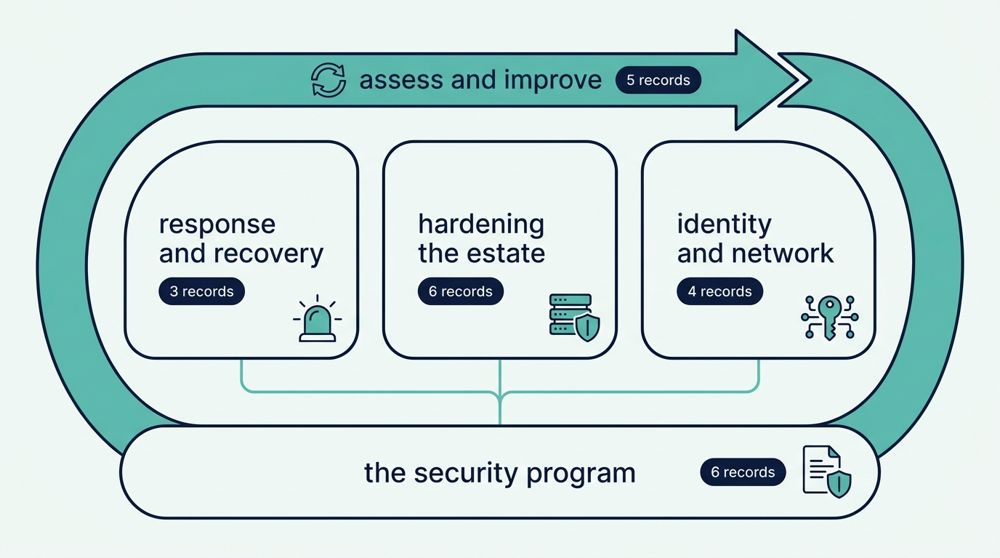

> **KEY POINTS:**
>
> * **This journal is my defensive-security operating model, written down** — 24 records covering the program before the tools (creating it, knowing what you have, policies, standards, education, compliance), what happens when it goes wrong (incidents, disasters, phishing), hardening the estate (physical to cloud), identity and the network, and the continuous loop of assessing and improving — grounded in Lee Brotherston, Amanda Berlin, and William F. Reyor III's *Defensive Security Handbook*, 2nd edition.
> * **Every record ships its working checklist, not just the argument** — the article states the principle I commit to and why; the **Checklist** tab carries the runnable self-assessment distilled from the source chapter, ready to run against a real estate.
> * **Read it as an operating manual, not a book report** — the material is adapted from a book I trust through a practitioner-executive lens; where my practice differs from the source, the record says so, and every record names the conditions under which I would revise it.

 

If you build, run, or depend on systems in my organization, you should **not have to guess** what I think defensible looks like. This journal writes it down: what a security program is and where its authority comes from, what happens in the first hour of an incident, what every server, endpoint, database, and cloud account is held to, who gets in and what can talk to what, and how we keep finding our own weaknesses before someone else does. The Map below carries the full inventory. Each record states the operating principle in the article; the runnable checklist lives in the record's **Checklist** tab.

## Why an Executive Writes the Security Model Down

Because **security is decided before the incident, in writing — or during the incident, in panic.** Every engineer in the organization makes security decisions daily — what to log, what to expose, what to patch, whom to trust — and a model that lives in the security team's heads reaches none of them. Incidents are the worst possible time to discover that nobody agreed on who declares one, disasters are the worst possible time to test a recovery plan, and an audit is the worst possible time to learn what your own policy says. Writing the model down does two things: it tells the teams doing security work what I will hold them to — and it tells everyone else what they are entitled to expect from the security program, **including the right to hear "no, that risk we accept, in writing."**

**Figure 1:** *Security is decided before the incident, in writing — or during the incident, in panic; written records reach every engineer making daily security decisions.*

The journal inherits its charter from its siblings: the [engineering-executive journal](../grounded-engineering-executive/introduction.html) commits me to an inspectable executive operating model, and the [platforms journal](../grounded-platforms/introduction.html) writes down what I hold platform work to. This journal covers defense: the program, the response, the hardening, the access, and the loop that improves all of it.

## What a Record Looks Like

Every record follows the same shape, so you always know where to look:

| Part | What it gives you |
| --- | --- |
| **Status / Principle** blockquote | The operating principle in one quotable paragraph. |
| **Statement → Rationale → Anti-Patterns** | The ADR-shaped body: what I commit to, why it holds, what it does *not* say, and the failure modes it guards against. |
| **Checklist** tab | The working self-assessment distilled from the source chapter — the part you run against a real estate. |
| **TL;DR** and **Conversation** tabs | The management summary for the skim, and the two-host dialog for the argument out loud. |
| **View spec** link | The authoring contract behind the post — intent, success criteria, and a decision log, versioned like everything else. |

Every record carries a stable `SEC-` identifier and `status: draft`, deliberately: the material is adopted from a source I trust and adapted ahead of being fully worn in at my current scope, and each record **names its own revisiting conditions**.

## Where the Material Comes From

One book, credited openly and per record: **Lee Brotherston, Amanda Berlin, and William F. Reyor III, *Defensive Security Handbook: Best Practices for Securing Infrastructure*, 2nd edition** (O'Reilly, 2024) — the pragmatic blue-team book, written for organizations that must defend themselves with the engineers and budget they actually have rather than the security department they wish they had. The 24 records follow the book's 24 chapters, one record per chapter checklist.

The chapter checklists are the ground truth; the records state **what *I* will run and hold security work to**, in first person, with the adaptations I have made. Where my practice differs from the book, the record says so.

## The Map

Five sections after this one:

- **The Security Program** — the program before the tools: [[security-program]] creates the program and gives it authority; [[asset-management]] establishes that you cannot defend what you do not know you have; [[policies]], [[standards-and-procedures]], and [[user-education]] turn intent into rules, rules into repeatable practice, and practice into people who don't click; [[compliance]] keeps the auditors a by-product of doing security, not the point of it.
- **Response and Recovery** — what happens when it goes wrong: [[incident-response]] decides who declares, who leads, and who speaks before anything is on fire; [[disaster-recovery]] makes recovery a tested capability rather than a document; [[phishing-response]] handles the attack that starts most of the others.
- **Hardening the Estate** — the systems themselves, from the door to the cloud: [[physical-security]], [[windows-infrastructure]], [[unix-servers]], [[endpoints]], [[databases]], and [[cloud-infrastructure]] each state the baseline that class of system is held to.
- **Identity and Network** — who gets in and what can talk to what: [[authentication]] governs identity and credentials; [[network-security]] and [[network-segmentation]] control the paths and the blast radius; [[ids-ips]] watches the traffic that gets through.
- **Assess and Improve** — the continuous loop: [[vulnerability-management]] finds and fixes weaknesses on a cadence; [[secure-software-development]] moves security into the code before it ships; [[osint-purple-teaming]] tests the defense the way an attacker would; [[logging-and-monitoring]] makes everything else observable; [[the-extra-mile]] is what comes after the baseline holds.

**Figure 2:** *The map: five sections, twenty-four records — the program is the ground, response, hardening, and identity stand on it, and the assess-and-improve loop keeps them all honest.*

**The sections answer different questions about the same defense.** The program records decide *on whose authority and against what inventory* everything else operates — [[asset-management]] is the ground under every hardening record, because a baseline you cannot enumerate is a baseline you cannot enforce. The response records assume the hardening will sometimes fail — [[logging-and-monitoring]] is what turns [[incident-response]] from guesswork into investigation, and [[network-segmentation]] is what keeps the incident it investigates small. The seams run in both directions: [[user-education]] and [[phishing-response]] are the same threat handled before and after the click, and [[vulnerability-management]] is the loop that keeps every baseline in the Hardening section honest. Follow the links rather than the section order if a thread pulls you.

## How to Read This Journal

- **If you do security or infrastructure work here** — start with [[security-program]] and [[asset-management]]; then run the Checklist tab of each record that names a system class you own ([[windows-infrastructure]], [[unix-servers]], [[endpoints]], [[databases]], [[cloud-infrastructure]]) against the real estate.
- **If you lead an application team** — [[secure-software-development]], [[authentication]], and [[user-education]] tell you what your team is held to; [[incident-response]] tells you what happens, and what is expected of you, when something your team runs is involved in an incident.
- **If you are my peer or my manager** — read the Status/Principle blockquotes across all five sections; that is **the whole operating model in twenty minutes**. [[security-program]] and [[compliance]] are where the governance and investment arguments live.
- **If something is on fire right now** — [[incident-response]], then [[phishing-response]] or [[disaster-recovery]] as the situation dictates; their Checklist tabs are written to be run under pressure.
- **If you are building your own model** — take the checklists and adapt them; that is what I did. The book is worth your time in full, and disagreeing with my adaptations is a fine way to find your own.

## Status and Revisiting

This journal is **a living document**. Every record starts in `draft` status and moves to `accepted` **as practice wears it in**, each on the revisiting conditions it declares for itself — and this introduction gets updated whenever the journal's shape changes.

## Authoritative References

- Lee Brotherston, Amanda Berlin, and William F. Reyor III, *Defensive Security Handbook: Best Practices for Securing Infrastructure*, 2nd edition (O'Reilly, 2024).
