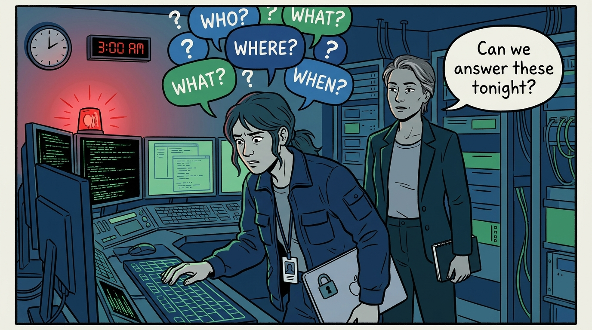
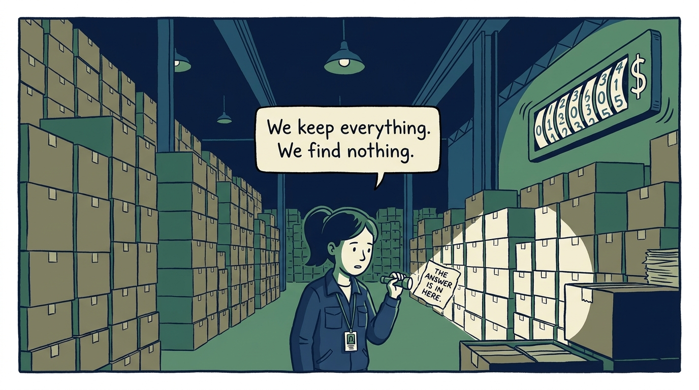
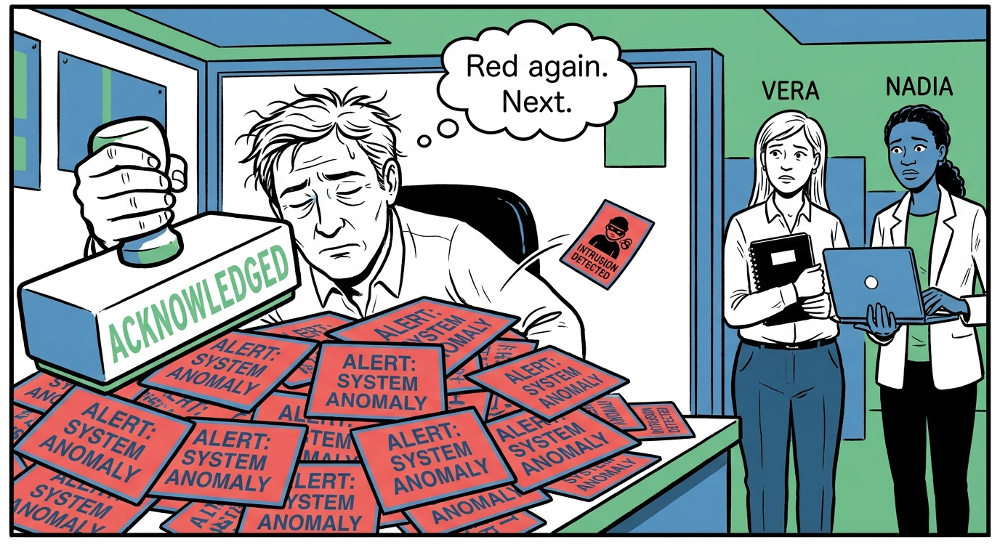
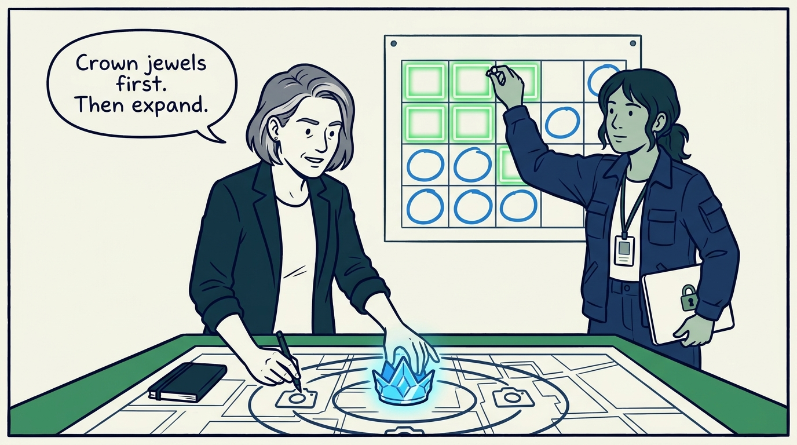
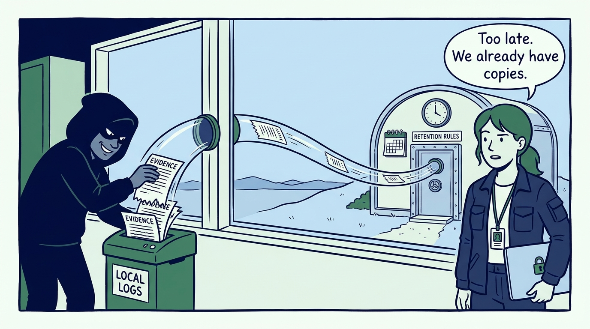
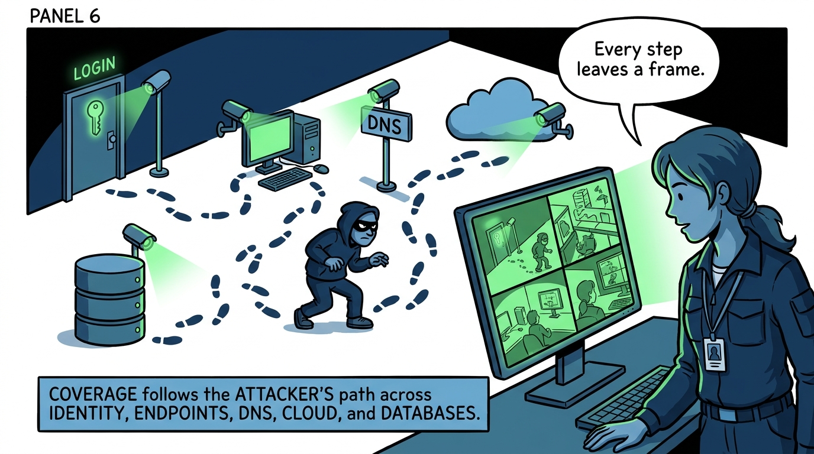
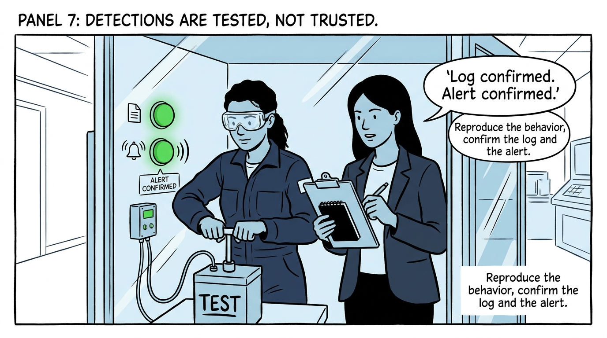
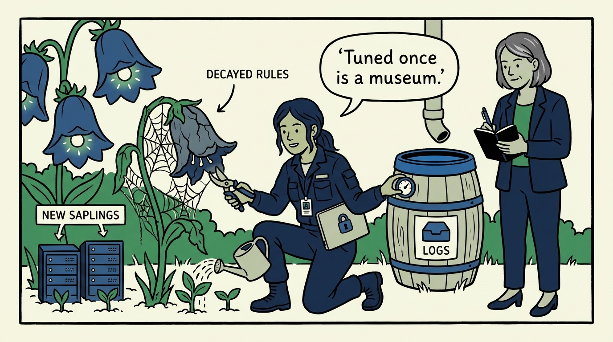
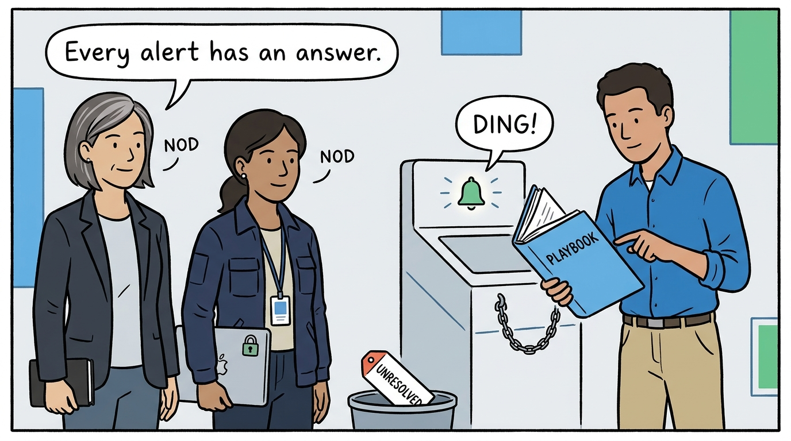

Why logging is the ability to answer questions during the worst hour, not storage — in nine panels.

<!-- comic-style
{
  "cast": "VERA: a calm, seasoned engineering executive, short gray-streaked hair, dark blazer over a plain t-shirt, carries a small black notebook. NADIA: a hands-on defensive-security lead, shoulder-length dark hair tied back, navy utility jacket over a plain shirt, an access badge on a lanyard, laptop with a padlock sticker under one arm.",
  "style": "Clean two-tone explainer comic, thick ink outlines, flat colors with deep blue and green accents on a light background, generous white space, hand-lettered speech bubbles with SHORT readable text, no photorealism."
}
-->

**Panel 1:** *The hook: the worst hour — an incident is a stream of questions under time pressure, and the logging estate either answers them or it does not.*

**Panel 2:** *The problem: the write-only SIEM — terabytes ingested, licensing paid, nothing read; collecting everything is a decision to find nothing.*

**Panel 3:** *The wrong way: the thousand-alert morning — untuned rules train analysts to bulk-acknowledge, and the real intrusion drowns in ignored red.*

**Panel 4:** *The principle: design from risk backwards — highest-value systems and explicit use cases first, mapped to a framework so the gaps have names.*

**Panel 5:** *Practice: centralize under a Record of Authority — attackers delete local logs, so the copy the investigation relies on lives beyond their reach, with location and retention written down.*

**Panel 6:** *Practice: coverage follows the attacker's path — identity, endpoints, applications, cloud, databases, DNS, and the perimeter each get a camera, because a gap in any one is an unrecorded corridor.*

**Panel 7:** *Practice: tested, not trusted — a detection that has never fired in a test is a hypothesis, so the behavior is reproduced and both the log and the alert are confirmed.*

**Panel 8:** *The upkeep: the SIEM decays by default — noisy rules pruned, detections updated with new systems and threats, retention and capacity reviewed, every change documented.*

**Panel 9:** *The closer: the bar the estate is held to — every enabled alert is one analysts know how to investigate, and every claimed detection has been proven to fire.*
