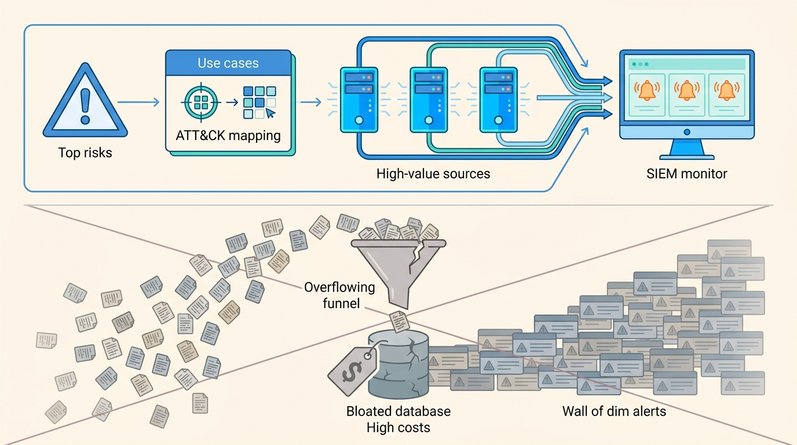
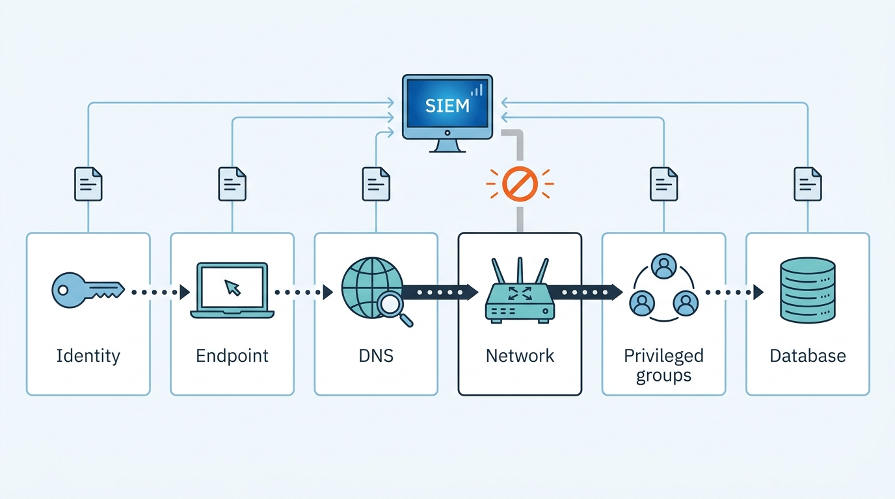
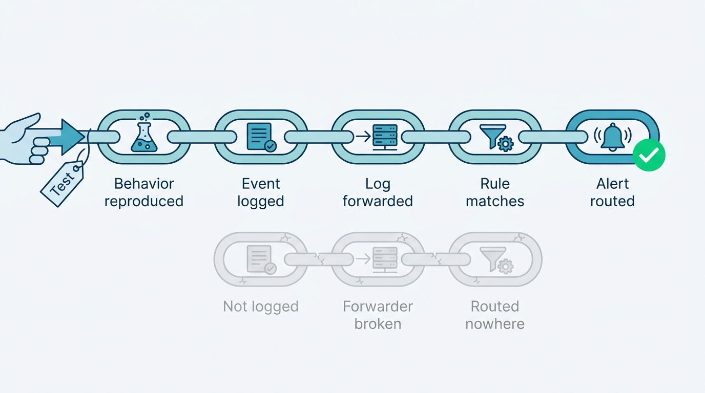

> **Status**: DRAFT
>
> **Principle**: Logging in my organization is not storage — it is **our ability to answer questions during the worst hour**. The SIEM is **designed from risk backwards**: coverage scope, compliance requirements, and the highest-value systems come first, use cases are mapped to frameworks like MITRE ATT&CK, and **collection starts with high-value sources** instead of hoarding everything at any cost. **Logs are stored centrally** under a Record of Authority for location and retention; **alerts are few, focused, and actionable** — false positives tuned down, false negatives actively hunted; **coverage follows the attacker's path** across identity, endpoints, applications, cloud, databases, DNS, and the network; and **detections are tested, not trusted** — expected malicious behavior is reproduced in a controlled environment and both the log and the alert are confirmed. The test I hold the estate to: **every alert that is enabled is one analysts know how to investigate — and every claimed detection has been proven to fire.**

## Statement

When my organization builds and operates its detection estate, this is the bar it is held to.

**The SIEM is designed from risk backwards.**

- **Scope before signal.** The SIEM's coverage scope, the compliance requirements that shape logging, and the organization's highest-risk and highest-value systems are identified first; security scenarios and use cases the SIEM should detect are established and mapped to frameworks such as MITRE ATT&CK or the Cyber Kill Chain.
- **Not every event is equally important.** Alert priorities are explicit; detection rules earn trust through proof-of-concept testing, and penetration tests or red-team exercises validate what the SIEM actually catches.
- **Collection is deliberate.** A Record of Authority defines where logs are stored and for how long; logs are stored centrally, not only on the systems that generate them; the collect-everything-versus-collect-what-is-needed decision is made consciously against storage, indexing, transmission, and licensing costs; coverage starts with high-value sources and expands over time.

**Figure 1:** *Designed from risk backwards: scope, use cases, and high-value sources first — because collecting everything is a decision to find nothing.*

**Alerting is tuned for action.**

- Centralized logs are analyzed continuously with real-time or near-real-time alerts for the events that matter. We verify that expected events are actually being logged and tune operating-system logging where defaults fall short.
- **False positives are tuned down; false negatives are hunted** by testing known suspicious behavior. Events are correlated across sources, enriched with threat intelligence, and the resulting alerts stay focused, useful, and actionable — with detection logic reviewed as the environment changes.

**Coverage follows the attacker's path across the estate.**

- **Windows endpoints** carry enhanced logging where required — process creation with command lines and parent processes, network connections correlated to processes, tamper detection on the logging service itself, persistence-related registry changes, and DNS queries tied to originating processes — forwarded to the SIEM, with advanced auditing standardized through Group Policy.
- **Identity** is watched for failed-login bursts, password spraying, brute force, abnormal patterns, privileged-account logins, and authentication over insecure clear-text protocols — which are eliminated where possible.
- **Applications** feed internet-facing logs into detection: excessive 4XX responses, URL enumeration, reconnaissance, and deviations from a baseline of normal services, processes, and open ports.
- **Cloud** is logged under the shared-responsibility model: administrative and API activity captured and centralized across AWS, Azure, and GCP, retained appropriately, with alerts on unexpected configuration and access changes.
- **Databases** are monitored for access to sensitive data, unusual users and query volumes, privileged activity, schema changes, privilege escalation, and possible bulk exfiltration.
- **DNS, endpoints, sensors, and the perimeter** complete the picture: DNS queries tied to endpoints and checked for malicious domains, C2 patterns, and DGAs; EDR/XDR detections centralized; IDS/IPS events forwarded and tuned; operating-system baselines alerting on unexpected processes and shell activity; proxy and firewall logs watched for C2, tunneling, and abnormal connections; and account, group, and permission changes — especially privileged group additions — alerted on.

**Detections are tested, not trusted.**

- Alerts are tested internally on a regular basis: expected malicious behaviors are reproduced in a controlled environment, and both the log data and the resulting alert are confirmed. Repeatable tests are automated where practical; tabletop exercises surface missing detections.
- **Logging audits are periodic and full**: every expected endpoint sending logs, current volume compared with historical baselines, unexpected changes investigated, every network ingress and egress point covered, newly deployed software evaluated for SIEM coverage, and detections retested after major configuration or infrastructure change.

**Frameworks make coverage inspectable; maintenance keeps it true.**

- Important detections are mapped to MITRE ATT&CK tactics and techniques, and ATT&CK is used to find coverage gaps. Threat models grow from the organization's most significant risks into use cases across access control, perimeter defense, intrusion detection, malware, application attacks, and resource integrity. Sigma is considered as a portable rule format — community rules customized locally, and **every imported or newly created rule tested before it is relied on**.
- The SIEM is operated as a living system: configuration reviewed regularly, detections updated as systems and threats change, alerts retuned as normal behavior shifts, consistently noisy rules removed or fixed, retention and storage capacity reviewed, every change documented, coverage periodically reassessed against organizational risk — and **analysts know how to investigate every alert that is enabled**.

## How to Read This

This record sits in the **Assess and Improve** section of the journal — it is the estate everything else reports into, and the precondition for [[incident-response]] being an investigation rather than an archaeology dig. It is grounded in the Logging and Monitoring chapter of the *Defensive Security Handbook*. The named instruments — Sysmon, CloudTrail, Sigma, the cloud providers' native services — are the chapter's concrete worked examples; my commitments hold at the capability level. The full working checklist lives in the **Checklist** tab; the **TL;DR** tab carries the management summary and the **Conversation** tab the dialog.

## Rationale

**Logs exist to answer the questions the incident will ask.** Who touched this host, what did that process spawn, where did the data go, when did the credential first appear — an incident is a stream of questions under time pressure, and the logging estate either answers them or it does not. That is why verification runs through this whole record: expected events *actually* logged, alerts *actually* generated, endpoints *actually* sending. Centralization is part of the same argument — attackers delete local logs, and a log that exists only on the compromised system is evidence held by the adversary.

**Collecting everything is a decision to find nothing.** The chapter is unusually honest about cost: storage, indexing, transmission, and licensing all scale with volume, and analyst attention scales with none of them. Treating every event as equally important produces a SIEM that is expensive, slow, and unread. Designing from risk backwards — highest-value systems, explicit use cases, high-value sources first — buys the opposite: a smaller estate that answers real questions. The Record of Authority makes the trade-off inspectable: what we keep, where, and for how long is a written decision, not an accident of default settings.

**An alert nobody can investigate is noise with a severity label.** The chapter's closing requirement — analysts know how to investigate every alert that is enabled — is the whole alerting philosophy in one line. Every enabled alert is a claim that someone will act on it; if no one can, the honest options are to fix the playbook or remove the alert. The same logic drives false-positive tuning and noisy-rule removal: alert fatigue is not an annoyance, it is the mechanism by which real intrusions go unread in a sea of ignored red.

**Coverage follows the attacker's path, not the org chart.** The estate's breadth — identity, endpoints, applications, cloud, databases, DNS, perimeter, accounts and groups — mirrors how intrusions actually move: a phished credential, a process on an endpoint, a DNS lookup to C2, lateral movement over SMB, a privileged group addition, a bulk query against the database. Each domain in the coverage list is a place a real attack becomes visible; a gap in any one of them is a corridor an attacker can walk down unrecorded. DNS deserves its special place: nearly everything resolves a name first, which makes DNS telemetry one of the cheapest, widest sensors the organization owns.

**Figure 2:** *Coverage follows the attacker's path, not the org chart — every domain is a place the intrusion becomes visible, and every gap is a corridor walked unrecorded.*

**A detection that has never fired in a test is a hypothesis.** Between "we forward those logs" and "we would catch that attack" sits a chain of silent failure modes: the event not logged, the forwarder broken, the rule mistargeted, the alert routed nowhere. The only way to know the chain works is to pull it — reproduce the malicious behavior in a controlled environment, confirm the log, confirm the alert. This is also why the record insists on testing every imported Sigma rule before relying on it, and on retesting after major change: community rules encode someone else's environment, and yesterday's confirmed detection quietly dies in today's migration. [[osint-purple-teaming]] runs this same discipline end to end with a live red team.

**Figure 3:** *The only way to know the chain works is to pull it: reproduce the behavior, confirm the log, confirm the alert — every untested link is a silent failure mode.*

**Frameworks turn "we monitor a lot" into "here is what we cannot see."** Mapping detections to MITRE ATT&CK converts a warm feeling about coverage into an explicit map with named holes. That map is what makes prioritization honest — the next detection built is the one covering the highest-risk uncovered technique, not the one that was easiest to write. Threat models grounded in the organization's actual significant risks keep the use-case catalog from becoming a generic vendor starter pack.

**The SIEM decays by default.** Systems get added, software gets deployed, traffic patterns shift, threats evolve — and every one of those changes silently invalidates some detection or baseline. A SIEM tuned once at installation is a museum of the environment as it existed that quarter. The maintenance loop — regular configuration review, detections updated with new systems and threats, log-volume baselines watched, retention and capacity reviewed, changes documented — is not upkeep around the product; it *is* the product.

## What This Means in Practice

| What this record says | What it does **not** say |
| --- | --- |
| The SIEM is designed from risk backwards: scope, compliance, high-value systems, and explicit use cases first. | Buy a SIEM and point everything at it — tooling without design is cost without detection. |
| Collection is deliberate and cost-aware, starting with high-value sources and expanding over time. | Collect everything forever — volume is a decision with a price, made consciously, not a default. |
| Logs are stored centrally under a Record of Authority for location and retention. | Local logs are worthless — they are tuned and kept, but the copy the investigation relies on lives beyond the attacker's reach. |
| Every enabled alert is one analysts know how to investigate. | More alerts mean more security — an uninvestigable alert is removed or given a playbook, not left to train people to ignore red. |
| Detections are proven by reproducing malicious behavior and confirming the log and the alert. | Vendor and community rules can be trusted as shipped — every imported rule is tested against our environment first. |
| Detection coverage is mapped to ATT&CK and gaps are named and prioritized. | ATT&CK coverage bingo is the goal — the map serves the organization's actual threat model, not completeness for its own sake. |
| The SIEM is maintained: retuned, pruned, audited, documented, and reassessed against risk. | Monitoring is a project — it is an operated system that decays the moment attention stops. |

Concretely: no detection ships in my organization until it has fired in a test, and the first question about any alert in the console is *"what is the analyst supposed to do when this fires?"* If there is no answer, the alert does not stay enabled.

## Anti-Patterns

- **The write-only SIEM.** Terabytes ingested, licensing paid, nothing read — a log warehouse mistaken for a detection capability.
- **The thousand-alert morning.** Untuned rules training analysts to bulk-acknowledge; the real intrusion scrolls past in the noise it was guaranteed to drown in.
- **The unproven detection.** A rule deployed from a blog post or community repo, never fired in a test, discovered broken during the incident it was meant to catch.
- **The local-only log.** Evidence stored solely on the system the attacker owns — deleted in the first minutes of a competent intrusion.
- **The coverage assumption.** "We forward everything to the SIEM" asserted without a logging audit — meanwhile a third of endpoints stopped sending months ago and nobody noticed the volume drop.
- **The shared-responsibility surprise.** Cloud audit logging assumed to be someone else's job — administrative and API activity unlogged until the provider's default retention has already expired.
- **The frozen baseline.** Detections tuned once at installation while the environment moved on — alerting confidently on the network of two years ago.
- **The orphaned alert.** An alert that fires, is acknowledged, and goes nowhere, because no analyst was ever told what investigating it means.

## Related Records

- [[incident-response]] — this estate is what makes response an investigation instead of guesswork; response requirements shape what must be logged.
- [[osint-purple-teaming]] — the adversarial exercises that validate this estate end to end; its findings are this record's gap list.
- [[ids-ips]] — the network sensors whose events are forwarded, tuned, and correlated here.
- [[cloud-infrastructure]] — the hardening record for the cloud estate whose CloudTrail, Azure, and GCP telemetry this record centralizes.
- [[endpoints]] — endpoint hardening and EDR live there; their detections and telemetry land here.
- [[windows-infrastructure]] — the Windows estate whose Sysmon and Group Policy auditing this record consumes.
- [[authentication]] — the identity controls whose failure modes — spraying, brute force, privileged misuse — this record watches for.

## Scope and Revisiting

This record is `draft`. It applies to the whole detection estate my organization operates — the SIEM, its log sources, its rules, and its maintenance loop. I revisit it if a logging audit or purple-team exercise finds coverage claims that do not survive testing (the tested-not-trusted discipline failing), if alert volume grows faster than analyst capacity to investigate (the actionability bar failing), or if the estate's cost trajectory forces a re-cut of the collection scope — which is done by redesigning from risk, not by silently dropping sources.

## Authoritative References

- *Defensive Security Handbook*, 2nd edition — Lee Brotherston, Amanda Berlin, and William F. Reyor III; the Logging and Monitoring chapter, whose checklist this record distills.
- **MITRE ATT&CK** — the tactic-and-technique framework the chapter names for mapping detections and finding coverage gaps.
- **Sigma** — the portable detection-rule format the chapter names for sharing and customizing detections.
