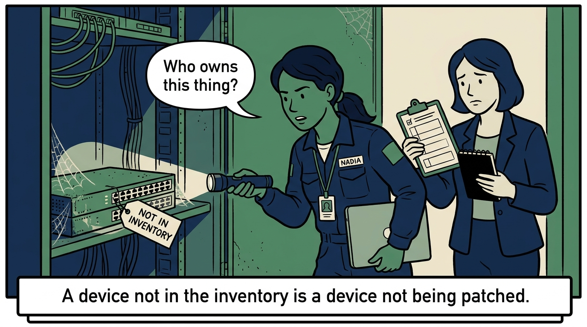
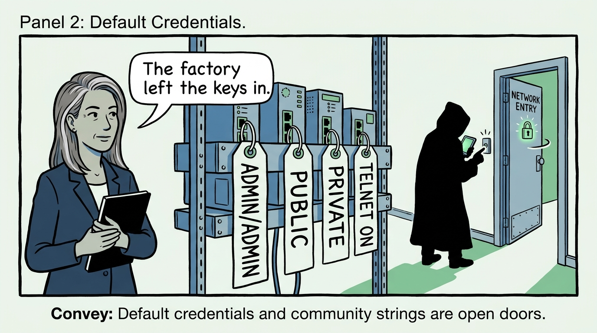
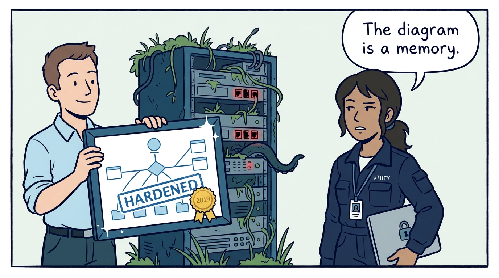
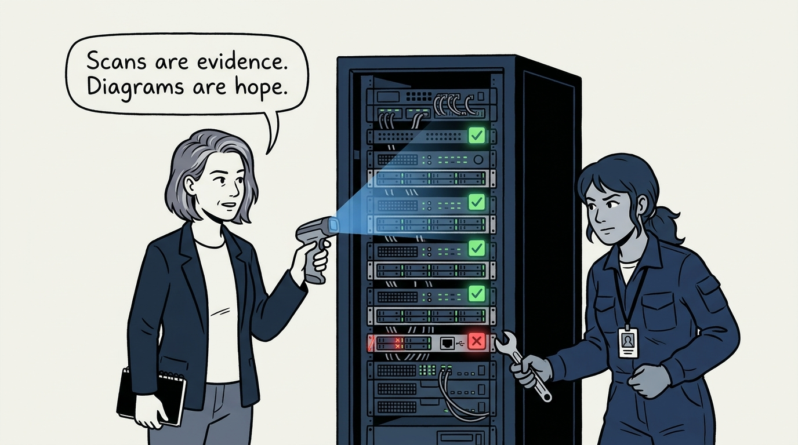
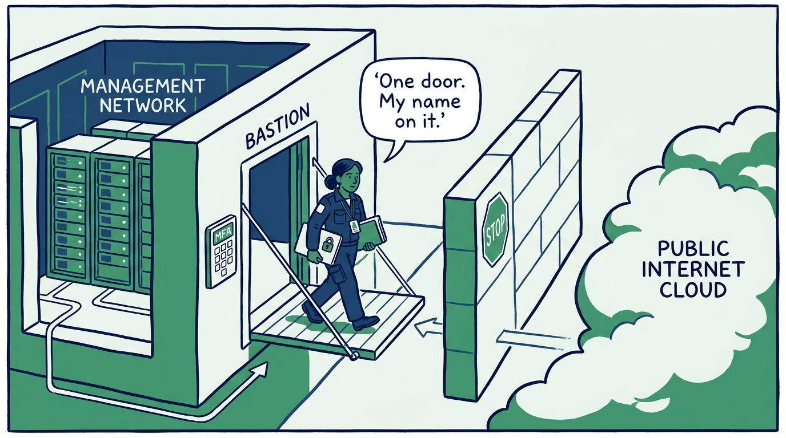
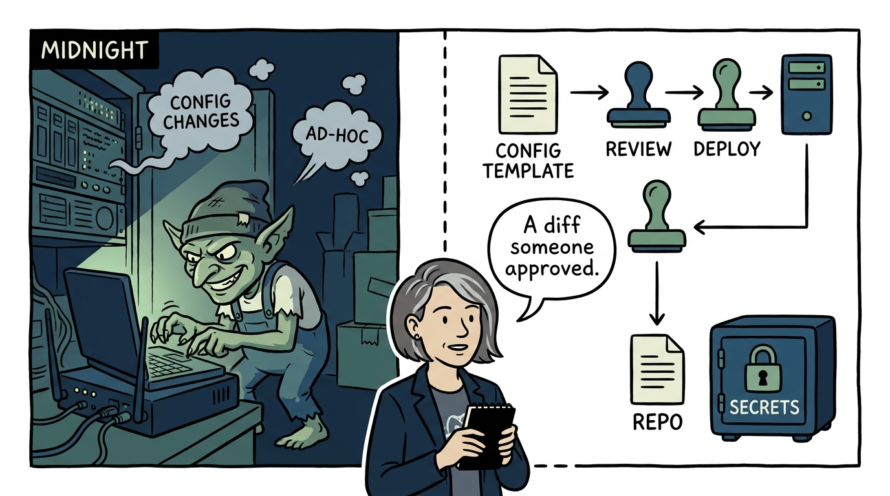
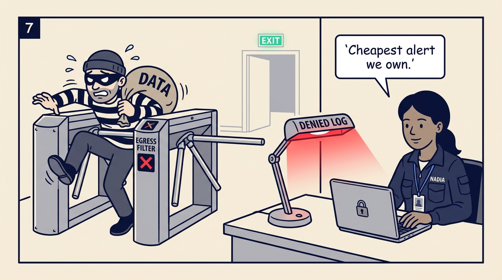
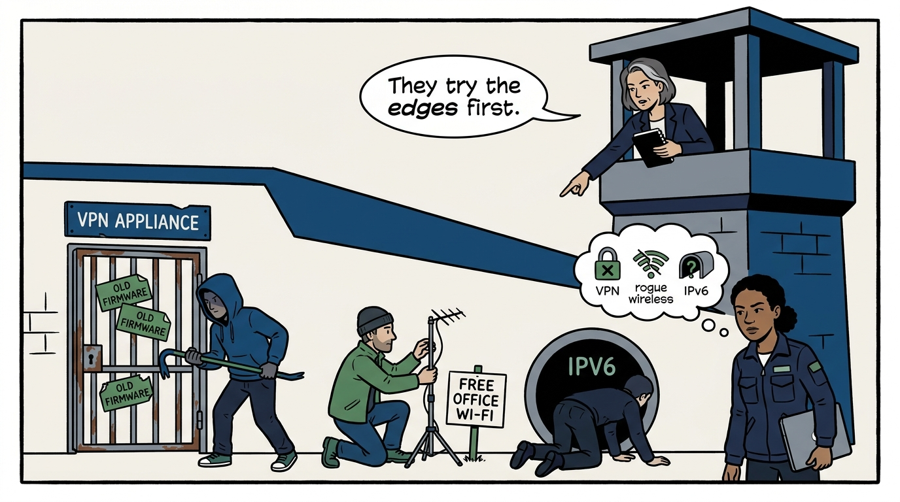
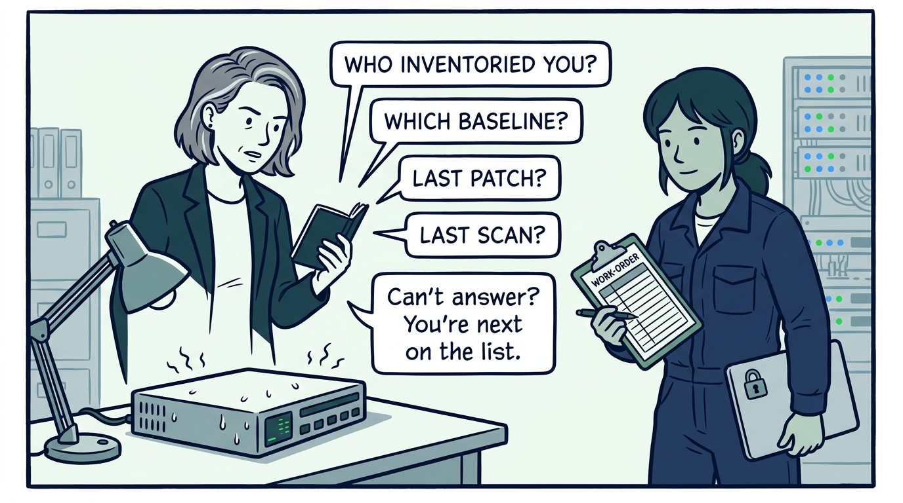

Why the network is inventoried, hardened, patched, and watched — and proven by a scan, not a diagram — in nine panels.

<!-- comic-style
{
  "cast": "VERA: a calm, seasoned engineering executive, short gray-streaked hair, dark blazer over a plain t-shirt, carries a small black notebook. NADIA: a hands-on defensive-security lead, shoulder-length dark hair tied back, navy utility jacket over a plain shirt, an access badge on a lanyard, laptop with a padlock sticker under one arm.",
  "style": "Clean two-tone explainer comic, thick ink outlines, flat colors with deep blue and green accents on a light background, generous white space, hand-lettered speech bubbles with SHORT readable text, no photorealism."
}
-->

**Panel 1:** *The hook: the unknown device — a switch no inventory lists, unpatched for years, discovered only when it shows up in an incident timeline.*

**Panel 2:** *The problem: factory defaults — credentials, community strings, and Telnet still on mean the estate answers to anyone who asks.*

**Panel 3:** *The wrong way: the hardened-once network — baselines applied at deployment, never revalidated, while drift quietly un-hardens the estate and the documentation stays green.*

**Panel 4:** *The principle: inventoried, hardened, patched, watched — and the claim is proven by a scan, not asserted in a diagram, then re-proven after every change.*

**Panel 5:** *Practice: the management plane is the crown jewels — dedicated network, never internet-exposed, entered through a hardened MFA bastion with individual, centrally authenticated accounts.*

**Panel 6:** *Practice: configuration is code — version-controlled templates, peer review, tested deployment; secrets live in a dedicated store, never in the repository.*

**Panel 7:** *Practice: filter outbound as strictly as inbound — a host repeatedly denied an unexpected connection is one of the cheapest, highest-signal alerts the organization will ever get.*

**Panel 8:** *The cost: the perimeter's soft edges — unpatched VPN appliances, evil-twin access points, and an IPv6 network nobody guards are where compromise walks in.*

**Panel 9:** *The closer: every device answers four questions — who inventoried it, which baseline hardened it, when it was patched, when its hardening was last re-verified. No answers, next work item.*
