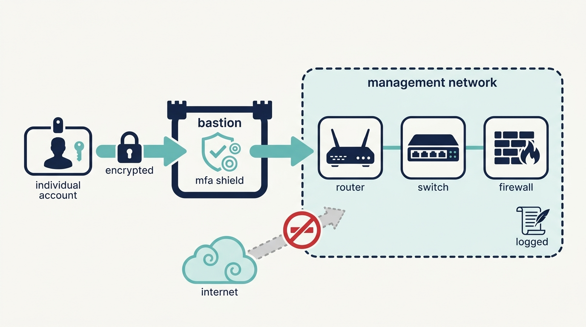
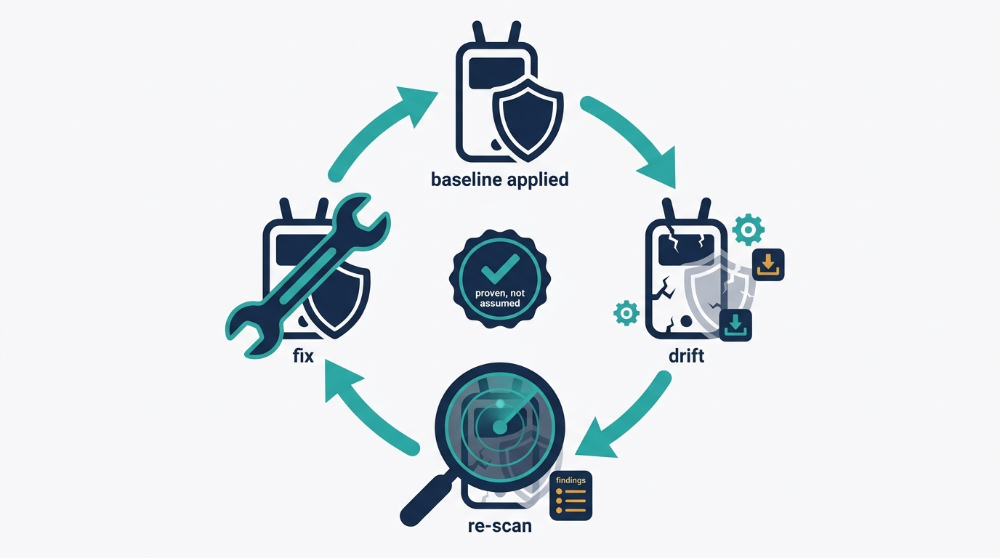
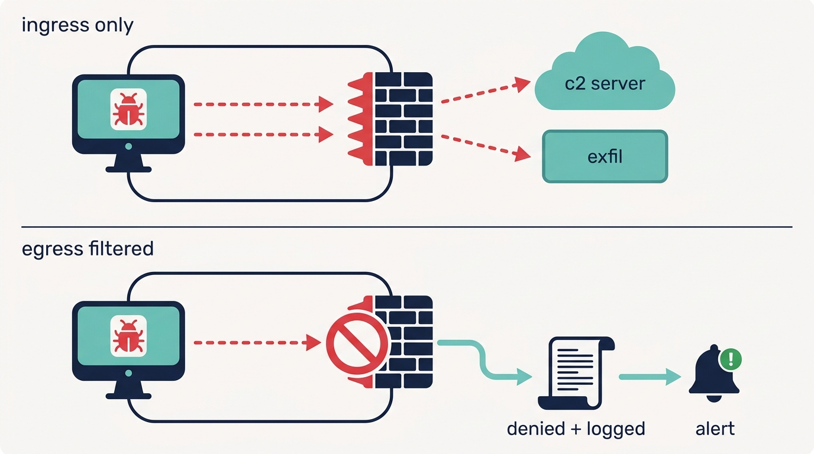

> **Status**: DRAFT
>
> **Principle**: The network my organization runs on is not trusted by default — it is **inventoried, hardened, patched, and watched**, device by device. **Defaults die on arrival**: credentials, community strings, and factory configurations are replaced with hardened baselines. **Every open port has a justified business purpose**, and management traffic is **encrypted and isolated** on a dedicated network behind a hardened bastion, administered through **individual, centrally authenticated accounts** — never shared logins. **Configuration is code**, reviewed and version-controlled, with secrets in a dedicated store. The network **filters outbound as strictly as inbound**, treats **IPv6 as a first-class citizen**, runs wireless on modern protocols with rogue-AP monitoring, and treats **VPN appliances as the front door attackers try first**. The test I hold the estate to: **hardening is proven by a scan, not asserted in a diagram** — and re-proven after every change.

## Statement

When my organization operates network infrastructure — routers, switches, wireless access points, firewalls, VPN appliances — this is the bar every device is held to.

**Every device is inventoried, hardened, and patched through discipline, not heroics.**

- **The inventory is complete** — routers, switches, WAPs, firewalls, VPN appliances, and the wireless and IoT devices that attach to them. A device not in the inventory is a device not being patched.
- **Hardening follows established baselines** — CIS Benchmarks or vendor guides where appropriate; unnecessary services and management interfaces disabled; default usernames, passwords, and community strings changed; configurations reviewed regularly for risky settings.
- **Patching is a controlled cycle**: vendor advisories tracked, release notes reviewed, hardware revisions confirmed, firmware downloaded only from the vendor with integrity verified, configuration backed up, rollback documented, stakeholders notified, changes scheduled through change control, function tested afterward, monitoring confirmed green, outcome communicated.

**Every open port earns its place.**

- Devices are scanned for listening TCP and UDP ports; every open port has a legitimate business purpose or is closed. Unexpected management services on high ports are investigated, not shrugged at.
- **Telnet is replaced by SSH, HTTP management by HTTPS**, and management services are reachable only from trusted management networks. Port scans are repeated after configuration changes, and authenticated vulnerability scans run where possible.

**Configuration is code; secrets never live in repositories.**

- Network configurations are managed as code where practical — templates in version control, peer review and change control on every change, automated deployment tested before production.
- **Credentials, API keys, and secrets live in a dedicated secrets-management system** and are never committed to configuration repositories.

**The management plane is the crown jewels — encrypted, isolated, and individually accountable.**

- **SNMP runs v3 with authentication and encryption**; v1 and v2c are avoided, `public` and `private` community strings are dead, access is restricted to authorized management systems, and SNMP cannot be abused as a DDoS amplifier.
- **Management traffic is encrypted end to end**; devices that cannot support secure management are replaced, and any remaining insecure access is restricted and formally risk-accepted in writing.
- **A dedicated management network or VLAN** carries administrative traffic; management interfaces are never exposed to the public internet; entry is through a hardened, minimal, MFA-protected bastion host or VPN, with least privilege, RBAC, and centrally logged administrative activity — Zero Trust approaches considered for high-security environments.
- **Administration is individual and centralized** — TACACS+-style AAA, individual accounts, no shared logins, prompt removal on role change, separation of duties, and regular review of privileged activity.

**Figure 1:** *The management plane is the crown jewels: one encrypted, MFA-protected path through a hardened bastion into a dedicated network — never the public internet, never a shared login.*

**Each device class carries its own discipline.**

- **Routers**: default-deny ACLs applied to the right interfaces and directions, administrative protocols restricted to trusted subnets, dynamic routing protocols authenticated, route advertisements protected.
- **Switches**: VLANs used for segmentation but never mistaken for physical isolation; VLAN hopping protected against; port security with MAC limits; unused ports disabled or parked in a restricted VLAN; DHCP snooping and Dynamic ARP Inspection enabled; spanning tree secured.
- **Wireless and IoT**: inventoried, patched, and segmented from sensitive systems; unsupported devices removed or isolated; Bluetooth, cellular, Zigbee, and NFC disabled or constrained where not required; Wi-Fi on WPA2-AES minimum and WPA3 preferred, with enterprise authentication where appropriate, rogue and evil-twin access points detected, and deauthentication attacks monitored.

**Traffic is controlled in both directions, in both protocols.**

- **Segmentation separates** sensitive systems, management traffic, public-facing services, and less-trusted IoT — with inter-segment traffic restricted and controls verified regularly.
- **Egress is filtered as deliberately as ingress**: only necessary outbound protocols and destinations, denied connections logged, command-and-control patterns monitored, unusual outbound connections investigated — because egress control is what makes exfiltration hard.
- **IPv6 is secured as a first-class citizen**: discovered where it is enabled, policied, firewalled, monitored — including link-local addresses and tunneling mechanisms — with controls equivalent to IPv4.
- **DDoS is prepared for**: no open amplifiers (DNS, SNMP), public services behind appropriate protection, origin servers shielded behind the CDN or proxy, a response plan written and traffic monitored for abnormal patterns.

**Remote access and the watch floor close the loop.**

- **VPN appliances are patched aggressively and their advisories tracked** — MFA required, unused accounts disabled, users restricted to the resources they need, and login anomalies investigated.
- **Monitoring is centralized**: device logs collected centrally, authentication failures and configuration changes watched, unexpected reboots and new listening services alerted on, firewall and egress denials reviewed, unauthorized devices detected — and hardened configurations periodically revalidated, because hardening decays.

## How to Read This

This record is the infrastructure backbone of the **Identity and Network** section — the devices themselves, hardened, before [[network-segmentation]] designs what can talk to what and [[ids-ips]] watches the traffic that flows. It is grounded in the Network Security chapter of the *Defensive Security Handbook*, whose checklist carries the title "Secure Network Infrastructure" — and this record keeps that name, because that is what the chapter is: not network security in the abstract, but the concrete discipline of the boxes the network is made of. The full working checklist — all twenty-one practice areas plus the chapter's Final Review — lives in the **Checklist** tab; the **TL;DR** tab carries the management summary and the **Conversation** tab the dialog.

## Rationale

**Inventory is the precondition for everything else.** You cannot patch a device you do not know you own, and you cannot notice a rogue device without a list of legitimate ones. Every commitment in this record — advisories tracked, firmware current, configurations revalidated — silently assumes a complete inventory, which is why the inventory comes first and why a device found outside it is treated as a finding, not a footnote. This is [[asset-management]] applied to the boxes the network is made of.

**The management plane is worth more than any device it manages.** An attacker who owns one server owns one server; an attacker who owns the management network owns the estate. That asymmetry justifies every layer of the record's management discipline — encrypted protocols, a dedicated network, no internet exposure, a hardened bastion, MFA, individual accounts with centralized AAA. Shared admin logins fail the same test from the inside: when every administrator is `admin`, accountability is a rounding error and offboarding is impossible.

**Hardening is a claim; scanning is the evidence.** Configurations drift, upgrades resurrect disabled services, and a device hardened last year is an assumption, not a fact. That is why the record insists on the verification loop: port scans repeated after changes, authenticated vulnerability scans, and periodic revalidation that hardened configurations remain in place. A hardening standard without a re-scan schedule is a diagram of the network as it was once hoped to be.

**Figure 2:** *Hardening is a claim; scanning is the evidence — configurations drift and upgrades resurrect disabled services, so the scan loop recurs and the finding is believed over the diagram.*

**Configuration-as-code turns network changes into engineering.** A CLI change made at midnight is invisible to review and irreproducible by the next engineer; a configuration template in version control is a diff someone approved. The same move that made server infrastructure auditable applies to the network — with the same non-negotiable: secrets go to a dedicated store, never to the repository, because a community string in git history is a community string published.

**Egress filtering is where compromise gets caught.** Perimeter thinking spends everything on inbound and lets any internal host talk to the entire internet — which is precisely what malware needs to fetch its second stage and exfiltrate its haul. Filtering outbound traffic, logging the denials, and reading those logs turns the network itself into a detection system: a workstation repeatedly denied a connection to an unexpected address is one of the cheapest, highest-signal alerts my organization will ever get.

**Figure 3:** *Egress is filtered as deliberately as ingress: the denied outbound connection from a workstation is one of the cheapest, highest-signal alerts the organization will ever get.*

**IPv6 ignored is a parallel network with no guards.** Most estates run IPv6 whether anyone decided to or not — enabled by default, tunneled through Teredo or 6to4, invisible to teams who think in IPv4. An attacker does not care which protocol the defenders monitor; traffic flows where inspection is absent. Equivalent controls for IPv6 are not an advanced topic; they are the closing of a door that was open the whole time.

**VPN appliances and wireless are the perimeter's soft edges.** VPN concentrators are internet-facing by design, hold credentials by design, and have carried some of the most exploited vulnerabilities of recent years — which earns them the record's most aggressive patching posture, MFA, and anomaly review. Wireless extends the network past the walls: WPA2/WPA3 keeps the traffic honest, but only rogue-AP and evil-twin monitoring keeps the *network* honest, because the cheapest attack on a wireless estate is standing up a friendly-looking imposter.

**Layer 2 is an attack surface, not plumbing.** ARP spoofing, MAC flooding, VLAN hopping, and rogue DHCP happen below where most monitoring looks — and they hand an attacker the man-in-the-middle position every encrypted protocol upstream is trying to deny. Port security, DHCP snooping, and Dynamic ARP Inspection are cheap, mostly-invisible controls that close the floor under the whole stack; encrypted protocols are the backstop that keeps intercepted traffic worthless anyway.

## What This Means in Practice

| What this record says | What it does **not** say |
| --- | --- |
| Every network device is inventoried, baselined, and patched through change control with documented rollback. | Emergency patches wait for the change board — a critical VPN advisory is the emergency process, executed with the same backup-and-rollback discipline. |
| Every open port has a justified business purpose, re-verified by scans after changes. | Scanning once at deployment is enough — hardening decays, so verification recurs. |
| Management interfaces live on a dedicated network behind a bastion, never on the public internet. | Administrators lose remote access — they gain a hardened, MFA-protected, audited path. |
| SNMP runs v3; `public`/`private` community strings are dead. | Monitoring tools are exempt because they are "internal" — internal is where attackers operate. |
| Configuration is code with secrets in a dedicated store. | Every estate converts overnight — but new changes go through review, and secrets leave the repos now. |
| Egress is filtered, denials are logged and read; IPv6 gets IPv4-equivalent controls. | Blocking IPv6 blindly — the record requires evaluating operational impact, not amputation. |
| Device administration uses individual, centrally authenticated accounts with separation of duties. | Break-glass access disappears — it exists, sealed, logged, and reviewed when used. |
| Devices that cannot support secure management are replaced, or their risk formally accepted. | "Legacy" is a permanent excuse — acceptance is written, owned, and has an end date. |

Concretely: every network device in my organization can answer four questions — who inventoried it, which baseline hardened it, when it was last patched, and when its hardening was last re-verified by a scan. A device that cannot answer all four is the next work item, and a scan finding that contradicts the diagram is believed over the diagram.

## Anti-Patterns

- **The unknown device.** A switch in a wiring closet that no inventory lists — unpatched for years, defaults intact, discovered only when it appears in an incident timeline.
- **The `public` community string.** SNMP v2c answering the whole LAN with the factory default — a full map of the estate, free to anyone who asks, and a ready-made DDoS amplifier.
- **The internet-facing admin page.** A firewall's management interface reachable from anywhere "temporarily, for the vendor" — the control plane of the network, one credential-stuffing run from ownership.
- **The ingress-only firewall.** Meticulous inbound rules and an outbound policy of *any-any* — the compromise walks out the front door, second stage and stolen data alike, unlogged.
- **The IPv4-only security program.** Firewalls, monitoring, and policies all blind to the IPv6 the operating systems enabled by default — a parallel network with no guards.
- **The shared `admin` login.** One credential in every engineer's muscle memory — no accountability, no offboarding, and a password that survives every departure.
- **The forever-unpatched appliance.** A VPN concentrator running firmware from three advisories ago because the outage window never came — the internet-facing front door, held open by scheduling.
- **The hardened-once network.** Baselines applied at deployment, never revalidated — drift, upgrades, and "temporary" changes quietly un-harden the estate while the documentation stays green.

## Related Records

- [[network-segmentation]] — the design of what can talk to what; this record hardens the devices that enforce those boundaries.
- [[authentication]] — the credential, MFA, and protocol discipline this record applies to device administration and management planes.
- [[ids-ips]] — detection and prevention on the traffic; this record's device logs and egress denials feed it.
- [[vulnerability-management]] — the org-wide scanning program; this record's authenticated device scans and revalidation are its network slice.
- [[logging-and-monitoring]] — the central platform this record's device logs, alerts, and administrative audit trails flow into.
- [[asset-management]] — the inventory discipline this record's first commitment depends on.
- [[cloud-infrastructure]] — the same hardening instincts where the "devices" are virtual networks, security groups, and managed services.

## Scope and Revisiting

This record is `draft`. It applies to every network device my organization operates — on-premises, in colocation, and the virtual network constructs that replace hardware in cloud estates. I revisit it if an incident or audit finds devices outside the inventory (the precondition failing), if scan results repeatedly contradict the hardening claims (the verification loop failing), if the estate's architecture shifts materially toward SDN or Zero Trust Network Access (the management-plane commitments must be restated in those terms), or if egress filtering is being routed around because it is too coarse — friction in the filter is a defect to fix, not a rule to waive.

## Authoritative References

- *Defensive Security Handbook*, 2nd edition (Lee Brotherston, Amanda Berlin, and William F. Reyor III; O'Reilly) — the Network Security chapter, whose checklist ("Secure Network Infrastructure", including its Final Review) this record distills.
- CIS Benchmarks and vendor hardening guides, which the chapter names as the baselines for routers, switches, and network devices.
