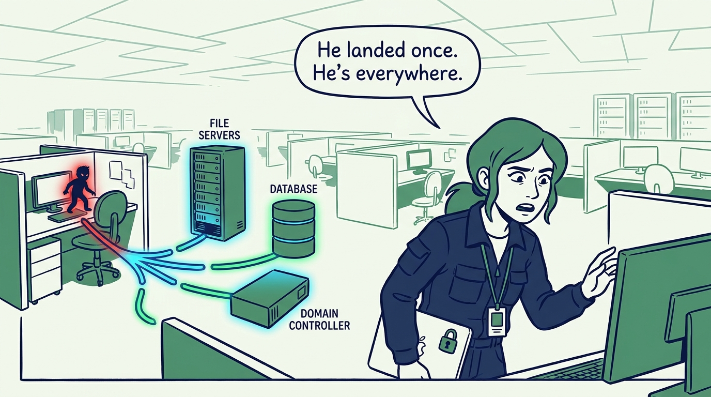
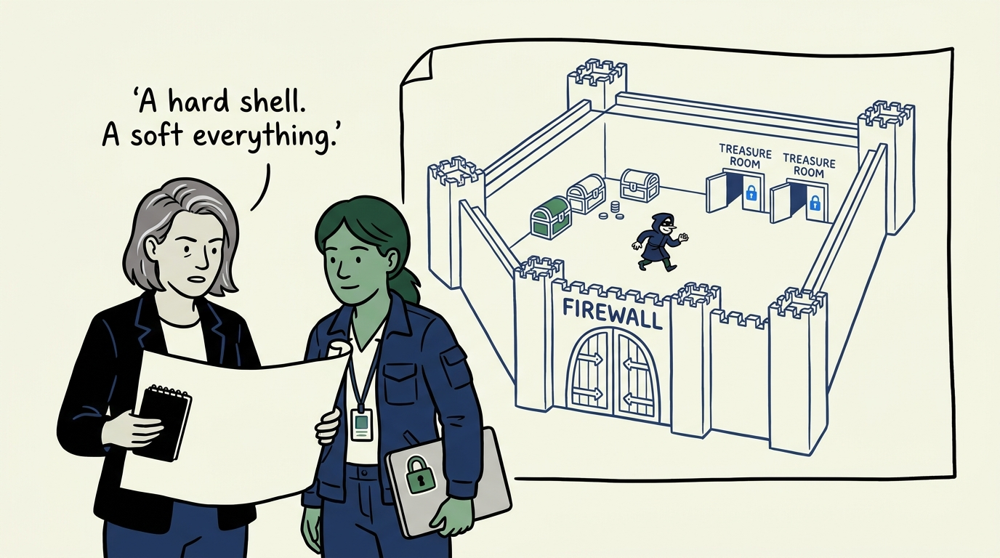
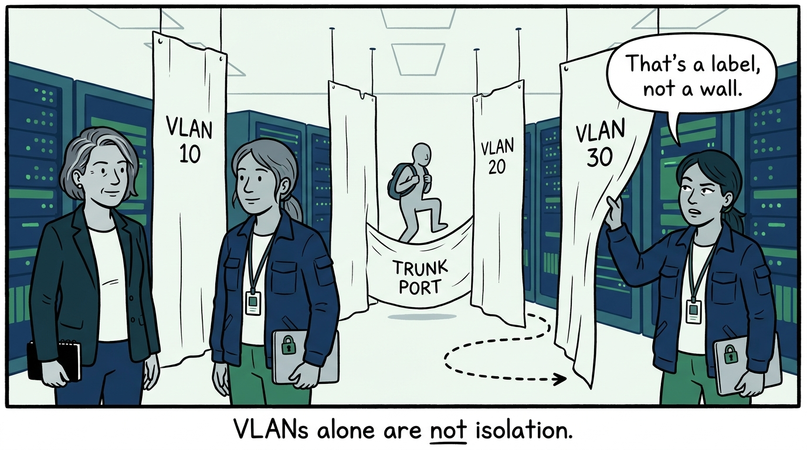
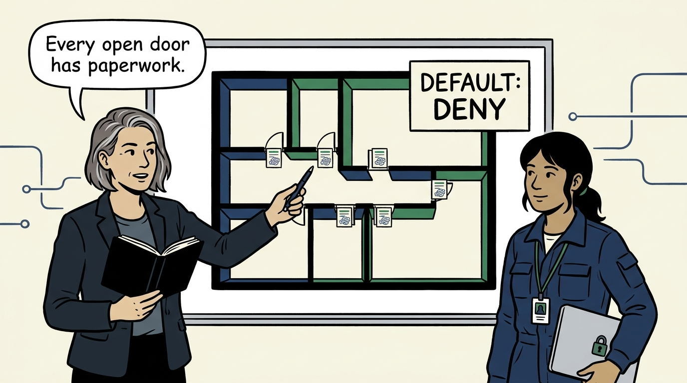
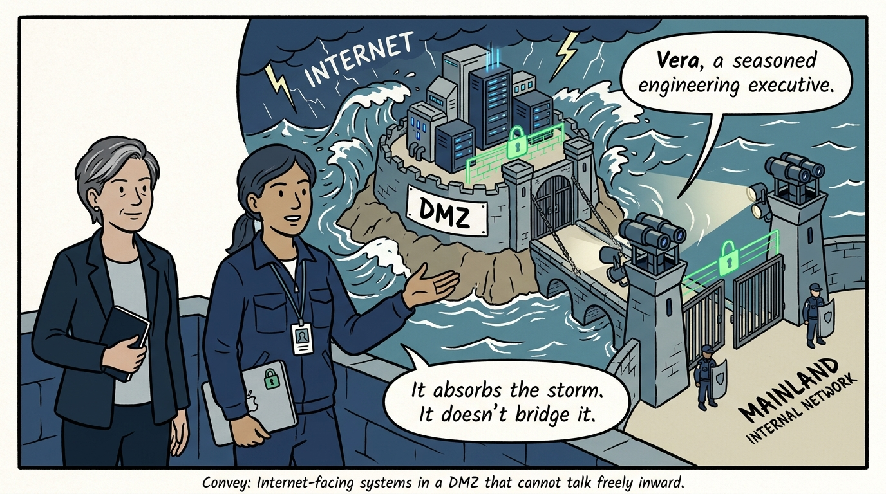
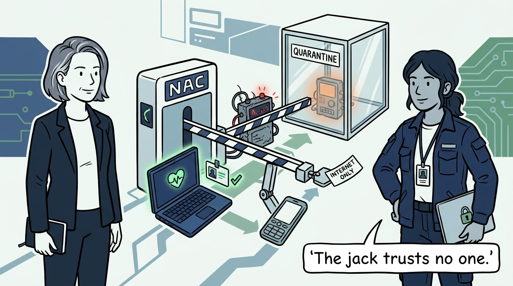
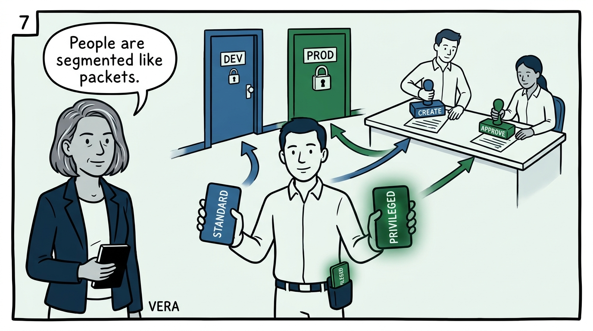
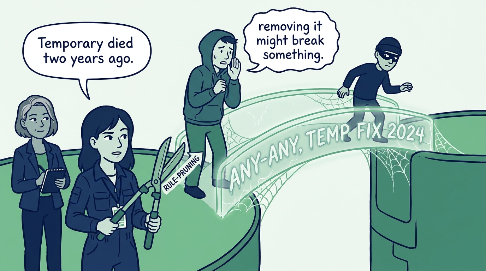
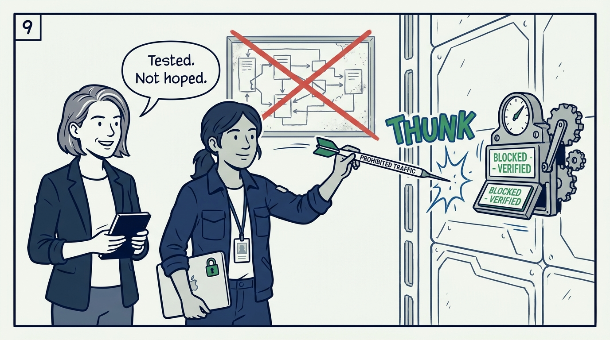

Why lateral movement is minimized by design, not by hope — in nine panels.

<!-- comic-style
{
  "cast": "VERA: a calm, seasoned engineering executive, short gray-streaked hair, dark blazer over a plain t-shirt, carries a small black notebook. NADIA: a hands-on defensive-security lead, shoulder-length dark hair tied back, navy utility jacket over a plain shirt, an access badge on a lanyard, laptop with a padlock sticker under one arm.",
  "style": "Clean two-tone explainer comic, thick ink outlines, flat colors with deep blue and green accents on a light background, generous white space, hand-lettered speech bubbles with SHORT readable text, no photorealism."
}
-->

**Panel 1:** *The hook: the flat network — the attacker who lands on one workstation has landed everywhere; the file servers, database, and domain controller are all one hop away.*

**Panel 2:** *The problem: a hard perimeter around one big trusted interior — the firewall at the front, and nothing between the first phished workstation and everything the organization owns.*

**Panel 3:** *The wrong way: the VLAN mistaken for a wall — tags without ACLs or hopping protections are separation that ends at the first misconfigured trunk port.*

**Panel 4:** *The principle: segmentation is least privilege applied to traffic — segments drawn by risk, function, sensitivity, and business need; every approved flow documented, everything else denied.*

**Panel 5:** *Practice: internet-facing systems live in a DMZ — deny by default, only required ports in, no free path inward, and watched more closely because they absorb more risk.*

**Panel 6:** *Practice: admission is earned — 802.1X authentication and posture checks before access, quarantine for the unknown, internet-only paths for guests; trust moves from the jack to the device.*

**Panel 7:** *Practice: duty separation is segmentation of people — dev apart from prod, creation split from approval, separate standard and privileged accounts, no shared generic admin.*

**Panel 8:** *The cost: the ANY-ANY that never died — a rule base that only grows decays default-deny into a deny-list, one 'temporary' exception at a time; pruning is part of the design.*

**Panel 9:** *The closer: an untested boundary is a diagram — pick a segment, attempt the traffic that should be impossible, and watch it fail. Lateral movement is minimized by design, not by hope.*
