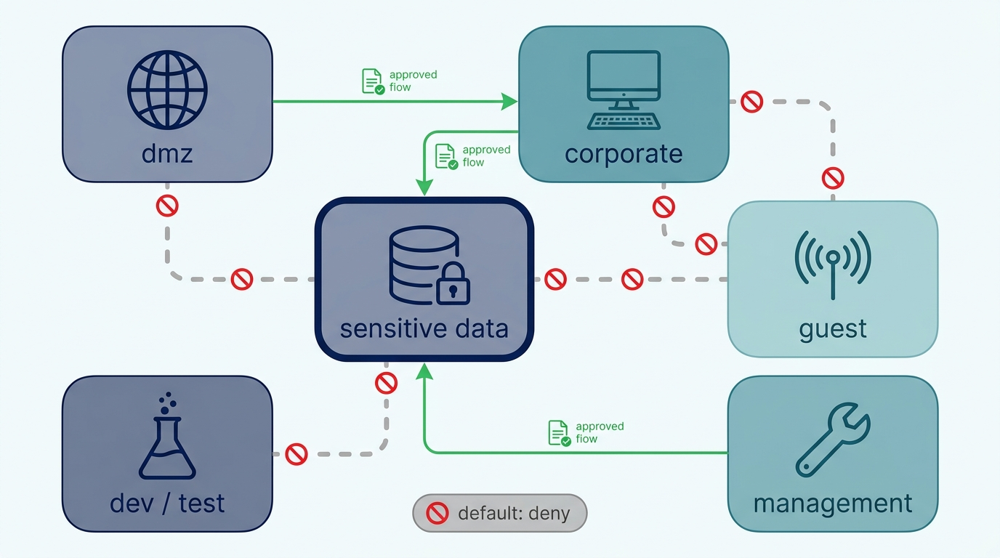
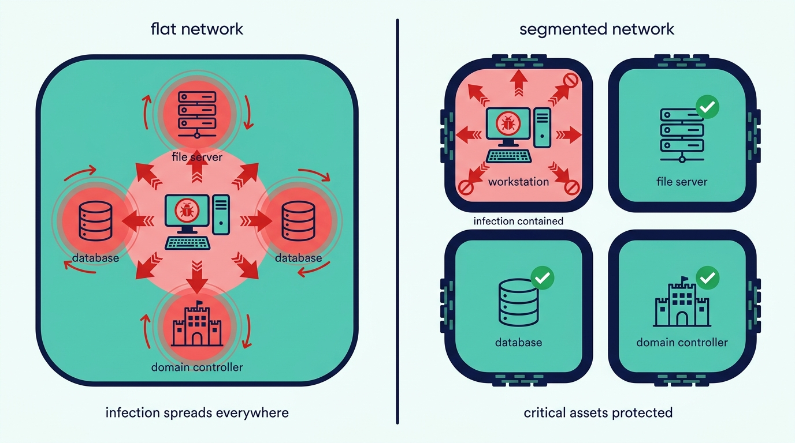
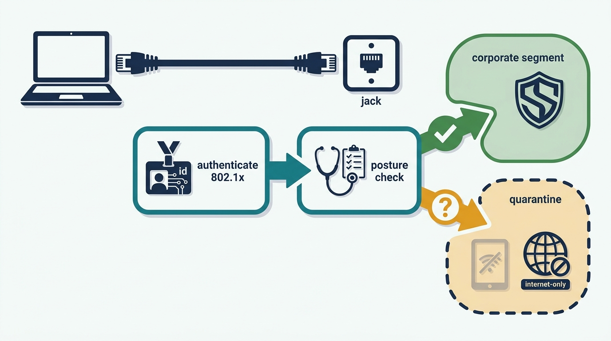

> **Status**: DRAFT
>
> **Principle**: Segmentation in my organization is **least privilege applied to traffic**: systems are separated by **risk, function, sensitivity, and business need**, and between segments the **default is deny** — every approved flow is documented, everything else is blocked. **Internet-facing systems live in a DMZ that cannot talk freely inward**; **VLANs are labels, not walls**, so they never stand as the only control; **devices earn admission** through NAC before the jack gives them anything; **VPN users reach only what they need**; and application tiers, human duties, and regulated data get the same separation as the network itself. The design is documented, monitored, and **tested until prohibited traffic is proven blocked**. The test I hold it to: **each segment can communicate only with the systems it legitimately needs** — lateral movement is minimized by design, not by hope.

## Statement

When my organization designs how its network is divided — and what may cross each boundary — this is the bar the design is held to.

**Segmentation follows risk, not convenience.**

- **The design starts with an inventory of what needs separating**: systems, users, applications, and data are identified, the topology and existing trust boundaries documented, and segments drawn by risk, function, sensitivity, and business need.
- **Between segments, least privilege rules and the default is deny.** Approved traffic flows are documented on an allow-list basis; segmentation rules are reviewed regularly and unnecessary access is removed.

**Figure 1:** *Least privilege applied to traffic: segments drawn by risk, function, and sensitivity, every approved flow documented on an allow-list — and between segments, the default is deny.*

**Boundaries are real and enforced.**

- **Firewalls, routers, and switches create the boundaries**, with rules configured for each segment's needs, boundary traffic monitored, and adequate logging on the devices that enforce them.
- **The standing separations exist**: development and test networks apart from production, sensitive and regulated data on their own networks, guest networks apart from corporate, unnecessary egress limited, broadcast traffic reduced.
- **Internet-facing systems live in a DMZ** that denies by default, admits only required inbound ports, and — critically — cannot talk freely to the internal network. DMZ systems are watched more closely because they absorb more risk.
- **VLANs are used deliberately and trusted proportionately**: endpoints grouped by security requirement, inter-VLAN traffic controlled by ACLs or firewall policy, unused VLANs disabled, VLAN hopping protected against, IDs and purposes documented — and VLANs never relied on as the only segmentation control.
- **ACLs are specific and tested**: rules keyed on source, destination, port, and protocol; no broad ANY-ANY allows; an explicit deny at the end; denials logged where useful; rules reviewed for rot and changes tested before production.

**Admission is earned, not assumed.**

- **Devices authenticate before they get normal network access** — 802.1X where appropriate, posture validated before admission, unknown or noncompliant devices quarantined in an isolated network.
- **The edges are covered**: vendor equipment scanned before production access, guest access through captive portals restricted to internet-only, NAC applied in conference rooms and shared spaces, BYOD integrated with policy, unmanaged devices denied when required.

**Remote access is scoped like any other segment.**

- **VPN access exists on business need and dies with it** — strongest practical authentication, strong current encryption, users limited to the resources they need, host-integrity checks where supported, centralized identity integration, full logging and audit.
- **Split tunneling is evaluated carefully before it is enabled**, and browser-based VPN sessions are protected against credential theft and malware exposure.

**Applications and duties are segmented too.**

- **Application tiers are separated where the security benefit justifies it**: web servers apart from database servers, database access restricted to authorized application systems, raw database files unreachable, TLS private keys kept off public-facing servers, tier-to-tier traffic restricted to required ports and protocols — most stringently for applications processing sensitive data.
- **Unrelated critical services do not share a server** — databases apart from application servers where risk warrants it, and domain controllers, mail servers, and systems holding personally identifiable information kept isolated.
- **People are segmented like packets**: development and production responsibilities separated, transaction creation split from approval, RBAC with regular permission reviews, generic and shared admin accounts disabled and alerted on, DBAs scoped to database work, and administrators holding separate standard and privileged accounts — privileged used only for privileged work, ideally from dedicated workstations.
- **SDN and microsegmentation are evaluated on merit** — with the control plane secured, controller access restricted, automated policy changes monitored, and documentation kept accurate, so software-defined boundaries do not quietly delete the controls the hardware used to enforce.

**Sensitive data lives in dedicated zones — and the design is proven, continuously.**

- **Sensitive information is located, zoned, and watched**: dedicated security zones, access on business need, extra monitoring at the boundary, and segmentation requirements for PCI DSS, HIPAA, and other applicable standards verified and documented.
- **The verification loop runs**: traffic captured and flow-analyzed for abnormal communication, permitted and denied traffic logged at important boundaries, firewall/VLAN/ACL/NAC/VPN configurations reviewed regularly, diagrams and naming kept current, obsolete rules and devices removed — and segmentation controls tested to prove prohibited traffic is actually blocked, with the design reassessed whenever systems or business requirements change.

## How to Read This

This record sits in the **Identity and Network** section between [[network-security]] — which hardens the devices that enforce these boundaries — and [[ids-ips]], which watches the traffic the boundaries admit. It is grounded in the Network Segmentation chapter of the *Defensive Security Handbook*, and its subject is the single design property that most limits an intruder: how far can an attacker who is already inside actually travel? The full working checklist — design, DMZ, VLANs, ACLs, NAC, VPN, application and duty segmentation, and the chapter's Final Review — lives in the **Checklist** tab; the **TL;DR** tab carries the management summary and the **Conversation** tab the dialog.

## Rationale

**Segmentation is the control on blast radius.** Every other defense in this journal reduces the probability of compromise; segmentation reduces its price. The attacker who lands on a workstation in a flat network has landed everywhere — the file servers, the database, the domain controller are all one hop away. The same attacker in a properly segmented network has won a cul-de-sac. Since some compromise is a matter of time, the size of the compartment it lands in is one of the few security properties my organization fully controls in advance.

**Figure 2:** *Every other defense reduces the probability of compromise; segmentation reduces its price — the attacker in a segmented network has won a cul-de-sac, not the estate.*

**Default-deny is the only rule set that ages well.** An allow-list decays into safety: forget to add a flow and someone complains, so the mistake surfaces and gets fixed. A deny-list decays into exposure: forget to block something and nothing happens — until it does. The same asymmetry drives the record's insistence on documented approved flows and regular pruning, because a rule base that only ever grows is a deny-list in the making, one ANY-ANY "temporary fix" at a time.

**A VLAN is a label, not a wall.** VLANs are the cheapest segmentation mechanism and therefore the most over-trusted; hopping attacks and misconfigured trunks cross them, which is why the record uses VLANs freely but never alone — always paired with ACLs or firewall policy, always with the hopping protections on, never mistaken for physical isolation. The DMZ logic is the same principle at the perimeter: exposure is asymmetric, so the systems that absorb the internet's hostility are placed where their compromise buys the attacker a monitored, restricted island — not a bridge inward.

**Admission control moves trust from the jack to the device.** A network that grants full access to whatever plugs in has delegated its security policy to the office furniture. NAC inverts that: authenticate first, validate posture, and quarantine the unknown — the visitor's laptop and the vendor's demo box land in isolation, not on the corporate segment. Guest captive portals and conference-room controls are the same inversion applied to the places where unknown devices are most routine.

**Figure 3:** *Admission is earned, not assumed: authenticate first, validate posture, and quarantine the unknown — trust moves from the jack to the device.*

**Duty separation is segmentation of people.** The record deliberately keeps roles in a network chapter: a developer with standing production access, an administrator browsing the web with a privileged account, one person creating and approving the same transaction — each is a flat network drawn in an org chart. RBAC, split accounts, and separated responsibilities apply exactly the least-privilege, default-deny logic to humans that ACLs apply to packets, and both fail the same way: through exceptions nobody prunes.

**An untested boundary is a diagram.** Firewall rules drift, ACLs rot, an emergency change quietly bridges two zones — and the network diagram stays reassuring throughout. That is why the record's loop does not end at "documented": it ends at *tested*, with prohibited traffic actually attempted and actually blocked, flows analyzed for abnormal communication, and the design reassessed when the business changes. For regulated zones this is also the difference between claiming PCI DSS or HIPAA scope reduction and being able to demonstrate it.

**A design nobody understands is a design nobody can defend.** The chapter's final review asks a question most security checklists skip: can administrators quickly understand and troubleshoot the design, and does it balance security with legitimate usability? An over-clever segmentation scheme fails operationally — troubleshooting bypasses accumulate, exceptions multiply, and the elegant zone map becomes fiction. Consistent naming, current diagrams, and honest balance are what keep the segmentation real for years instead of months.

## What This Means in Practice

| What this record says | What it does **not** say |
| --- | --- |
| Segments are drawn by risk, function, sensitivity, and business need, with default-deny between them. | A prescribed zone count or topology — the design is ours; the test it must pass is not. |
| Every approved inter-segment flow is documented; everything else is blocked. | Documentation as archaeology — flows are pruned on review, not merely recorded. |
| VLANs are paired with ACLs or firewall policy and hopping protections. | VLANs are worthless — they are one layer, never the only one. |
| The DMZ denies by default and cannot talk freely to the internal network. | Internet-facing means unprotected — DMZ systems get *more* monitoring, not less. |
| Devices authenticate and prove posture before receiving normal access; the unknown is quarantined. | Guests and vendors are locked out — they get isolated, internet-only paths built for them. |
| VPN users reach only the resources they need, and split tunneling is deliberately evaluated. | Remote work is restricted — remote access is scoped exactly like any other segment. |
| Duties are separated: dev from prod, creation from approval, standard from privileged accounts. | Developers never touch production — they touch it through controlled, logged, temporary paths. |
| Segmentation is tested until prohibited traffic is proven blocked. | Testing once at rollout — the proof recurs, and the design is reassessed on change. |

Concretely: any team in my organization proposing a new system must answer *which segment it lives in, what it must talk to, and why* — and the flows it names are the flows it gets. The standing audit question is the chapter's own: pick a segment, attempt the traffic that should be impossible, and watch it fail.

## Anti-Patterns

- **The flat network with a firewall at the front.** A hard perimeter around one big trusted interior — the first phished workstation is one hop from everything the organization owns.
- **The ANY-ANY rule that never died.** A troubleshooting exception from two years ago, still bridging two zones because removing it might break something nobody can name.
- **The VLAN mistaken for a wall.** Sensitive systems "segmented" by VLAN tag alone — no ACLs, no hopping protections — separation that ends at the first misconfigured trunk port.
- **The DMZ with a back door.** Public-facing servers that can reach the internal network freely — the DMZ absorbs the breach and then escorts it inside.
- **The live jack in the lobby.** Conference rooms and reception areas where any plugged-in device joins the corporate network — admission by furniture.
- **The all-access VPN.** Remote users landing on the full internal network because scoping was tedious — the perimeter re-flattened, one credential theft from anywhere.
- **The generic admin everyone shares.** One privileged account for browsing, email, and production changes alike — duty separation erased, attribution impossible, alerting silent.
- **The paper segmentation.** A beautiful zone diagram, never tested — the prohibited flows work fine, and everyone finds out during the incident.

## Related Records

- [[network-security]] — hardens the firewalls, routers, and switches this record's boundaries depend on.
- [[authentication]] — the identity discipline NAC and VPN admission decisions rest on.
- [[ids-ips]] — the detection layer that watches the boundary traffic this record logs and restricts.
- [[databases]] — the record's tier separation restricts who reaches the database; that record hardens what they reach.
- [[cloud-infrastructure]] — the same zoning logic where boundaries are security groups and virtual networks instead of switches.
- [[compliance]] — the program that owns the PCI DSS and HIPAA obligations this record's zones demonstrably support.
- [[logging-and-monitoring]] — the platform receiving the boundary logs and flow analysis this record's verification loop produces.

## Scope and Revisiting

This record is `draft`. It applies to every network my organization operates — office, data center, and cloud — and to every new system's placement decision. I revisit it if segmentation testing finds prohibited traffic flowing (the core test failing in practice), if the exception list at any boundary grows quarter over quarter (default-deny decaying into a deny-list), if the estate moves materially toward microsegmentation or Zero Trust architectures (the commitments must be restated in those terms, not silently dropped), or if teams begin routing around segment boundaries because legitimate flows take too long to approve — friction in the approval path is a defect to fix, not a reason to flatten the network.

## Authoritative References

- *Defensive Security Handbook*, 2nd edition (Lee Brotherston, Amanda Berlin, and William F. Reyor III; O'Reilly) — the Network Segmentation chapter, whose checklist (including its Final Review) this record distills.
- PCI DSS and HIPAA, which the chapter names for verifying segmentation requirements around regulated data.
- IEEE 802.1X, which the chapter names for network access control.
