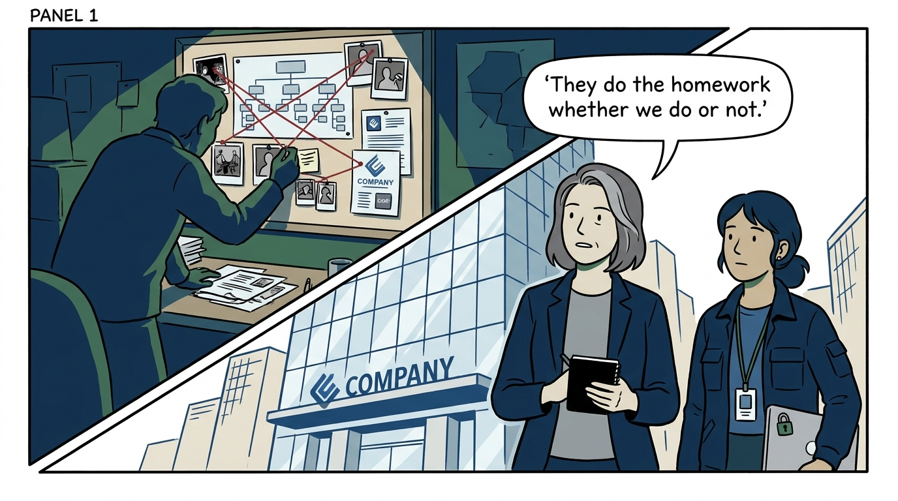
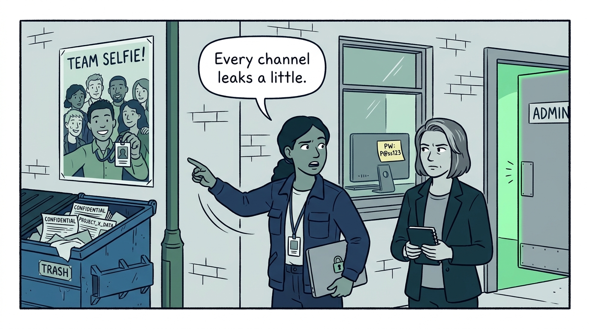
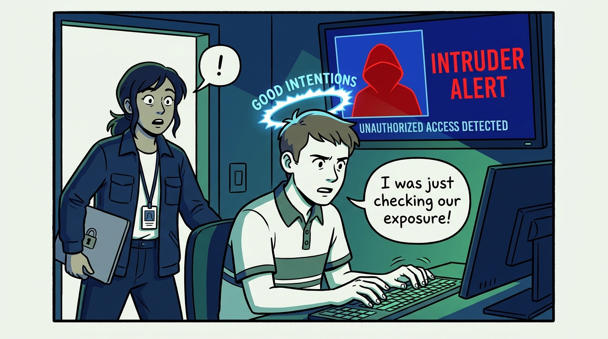
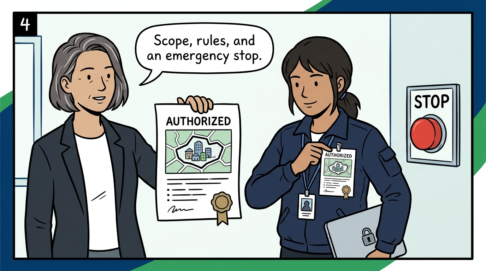
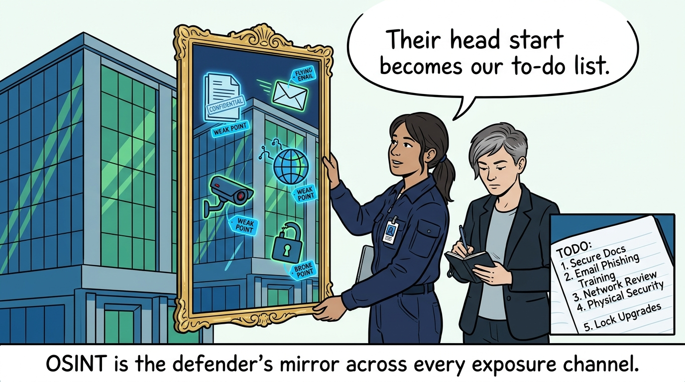
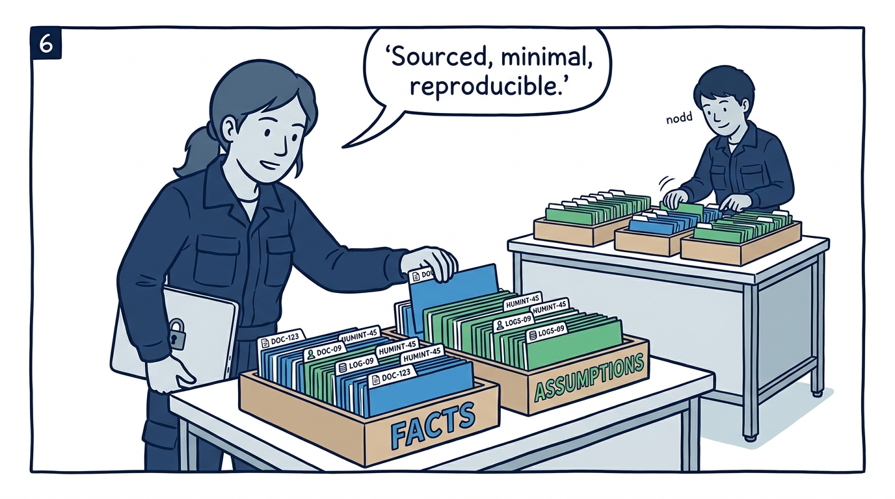
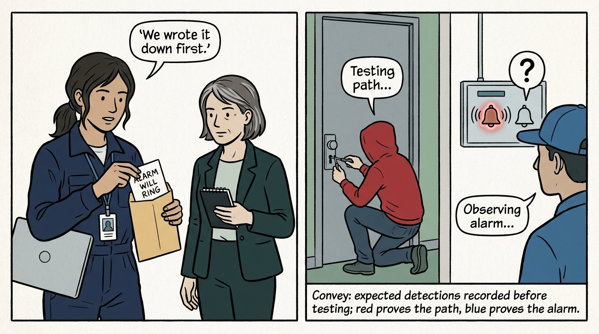
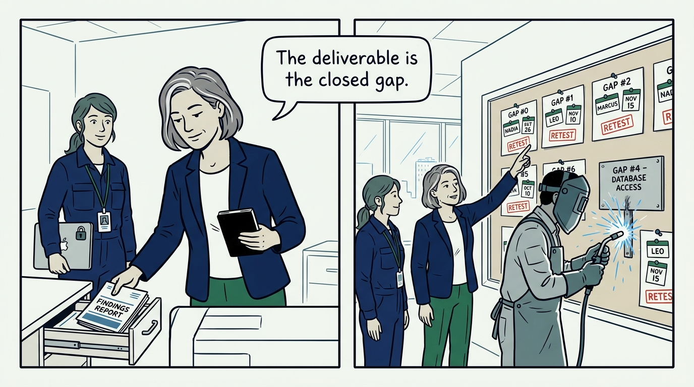
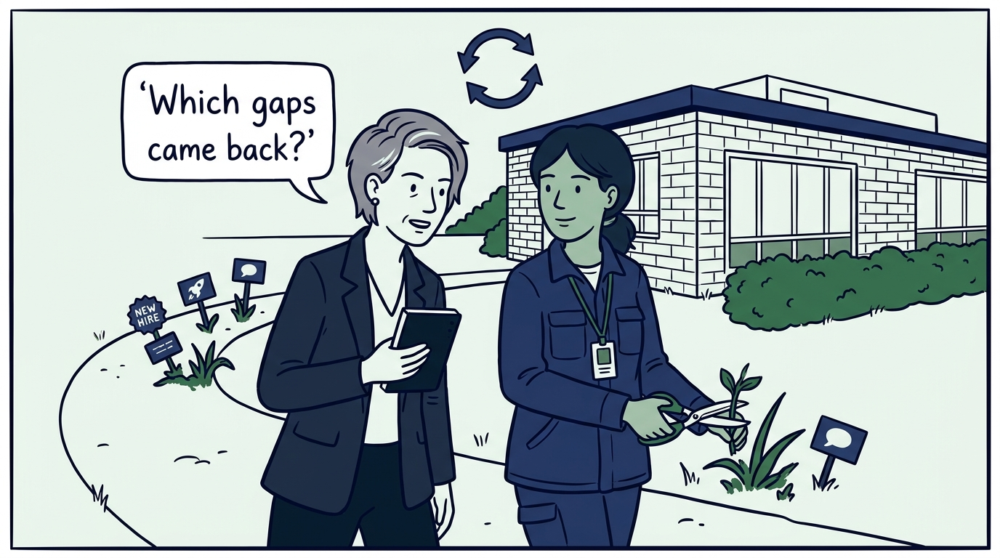

Why my organization looks at itself the way an attacker would — and drills what it finds — in nine panels.

<!-- comic-style
{
  "cast": "VERA: a calm, seasoned engineering executive, short gray-streaked hair, dark blazer over a plain t-shirt, carries a small black notebook. NADIA: a hands-on defensive-security lead, shoulder-length dark hair tied back, navy utility jacket over a plain shirt, an access badge on a lanyard, laptop with a padlock sticker under one arm.",
  "style": "Clean two-tone explainer comic, thick ink outlines, flat colors with deep blue and green accents on a light background, generous white space, hand-lettered speech bubbles with SHORT readable text, no photorealism."
}
-->

**Panel 1:** *The hook: the reconnaissance is happening either way — the only question is who looks at our exposure first.*

**Panel 2:** *The problem: exposure is a whole-organization property — dumpsters, badges in photos, sticky notes, breach dumps, and forgotten admin panels add up to one picture.*

**Panel 3:** *The wrong way: the unauthorized favor — a test nobody approved is indistinguishable from an attack, and gets treated as one.*

**Panel 4:** *The principle: nothing runs without written approval — defined scope, rules of engagement, privacy and legal bounds, and an emergency stop everyone can pull.*

**Panel 5:** *Practice: OSINT as the defender's mirror — sweep what physical assets, email, systems, metadata, web content, social posts, and breach data reveal, and close what you find.*

**Panel 6:** *Practice: investigation discipline — every finding sourced, facts separated from assumptions, no more personal data than necessary, and reproducible by another analyst.*

**Panel 7:** *Practice: the purple drill — expected detections recorded before testing begins; red simulates realistic attacker behavior in scope, blue proves alerts fire and logs support investigation.*

**Panel 8:** *The finish line: not the report — the exercise ends when every gap found has an owner, a deadline, a fix, and a retest.*

**Panel 9:** *The closer: the loop repeats — footprints drift and exposure regrows with every hire, launch, and post, so the sweep is periodic and the first question is 'which gaps came back?'*
