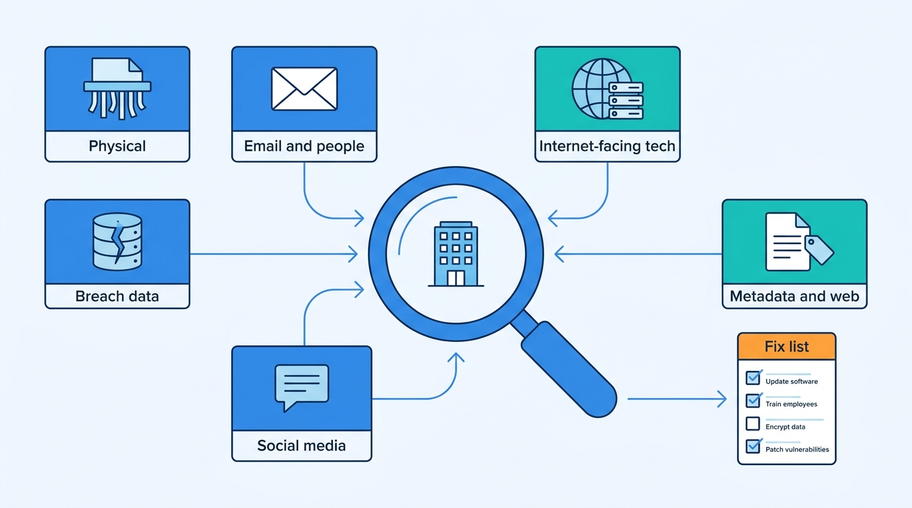
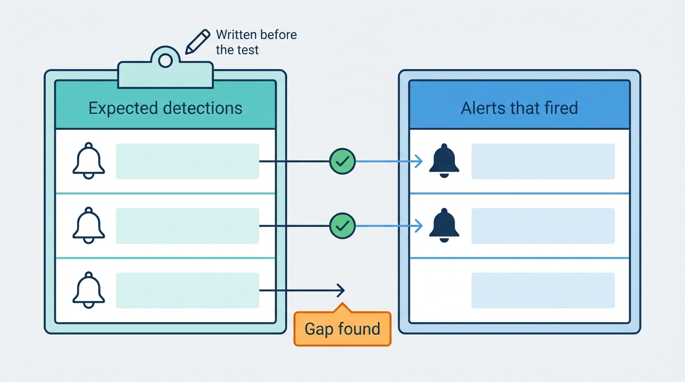
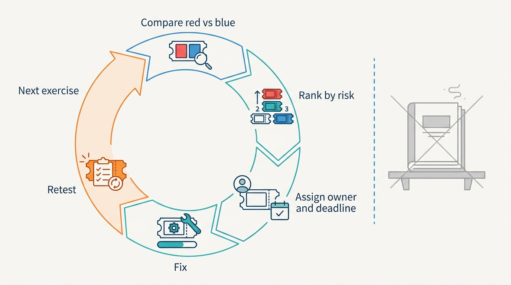

> **Status**: DRAFT
>
> **Principle**: My organization looks at itself the way an attacker would — deliberately, regularly, and under **written authorization with defined scope, rules of engagement, and an emergency stop**. **OSINT is the defender's mirror**: we sweep what our physical assets, email addresses and personnel, internet-facing systems, document metadata, public web content, social-media posts, and breach exposure reveal about us — and we close what we find. **Investigation is disciplined**: sources recorded, facts separated from assumptions, no more personal data collected than necessary, every finding reproducible by another analyst. **Purple teaming turns the mirror into a drill**: expected detections are recorded before testing begins, red simulates realistic attacker behavior within scope, blue proves alerts fire and logs support investigation, and the two are compared honestly. The test I hold the practice to: **an exercise is not finished until every gap it found has an owner, a deadline, and a retest.**

## Statement

When my organization assesses its own exposure and drills its own defenses, this is the bar it is held to.

**Nothing runs without authorization.**

- **Written approval first.** No OSINT investigation, penetration test, or purple-team exercise starts without written approval, a defined scope — systems, domains, networks, accounts, locations — and documented rules of engagement with prohibited activities.
- **Privacy, legal, and ethics are requirements, not afterthoughts.** They are established before collection begins; stakeholders are notified and escalation procedures defined.
- **Disruptive techniques stay in the lab.** Anything that could disrupt production runs in a controlled lab, on systems we own or are explicitly authorized to test.

**We audit our own exposure across every channel an attacker would use.**

- **Physical.** Sensitive assets — laptops, servers, documents, badges, removable media — are identified; disposal is reviewed, paper is shredded, trash is secured, workspaces are checked for exposed credentials, monitors are positioned against shoulder surfing, and staff are trained to stay aware.
- **Email and people.** Publicly discoverable addresses, revealing naming conventions, staff directories, and vendor information are reviewed; phishing exposure is assessed, monitored decoy accounts are considered for defensive detection, and awareness training follows the findings.
- **Technology.** Internet-facing domains, subdomains, IPs, DNS records, visible OS and software versions, exposed administrative interfaces, and cloud services are inventoried; unsupported or unnecessary services are removed and changes to the external attack surface are tracked.
- **Metadata and web content.** Published documents and images are inspected for metadata — usernames, software versions, geodata — and stripped before publishing; the public website and indexed files are searched for credentials, secrets, internal URLs, and accidentally exposed configuration or backup files, with a removal process and alerts for newly indexed sensitive content.
- **Social media and breaches.** What employees publicly disclose about roles, technologies, travel, and office interiors is reviewed and guided; organizational addresses are checked against known breaches, unique passwords and MFA are enforced, compromised credentials are reset promptly and monitored.

**Figure 1:** *The defender's mirror: one sweep across every channel an attacker would use, ending in a prioritized list of exposures to close.*

**Investigation is disciplined, minimal, and reproducible.**

- An OSINT framework organizes the categories; tools are selected for the question at hand. The source and reliability of every finding are recorded, confirmed facts are separated from assumptions, no more personal information is collected than necessary, and the investigation is documented so another analyst can reproduce it. Tools support analysis; they do not replace judgment — the chapter's Maltego and Shodan walkthroughs are kept in the Checklist tab as scoped, authorized worked examples of exactly this discipline.

**Purple teaming is planned, bounded, and measured.**

- Every exercise defines the control or scenario under test, red-team and blue-team responsibilities, objectives with measurable success criteria, communication and emergency-stop procedures — and **the expected defensive detections are recorded before testing begins**.
- **Red proves the path.** Realistic attacker behavior, not trophy exploitation; minimal disruption to production; every technique and its outcome recorded; evidence preserved; a hard stop the moment safety or scope limits are exceeded.
- **Blue proves the alarm.** Expected alerts fire, logs contain enough to investigate, time-to-identify is measured, escalation and incident-response procedures are tested, analysts can name the affected hosts and accounts, containment works, and telemetry gaps are identified. Lab exercises against coerced authentication run only on designated systems — and end with the weakness hardened, not just observed.

**Every gap becomes an owned fix, and the loop repeats.**

- Red activity is compared with blue detections; vulnerabilities, visibility gaps, and process failures are ranked by risk, assigned owners and deadlines, fixed, and **retested**. Detection rules, awareness training, and documentation are updated; lessons feed the next exercise.
- The public digital footprint is monitored continuously, exposure is reassessed after major change, exercises repeat periodically, regressions are tracked, new attacker techniques are incorporated — and every discovered weakness is treated as an opportunity to strengthen defenses.

## How to Read This

This record sits in the **Assess and Improve** section of the journal — the continuous loop that tests whether everything the earlier sections built actually works. Where [[vulnerability-management]] runs the standing pipeline against known weaknesses, this record is the adversarial lens: it finds what no scanner reports, and it exercises the detection estate that [[logging-and-monitoring]] builds. It is grounded in the OSINT and Purple Teaming chapter of the *Defensive Security Handbook* — and everything in it is written as defense: self-assessment of my own organization, under written authorization, on systems we own or are explicitly authorized to test. The full working checklist lives in the **Checklist** tab; the **TL;DR** tab carries the management summary and the **Conversation** tab the dialog.

## Rationale

**Attackers do the reconnaissance whether I do or not.** Everything OSINT finds — the exposed admin interface, the org chart in a staff directory, the credentials in a breach dump, the badge visible in a team photo — is already available to anyone who looks. The only question is who looks first. Running the sweep myself converts an attacker's free head start into my own prioritized to-do list; refusing to look does not make the exposure smaller, only the surprise larger.

**Authorization is what separates a security exercise from an incident.** The chapter opens with approval, scope, rules of engagement, and legal requirements before a single technique — and that ordering is not bureaucracy. Written authorization is what makes the activity defensible, keeps testers inside legal and ethical bounds, protects the people whose data an investigation touches, and gives everyone an emergency stop when something behaves unexpectedly. A test nobody approved is indistinguishable from an attack, and my organization treats it as one.

**Exposure is a whole-organization property, not a network property.** The sweep deliberately spans dumpsters and shoulder surfing, email naming conventions, EXIF data in photos, social-media posts about new vendors and travel, and breach corpora — because attackers assemble their picture from all of it at once. A program that only scans IP ranges audits a fraction of the surface. This is also why the fixes land everywhere: shredders and privacy screens, metadata stripping before publication, awareness guidance that extends to home working, MFA and prompt credential resets.

**Discipline in collection is both an ethical and a quality requirement.** Recording the source and reliability of each finding, separating confirmed fact from assumption, and collecting no more personal information than necessary are not ceremony. They keep the investigation lawful and proportionate, they keep conclusions honest when a finding is challenged, and they make the work reproducible — another analyst can retrace it, which is the same standard I hold any engineering investigation to. Tools accelerate all of this; none of them replaces the analyst's judgment.

**A detection that has never been exercised is a guess.** The single sharpest discipline in the chapter is recording the expected defensive detections *before* testing begins. That one step converts the exercise from theater into measurement: if the alert I predicted fires, the control is confirmed; if it does not, I have found a real gap — in telemetry, in rules, or in the assumption itself — before an attacker does. Blue-team verification then goes beyond "did an alert fire" to the questions an incident will actually ask: are the logs sufficient, how fast was it identified, did escalation work, could analysts name the affected hosts and accounts, did containment hold.

**Figure 2:** *Prediction turns the drill into measurement: detections are written down before red moves, and every alert that fails to fire is a gap found before an attacker finds it.*

**The exercise's product is the remediation loop, not the report.** Comparing red activity with blue detections, ranking findings by risk and business impact, assigning owners and deadlines, updating detections and training, and retesting corrected weaknesses is where the value lives. An exercise whose findings have no owners is an expensive way to document known problems. And the loop never closes for good: footprints drift, organizations change, attacker techniques evolve — so the sweep is periodic, regressions are tracked, and every weakness found is treated as a chance to get stronger.

**Figure 3:** *The deliverable is the closed gap, not the deck: findings are ranked, owned, deadlined, fixed, and retested — and the loop feeds the next exercise.*

## What This Means in Practice

| What this record says | What it does **not** say |
| --- | --- |
| No OSINT, penetration testing, or purple teaming without written approval, defined scope, and rules of engagement. | Self-assessment is optional — the sweep and the drill are standing practice, not a one-off audit. |
| We inventory our exposure across physical, email, technology, metadata, web, social, and breach channels. | We surveil our employees — collection is minimal, proportionate, and bounded by privacy, legal, and ethical requirements. |
| Expected detections are recorded before testing begins. | The blue team is told the schedule and script of every move — the point is honest measurement of detection, not a demo. |
| Red simulates realistic attacker behavior with minimal disruption and stops on scope or safety limits. | Red pursues maximum exploitation — proving the path matters; trophies do not. |
| Every finding gets an owner, a deadline, a fix, and a retest. | A findings report is the deliverable — the deliverable is the closed gap. |
| Techniques that could disrupt production run in a controlled lab, and captured authentication material is never reused outside the exercise. | The lab findings stay academic — the exercise ends by hardening the weakness it demonstrated. |
| The footprint is monitored continuously and exercises repeat periodically. | One clean sweep proves we are safe — exposure regrows with every hire, launch, and post. |

Concretely: every OSINT investigation and purple-team exercise in my organization starts with a written authorization naming scope and rules of engagement, records expected detections before the first technique runs, and ends with a ranked findings list where every line has an owner, a deadline, and a scheduled retest. The first review question after any exercise is *"which of the gaps we found last time came back?"*

## Anti-Patterns

- **The unauthorized favor.** An engineer "quickly checks" a system's exposure without written approval — well-intentioned, indistinguishable from an attack, and legally naked the moment anything breaks.
- **The mirror we never look into.** Exposure assessed once, during an audit year, while domains, employees, posts, and breach dumps accumulate unwatched in between.
- **The trophy hunt.** A red team that chases maximum exploitation instead of testing whether exposed information meaningfully supports an attack path — production disrupted, little learned.
- **The scripted demo.** An "exercise" where blue knows every move in advance and the alerts are confirmed to fire on schedule — a rehearsal of success, not a measurement of detection.
- **The scrapbook investigation.** OSINT findings with no recorded sources, facts blended with assumptions, and a method nobody can reproduce — conclusions that collapse the first time they are challenged.
- **The graded-and-forgotten exercise.** A polished findings deck with no remediation owners, no deadlines, and no retest — the same gaps rediscovered, at full price, next year.
- **The stockpiled capture.** Credentials or authentication material captured during an exercise and kept, reused, or accessed outside it — the defender becoming the breach.
- **The paper blue team.** Detection coverage asserted from the SIEM's marketing sheet rather than proven by exercising it — alerts that have never fired against real behavior.

## Related Records

- [[logging-and-monitoring]] — the detection estate this record exercises; purple-team findings are its test results.
- [[incident-response]] — blue-team verification drills the escalation, investigation, and containment machinery defined there.
- [[vulnerability-management]] — the standing pipeline for known weaknesses; this record's adversarial findings feed it, and its externally visible gaps show up here.
- [[asset-management]] — the external attack-surface inventory is only checkable against a known asset base.
- [[user-education]] — OSINT findings about phishing exposure and social-media disclosure become that program's training content.
- [[phishing-response]] — email exposure, decoy accounts, and credential-breach monitoring border directly on the phishing defenses defined there.
- [[physical-security]] — the physical asset review here is the OSINT view of the controls that record establishes.

## Scope and Revisiting

This record is `draft`. It applies to every self-assessment activity in my organization — OSINT sweeps, red-team and purple-team exercises, and lab-based detection tests. I revisit it if an exercise runs without written authorization or breaches scope (the framing failing in practice), if remediation from two consecutive exercises stays unowned or unretested (the loop degrading into reporting), or if the external footprint materially changes shape — new subsidiaries, major cloud moves, a merger — faster than the periodic sweep can track.

## Authoritative References

- *Defensive Security Handbook*, 2nd edition — Lee Brotherston, Amanda Berlin, and William F. Reyor III; the OSINT and Purple Teaming chapter, whose checklist this record distills.
