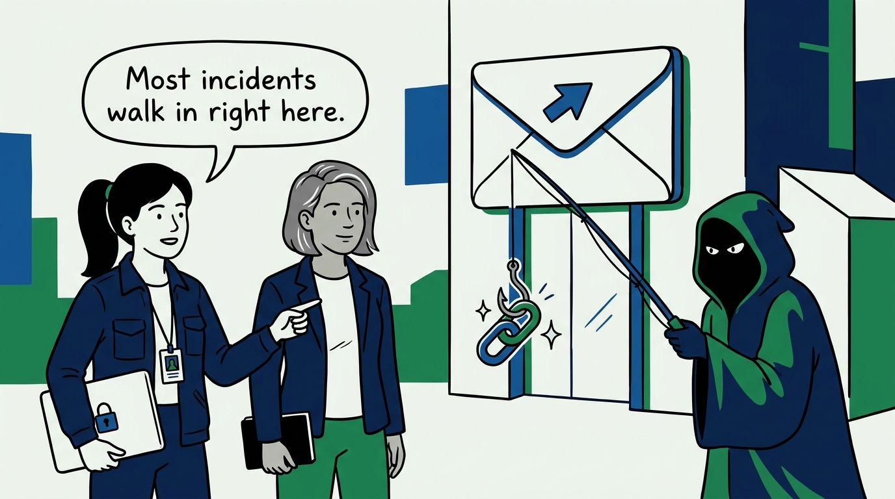
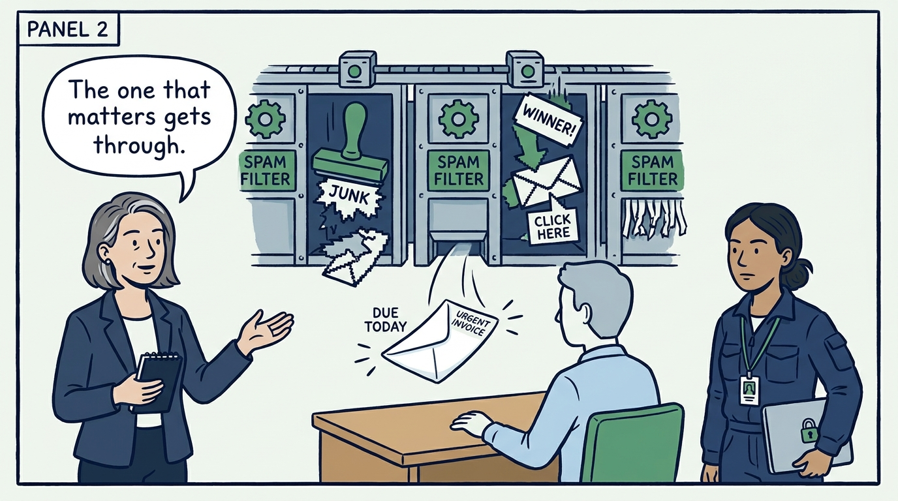
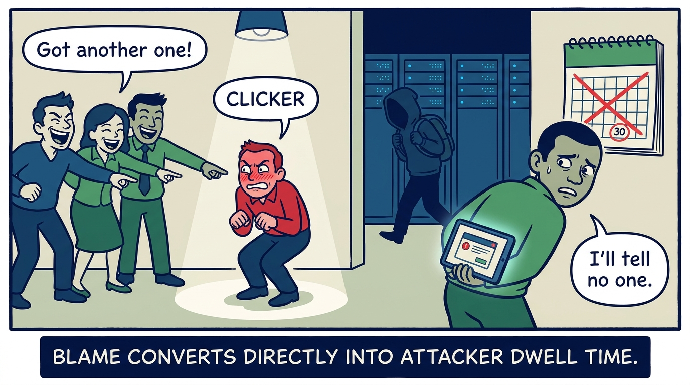
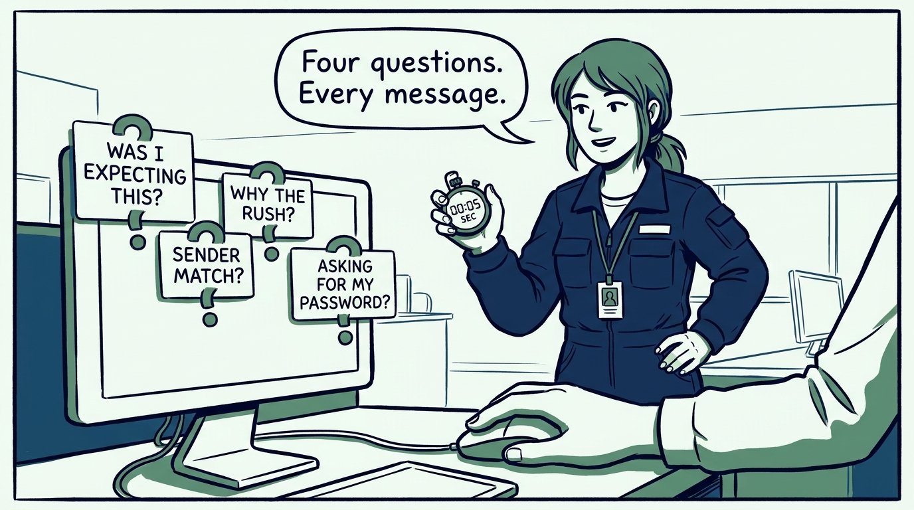
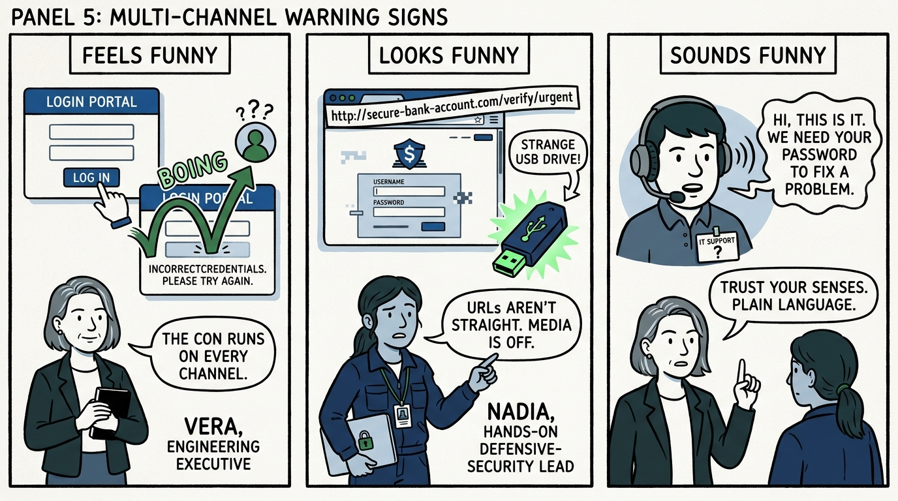
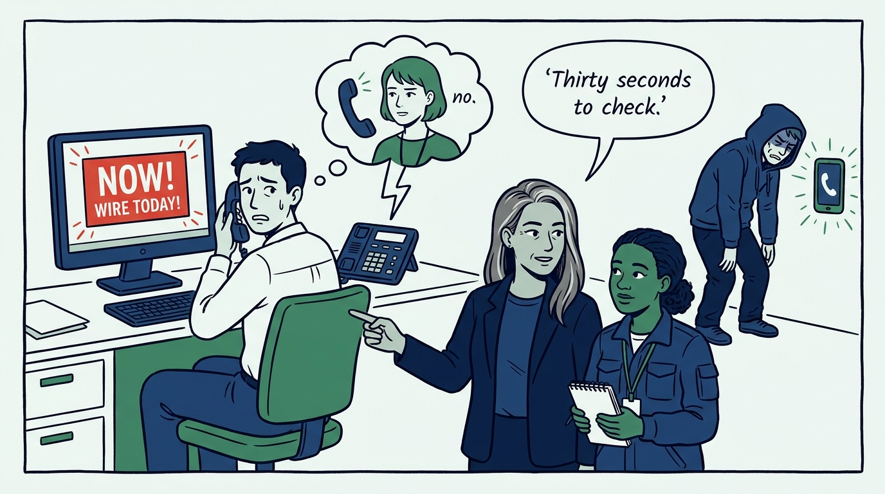
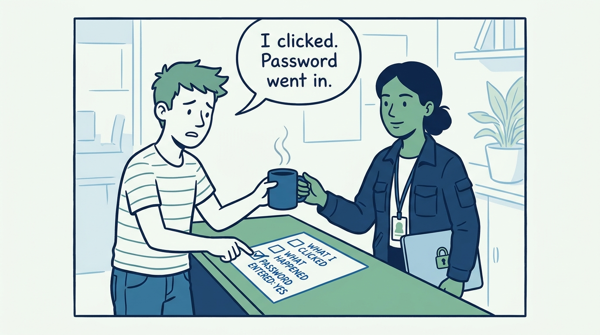
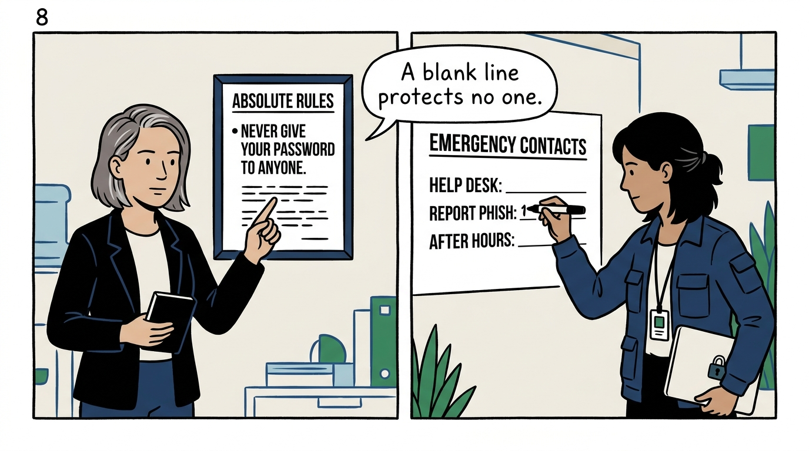
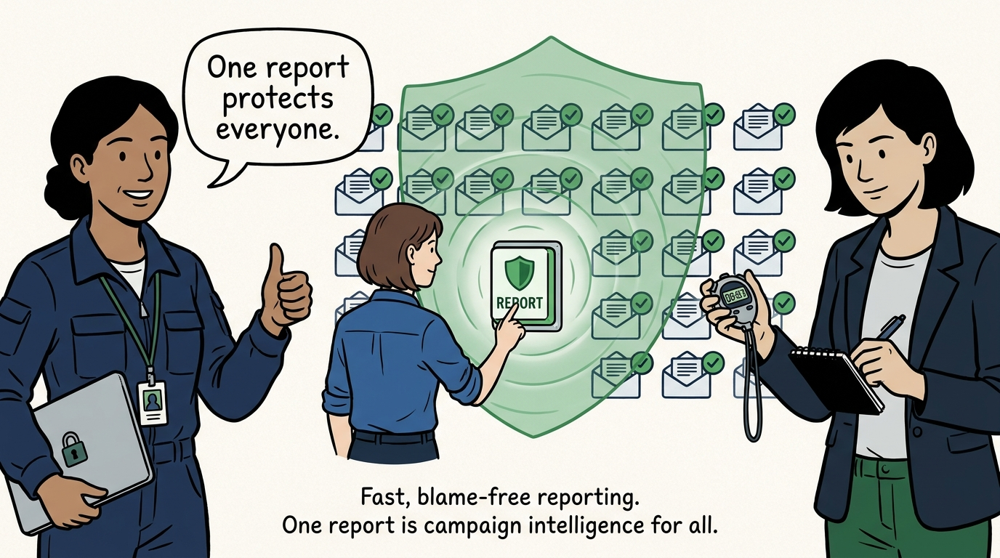

Why the front door of most incidents is defended with people, not just filters — in nine panels.

<!-- comic-style
{
  "cast": "VERA: a calm, seasoned engineering executive, short gray-streaked hair, dark blazer over a plain t-shirt, carries a small black notebook. NADIA: a hands-on defensive-security lead, shoulder-length dark hair tied back, navy utility jacket over a plain shirt, an access badge on a lanyard, laptop with a padlock sticker under one arm.",
  "style": "Clean two-tone explainer comic, thick ink outlines, flat colors with deep blue and green accents on a light background, generous white space, hand-lettered speech bubbles with SHORT readable text, no photorealism."
}
-->

**Panel 1:** *The hook: phishing is the front door of most incidents — the attack that starts most of what incident response later has to handle.*

**Panel 2:** *The problem: filters catch volume, but the attack that matters is engineered to pass them — a well-crafted message whose only flaws are that it was unexpected, slightly off, and in a hurry.*

**Panel 3:** *The wrong way: the shame spiral. Mock the clicker and the next employee who clicks tells no one — every ounce of blame on the reporting path converts directly into attacker dwell time.*

**Panel 4:** *The principle: defend with people, not just filters. Every employee runs the same short habit before clicking — was I expecting this, does the sender match, is it manufacturing urgency, is it asking for credentials?*

**Panel 5:** *The warning signs are sensory and multi-channel: something feels funny, looks funny, or sounds funny long before a tool flags it — and training only the inbox builds a defense the attacker walks around with a phone call.*

**Panel 6:** *Urgency is the payload, so pressure is the signal: the harder the message pushes, the more suspicious it becomes — and a thirty-second call through a known-good channel defeats what no inspection would catch.*

**Panel 7:** *After the click, speed and honesty beat shame: stop, report immediately, and say exactly what was entered — the clicked employee is the response's first sensor, not its culprit.*

**Panel 8:** *The non-negotiables are few and absolute — never give your username or password to another person, IT included — and the contact lines are filled in, published, and current, because a reporting culture with a blank contact line is a poster, not a defense.*

**Panel 9:** *The closer: the culture test — the employee who clicked reports it within minutes, because they know they will be helped, not punished. Phishing arrives in campaigns, and one report protects everyone who received the same attack.*
