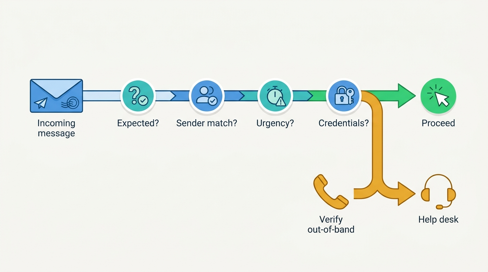
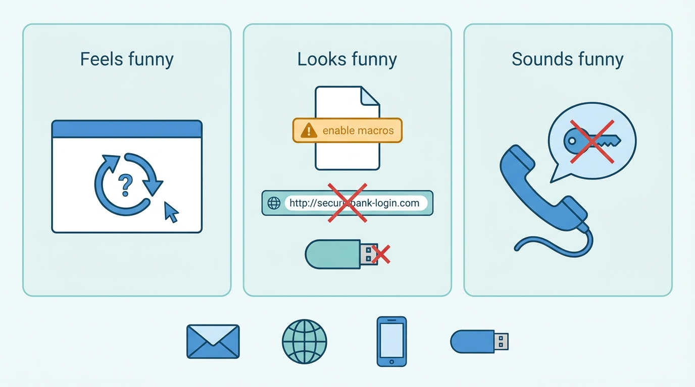
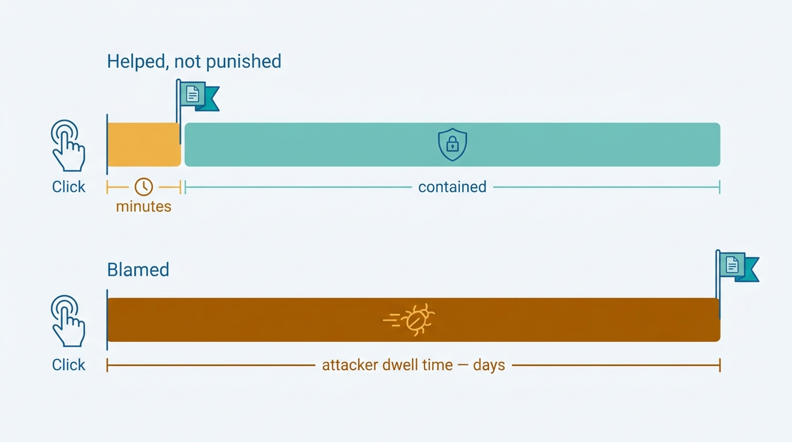

> **Status**: DRAFT
>
> **Principle**: Phishing is the front door of most incidents, and my organization defends it with **people, not just filters**. Every employee runs the same short verification habit before clicking — *was I expecting this, does the sender match, is it manufacturing urgency, is it asking for credentials* — and **verifies unusual requests through a separate trusted channel**. The warning signs are taught in plain language across every medium the attack arrives on — email, web, phone, and found media — because **phishing feels, looks, and sounds funny long before a tool flags it**. **Reporting is fast, easy, and blame-free whether or not anyone clicked**: the employee who clicked is the response's first sensor, not its culprit, and one report protects everyone who received the same attack. A username or password is **never given to another person**, and the help-desk and reporting contacts are filled in, published, and known. The test I hold the culture to: **the employee who clicked reports it within minutes — because they know they will be helped, not punished.**

## Statement

When a phishing attempt reaches anyone in my organization — and it will — this is the behavior I hold the organization to.

**Before the click, a short verification habit runs every time.**

- **Expectation first.** Was I expecting this email, link, or attachment? Do I recognize the sender, and does the sender's address actually match the person or organization it claims to be?
- **Pressure is a signal.** Unusual urgency or pressure is treated as a warning sign in itself, not a reason to comply faster.
- **Credential requests are suspect by default.** Any message asking for a username, password, financial information, or other sensitive data earns scrutiny.
- **Verification goes out-of-band.** Work-related requests that feel unusual are verified with the sender through a separate trusted method — never by replying to the message that made the request. Links are checked for the correct URL over `https://` before use.
- **Doubt stops the hand.** When anything feels suspicious, the action is to stop and contact the help desk — not to proceed carefully.

**Figure 1:** *The pre-click habit: four cheap questions on every message, and any doubt routes to a separate trusted channel — never to a careful click.*

**The warning signs are taught, in plain language, across every medium.**

- **Something feels funny:** a login that bounces straight back to the login page; a website that misbehaves; an unexpected package, delivery, payroll, or greeting-card message; a document claiming sensitive content nobody asked for.
- **Something looks funny:** an attachment that opens with a strange error or does not contain what it promised; a prompt to enable macros, install software, update a driver, or add a media player; a familiar-looking site on the wrong URL; an unknown USB drive or other removable media.
- **Something sounds funny:** "IT" asking for a username or password; a caller needing immediate access to fix an issue nobody reported; an unfamiliar vendor probing for details about systems and software; unusual requests made in the name of facilities, management, or another department.

**Figure 2:** *Three sensory families of warning signs across every medium the attack arrives on — phishing feels, looks, and sounds funny long before a tool flags it.*

**After a click, speed and honesty beat shame.**

- Stop interacting with the message, site, or attachment; enter nothing further; contact the help desk immediately; say exactly what was clicked, what happened, and **whether credentials or sensitive data were entered**; then follow instructions for password changes and device checks. Fast reporting is framed as what it is: the act that protects everyone else and stops the spread.

**No click still means report.**

- Suspicious messages are reported through the organization's phishing-reporting process, kept available for review, and **never forwarded to coworkers** unless IT asks. One report is treated as a campaign signal — others likely received the same attack, and follow-up attempts from similar senders are expected.

**What must be reported is spelled out.**

- Suspicious emails fishing for credentials, banking details, or system information; unexpected links and attachments; attempts by unauthorized people to access computers, accounts, systems, or workspaces; requests touching protected health information or other confidential data; suspicious calls, messages, websites, and removable media.

**The non-negotiables are few and absolute.**

- Do not click unexpected links. Do not open unexpected attachments. **Never give your username or password to another person.** Verify unusual requests through a trusted channel. When something feels, looks, or sounds suspicious, report it. When in doubt, contact the help desk — and **the help-desk, phishing-report, and after-hours contacts are filled in, published, and known**, because a rule that ends in a blank line protects no one.

## How to Read This

This record closes the **Response and Recovery** section by covering the attack that starts most of what [[incident-response]] handles. It differs from its neighbors in audience: the chapter's checklist is written for *every employee*, not for responders — it is the handout, the onboarding artifact, the poster version of the organization's phishing defense — and this record is the executive commitment that stands behind it. It is grounded in the Phishing Awareness and Response chapter of the *Defensive Security Handbook* (Brotherston, Berlin, Reyor). The full employee-facing checklist lives in the **Checklist** tab; the management summary in the **TL;DR** tab; the conversation in the **Conversation** tab.

## Rationale

**The last line of defense thinks, so train the thinking.** Mail filters, link rewriting, and attachment sandboxing catch volume, and my organization runs them — but the attack that matters is the one engineered to pass them, and it lands in front of a human. The chapter's checklist is therefore not a technology list; it is a habit: a handful of questions cheap enough to run on every message, calibrated to catch exactly what filters miss — the well-crafted message whose only flaws are that it was unexpected, slightly off, and in a hurry. A defense that depends on employees never making mistakes is a fantasy; a defense that makes suspicion cheap and reporting safe is a system.

**Urgency is the payload.** Nearly every phishing attack carries the same engine: manufactured time pressure that switches the target from judgment to compliance — the invoice due today, the executive who needs gift cards now, the account that will be locked in an hour. Teaching people that *pressure itself is the warning sign* inverts the attack: the harder the message pushes, the more suspicious it becomes. The out-of-band verification rule is the escape hatch — a thirty-second call through a known-good channel defeats attacks that no amount of message inspection would catch, because the attacker controls the message but not the second channel.

**Feels, looks, sounds — because the attack is multi-channel.** The chapter's three warning-sign families are deliberately sensory, and deliberately broader than email. The login that bounces back (credentials already harvested), the macro prompt (the payload asking permission), the familiar site on a wrong URL, the found USB drive, the caller from "IT" — vishing, smishing, and baiting all run the same con through different media. Training only the inbox builds a defense the attacker walks around with a phone call. Plain, memorable language is a design choice: an employee who can say "something sounded funny" reports; one who thinks reporting requires technical vocabulary stays silent.

**The clicked employee is a sensor, not a culprit.** The record's center of gravity is what happens in the minutes after a mistake. An employee who clicked holds exactly the intelligence the response needs — what was clicked, what happened next, whether credentials went in — and the only variable is whether they surrender it in minutes or hide it for days. Every ounce of blame added to the reporting path converts directly into attacker dwell time. That is why the test in the principle is cultural: helped, not punished. The disclosure question — *did you enter a username or password?* — is the single highest-value fact in the entire exchange, and people answer it honestly exactly once: when honesty is safe.

**Figure 3:** *The clicked employee is the response's first sensor: every ounce of blame on the reporting path converts directly into attacker dwell time.*

**The near-miss is campaign intelligence.** The employee who did not click and therefore reports nothing has silently discarded the organization's early warning: phishing arrives in campaigns, and the message one person deleted is sitting unread in thirty other inboxes. Hence the record's insistence that no-click still means report, that the message is kept for review rather than deleted, and that it is never helpfully forwarded to coworkers — the forward spreads the live payload faster than the attacker could. One report, routed through the process, protects everyone who received the same attack.

**Absolute rules survive stress; nuanced rules do not.** Under pressure — which is precisely when phishing strikes — people fall back on the simplest rule they know. So the record keeps a short list of absolutes, and the sharpest is *never give your username or password to another person* — no exception for IT, for a manager, for anyone, because legitimate IT never needs it and every exception becomes the pretext an attacker uses. And the checklist's closing blanks — help desk, reporting method, after-hours contact — are the whole program in miniature: **a reporting culture with an unfilled contact line is a poster, not a defense.** Filling them in, publishing them, and keeping them current is an executive responsibility, not a formatting detail.

## What This Means in Practice

| What this record says | What it does **not** say |
| --- | --- |
| Every employee runs the verification habit and reports suspicion — everyone is a sensor. | Employees are the ones blamed when an attack succeeds — the system absorbs mistakes; that is its job. |
| Reporting is blame-free, whether or not the person clicked. | Clicks have no follow-up — password resets, device checks, and coaching still happen; they are help, not punishment. |
| Unusual requests are verified through a separate trusted channel. | Every email needs a phone call — the habit triggers on unexpected, pressured, or sensitive requests. |
| Urgency and pressure are treated as warning signs in themselves. | Nothing is ever actually urgent — verified urgent requests proceed; unverified ones wait thirty seconds for the check. |
| A username or password is never given to another person, IT included. | Credential sharing is acceptable with sufficiently senior people — seniority is the pretext attacks are built on. |
| Suspicious messages are reported and kept, never forwarded to coworkers. | Warning colleagues is wrong — warnings travel through IT's channel, not with the live payload attached. |
| Help-desk, reporting, and after-hours contacts are filled in, published, and known. | Publishing contacts once is enough — they are verified current as part of the program. |

Concretely: anyone in my organization, asked at random, can name the way to report a phish; every reported message earns a thank-you regardless of outcome; and the after-a-click path — stop, report, disclose what was entered, follow instructions — is rehearsed in onboarding and refreshed in [[user-education]], not discovered during the first real incident.

## Anti-Patterns

- **The shame spiral.** Clickers are named, mocked, or written up — and the next employee who clicks tells no one, handing the attacker days of quiet dwell time that a safe report would have cut to minutes.
- **The urgency reflex.** The message says *now*, so the employee complies now — pressure treated as a reason to skip verification instead of the reason to run it.
- **The helpful forward.** A suspicious email forwarded to the whole team as a warning — spreading the live link to more inboxes faster than the attacker's own send.
- **The silent near-miss.** "I didn't click, so there's nothing to report" — the campaign's earliest warning deleted, while the same message waits in thirty other inboxes.
- **The credential courtesy.** A password read out to a caller from "IT" who was polite, insistent, and in a hurry — the one absolute rule broken for the exact scenario it exists to stop.
- **The filter faith.** "Our email security catches this" — awareness treated as redundant, right up until the message engineered to pass the filter lands in front of an untrained human.
- **The blank contact line.** A reporting policy whose help-desk and after-hours lines were never filled in or went stale — suspicion with nowhere to go becomes suspicion discarded.
- **The annual checkbox.** Phishing awareness as a once-a-year compliance module — the habit this record needs is built by continuous reinforcement, not by a certificate.

## Related Records

- [[user-education]] — the program that teaches, drills, and refreshes this record's habits; this is its highest-stakes curriculum.
- [[incident-response]] — where a reported phish with a click goes next; this record's fast-report culture is that record's early-escalation culture applied to everyone.
- [[authentication]] — MFA and credential hygiene bound the damage when a password is phished anyway; the technical backstop to the never-share rule lives there.
- [[endpoints]] — the macro prompts, malicious installers, and found USB media in the warning signs land on endpoints; hardening there absorbs the clicks that slip through.
- [[security-program]] — the program that owns the reporting channel, keeps the contact lines current, and measures whether the culture test holds.

## Scope and Revisiting

This record is `draft`. It applies to everyone in my organization, on every channel a social-engineering attempt can arrive — email, web, phone, text, and physical media. I revisit it if reporting rates fall or a real incident reveals employees hesitated to report (the culture test failing), if attack techniques shift materially — AI-generated lures, deepfake voice calls, and QR-code phishing already strain the sender-checks — or if a phishing simulation program is introduced, whose design must reinforce the blame-free reporting culture rather than undermine it.

## Authoritative References

- *Defensive Security Handbook*, 2nd edition (Lee Brotherston, Amanda Berlin, William F. Reyor III; O'Reilly) — the Phishing Awareness and Response chapter, whose employee-facing checklist this record distills.
