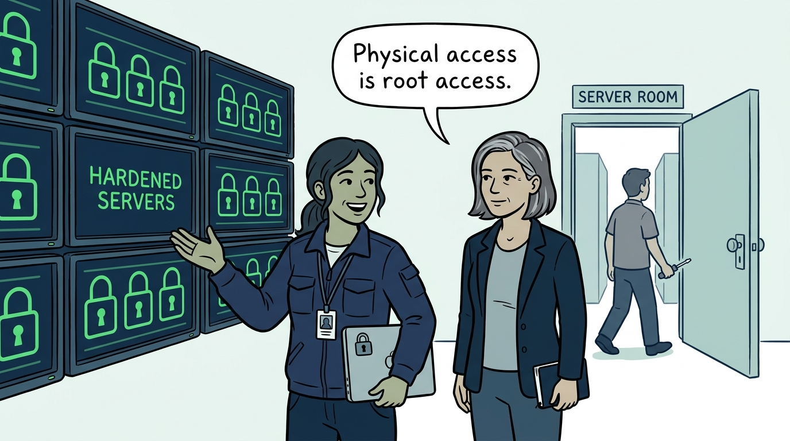
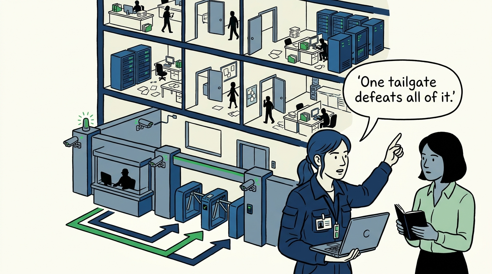
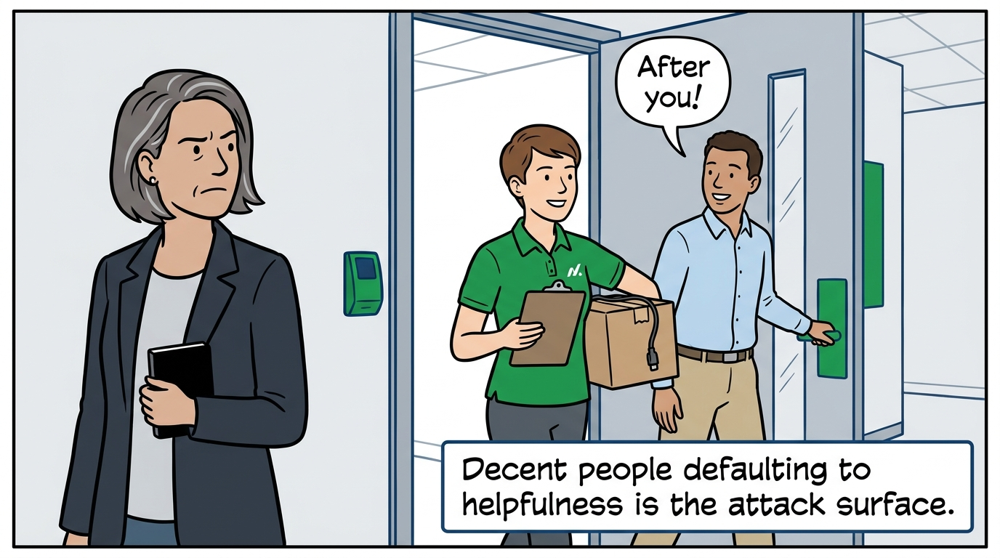
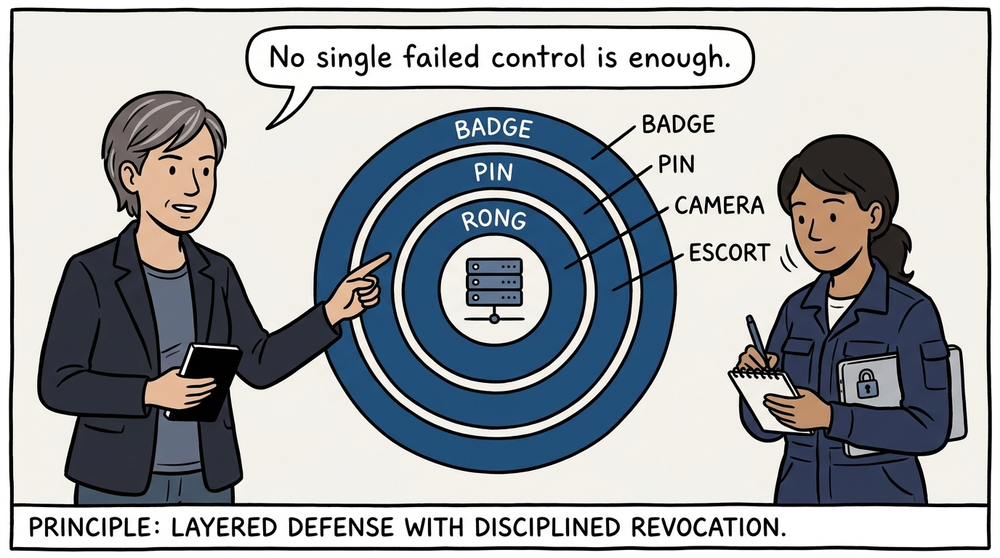
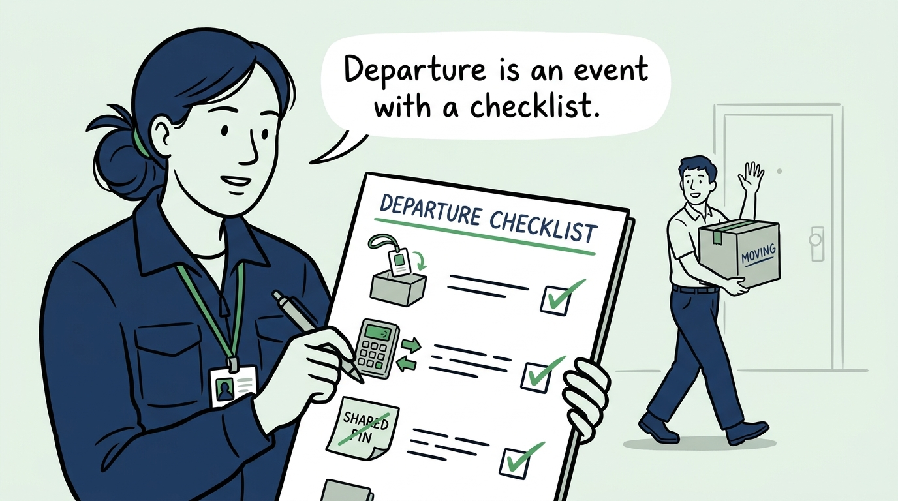
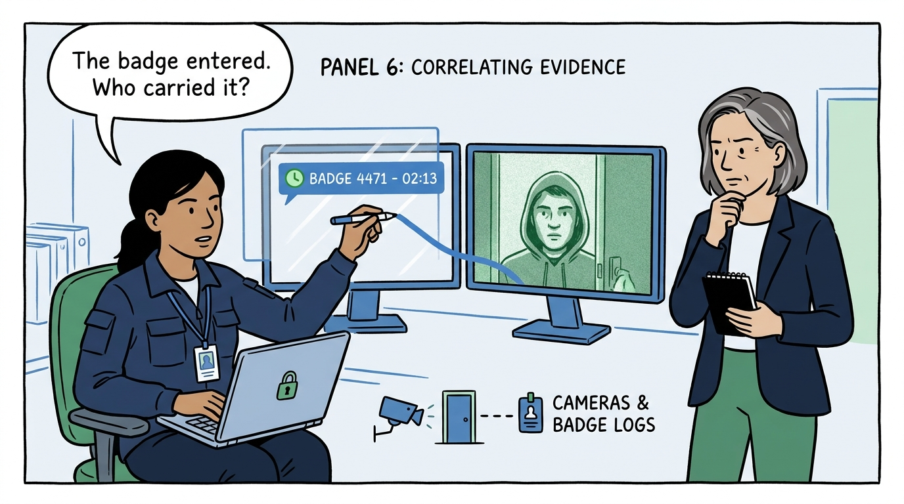
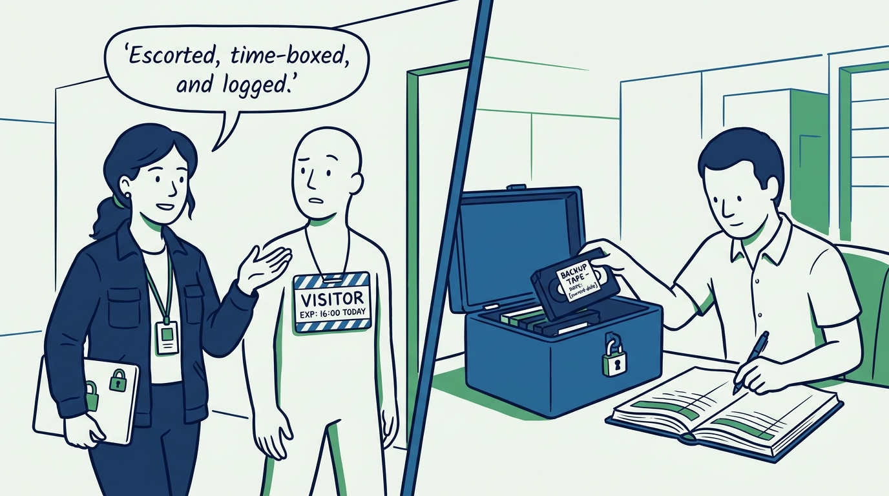
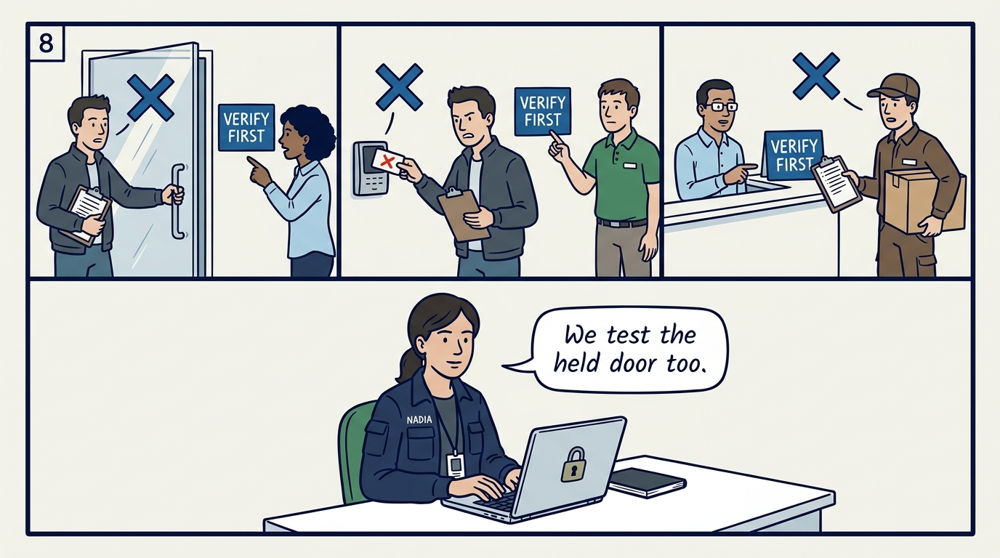
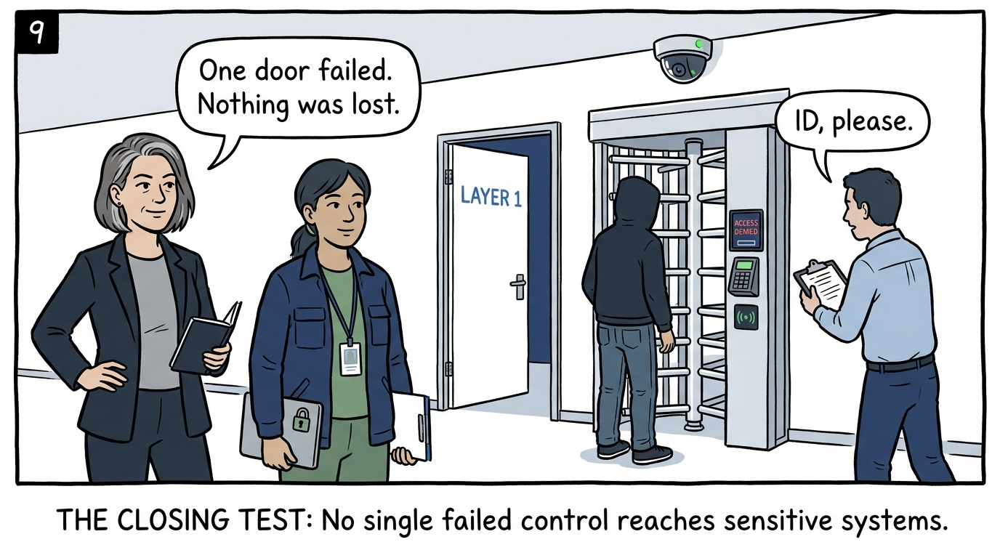

Why a held door outranks a zero-day, and how the estate defends itself in layers — in nine panels.

<!-- comic-style
{
  "cast": "VERA: a calm, seasoned engineering executive, short gray-streaked hair, dark blazer over a plain t-shirt, carries a small black notebook. NADIA: a hands-on defensive-security lead, shoulder-length dark hair tied back, navy utility jacket over a plain shirt, an access badge on a lanyard, laptop with a padlock sticker under one arm.",
  "style": "Clean two-tone explainer comic, thick ink outlines, flat colors with deep blue and green accents on a light background, generous white space, hand-lettered speech bubbles with SHORT readable text, no photorealism."
}
-->

**Panel 1:** *The hook: physical access is root access — someone at the machine needs no exploit, so an unlocked server room hardens the estate on paper only.*

**Panel 2:** *The problem: the lobby perimeter — all the security budget at the front desk means one tailgate defeats the entire estate.*

**Panel 3:** *The wrong way: the polite door-hold — politeness becomes the attack surface when challenging a stranger feels rude.*

**Panel 4:** *The principle: defend in layers — highly sensitive areas sit behind more than one control, so no single failed control reaches the data.*

**Panel 5:** *Practice: granting access is easy, revocation is the discipline — badges recovered same day, shared codes changed, and shared PINs never guard sensitive rooms because shared secrets have no offboarding.*

**Panel 6:** *Practice: cameras are for correlation, not decoration — positioned to capture faces, protected from tampering, and reviewed against badge logs to turn an entry record into evidence.*

**Panel 7:** *Practice: people and media at the perimeter — visitors and contractors are identified, escorted, and time-boxed, and removable media moves with classification labels, approvals, and a chain of custody.*

**Panel 8:** *The cost: the program is only real if it is exercised — controls are audited, and at least one assessment per cycle actually tries the held door, the cloned badge, the confident pretext.*

**Panel 9:** *The closer: the test the estate is held to — no single failed control, a held door, a cloned badge, or a confident pretext, is ever enough on its own.*
