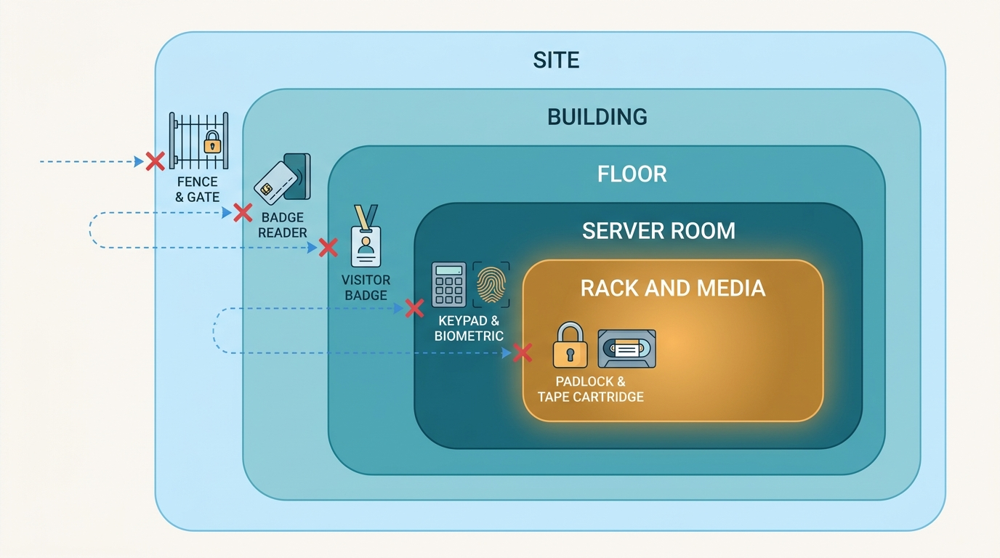
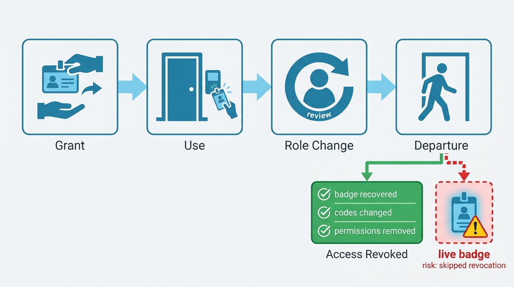
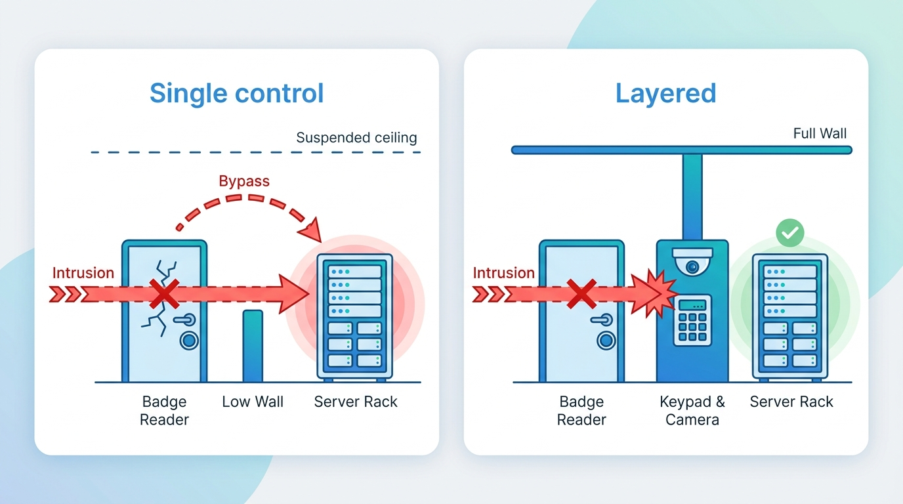

> **Status**: DRAFT
>
> **Principle**: Physical access is a security boundary of the same rank as the network, and my organization defends it the same way — **in layers, with revocation as disciplined as granting**. Secure areas sit behind real controls, and **highly sensitive areas behind more than one**; **badges, keys, and codes are recovered or changed the day someone leaves**; **media is tracked like the data it carries**; **visitors and contractors are identified, escorted, and time-boxed**; cameras are positioned to answer *who*, not just *when*; and every employee is trained that **politeness does not override procedure**. The test I hold the estate to: **no single failed control — a held door, a cloned badge, a confident pretext — is enough to reach sensitive systems or data**.

## Statement

This is the physical-security bar I hold my organization to, from the front door to the server rack.

**Access is controlled — and layered where it matters.**

- **Secure and sensitive areas are restricted** with appropriate controls — locks, PIN pads, RFID/badge readers, biometrics, or guards — and **highly sensitive areas require more than one control**, not one good one.
- **The workplace itself is defended**: screens lock when people step away, cable locks secure portable equipment where appropriate, a clear-desk policy is enforced, sensitive documents live in locked storage and die in shredders or locked shredding containers, and printers and their discard boxes stay free of sensitive output.
- **Connection points are part of the perimeter**: network and telephone jacks are access-restricted, and unused jacks are disabled or require authentication before use.

**Figure 1:** *Layered perimeters: every ring adds its own control, and highly sensitive areas sit behind more than one.*

**Surveillance answers *who*, not just *when*.**

- Cameras cover major entrances, exits, and high-risk rooms such as server rooms; they are **positioned to capture faces and to correlate badge use with the person using the badge**; they are mounted out of reach, protected from tampering, and their footage is actually reviewed — and correlated with badge-access logs — when something looks wrong.

**Access is maintained, not just granted.**

- Physical authentication controls are **audited regularly**: worn keypad buttons that reveal common codes are found and fixed; controls that expose authentication information are repaired or replaced.
- **Departure is an event with a checklist**: badges, keys, and access devices are recovered immediately, permissions removed promptly, shared door and alarm codes changed when authorized personnel leave, and access reviewed on every role change. **Shared PINs do not guard highly sensitive areas.**

**Media is tracked like the data it carries.**

- Removable media is secured, stored locked, **labeled by data classification**, moved by secure courier when sensitive, tracked in location and status, released from secure areas only with approval, and every movement and transfer is recorded. Backup media is protected against loss and theft, and storage locations are inspected periodically.

**Equipment rooms resist more than the front door.**

- Server racks and cabinets lock; **rack keys are centrally controlled with logged checkout and return**; sensitive-room walls run floor to ceiling and suspended-ceiling routes are evaluated; routers, switches, and domain controllers in remote offices get secured too — a locked enclosure where a full rack is impractical — and protected spaces are designed for fire safety as well as security.

**People at the perimeter are verified.**

- **Visitors** sign in and out, are escorted to and from controlled areas, have their purpose verified before touching technology, and need employee approval before interacting with equipment or information.
- **Contractors** are clearly identified on-site, show verified photo ID, work under access permissions defined in policy and limited to the areas their work requires, and their vetting and requests are confirmed before access is granted.
- **Badges** visibly distinguish visitors from employees and contractors, expire with the visit, are returned at sign-out, and are disabled promptly when lost, stolen, or unreturned.

**The human layer is trained, tested, and managed.**

- Employees are trained on physical social engineering: **tailgating** (everyone authenticates individually; secure doors are not held for the unknown), **badge cloning** (badges can be copied — sensitive areas get a second factor), **malicious removable media** (unknown USB devices are never connected), and **pretexting** (repair staff, vendors, and delivery workers are verified; unusual requests are confirmed with a manager; nobody gets in solely for looking the part).
- Physical security is **managed as an ongoing program**: coordinated between information security and facilities, included in internal assessments and penetration tests, reviewed periodically, with new threats identified and gaps corrected in a timely manner — **defense-in-depth, never a single control**.

## How to Read This

This record opens the **Hardening the Estate** section of the journal — the systems themselves, starting with the layer that is easiest to forget because it has no dashboard. Where the Security Program section fixes the frame ([[security-program]], [[policies]]), this record fixes the bar for the buildings, rooms, racks, and media the digital estate physically lives in; [[windows-infrastructure]] and [[unix-servers]] then harden what runs inside. It is grounded in the Physical Security chapter of the *Defensive Security Handbook* (Brotherston, Berlin, Reyor). The named mechanisms — badge readers, CCTV, rack keys, self-voiding visitor badges — are the worked example; my commitments hold at the capability level for any estate, from one office to many. The full working checklist lives in the **Checklist** tab, the management summary in the **TL;DR** tab, and the conversation in the **Conversation** tab.

## Rationale

**Physical access is root access.** Nearly every technical control this journal describes assumes the attacker is remote. Someone standing at the machine can boot from their own media, pull a drive, plug into an open jack, or photograph the papers on the desk — no exploit required. That is why this record sits at the front of the hardening section: an estate with hardened servers and an unlocked server room is hardened on paper. The clear-desk rule, the locked screen, the disabled jack, and the clean printer tray are not office etiquette; they are the physical equivalents of closing open ports.

**Granting access is easy; revocation is the discipline.** Any organization can issue badges. The ones that stay secure are the ones where departure triggers the same rigor as arrival: badge recovered the same day, permissions removed promptly, shared door codes changed, access re-reviewed when roles change. Every skipped revocation compounds silently — a former employee's live badge is a standing credential nobody is watching. And a shared PIN cannot be revoked from one person at all, which is exactly why it does not guard anything highly sensitive: shared secrets have no offboarding.

**Figure 2:** *Granting is easy; revocation is the discipline — departure triggers a checklist, and every skipped step leaves a standing credential.*

**Cameras are for correlation, not decoration.** A badge log proves a badge entered; it does not prove who carried it. Video positioned to capture faces — and to pair a face with a badge event — is what turns "badge 4471 entered at 02:13" into evidence. A camera mounted for coverage optics, never reviewed, or reachable by anyone with a ladder is a prop. The record therefore demands placement that answers *who*, tamper protection, and a working habit of reviewing footage against badge-access logs when investigating — which is also where this record hands off to [[incident-response]].

**Media is data that walks.** A locked datacenter means little if backups, USB drives, and removable disks leave the building untracked. Classification labels, locked storage, approval before removal, secure couriers, and movement records give portable data the same chain of custody the racked data enjoys. The periodic inspection of storage locations is the audit that keeps the paper trail honest — [[asset-management]] carries the broader inventory discipline this depends on.

**Politeness is the attack surface.** Tailgating, pretexting, and the parking-lot USB stick all exploit the same thing: decent people defaulting to helpfulness. The chapter's most quotable instruction is that politeness should not override security procedures — holding the door, waving through the confident person in the branded polo, plugging in the promotional USB drive. Training has to make verification feel like professionalism rather than rudeness, and it has to be reinforced continuously with signs, reminders, and awareness work, because this control decays fastest. The broader curriculum lives in [[user-education]]; the in-person cousin of this attack is the subject of [[phishing-response]].

**No single control survives contact — so the program layers them and tests them.** Badges get cloned; keypads wear down and reveal their codes; walls that stop at the suspended ceiling get climbed over. The record's answer is structural, not heroic: more than one control on highly sensitive areas, badge access combined with another factor where risk warrants it, regular audits of the controls themselves, and physical security included in penetration tests — the same adversarial verification the digital estate gets through [[osint-purple-teaming]]. Defense-in-depth is the closing line of the chapter's checklist because it is the design rule everything above it instantiates.

**Figure 3:** *No single control survives contact: badges get cloned and walls get climbed, so sensitive areas layer controls and test them adversarially.*

## What This Means in Practice

| What this record says | What it does **not** say |
| --- | --- |
| Secure areas sit behind real controls; highly sensitive areas behind more than one. | Every office door needs a biometric lock — controls are proportionate to what the area holds. |
| Badges, keys, and codes are recovered or changed the day someone leaves; access is reviewed on role change. | HR paperwork is enough — revocation is verified, not assumed. |
| Cameras capture faces and correlate with badge logs, and footage is reviewed when investigating. | Surveillance is ambient monitoring of employees — it is an investigative and deterrent control. |
| Removable media is labeled, locked, tracked, and moved with approval and records. | Removable media is banned — it is governed. |
| Visitors and contractors are identified, escorted, time-boxed, and verified before touching anything. | Guests are treated as suspects — verification is a standard step, applied politely to everyone. |
| Employees individually authenticate, challenge tailgaters, and verify pretexts, and are trained to. | The lobby desk owns physical security — every employee holds the boundary. |
| Physical security is coordinated, tested in penetration tests, and reviewed as a program. | It is facilities' problem, or a one-time office fit-out. |

Concretely: my organization runs physical security as a joint program between information security and facilities, with a named owner. Departures trigger same-day badge recovery and code changes; the badge and camera systems are audited on a schedule; and at least one assessment per cycle includes a physical component — someone actually tries the held door, the cloned badge, the confident pretext.

## Anti-Patterns

- **The lobby perimeter.** All the security budget at the front desk; once inside, every floor, room, and rack is open. One tailgate defeats the entire estate.
- **The badge that never dies.** Departed employees and expired contractors with live badges because offboarding recovers the laptop but not the access — a standing credential with no owner.
- **The decorative camera.** CCTV mounted for coverage optics: wrong angle for faces, reachable from a chair, footage never reviewed and never correlated with badge logs.
- **The polite door-hold.** A culture where challenging an unbadged stranger feels rude — so nobody does, and the procedure exists only in the policy document.
- **The shared PIN.** One code for the server room, known to everyone including several people who left last year, unchanged since installation — a secret with no offboarding.
- **The parking-lot USB.** Found or promotional media plugged straight into a company device, because curiosity was never trained out and the ports were never restricted.
- **The ceiling route.** A badge reader on the door and a suspended ceiling over the wall — the expensive control bypassed by the cheap gap nobody evaluated.
- **The orphaned program.** Information security assumes facilities owns the doors; facilities assumes security does — audits, camera reviews, and threat updates belong to nobody.

## Related Records

- [[user-education]] — the training layer this record depends on; tailgating, pretexting, and media awareness are its physical curriculum.
- [[phishing-response]] — pretexting is phishing in person; the verify-before-you-act reflex is the same muscle.
- [[asset-management]] — media tracking and equipment security assume you know what media and equipment exist.
- [[windows-infrastructure]] — domain controllers are the estate's crown jewels; their racks, cages, and remote-office enclosures are this record applied.
- [[incident-response]] — badge logs and camera footage are physical evidence; correlation happens inside the incident process.
- [[osint-purple-teaming]] — physical security is verified adversarially, in the same assessments that test everything else.
- [[policies]] — clear-desk, visitor, and contractor-access rules are written and enforced through the policy frame.

## Scope and Revisiting

This record is `draft`. It applies to every facility where my organization keeps people, equipment, or data — offices, server rooms, and remote sites alike, proportionate to what each holds. I revisit it if a physical assessment or penetration test defeats a sensitive area with a single failed control (the defense-in-depth claim failing in practice), if the estate changes shape materially (a new datacenter, a move to co-working space, a shift to fully remote), or if badge, camera, or visitor-management technology changes enough that the worked examples no longer match the controls actually deployed.

## Authoritative References

- *Defensive Security Handbook*, 2nd edition (Lee Brotherston, Amanda Berlin, and William F. Reyor III) — the Physical Security chapter, whose checklist this record distills.
