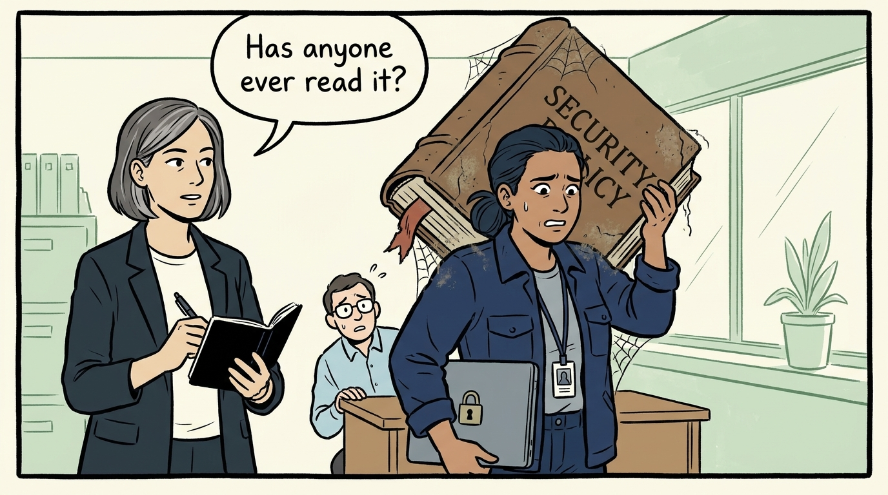
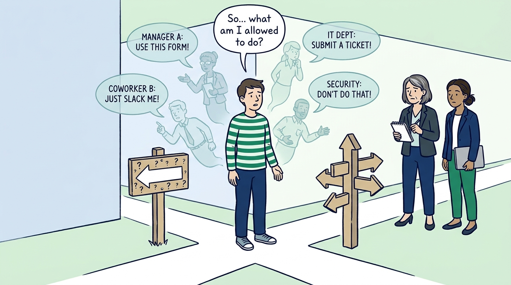
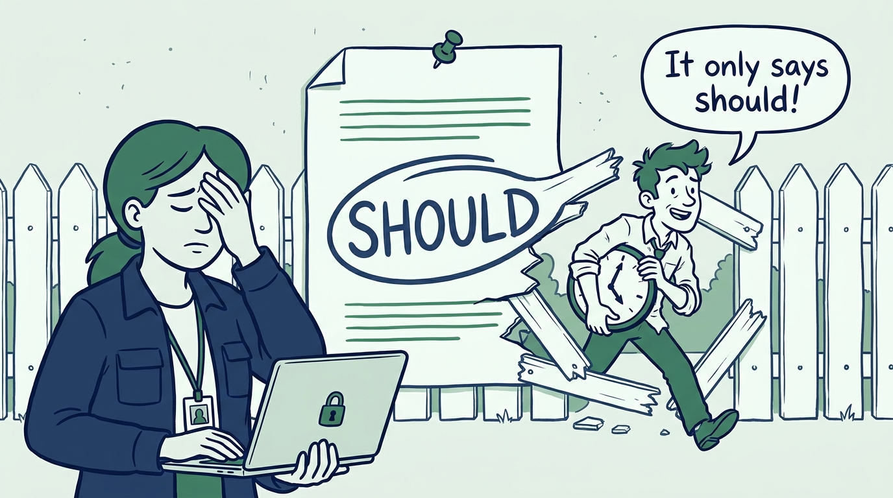
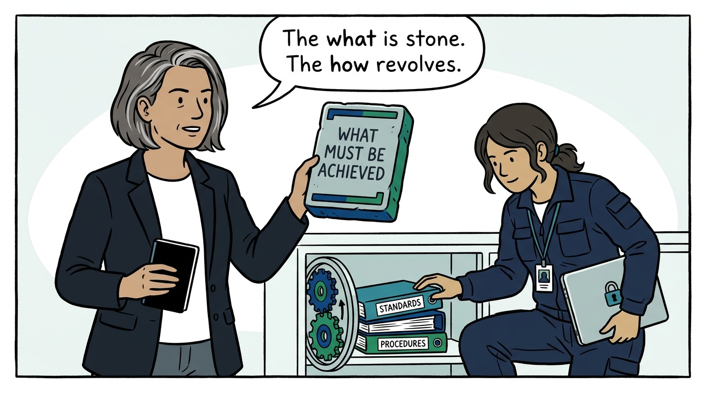
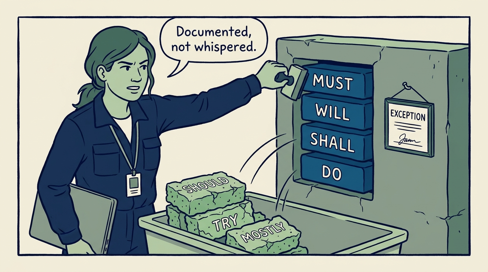
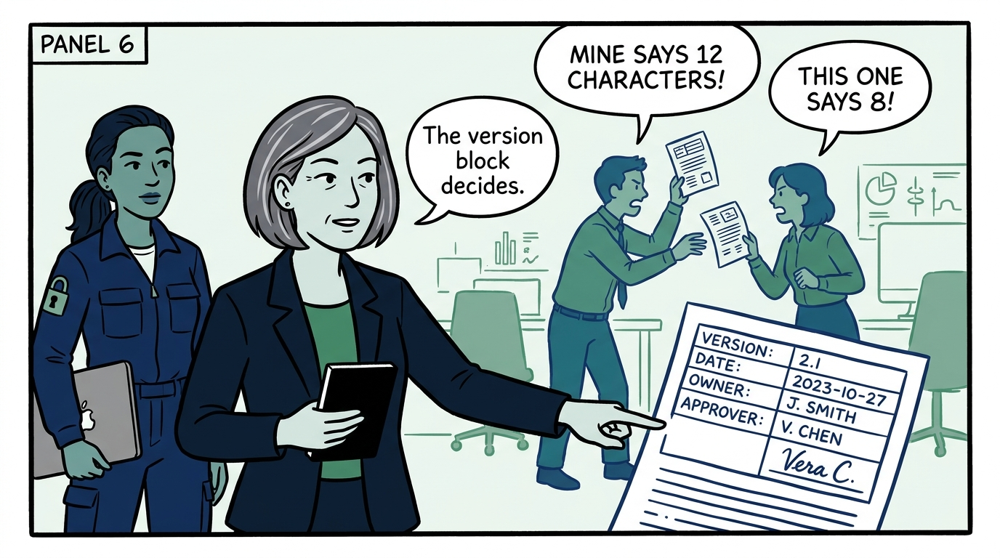
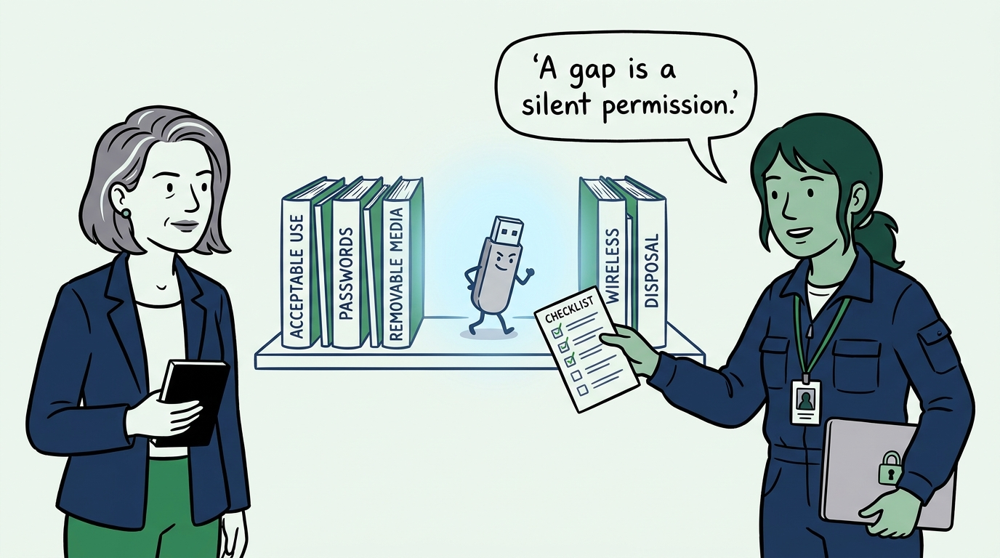
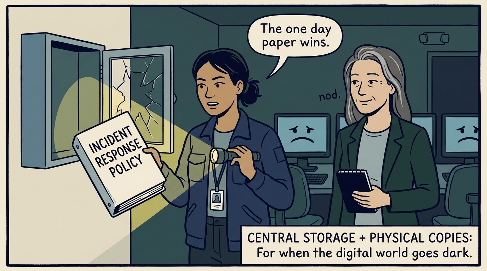
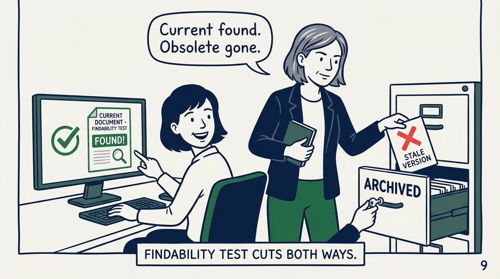

Why a policy states what must be achieved — and why "should" is not policy language — in nine panels.

<!-- comic-style
{
  "cast": "VERA: a calm, seasoned engineering executive, short gray-streaked hair, dark blazer over a plain t-shirt, carries a small black notebook. NADIA: a hands-on defensive-security lead, shoulder-length dark hair tied back, navy utility jacket over a plain shirt, an access badge on a lanyard, laptop with a padlock sticker under one arm.",
  "style": "Clean two-tone explainer comic, thick ink outlines, flat colors with deep blue and green accents on a light background, generous white space, hand-lettered speech bubbles with SHORT readable text, no photorealism."
}
-->

**Panel 1:** *The hook: the 90-page omnibus — one giant policy nobody reads, nobody can revise without a committee, and nobody can map to a real question.*

**Panel 2:** *The problem: a policy nobody can find or understand binds nobody — the gap gets decided ad hoc by whoever faces the question first, differently each time.*

**Panel 3:** *The wrong way: 'should' is a loophole spelled politely — every one is a decision delegated to whoever reads it under pressure, and pressure argues for the convenient reading.*

**Panel 4:** *The principle: policy states the what — durable for a decade; the how lives in standards and procedures, revised every year without touching the mandate.*

**Panel 5:** *The language is mandatory or it is not policy: must, will, shall, and do — and permitted exceptions are documented, because a written exception is a decision and an unwritten one is erosion.*

**Panel 6:** *Every policy is a governed document — version, effective date, owner, approver, endorsement. When two versions circulate, the version block is the whole argument.*

**Panel 7:** *Coverage is deliberate, not accidental: walk the full list and decide each one — because whatever has no policy is, in practice, allowed.*

**Panel 8:** *Managed as a set: central storage under revision control — and paper copies of critical policies, because the response policy locked inside the crashed system is a punchline, not a control.*

**Panel 9:** *The closer: the test the set is held to — any employee can find the current approved policy that applies to them, and nobody can find an obsolete one.*
