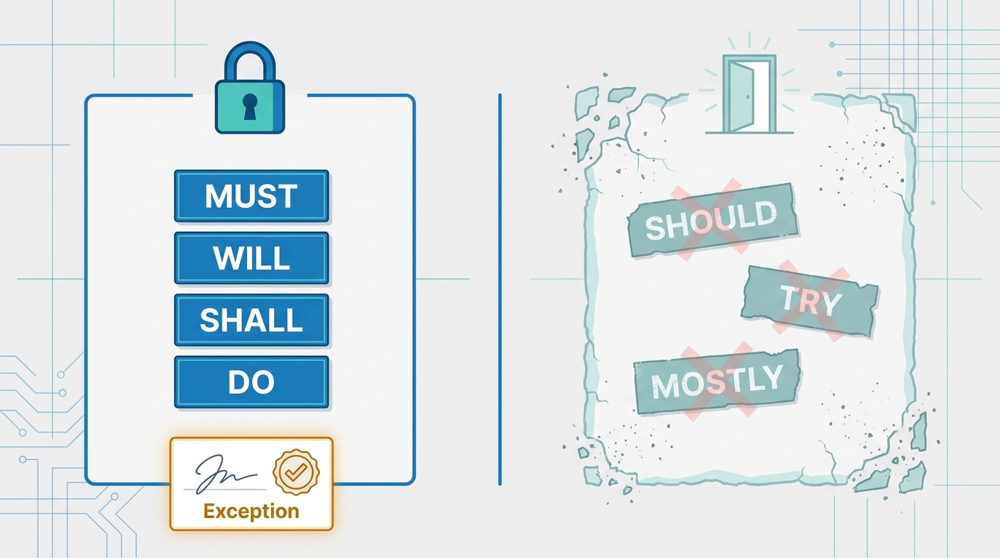
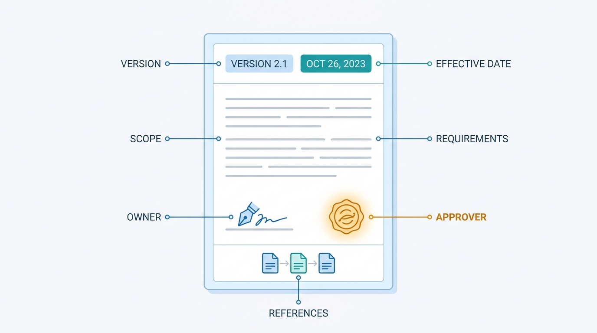

> **Status**: DRAFT
>
> **Principle**: A security policy in my organization states **what must be achieved** — the how lives in standards and procedures. **The language is mandatory or it is not policy**: must, will, shall, and do; never should, try, and mostly — with permitted exceptions **documented, not whispered**. Every policy is a **governed document** — version, effective date, revision history, owner, approver, scope, and management endorsement — and the set is managed deliberately: **separate manageable documents**, aligned to a framework, **centrally stored under revision control**, formally approved, communicated to the people they bind, with backup and physical copies that survive the outage they were written for. Policies are **living documents**, reviewed at least annually and after significant change, with obsolete versions archived. The test I hold the policy set to: **any employee can find the current approved version of the policy that applies to them and understand what it requires — and nobody can find an obsolete one**.

## Statement

When my organization writes, approves, and maintains security policies, this is the bar.

**Policy states the what; implementation lives elsewhere.**

- **Every policy has a reason.** Why the policy is needed and which security objective it supports is defined; the policy promotes consistent behavior, reflects the organization's overall security posture, and supports applicable regulatory, compliance, and audit requirements.
- **Boundaries are explicit.** Expectations, boundaries, and prohibited behavior are clearly defined, and the policy is accessible enough that employees can actually understand the rules that apply to them.
- **Endorsed from the top.** Every policy carries appropriate management endorsement — a policy without it is an opinion.

**The language is mandatory or it is not policy.**

- Statements are clear, simple, and concise. Policies focus on **what must be achieved**, leaving implementation steps to procedures and standards.
- Mandatory requirements use **must, will, shall, and do**. Ambiguous terms — should, try, mostly — are avoided for anything mandatory. Permitted exceptions are clearly documented.
- No unnecessary legalese, no excessively wordy statements; short paragraphs and bullet points where they serve the reader.

**Figure 1:** *The language is mandatory or it is not policy: must, will, shall, and do — with permitted exceptions documented, never whispered.*

**Every policy is a governed document.**

- Each policy carries a version number, an effective date, a revision history, a named owner, a named approver, and executive sign-off where required.
- Each policy states its purpose, defines its scope — who or what it applies to — contains the actual policy statements and requirements, and references related policies, standards, procedures, and relevant regulatory or legal requirements. Document and artifact naming is consistent across the set.
- Roles and responsibilities for implementation, monitoring, compliance, and updates are defined in the document itself.

**Figure 2:** *Every policy is a governed document: version, effective date, owner, approver, scope, and references — metadata that decides which version binds and whose authority backs it.*

**Coverage is deliberate, not accidental.**

- The policy set deliberately spans the surface the organization actually has: acceptable use, access control and remote access, passwords, encryption and key protection, email and communications, internet usage, mobile devices, removable media, wireless, software installation, workstation security, server security and auditing, network equipment, malware protection, web application security, incident response and recovery, data breach response, disaster recovery, risk assessment, security awareness and social engineering, data and database credentials, logging, equipment acquisition and disposal, employee and third-party responsibilities, ethics and intellectual property, and whatever industry-specific or regulatory policies apply. A gap in coverage is a silent permission.

**Policies are managed as a set.**

- Separate, manageable documents rather than one omnibus; aligned with an appropriate security framework or regulatory regime; stored in a central, easily accessible location under revision control so the current approved version is always identifiable.
- A formal review and approval process exists; new and revised policies are communicated to affected personnel; backup copies exist for the policies needed during outages, and critical policies exist on paper for the day digital access is what failed.

**Policies are living documents.**

- Reviewed at least annually — and after significant business, technology, regulatory, or security changes. Outdated requirements and references are updated, each revision records what changed, revised policies are re-approved, alignment with current business objectives is verified, and obsolete versions are removed or archived so nobody follows requirements that no longer exist.

## How to Read This

This record is the policy layer of **The Security Program** section: [[security-program]] establishes governance and says documented policies must exist; this record fixes what "a policy" means before a single one is written. The how — configuration baselines, step-by-step procedures — is deliberately excluded and lives in [[standards-and-procedures]]. It is grounded in the "Policies" chapter of the *Defensive Security Handbook*. The full working checklist — foundation, language, contents, coverage, management, and maintenance — lives in the **Checklist** tab; the management summary is in the **TL;DR** tab and the conversation in the **Conversation** tab.

## Rationale

**A policy is a boundary, not a manual.** The moment a policy names a product, a port, or a procedure, it starts aging at the speed of the technology it mentions — and every tool swap becomes a policy amendment with executive sign-off. Splitting the what from the how keeps the policy durable while the implementation churns underneath it: "authentication credentials must be protected in storage and transit" survives a decade; the standard describing exactly how gets revised every year without touching the mandate. The split is also what keeps policies short enough to read — and a policy nobody reads governs nobody.

**"Should" is a loophole spelled politely.** Every should in a policy is a decision delegated to whoever reads it under pressure, and pressure always argues for the convenient reading. Must, will, shall, and do give the employee a rule they can follow, the auditor a claim they can test, and the manager a line they can hold. The record does not pretend exceptions away — it demands they be documented, because a written exception is a decision and an unwritten one is erosion. The precision of the language is the precision of the policy.

**An unowned policy is a rumor.** Version, effective date, owner, approver, revision history — the metadata looks bureaucratic until the day it is the whole argument. When two versions of the password policy circulate, the version block decides which one binds. When a requirement is challenged, the owner is who answers and the approver is whose authority backs it. Management endorsement is not ceremony either: a policy the executive layer never signed is a suggestion the executive layer never made — and it will be treated as exactly that in the first hard conflict with a deadline.

**Coverage gaps are silent permissions.** Whatever has no policy is, in practice, allowed — or rather, decided ad hoc by whoever faces the question first, differently each time. The chapter's coverage list is long deliberately: removable media, wireless, third-party responsibilities, equipment disposal — the unglamorous corners are where the incidents start. Walking the list annually and consciously deciding *we need this one, we do not need that one* converts silent gaps into recorded decisions. Not every organization needs every policy; every organization needs to have decided.

**A policy nobody can find binds nobody.** Central storage, revision control, and communication to affected personnel are what turn a signed document into an operating rule. And the record insists on the unfashionable detail: backup copies of the policies needed during outages, and physical copies of critical ones — because the incident-response policy locked inside the crashed document system is a punchline, not a control. The findability test cuts both ways: the current version must be one search away, and the obsolete version must be gone from where people look, because a stale policy that is still findable is still being followed by someone.

**Review is what separates policy from archaeology.** An organization changes its business, its technology, and its regulatory footprint continuously; a policy set reviewed "when we get to it" describes a company that no longer exists. The annual review — plus triggered reviews after significant change — is the mechanism that keeps the mandate true. Recording what changed and re-approving each revision keeps the authority chain intact; archiving obsolete versions finishes the job. A policy set that only ever grows, never prunes, is not governance — it is sediment.

**Figure 3:** *Policies are living documents: reviewed at least annually and after significant change, re-approved on revision — and obsolete versions archived where nobody can follow them.*

## What This Means in Practice

| What this record says | What it does **not** say |
| --- | --- |
| Policy states what must be achieved; implementation lives in standards and procedures. | Policies are vague — a mandate can be precise about the outcome without naming a tool. |
| Mandatory requirements use must, will, shall, and do. | Nothing is ever optional — genuinely optional practices are simply not written as policy, and exceptions are documented. |
| Every policy has a version, effective date, owner, approver, and revision history. | The metadata is the point — a perfectly governed document with no policy substance is filing, not governance. |
| Coverage spans the chapter's full list, decided deliberately. | Every organization needs every policy on the list — it needs a recorded decision for each. |
| Policies live in one central location under revision control, with backup and physical copies of critical ones. | Paper binders for everything — physical copies are for the policies you need when digital access is down. |
| Policies are reviewed at least annually and after significant change, with obsolete versions archived. | Annual review means annual rewrite — an unchanged policy that was genuinely reviewed and re-dated is a valid outcome. |

Concretely: any new or revised policy in my organization ships with its version block complete and its approver named, and the annual review answers three questions per policy — *is it still true, is it still mandatory in its language, and can the people it binds still find it?* A no on any of the three is a defect with an owner.

## Anti-Patterns

- **The 90-page omnibus.** One giant security policy nobody reads, nobody can revise without a committee, and nobody can map to a specific question — instead of separate, manageable documents.
- **The "should" policy.** Aspirational language throughout — employees cannot tell what is required, auditors cannot test compliance, and enforcement becomes selective by mood.
- **Policy as procedure.** Tool names, console paths, and step-by-step commands baked into the mandate — outdated at the next upgrade, and every upgrade now needs executive re-approval.
- **The orphan document.** No owner, no approver, no effective date — a policy that cannot answer *who says so, since when*.
- **The secret policy.** Approved, filed, and communicated to no one — its first appearance is in the disciplinary meeting after someone violated it.
- **The immortal draft.** Circulating for two years, cited in arguments, never formally approved — governing by habit without authority.
- **The stale mandate.** Requirements referencing systems retired years ago, obsolete versions still findable and still followed — archaeology wearing a policy's clothes.
- **The verbal exception.** Waivers granted in hallways and chat threads, never documented — each one a quiet amendment nobody approved and nobody remembers.

## Related Records

- [[security-program]] — the governance layer there mandates documented policies; this record is the document discipline it delegates.
- [[standards-and-procedures]] — the how that this record deliberately excludes: standards set the technical bar, procedures give the steps.
- [[compliance]] — policies must support regulatory, compliance, and audit requirements; the compliance frame itself lives there.
- [[user-education]] — communicating a policy makes it known; training makes it lived — the awareness program is there.
- [[incident-response]] — the incident-response and breach-response policies named in the coverage list get their operating substance there.
- [[disaster-recovery]] — the disaster-recovery policy is on the coverage list here, and the physical-copy discipline exists for exactly its scenario.

## Scope and Revisiting

This record is `draft`. It applies to every security policy my organization writes, revises, or inherits — and as the audit bar for the existing set. I revisit it if the regulatory footprint shifts enough to reshape the required coverage list, if policy reviews repeatedly find drift that the annual cycle missed (a signal the review triggers are wrong, not that people are careless), or if employees demonstrably cannot find or understand the policies that bind them — findability failing is the record's own test failing, and it gets fixed before more policy is written.

## Authoritative References

- *Defensive Security Handbook*, 2nd edition (Lee Brotherston, Amanda Berlin, and William F. Reyor III) — the "Policies" chapter, whose checklist this record distills.
