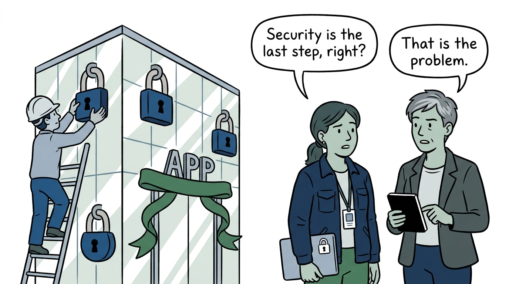
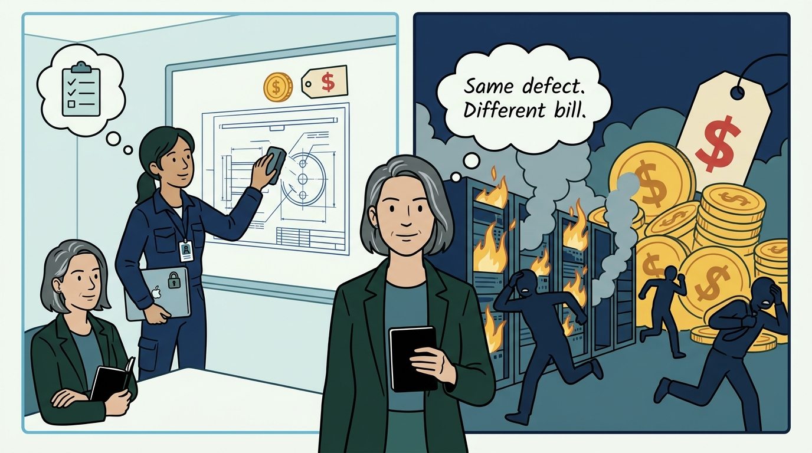
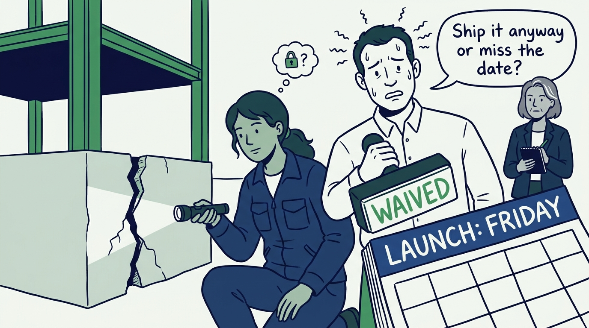
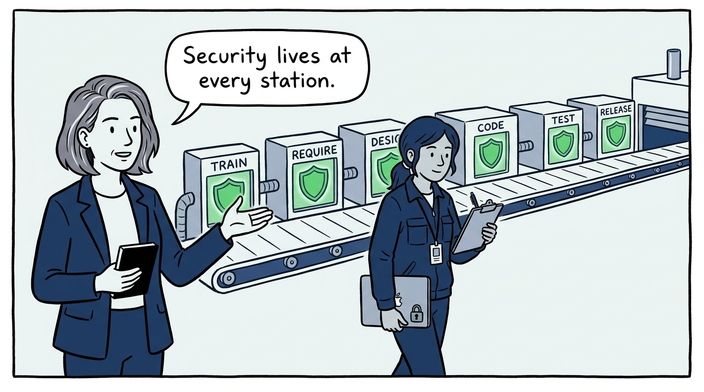
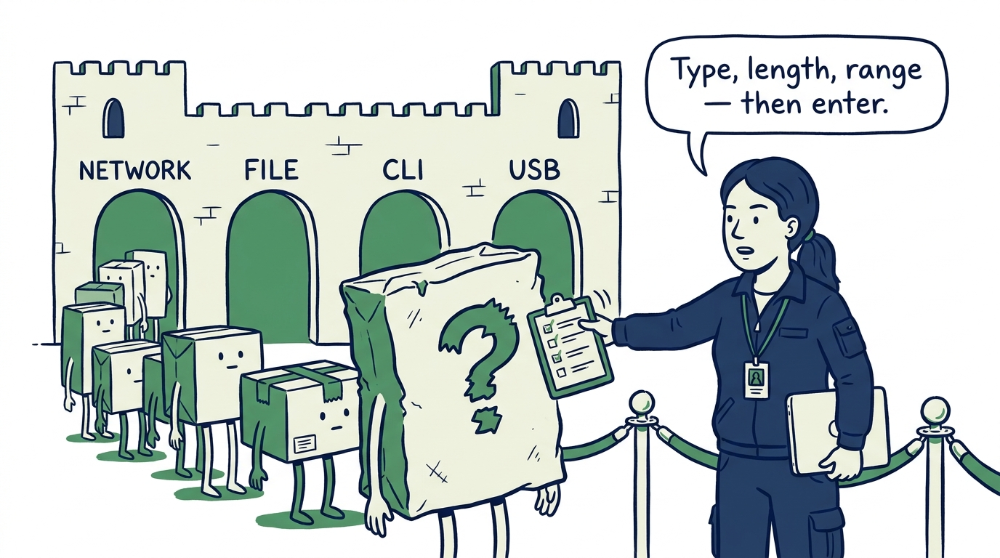
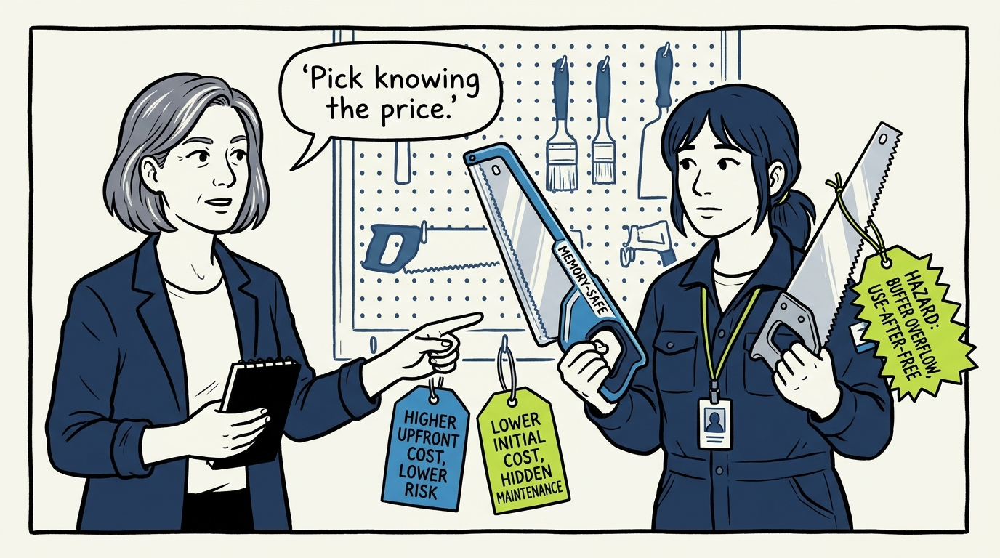
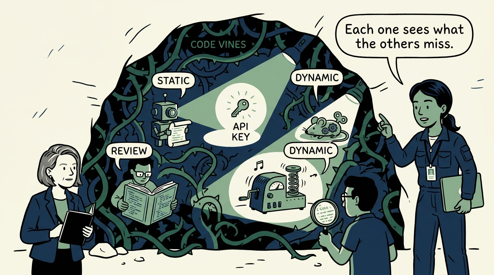
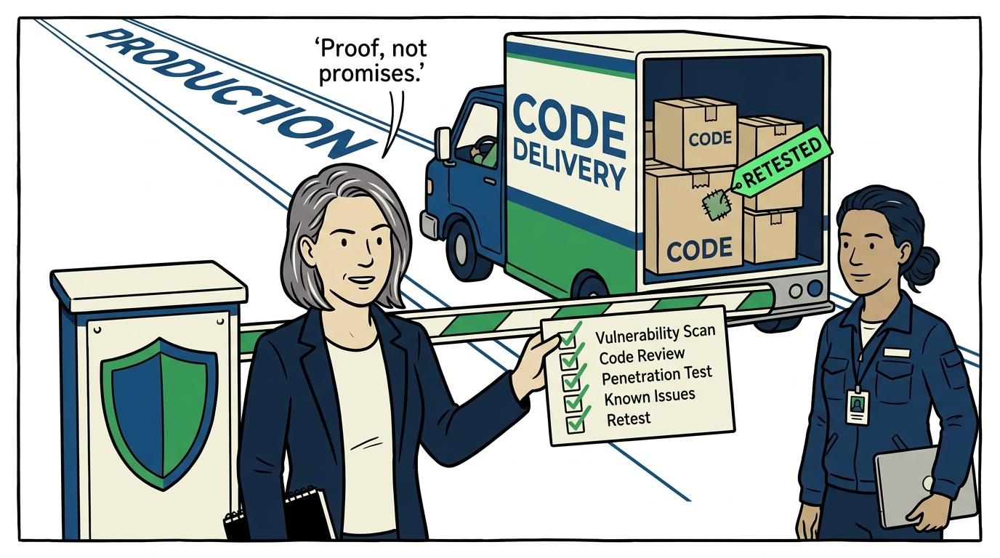
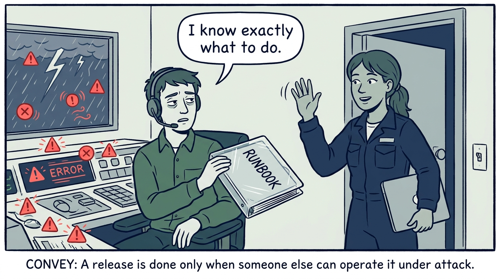

Why security is built into software, not tested onto it at the end — in nine panels.

<!-- comic-style
{
  "cast": "VERA: a calm, seasoned engineering executive, short gray-streaked hair, dark blazer over a plain t-shirt, carries a small black notebook. NADIA: a hands-on defensive-security lead, shoulder-length dark hair tied back, navy utility jacket over a plain shirt, an access badge on a lanyard, laptop with a padlock sticker under one arm.",
  "style": "Clean two-tone explainer comic, thick ink outlines, flat colors with deep blue and green accents on a light background, generous white space, hand-lettered speech bubbles with SHORT readable text, no photorealism."
}
-->

**Panel 1:** *The hook: bolted-on security — locks added to a finished building protect the walls, not the design.*

**Panel 2:** *The problem: the cost curve — a defect found at design costs a meeting; the same defect in production costs an incident.*

**Panel 3:** *The wrong way: the pre-release security sprint — deep flaws found when the architecture is poured concrete, then waived to protect the date.*

**Panel 4:** *The principle: build security in — training, requirements, threat-modeled design, coding, testing, and release each carry the shield.*

**Panel 5:** *Practice: the one rule with no safe exception — no user-supplied input, on any channel, is processed without validation first.*

**Panel 6:** *Practice: language choice is risk allocation — memory-safe where practical, the sharper tool only with its risks named and countered.*

**Panel 7:** *Practice: the testing trio — static in the pipeline, dynamic against the running app, systematic peer review — none suffices alone, and secret detection catches the committed key.*

**Panel 8:** *The gate: standards followed, input validated, testing complete, fixes retested — known vulnerabilities remediated or formally addressed, before production.*

**Panel 9:** *The closer: shipped is not done — a release is finished when someone else can operate it under attack, runbook, incident response, and handoff included.*
