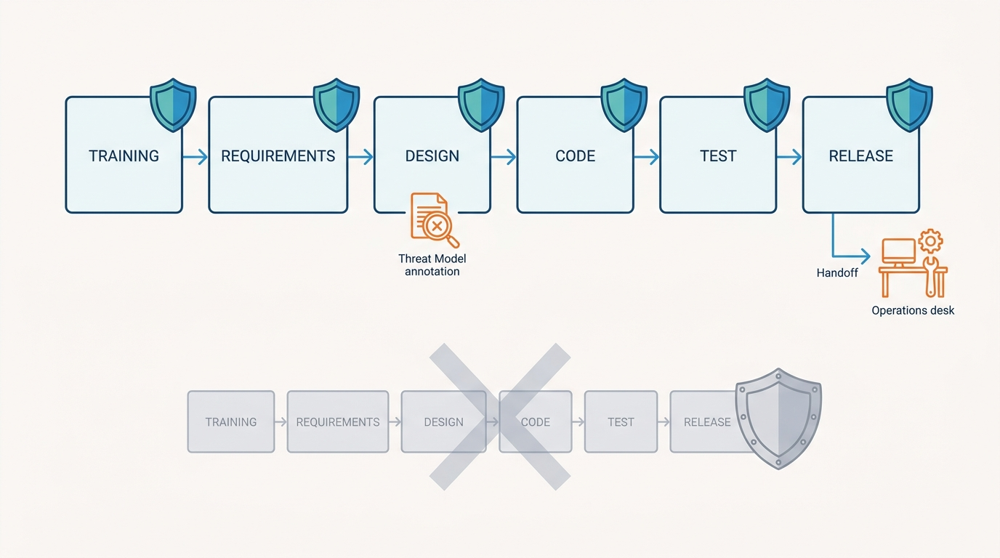
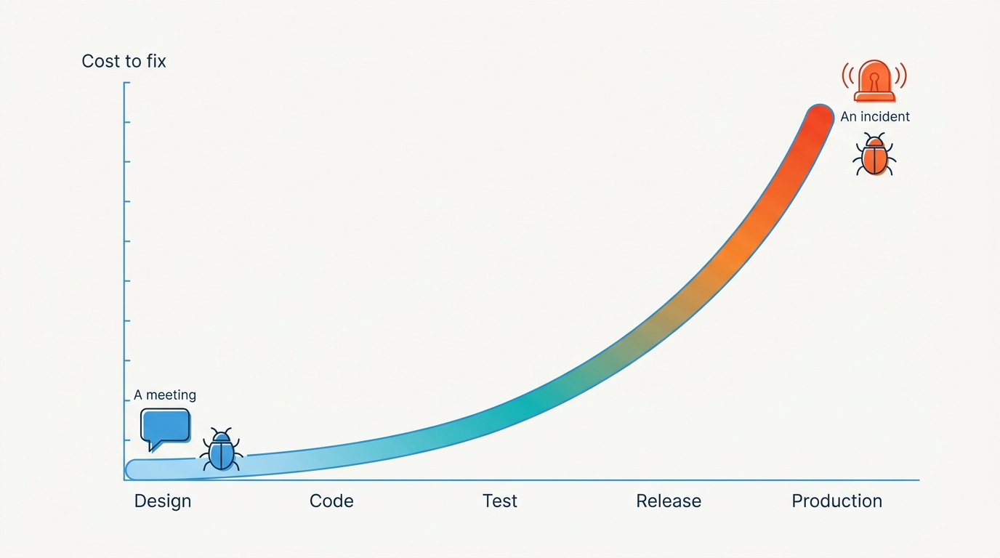
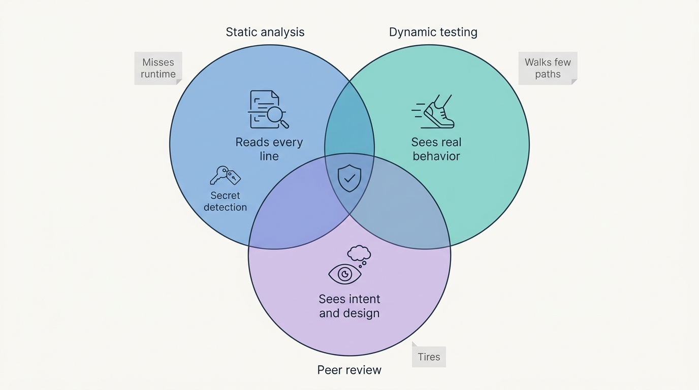

> **Status**: DRAFT
>
> **Principle**: My organization **builds security into software; it does not test security onto it at the end**. **Language choice is a security decision** — memory-safe languages preferred where practical, each language's risks understood and countered. **Secure coding standards are documented and applied consistently**, and **no user-supplied input is processed without validation** — type, length, range, and relational validity, with input defined broadly enough to include every channel data arrives on. **Security testing runs throughout development** — static analysis in the pipeline, dynamic testing against the running application, systematic peer review — each method covering the others' blind spots, because none suffices alone. **Security is incorporated into every stage of the lifecycle**, from training through release. The gate I hold every release to is the final review: **standards followed, input validated, testing complete, security in every stage, and known vulnerabilities remediated or formally addressed — before production.**

## Statement

When my organization writes software, this is the bar every codebase and every release is held to.

**Language choice is a security decision.**

- Security is a criterion when selecting a programming language: the language's **built-in protections against common vulnerabilities** are evaluated, **memory-safe languages are preferred where practical**, the risks of the selected language are understood, and its security scanning tools and libraries are used.
- The per-language discipline is explicit: **assembly** only when necessary, with its lack of safety checks acknowledged; **C/C++** with careful pointer and memory management against buffer overflows, use-after-free, and double-free; **Go** leaning on garbage collection, strong typing, bounds checking, and limited pointer arithmetic — with the `unsafe` package avoided unless absolutely necessary; **Rust** using ownership and memory-safety protections; **Python, Ruby, and Perl** validating input carefully even though automatic memory management removes many memory risks; **PHP** avoiding insecure features such as unsafe remote file inclusion and improperly validated user-controlled input.

**Secure coding standards are written down and applied everywhere.**

- **Documented secure coding standards** exist for the development team and are applied **consistently across the codebase** — not per developer, not per mood.
- **User-supplied input is defined broadly** — networks, files, command-line input, GUI interactions, peripheral devices — and **never processed without validation first**: expected data type, expected length, expected range, and validity in relation to other data in the same transaction, with invalid data rejected or discarded.
- **Approved libraries and reusable code** handle common security-sensitive tasks, and standards exist for the areas where improvisation is most expensive: **cryptography, database access, memory management, network communication, error handling, authentication, audit logging, and access management** — plus secure session management for web applications and defined security requirements for client–server communication.

**Security testing runs throughout development — three methods, one discipline.**

- Security testing happens **before code reaches production and throughout development**, with methods selected to fit the application and the environment.
- **Static analysis** scans source without executing it, integrated into CI/CD, running on new and modified code at every commit, with findings reviewed for false positives; it checks for buffer overflows and memory weaknesses, unsafe and dangerous functions, and — via secret-detection tools — accidentally committed **passwords, tokens, API keys, and private cryptographic keys**. Its limit is named: static analysis can miss design-level vulnerabilities, so it is supplemented, never solitary.
- **Dynamic testing** exercises the running application with varied inputs, hunting what static analysis cannot see — improper input handling, injection, reflection and output-handling issues — with its own coverage limits acknowledged.
- **Peer review** is systematic, not social: another developer reviews new and modified code specifically for security weaknesses, findings are verified before remediation is demanded, reviewers are chosen for knowledge of the language and the vulnerability class, and review is **combined with automated testing rather than relied on alone**.

**Security lives in every stage of the lifecycle.**

- **Training**: developers are trained in secure development, threat modeling, security testing, and relevant privacy obligations — able both to write secure code and to interpret security-testing results.
- **Requirements**: security requirements are identified **at the same time as functional requirements**, treated as mandatory rather than optional additions, documented clearly, and kept visible throughout the project.
- **Architecture and design**: security expectations are defined **before coding begins** — where encryption is required, where access controls are required, how sensitive information is stored and handled; **threat modeling happens during design**, high-level attack methods are identified, proposed designs are reviewed for weaknesses and modified to reduce attack surface, and controls land in the right places.
- **Code and build**: development follows the approved architecture, the predetermined language, the organizational coding guidelines, agreed security practices, and approved libraries and tools.
- **Test and review**: functionality *and* security are tested, multiple security-testing methods are used where appropriate, defects are identified, documented, and severity-assessed, vulnerable code goes back to its developers, and **fixes are retested before release**.
- **Release**: the formal release process runs — a final security review, confirmation that identified defects are addressed, operational documentation prepared, **incident-response and business-continuity procedures in place**, and information and responsibility transferred to the operational support teams.

**Figure 1:** *Security is incorporated into every stage of the lifecycle — not bolted on as a final check before shipping.*

**The final review is the gate.**

- Before production: secure coding standards documented and followed; user input validated before processing; appropriate static, dynamic, and manual testing completed; security incorporated into every SDLC stage; **known vulnerabilities remediated or formally addressed**; and the application ready for its final security review.

## How to Read This

This record sits in the **Assess and Improve** section of the journal as the upstream half of a pair: [[vulnerability-management]] finds and fixes weaknesses in the running estate; this record makes sure my organization ships fewer of them in the first place. It is grounded in the Secure Software Development chapter of the *Defensive Security Handbook* (Brotherston, Berlin, and Reyor). The full working checklist — language considerations, coding standards, the three testing methods, all six SDLC stages, and the final review — lives in the **Checklist** tab; the management summary is in the **TL;DR** tab and the conversation in the **Conversation** tab.

## Rationale

**A defect found at design costs a meeting; the same defect found in production costs an incident.** That gradient is the entire argument for building security in rather than bolting it on. A security review scheduled only at the end can find flaws but cannot afford to fix the deep ones — by then the architecture is poured concrete, and the review's real choices are "ship it anyway" or "miss the date." Moving security into requirements and design — where threat modeling reshapes the attack surface before it exists — is not idealism; it is buying the fix at its cheapest point on the curve.

**Figure 2:** *The same defect, priced at two points on the curve: a meeting at design, an incident in production — building security in buys the fix at its cheapest point.*

**Language choice is risk allocation, whether we admit it or not.** Choosing C++ is choosing to manage memory correctly forever; choosing a memory-safe language retires whole vulnerability classes at the compiler. Neither choice is wrong — sometimes the performance or the ecosystem genuinely demands the sharper tool — but the record requires the choice to be made *as* a security decision, with the risks named and the countermeasures budgeted. And safety features only help when they are used: a Go codebase threaded with `unsafe`, or a Python service that skips input validation because "memory is managed," has quietly opted back into the risks the language was chosen to avoid.

**Input validation is the one rule with no safe exception.** Nearly every classic application vulnerability — injection, overflow, path traversal, deserialization abuse — is at bottom the same event: data that arrived from outside was treated as more trustworthy than it was. That is why the record defines user-supplied input broadly — network, file, command line, GUI, peripheral — and why validation checks structure, not just presence: type, length, range, and whether the value is coherent with the rest of the transaction. "Never process input without validating it first" is the cheapest sentence in this journal relative to the damage it prevents.

**Standards beat heroics because security-sensitive code punishes improvisation.** Cryptography, session management, database access, authentication — these are domains where subtly wrong looks identical to right until the breach. Documented standards and approved libraries convert those domains from per-developer invention into settled organizational decisions, made once, reviewed properly, reused everywhere. Consistency is itself a control: a codebase that does the same thing the same way everywhere is a codebase where the anomaly stands out.

**The three testing methods are honest about each other's blindness — that is their strength.** Static analysis reads everything but understands nothing about runtime; dynamic testing sees real behavior but only along the paths it happens to walk; human reviewers see intent and design but tire, and cannot read every line. Any one of them alone produces confident false comfort. The record runs all three — static in the pipeline at every commit, dynamic against the running application, systematic peer review by people who know the language and the vulnerability class — precisely because each one's blind spot is another's specialty. The secret-detection clause earns its own mention: a committed credential is not a code-quality issue, it is a standing breach, and machines find it faster than reviewers do.

**Figure 3:** *Three methods, one discipline: each testing method's blind spot is another's specialty, so none is trusted alone.*

**Retesting and the final review keep the gate honest.** A fix that was never retested is a hypothesis, and a release gate that can be talked past is decoration. The record's release stage demands the unglamorous proofs: security defects severity-assessed and returned, fixes retested before release, the final review confirming that every earlier stage actually happened — and known vulnerabilities either remediated or *formally* addressed, meaning a documented, owned decision rather than a shrug. "Formally addressed" is the honest release valve: it keeps the gate strict without pretending every finding can be fixed by Friday.

**A release is not done when the code ships; it is done when someone can operate it under attack.** The chapter's release stage includes what most SDLC diagrams forget: operational documentation, incident-response and business-continuity procedures in place, and a real transfer of knowledge and responsibility to support teams. Software without an operational handoff is an incident where the only person who understands the system is the one who has moved on to the next project.

## What This Means in Practice

| What this record says | What it does **not** say |
| --- | --- |
| Language choice weighs security; memory-safe languages are preferred where practical. | Existing C/C++ codebases are rewritten on principle — the record demands managed risk, not migration. |
| No user-supplied input is processed without type, length, range, and relational validation. | Validation applies only to web forms — every input channel counts, including files and peripherals. |
| Security-sensitive domains use approved libraries and documented standards. | Teams may hand-roll cryptography or session management if they feel confident. |
| Static analysis runs in CI on every change, with findings reviewed for false positives. | Every static-analysis finding is a defect, or an unreviewed finding queue counts as testing. |
| Static, dynamic, and peer review all run — each covers the others' blind spots. | Any single method — including a strong review culture — is sufficient alone. |
| Security requirements are mandatory and set alongside functional requirements. | Security requirements are a backlog category that can be traded away under deadline. |
| Threat modeling happens during architecture and design. | Threat modeling is a post-hoc audit exercise on a finished design. |
| Release requires a final security review, ops documentation, IR/BC procedures, and handoff. | Shipping the code closes the project. |

Concretely: every project in my organization can show its documented coding standard, its threat model, its pipeline's static-analysis and secret-detection stages, its dynamic-test results, and its final review — and the first question at the release gate is not *"did we test it?"* but *"which stage would have caught the defect class we most fear, and did that stage actually run?"*

## Anti-Patterns

- **The pre-release security sprint.** Security compressed into a two-week audit before launch — deep flaws found precisely when they are most expensive to fix, then waived to protect the date.
- **The trusted input.** Validation applied to the login form but not the file upload, the API, or the message queue — the attacker simply uses the door without the guard.
- **Artisanal crypto.** A developer hand-rolling cryptography or session management because the approved library felt heavy — subtly wrong, invisible until the breach.
- **The suppressed finding.** A static-analysis queue so full of unreviewed noise that the team globally silences it — the scanner still runs, satisfying the pipeline, detecting nothing anyone reads.
- **The heroic reviewer.** Peer review as the only security control, resting on one senior engineer's vigilance — thorough on Monday, exhausted by Thursday, on holiday when it mattered.
- **The optional requirement.** Security requirements logged as nice-to-haves and traded away in the first scope negotiation — mandatory in name, decorative in practice.
- **The committed credential.** An API key pushed "temporarily" with no secret detection in the pipeline — history is forever, and the key is live in every clone.
- **The orphaned release.** Code shipped with no operational documentation, no incident-response procedure, no handoff — the first production incident finds a system nobody on call understands.

## Related Records

- [[vulnerability-management]] — the downstream program that finds what slips through; this record exists to shrink its backlog at the source.
- [[standards-and-procedures]] — the organizational machinery for standards; the secure coding standard is one of its most consequential instances.
- [[user-education]] — the organization-wide awareness layer; this record's developer training is its technical, role-specific counterpart.
- [[authentication]] — the identity baseline that application authentication and access-management standards must align with.
- [[databases]] — the hardened database layer; this record governs the code that talks to it, including the database-access standard that keeps injection out.
- [[incident-response]] — the procedures the release stage requires to be in place before software goes to production.

## Scope and Revisiting

This record is `draft`. It applies to all software my organization develops — products, internal tools, and infrastructure code alike. I revisit it if production incidents trace repeatedly to a vulnerability class the pipeline should have caught (the testing trio failing in practice), if static-analysis findings age unreviewed (the suppressed-finding anti-pattern arriving on schedule), if the language portfolio shifts materially toward or away from memory safety, or if the tooling landscape changes what "appropriate testing" means — including AI-assisted code generation and review, which changes the volume and character of code the gate must judge, not the gate itself.

## Authoritative References

- *Defensive Security Handbook*, 2nd edition (Lee Brotherston, Amanda Berlin, and William F. Reyor III; O'Reilly) — the Secure Software Development chapter, whose checklist (including its final review) this record distills.
