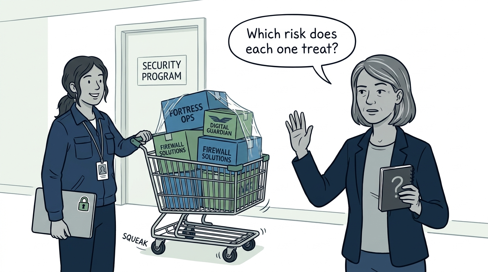
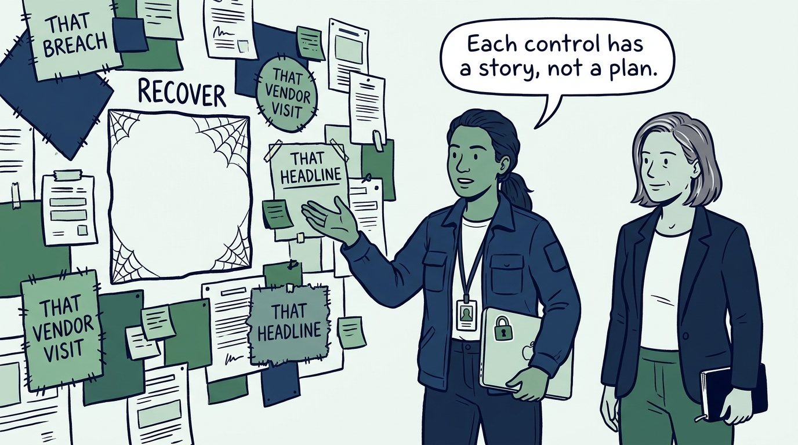
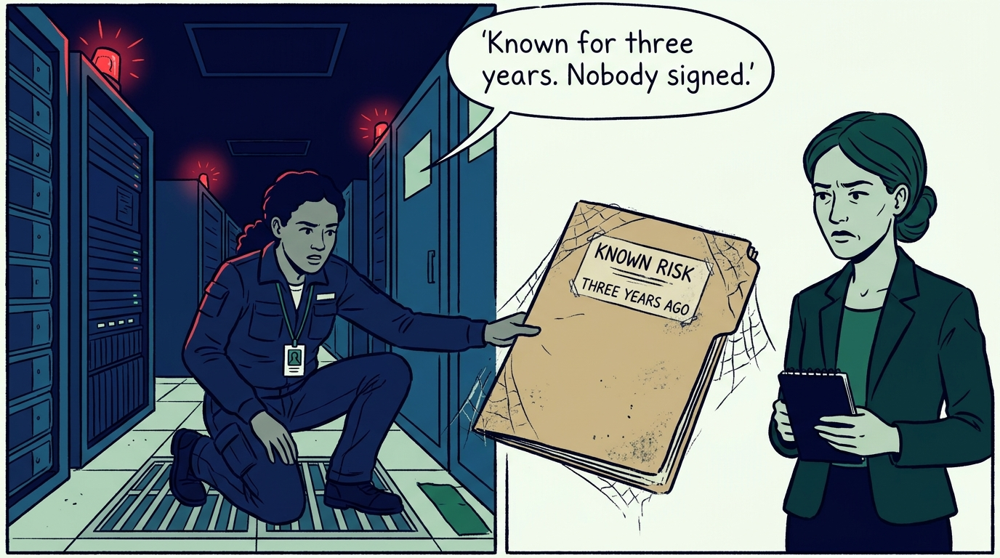
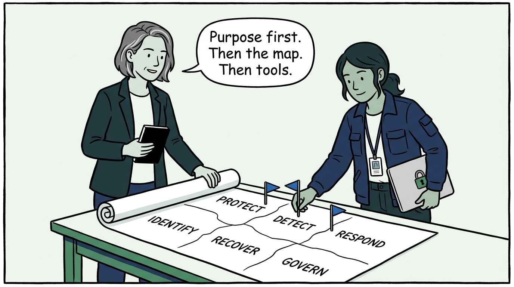
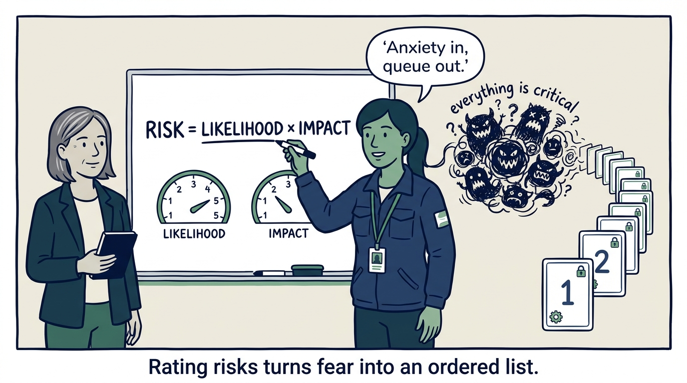
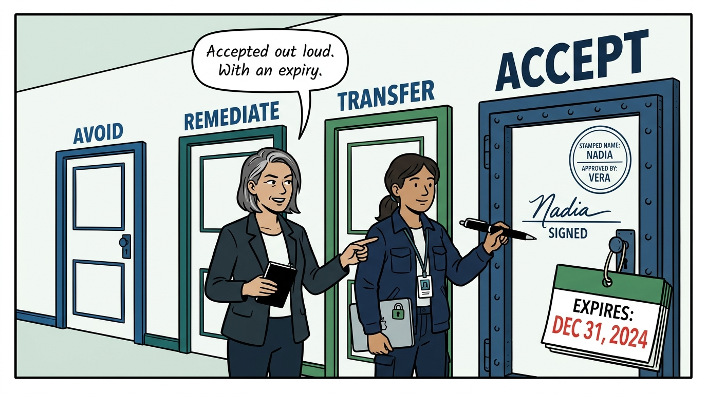
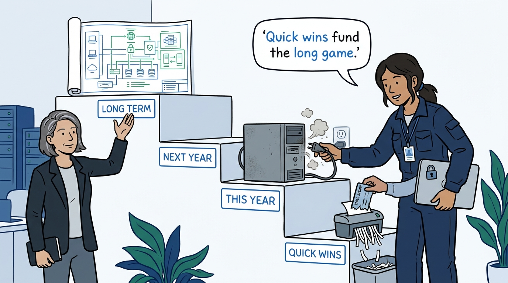
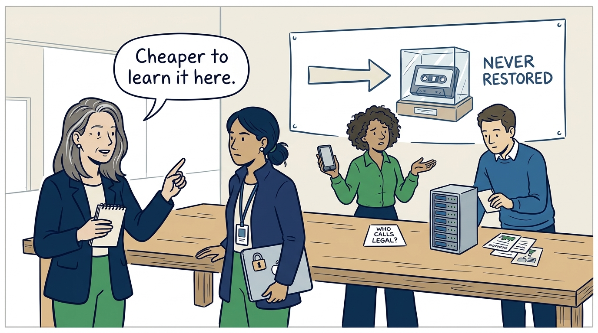
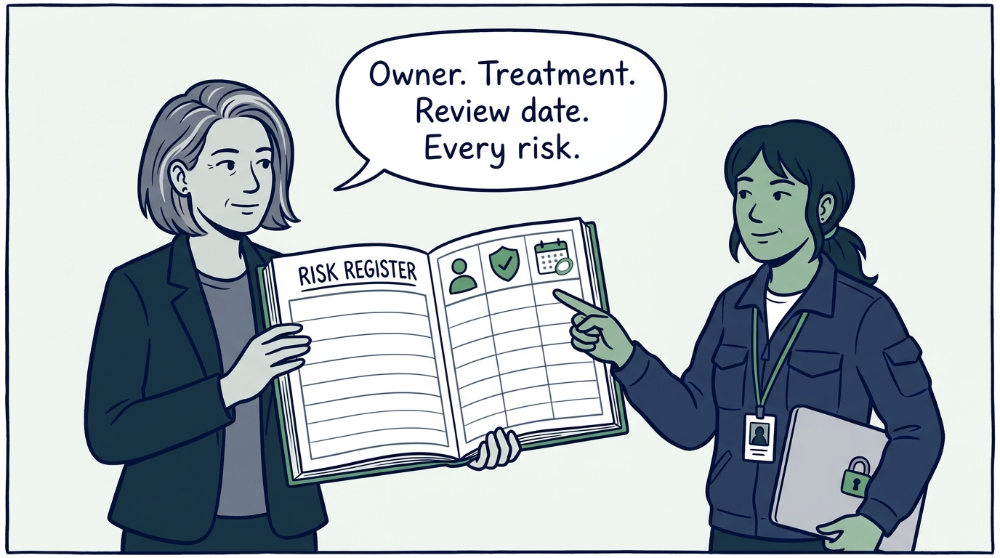

Why the security program is designed before anything is bought — in nine panels.

<!-- comic-style
{
  "cast": "VERA: a calm, seasoned engineering executive, short gray-streaked hair, dark blazer over a plain t-shirt, carries a small black notebook. NADIA: a hands-on defensive-security lead, shoulder-length dark hair tied back, navy utility jacket over a plain shirt, an access badge on a lanyard, laptop with a padlock sticker under one arm.",
  "style": "Clean two-tone explainer comic, thick ink outlines, flat colors with deep blue and green accents on a light background, generous white space, hand-lettered speech bubbles with SHORT readable text, no photorealism."
}
-->

**Panel 1:** *The hook: the shopping-cart program — tools bought first, risks named later, licenses looking for a strategy.*

**Panel 2:** *The problem: without a shared map the program becomes the sediment of past incidents — and the gaps stay invisible.*

**Panel 3:** *The wrong way: silent acceptance — the risk nobody remediated and nobody signed for, discovered mid-incident.*

**Panel 4:** *The principle: purpose and business objectives first, organized around a framework — every activity gets an address, every gap becomes visible.*

**Panel 5:** *Risk is calculated, not felt: likelihood 1–5, impact 1–5 — arithmetic honesty that converts anxiety into a queue.*

**Panel 6:** *Every risk gets an explicit treatment — and acceptance needs a justification, a named approver, compensating controls, and an expiry date.*

**Panel 7:** *Work is tiered: quick wins in days, then this year, next year, long term — early safety buys the right to do the multiyear work.*

**Panel 8:** *The program rehearses: tabletops, kill-chain mapping, and drills — a backup that has never been restored is a hope, not a control.*

**Panel 9:** *The closer: the test the program is held to — every major risk has an owner, a treatment decision, and a review date, and the program itself is reassessed.*
