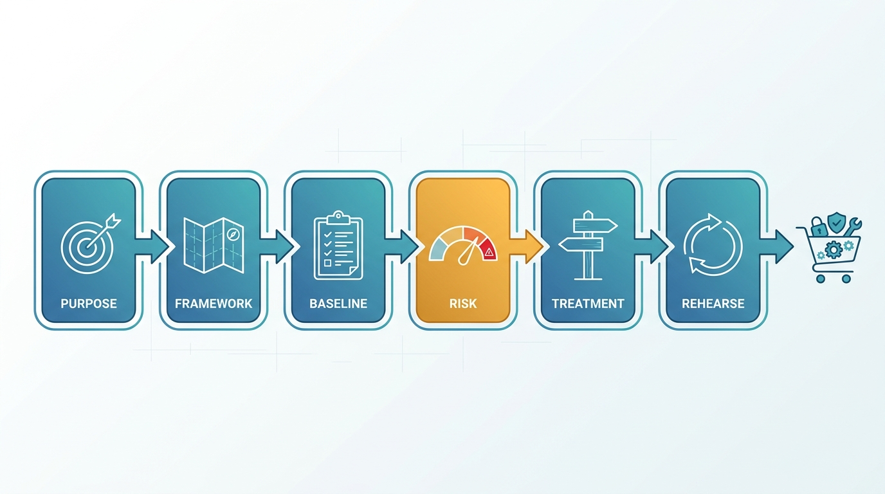
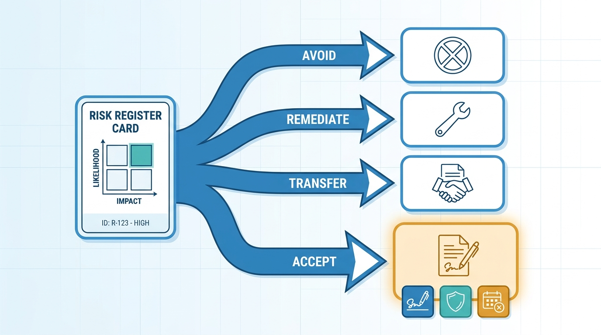

> **Status**: DRAFT
>
> **Principle**: My security program is designed before anything is bought. **Purpose and business objectives come first**, organized around a recognized framework — the NIST Cybersecurity Framework's Identify, Protect, Detect, Respond, Recover, and Govern functions — applied with judgment, never blindly. **Responsibility is structured**: executive leadership with real authority and funding, a risk function, a security team, and an independent audit. **The baseline is documented before it is improved**, risk is calculated — **likelihood times impact, recorded in a register** — and every risk receives an explicit treatment: avoided, remediated, transferred, or **accepted out loud, with a named approver and an expiry date**. Work is prioritized into tiered milestones from quick wins to multiyear goals, and the program **rehearses** — use cases, kill-chain mapping, tabletop exercises, technical drills. The test I hold the program to: **every major risk has an owner, a treatment decision, and a review date in a maintained risk register — and the program itself is periodically reassessed**.

## Statement

When my organization creates — or audits — its security program, this is the shape I hold it to.

**Figure 1:** *The program is designed before anything is bought: purpose, framework, baseline, calculated risk, explicit treatment, and rehearsal come first — tools come last.*

**The program starts with purpose, not products.**

- **Business objectives first.** The purpose and goals of the program are defined, and the business objectives it must support are identified, before any control is chosen.
- **A framework as the map.** Security activities are organized around a recognized framework — NIST CSF 2.0 and its Identify, Protect, Detect, Respond, Recover, and Govern functions — with compliance, legal, regulatory, and industry requirements identified up front.
- **Fit over fashion.** Standards that do not fit the organization are not blindly applied. The initial scope of the program is documented.

**Responsibility is structured, not implied.**

- **Executive leadership with teeth.** A CIO or CISO carries security leadership, with sufficient authority to make organization-wide decisions, set long-term goals, allocate funding, and approve major milestones.
- **A risk function.** Someone owns risk assessment, documents business and cybersecurity risks, selects a risk framework where appropriate, and coordinates with enterprise risk management.
- **A security team for daily operations** — asset management, threat and vulnerability assessment, monitoring, training — with specialist roles defined where needed.
- **An independent audit.** An auditing function reviews processes and controls for gaps, verifies that milestones actually completed, documents findings, and tracks remediation.
- **Sized honestly.** Smaller organizations combine roles; the plan to separate them as the organization grows exists from day one.

**The baseline is documented before it is improved.**

- The current posture is inventoried across the whole surface: policies and procedures, endpoints, licenses and certificates, the internet footprint, network infrastructure, logging and monitoring, ingress and egress points, vendors and their access, and critical applications with named owners.

**Risk is calculated, not felt.**

- Each assessment has a defined scope; critical assets, sensitive data, and business-critical services are identified; industry-specific and common threats — malware, ransomware, phishing, credential attacks, remote exploitation, insider threats, DDoS — are named, informed by threat intelligence, the OWASP Top 10, and CIS Controls.
- Internal and external scans, firewall and permission reviews, and asset records feed the assessment. Each risk is documented as threat, vulnerability, affected asset, and consequence — then rated: **likelihood 1–5, impact 1–5, Risk = Likelihood × Impact**, classified and recorded in the risk register.

**Every risk gets an explicit treatment.**

- **Avoid** — eliminate the risky activity; stop collecting unnecessary sensitive data. **Remediate** — patch, close, harden, correct. **Transfer** — outsource or insure, contractually documented. **Accept** — only when the others are impractical, with documented justification, approval from the right owner or executive, compensating controls, and an expiry or review date. Accepted risk is reassessed at least annually.

**Figure 2:** *Every risk gets an explicit treatment — and acceptance is the most heavily documented path, never the lightest: a named approver, compensating controls, and an expiry date.*

**Risk is monitored as standing work.**

- The register is formal and maintained: every risk has an owner, existing controls, planned actions, due dates, and residual risk. High risks are reviewed regularly, ratings updated when conditions change, and risk monitoring integrates with vulnerability management.

**Governance closes the loop.**

- Documented security and risk-management policies define how risks are identified, assessed, treated, monitored, and reported. Regulatory obligations are tracked. Reporting channels reach management and the board. Training and awareness run continuously, and lessons from incidents, audits, and assessments feed corrective actions whose effectiveness is measured.

**Work is prioritized and tiered.**

- Risks are ranked; active attacks come before routine program work; business context outranks vendor recommendations; low-cost/high-impact improvements and controls that reduce multiple risks go first. Milestones live in four tiers — quick wins in hours or days, this year, next year, long term — and every major initiative's priority is documented.

**The program rehearses before it is tested for real.**

- Roughly three high-priority attack scenarios become security use cases — assets, attacker actions, defensive controls, detection opportunities — and mature into playbooks. Attacks are mapped to the Cyber Kill Chain stage by stage. Tabletop exercises run with real scenarios, cross-department participants, and tracked corrective actions; technical drills test backup restoration, disaster recovery, failover, and incident-response procedures.
- **The team grows deliberately** — skill gaps identified, labs and CTFs used, conference participation and mentoring encouraged, communication skills valued alongside technical ones.

## How to Read This

This record opens **The Security Program** section of the journal — the program before the tools. Everything that follows, from [[asset-management]] to [[the-extra-mile]], hangs on the frame this record establishes: named responsibility, calculated risk, explicit treatment, and a rehearsal habit. It is grounded in the "Creating a Security Program" chapter of the *Defensive Security Handbook* — the book's opening argument that defense starts with organization, not acquisition. The full working checklist — every step through the program completion review — lives in the **Checklist** tab; the management summary is in the **TL;DR** tab and the conversation in the **Conversation** tab.

## Rationale

**A framework prevents a program of accidents.** Without a shared map, a security program becomes the sediment of past incidents — a control here because of that breach, a tool there because of that vendor visit. Organizing around NIST CSF's six functions gives every activity an address and makes gaps visible: if nothing in the program answers to Recover, that is now a fact, not a feeling. The same chapter that recommends the framework warns against applying standards blindly — the framework is a map of the territory, and my organization's territory is what gets defended.

**Authority is a control.** A security leader who cannot make organization-wide decisions, allocate funding, or approve milestones is a suggestion box with a title. The chapter puts the executive team first for a reason: every downstream commitment in this journal — patching windows, network changes, mandatory training — eventually collides with a business priority, and the collision is resolved by whoever has authority. Structuring responsibility across executive, risk, security, and audit functions also builds the tension the program needs: the audit function exists precisely to verify that what the security team says happened, happened.

**You cannot defend what you have not written down.** The baseline sweep — endpoints, certificates, internet footprint, vendors, ingress and egress — is unglamorous, and it is the step most programs skip on the way to buying something. But every serious decision that follows depends on it: risk assessment needs to know which assets exist, prioritization needs to know which systems are legacy, and incident response needs to know what "normal" looks like. The baseline is a snapshot; [[asset-management]] turns it into a standing capability.

**Likelihood times impact converts anxiety into a queue.** Unquantified risk produces two failure modes: everything is critical, or whatever was in the news is critical. A 1–5 rating on likelihood and impact is not science — it is arithmetic honesty. It forces every risk through the same two questions, makes disagreements specific ("you rated this a 4; here's why it's a 2"), and produces an ordering that budget and staffing conversations can actually use. The register is where the arithmetic becomes accountable: owner, controls, actions, due dates, residual risk.

**Accepted risk is a decision with a name and an expiry date.** Every organization accepts risk; the only question is whether it does so out loud. Silent acceptance — the risk nobody remediated and nobody signed for — is how organizations discover, mid-incident, that a known problem had been known for three years. The record's bar is deliberate: acceptance requires justification, an approver with the standing to accept it, compensating controls, and a date on which the acceptance expires and must be re-argued. Risk accepted forever was never really assessed.

**Quick wins buy the right to do long-term work.** The four-tier milestone structure is political engineering as much as planning. Removing unused endpoints, disabling stale accounts, and patching critical vulnerabilities in the first weeks demonstrates that the program produces safety, not paperwork — and that credibility is what funds the network redesigns and multiyear goals in tiers three and four. Prioritizing by business context rather than vendor recommendation keeps the queue honest: the vendor does not know my organization; my risk register does.

**Figure 3:** *Milestones live in four tiers — and the quick wins of the first weeks buy the credibility that funds the multiyear work.*

**Rehearsal is where the program meets reality.** Use cases, kill-chain mapping, tabletop exercises, and technical drills are the difference between a program that exists on paper and one that works under pressure. A tabletop is cheap; discovering during a real incident that nobody knows who calls legal is not. The chapter's discipline — record decisions, record unclear responsibilities, record missing tools, assign owners and deadlines to every finding, update the plan before the next exercise — turns rehearsal into a compounding asset. The same holds for drills: a backup that has never been restored is a hope, not a control.

## What This Means in Practice

| What this record says | What it does **not** say |
| --- | --- |
| The program is organized around a recognized framework, applied with judgment. | Every control in the framework is implemented regardless of fit — blind application is explicitly rejected. |
| Security leadership has organization-wide authority, funding, and milestone approval. | Security overrides the business — authority exists so trade-offs are decided, not dodged. |
| Every risk is rated (likelihood × impact) and recorded in a maintained register. | The ratings are precise measurements — they are honest, comparable judgments that make prioritization arguable. |
| Risk may be accepted — with justification, a named approver, compensating controls, and an expiry. | Acceptance is a way to make a risk disappear — it is the most heavily documented treatment, not the lightest. |
| Active attacks and urgent threats come before routine program work. | The loudest stakeholder or the latest headline sets the priority — the register does. |
| Tabletop exercises and technical drills run regularly, with findings tracked to completion. | Rehearsal is a compliance formality — an exercise that produces no corrective actions was not challenging enough. |
| Smaller organizations combine roles. | One person owning everything is the end state — the plan to separate roles exists from day one. |

Concretely: no security purchase in my organization precedes a documented risk it treats, and the first question in any program review is *"show me the risk register — who owns the top five, what is the treatment, and when is each next reviewed?"*

## Anti-Patterns

- **The shopping-cart program.** Tools bought first, risks named later — the program becomes an inventory of licenses looking for a strategy.
- **The borrowed framework, applied blind.** Every control from the standard implemented wholesale, fit or not; effort flows to checkbox completeness instead of actual exposure.
- **The unfunded mandate.** A CISO with a title, no budget, and no authority — accountable for outcomes they cannot influence.
- **The risk register graveyard.** A register written once for the auditors: no owners, no due dates, no reviews, and no relation to what anyone works on.
- **The silent acceptance.** Risks nobody remediated and nobody signed for — accepted by default, discovered mid-incident.
- **The audit as ambush.** No independent review until the external auditor arrives — or findings documented and never remediated, the same list every year.
- **The paper exercise.** Response plans that have never been tabletopped, backups that have never been restored, failover that has never failed over.
- **The permanent hero.** One person holding every role indefinitely — the "combine roles" concession without the "plan to separate" commitment.

## Related Records

- [[asset-management]] — the baseline documented here becomes a standing program with a single source of truth there.
- [[policies]] — governance here requires documented policies; the document discipline lives there.
- [[compliance]] — regulatory, legal, and contractual requirements identified here are operated in full there.
- [[user-education]] — the training and awareness commitments here become a program there.
- [[incident-response]] — the use cases, playbooks, and tabletop discipline established here are exercised in anger there.
- [[vulnerability-management]] — the scans that feed the risk assessment here become a standing loop there, integrated with the register.
- [[logging-and-monitoring]] — the monitoring gaps identified in the baseline here are closed there.

## Scope and Revisiting

This record is `draft`. It applies to the creation of any security program in my organization and as the audit bar for the one we operate. I revisit it if the organization's regulatory footprint changes materially (new obligations reshape the governance layer), if the risk register stops driving actual prioritization (the register failing as the working document is a program defect, not a documentation gap), or if two consecutive tabletop exercises produce no findings — which means the exercises have stopped being honest, not that the program is finished.

## Authoritative References

- *Defensive Security Handbook*, 2nd edition (Lee Brotherston, Amanda Berlin, and William F. Reyor III) — the "Creating a Security Program" chapter, whose checklist (including the program completion review) this record distills.
- NIST Cybersecurity Framework (CSF) 2.0 — the framework the chapter recommends, with its Identify, Protect, Detect, Respond, Recover, and Govern functions.
- NIST Risk Management Framework (RMF) and OCTAVE — the risk frameworks the chapter names as options.
- OWASP Top 10 and CIS Controls — the threat and control references the chapter points the assessment at.
- The Cyber Kill Chain — the attack-stage model the chapter maps defenses against.
