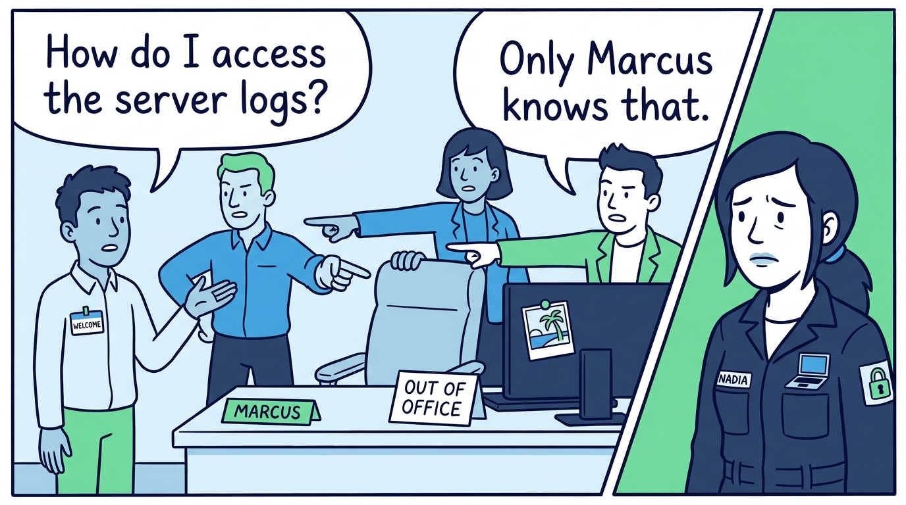
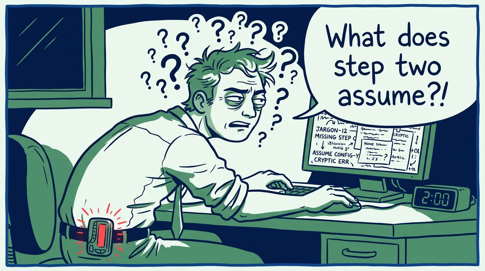
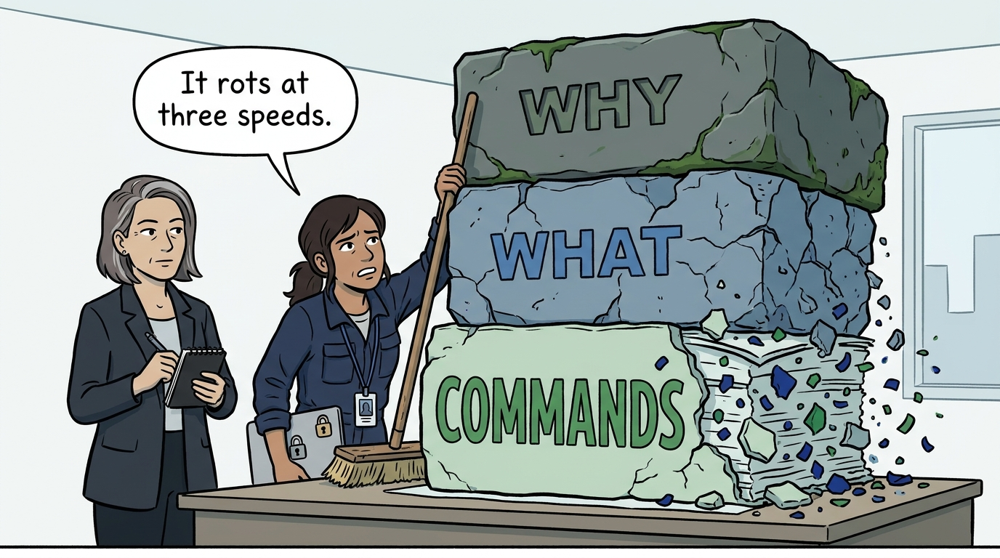
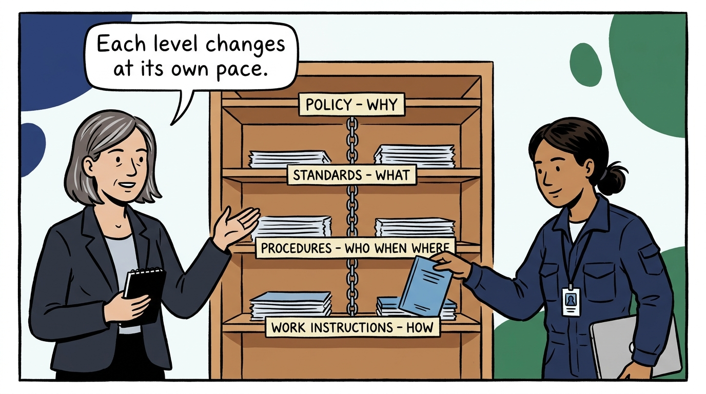
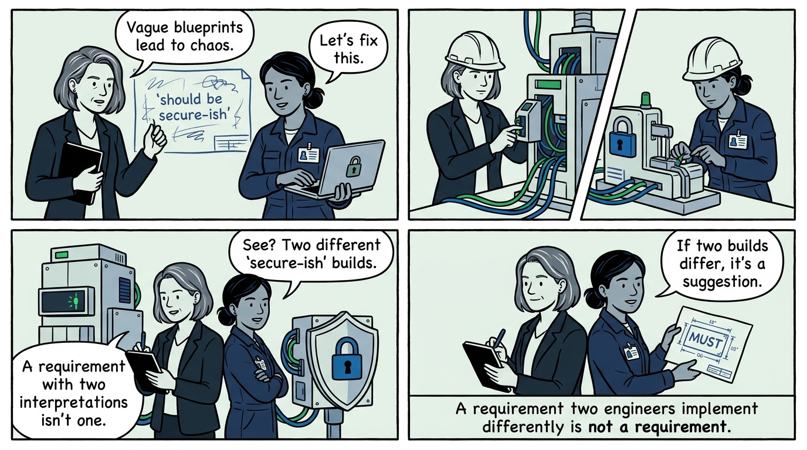
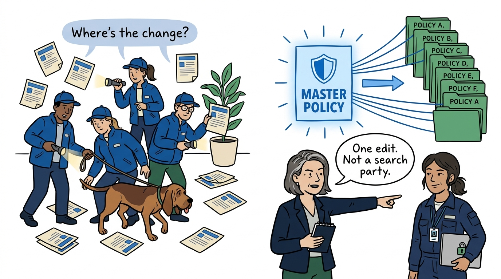
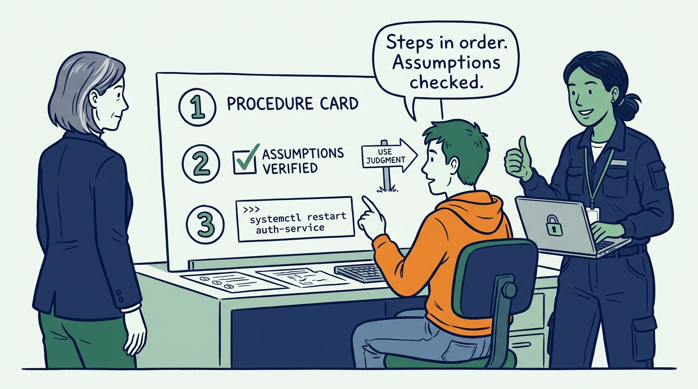
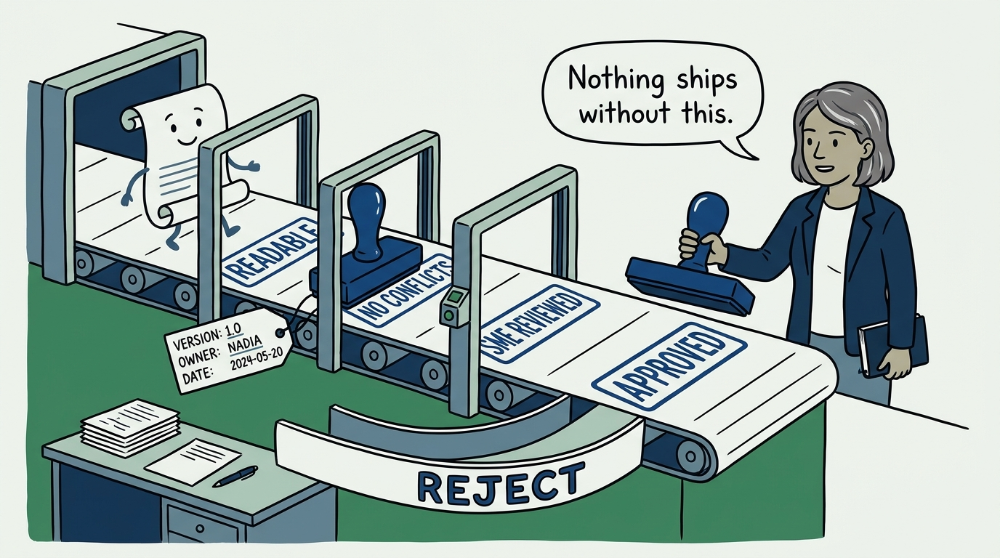
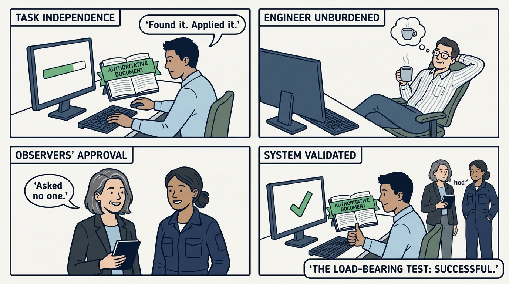

Why security documentation is a hierarchy with a division of labor — and how it replaces tribal knowledge — in nine panels.

<!-- comic-style
{
  "cast": "VERA: a calm, seasoned engineering executive, short gray-streaked hair, dark blazer over a plain t-shirt, carries a small black notebook. NADIA: a hands-on defensive-security lead, shoulder-length dark hair tied back, navy utility jacket over a plain shirt, an access badge on a lanyard, laptop with a padlock sticker under one arm.",
  "style": "Clean two-tone explainer comic, thick ink outlines, flat colors with deep blue and green accents on a light background, generous white space, hand-lettered speech bubbles with SHORT readable text, no photorealism."
}
-->

**Panel 1:** *The hook: every answer that lives only in one engineer's head is an outage waiting for their holiday — and a crisis waiting for their resignation.*

**Panel 2:** *The problem: the author already knows the assumptions and the recovery path — the reader at 2 a.m. does not, and that is who the document is for.*

**Panel 3:** *The wrong way: the everything policy — whys, whats, and command lines in one document, impossible to change safely and obsolete at three different speeds simultaneously.*

**Panel 4:** *The principle: a hierarchy with a division of labor — policy explains why, standards define what, procedures say who, when, and where, work instructions explain how.*

**Panel 5:** *Standards speak in must, shall, and will — a requirement that two competent engineers can implement two different ways is a suggestion wearing a checkbox.*

**Panel 6:** *Requirements are written once and referenced everywhere — the copy you miss becomes the contradiction the auditor finds and the engineer follows.*

**Panel 7:** *Procedures are executable by their reader: ordered steps, active voice, verified assumptions, real commands — and explicit judgment where prescription would be impractical.*

**Panel 8:** *Every document carries its contract — version, owner, approver, purpose, scope — and nothing is published without the quality review, an approval on record, and a review date.*

**Panel 9:** *The closer: the test the whole layer is held to — a new employee can find the authoritative document and apply it correctly without asking anyone.*
