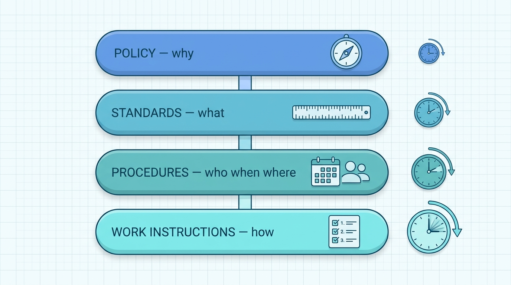
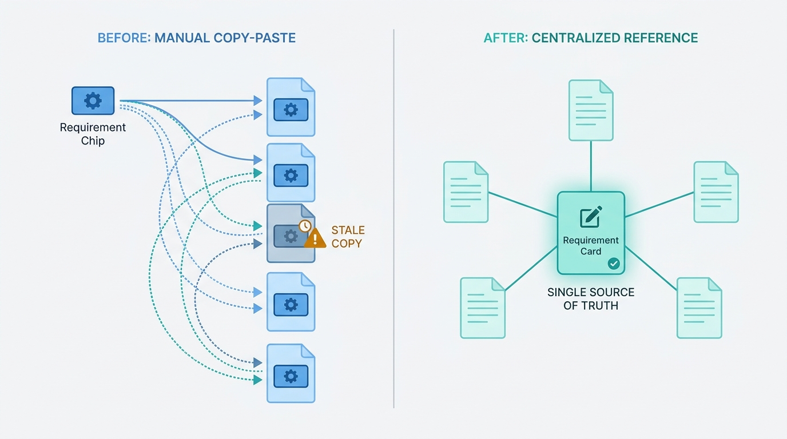
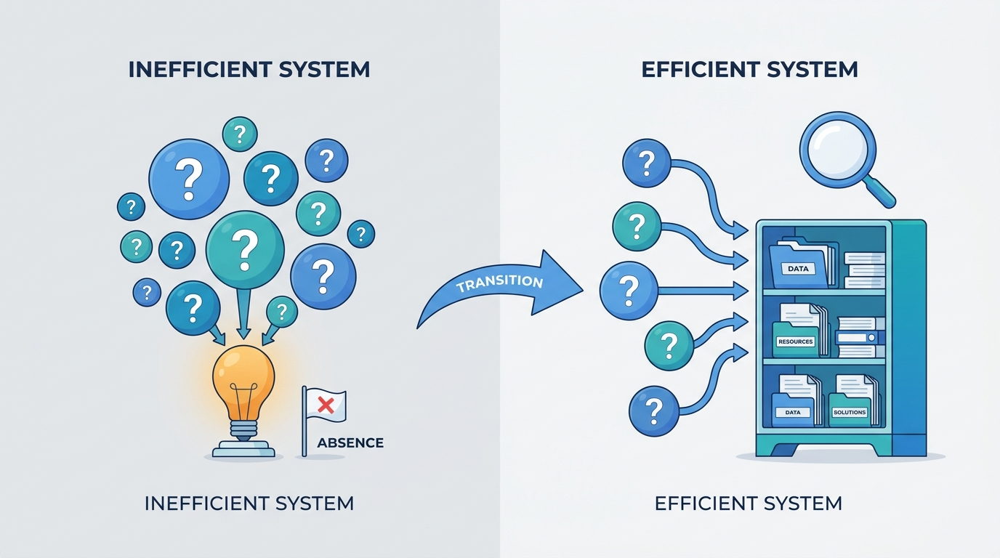

> **Status**: DRAFT
>
> **Principle**: My security documentation is a hierarchy with a division of labor, not a pile of documents. **Policy explains why, standards define what, procedures identify who, when, and where, and work instructions explain how** — each document sits at its correct level and links to its neighbors. **Standards speak in mandatory language** — must, shall, will — and are specific enough to be implemented consistently; ambiguous words like *should* and *try* are banned where a requirement is mandatory. **Requirements are written once and referenced everywhere**, so a change is made centrally, not hunted across ten documents. **Procedures are written for their readers** — ordered steps, active voice, verified assumptions, real commands — and reviewed by people who understand both the technology and the audience. **Every document carries its contract**: version, owner, approver, purpose, scope, requirements, and related documents, stored in one approved repository where the authoritative version is unambiguous. The test I hold the whole layer to: **a new employee can find the authoritative document and apply it correctly without asking anyone**.

## Statement

When my organization writes the documentation that implements its security policies, this is the bar it is held to.

**The hierarchy is explicit, and every document knows its level.**

- **Policy explains why** the organization requires the control or rule; **standards define what** requirements must be followed; **procedures identify who performs activities, when, and where**; **work instructions, guidelines, and SOPs explain how** specific tasks are performed.
- Each document is placed at the correct level of the hierarchy, and related policies, standards, procedures, and work instructions are clearly linked.

**Figure 1:** *The hierarchy is a division of labor: policy explains why, standards define what, procedures identify who, when, and where, and work instructions explain how — each layer changing at its own pace.*

**Standards are mandatory, specific, and non-duplicative.**

- Standards provide technology-specific requirements without unnecessary procedural detail, and they support and expand on the policies above them.
- **Requirements use mandatory language** — must, shall, will. Ambiguous wording — should, try, mostly — is avoided wherever a requirement is mandatory, and every requirement is specific enough to be implemented consistently.
- **Common requirements are documented once** and referenced by the policies that need them; standards are maintained separately where that improves usability, so a change is made centrally without touching multiple policies. Standards are reviewed regularly for technical accuracy.

**Procedures are executable by their intended audience.**

- Procedures explain how standards are implemented on specific technologies, with enough detail for the intended audience to complete the task consistently — including platform-specific variants where technologies differ.
- Steps are listed in execution order, in the active voice, with clear wording; **assumptions and prerequisites are stated explicitly and verified as valid**; commands, settings, and examples are included where needed; and procedures allow appropriate judgment where overly prescriptive instructions would be impractical.
- Procedures are reviewed by people who understand both the technology and the intended audience.

**Documentation replaces tribal knowledge.**

- Standards and procedures make policy implementation consistent across teams and systems, reduce reliance on institutional or legacy knowledge, and let employees find what they need without relying on specific individuals.
- Documentation is understandable to new employees and to people outside the authoring team, and repetition between policies, standards, and procedures is minimized.

**Documentation stands up to regulators and management.**

- Applicable laws, regulations, contractual requirements, and compliance frameworks are identified, and the policies, standards, and procedures that support those obligations exist and can be produced readily during an audit.
- Standards and procedures carry management endorsement; required approvals are documented, demonstrating that responsible management has accepted the requirements.

**Every document carries its contract.**

- **Version information**: version number, effective date, revision history — current and obsolete versions clearly distinguishable.
- **Owner and approver**: identified, with approval formally recorded and responsibility for future review clear.
- **Purpose, scope, and requirements**: a concise overview, an unambiguous scope with explicit exclusions, and clearly identified, objectively applicable requirements that reflect the current environment.
- **Related documents**: applicable policies, standards, procedures, and regulatory references, kept current when neighbors change.
- **Naming and storage**: consistent naming conventions and terminology, one approved and accessible repository, an unambiguous authoritative version, superseded documents archived, and access permissions matched to the intended audience.

**Nothing is published without a quality review.**

- Before release, every document is checked for readability at the readers' skill level, for conflicts with higher-level policy, for correct implementation down the hierarchy, and for validated technical content — then reviewed by subject-matter experts, formally approved, given a review date, and published and communicated to the people it applies to.

## How to Read This

This record sits in **The Security Program** section of the journal — the documentation layer between [[policies]], which state why, and the operational records that put controls on real systems. It is grounded in the Standards and Procedures chapter of the *Defensive Security Handbook* (Brotherston, Berlin, and Reyor), which treats standards and procedures as the machinery that makes policy real. The full working checklist — hierarchy, standards, procedures, document contents, and the final quality review — lives in the **Checklist** tab; the management summary is in the **TL;DR** tab and the conversation in the **Conversation** tab.

## Rationale

**The hierarchy is a division of labor, not bureaucracy.** Why, what, who-when-where, and how change at different speeds. The reasons my organization encrypts customer data are stable for years; the approved cipher suites change with the threat landscape; the commands to configure them change with every platform version. Separating the levels means each document changes at its own pace without dragging the others through re-approval — and it means a reader looking for a command is never forced to wade through a philosophy, or the reverse.

**Mandatory language is a control; ambiguity is an exemption.** The moment a standard says *should*, every reader is licensed to decide it does not apply to them today. *Must*, *shall*, and *will* leave nothing to negotiate, which is exactly what a requirement is for. The same logic drives the specificity rule: a requirement that two competent engineers can implement two different ways is not a requirement, it is a suggestion wearing a checkbox.

**Write once, reference everywhere — or every change becomes a search party.** When a password requirement lives in ten policies, updating it means finding all ten, and the one you miss becomes the contradiction an auditor finds and an engineer follows. Documenting common requirements once, in a standard that the policies reference, turns a fleet-wide change into a single reviewed edit. That is also why standards are maintained separately when doing so improves maintainability: the structure exists to make change cheap, not to make binders thick.

**Figure 2:** *Write once, reference everywhere: a requirement duplicated across ten documents becomes the contradiction an auditor finds — one referenced standard makes a fleet-wide change a single reviewed edit.*

**A procedure is written for its reader, not its author.** The author already knows the assumptions, the prerequisite state, and the recovery path — the reader at 2 a.m. does not. Ordered steps, active voice, explicit and *verified* assumptions, and real commands are what make a procedure executable by the person who actually holds the pager. And because no procedure can anticipate everything, the record deliberately allows judgment where prescription would be impractical: a procedure that tries to script the unscriptable gets ignored in full, including the parts that mattered.

**Documentation is the exit from key-person risk.** Every answer that lives only in a senior engineer's head is an outage waiting for their holiday and a crisis waiting for their resignation. The chapter's consistency section is really a resilience requirement: when employees can locate the information they need without relying on specific individuals, the organization has converted personal knowledge into institutional capability. That conversion is the difference between a security program and a set of talented individuals.

**Figure 3:** *Documentation is the exit from key-person risk: answers move out of individual heads into a repository every reader can reach without asking anyone.*

**Audit-readiness is a by-product of hygiene, not a project.** When every document carries its version, owner, approver, scope, and recorded management endorsement, an audit is a retrieval exercise. When they do not, an audit is archaeology performed under deadline — and the reconstruction costs more than the discipline ever would. The same contract that satisfies an auditor serves the everyday reader: the owner field is who you send questions to; the effective date is how you know the document is alive.

**An unowned document is already obsolete.** Documents rot silently — the platform version moves, the team renames, the requirement quietly stops reflecting the environment. The only known countermeasure is a named owner, a review date, and the final quality review that refuses to publish without them. A repository where the authoritative version is unambiguous and superseded versions are archived closes the last gap: nothing undermines documentation faster than two versions that both look current.

## What This Means in Practice

| What this record says | What it does **not** say |
| --- | --- |
| Policy says why, standards say what, procedures say who/when/where, work instructions say how. | Every control needs all four documents — small scopes collapse levels deliberately, not accidentally. |
| Standards use must/shall/will; ambiguous wording is banned where a requirement is mandatory. | Everything is mandatory — genuine guidance may say *should*, as long as it is labeled guidance. |
| Common requirements are documented once and referenced by the policies that need them. | Readers are sent on link chases — the reference points to one authoritative home, not a maze. |
| Procedures carry ordered steps, verified assumptions, and real commands. | Procedures script away all judgment — where prescription is impractical, judgment is explicit. |
| Every document has a version, owner, approver, purpose, scope, and related-document links. | The metadata is ceremony — the owner answers questions and the review date keeps the document alive. |
| Documents live in one approved repository with an unambiguous authoritative version. | Teams cannot keep working copies — drafts exist, but only one version is authoritative. |
| Nothing is published without SME review, recorded approval, and a review date. | Publication is slow forever — the quality gate is a checklist, not a committee season. |

Concretely: every new standard or procedure in my organization goes through the final quality review before publication, and the first review question is *"could a new employee find this document and apply it correctly without asking anyone?"* A document that fails that question is not finished, no matter how technically correct it is.

## Anti-Patterns

- **The everything policy.** One giant document carrying the whys, the whats, and the command lines — impossible to approve quickly, impossible to change safely, obsolete at three different speeds simultaneously.
- **The aspirational should.** A "requirement" written as *should* or *try to* — every reader is licensed to defer it, and the control exists only on paper.
- **The copy-paste standard.** The same requirement duplicated across ten documents; the update misses one, and the contradiction ships to the auditor and the engineer alike.
- **The author-only procedure.** Steps that make sense only to the person who wrote them — unstated assumptions, missing prerequisites, jargon the on-call reader has never seen.
- **Tribal knowledge with a wiki skin.** The documents exist, but the real answers still live in three people's heads and a chat archive; the wiki is a monument, not a tool.
- **The orphaned document.** No owner, no review date, no one responsible for accuracy — quietly wrong for two years and still being followed.
- **Two authoritative versions.** The repository and the shared drive disagree, and half the organization is diligently complying with the obsolete one.
- **The audit scramble.** Approvals reconstructed, owners guessed, and versions backdated the week before the audit — paying archaeology prices for hygiene work.

## Related Records

- [[policies]] — the why-layer this record implements; standards and procedures expand policy into actionable requirements.
- [[security-program]] — the program that commissions this documentation layer and gives it management endorsement.
- [[compliance]] — the external obligations the documentation must be able to face; that record decides which regulations and frameworks apply.
- [[user-education]] — teaching people to follow the documents; this record makes the documents followable.
- [[incident-response]] — the discipline that depends hardest on procedures being executable by their reader under pressure.
- [[asset-management]] — documentation of what exists; this record governs documentation of what must be done.

## Scope and Revisiting

This record is `draft`. It applies to every security policy, standard, procedure, and work instruction my organization writes, and as the audit bar for the documentation that already exists. I revisit it if audits or incidents reveal documents being bypassed because they cannot be found or followed (the findability test failing in practice), if the documentation hierarchy grows levels or ceremony that slow legitimate change (the structure must make change cheap, not expensive), or if a regulatory obligation demands document contents beyond the contract defined here.

## Authoritative References

- *Defensive Security Handbook*, 2nd edition (Lee Brotherston, Amanda Berlin, William F. Reyor III; O'Reilly) — the Standards and Procedures chapter, whose checklist (including the final quality review) this record distills.
