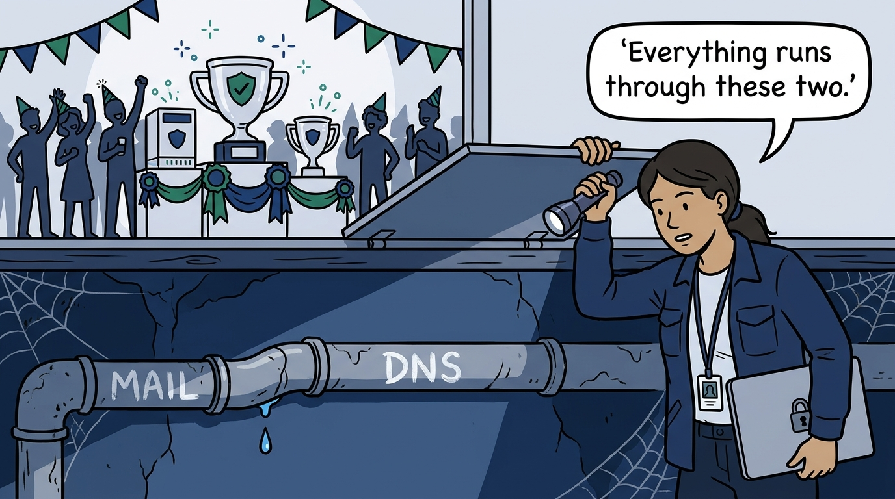
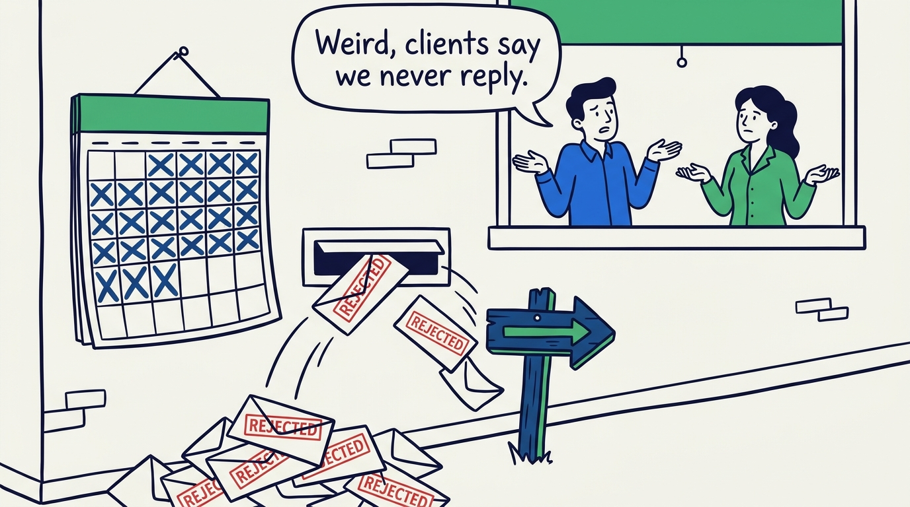
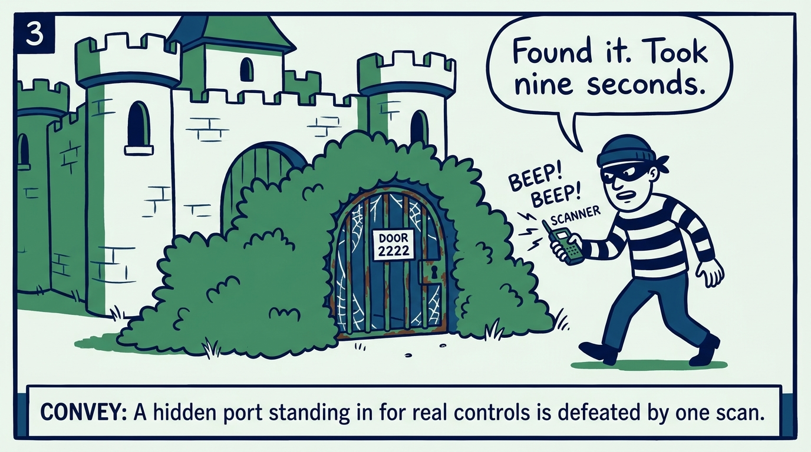
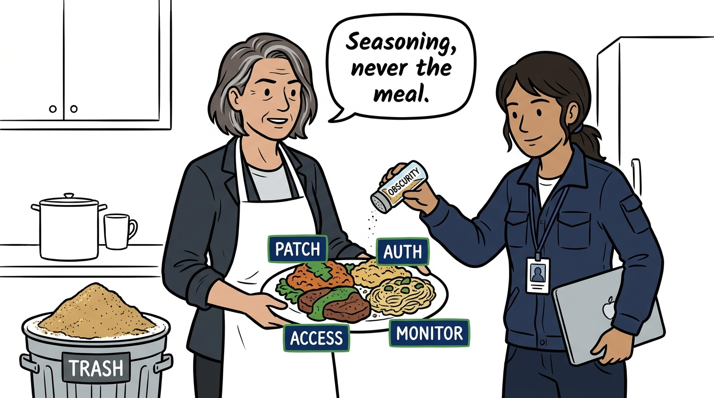
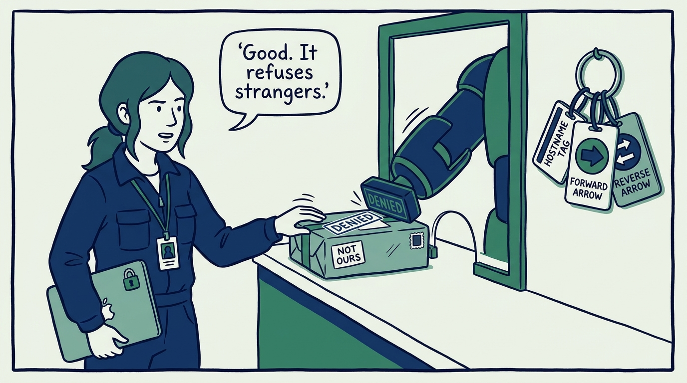
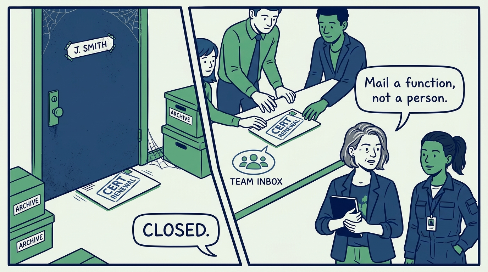
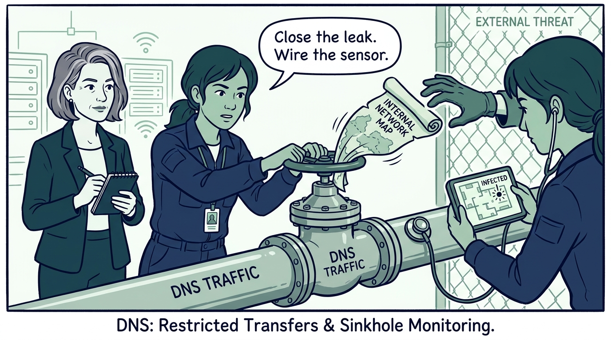
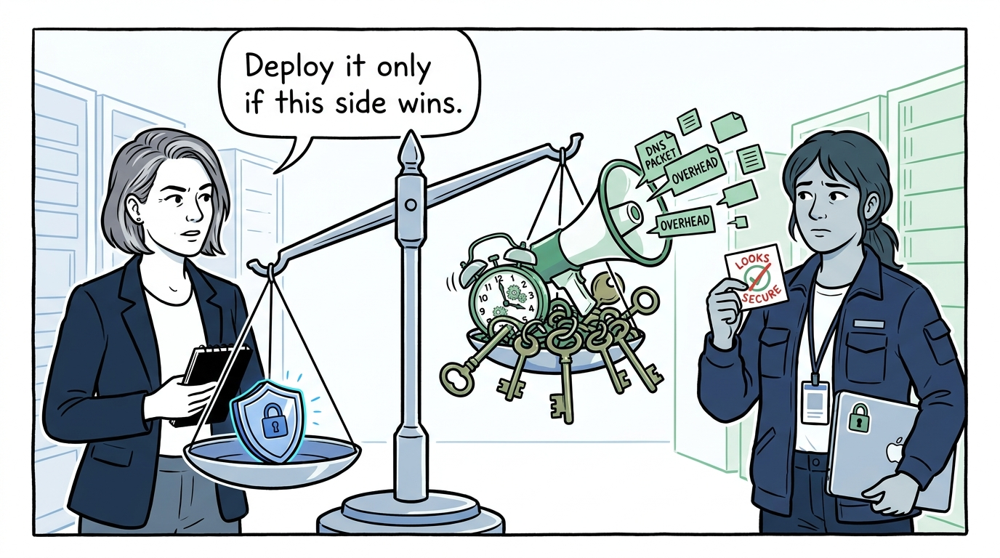
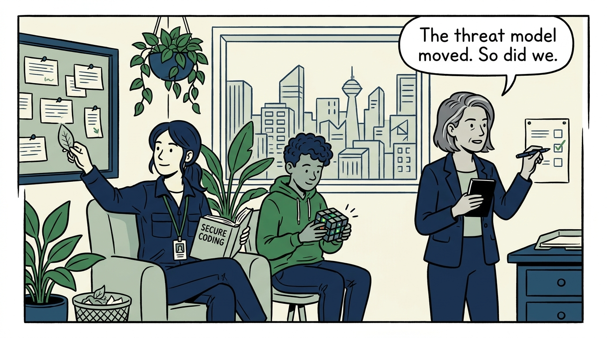

Why the last, unglamorous mile — mail, DNS, obscurity in its place, and a team that keeps learning — decides whether the program is finished — in nine panels.

<!-- comic-style
{
  "cast": "VERA: a calm, seasoned engineering executive, short gray-streaked hair, dark blazer over a plain t-shirt, carries a small black notebook. NADIA: a hands-on defensive-security lead, shoulder-length dark hair tied back, navy utility jacket over a plain shirt, an access badge on a lanyard, laptop with a padlock sticker under one arm.",
  "style": "Clean two-tone explainer comic, thick ink outlines, flat colors with deep blue and green accents on a light background, generous white space, hand-lettered speech bubbles with SHORT readable text, no photorealism."
}
-->

**Panel 1:** *The hook: the last mile is unglamorous — mail and DNS carry every alert, invoice, and login flow, and nobody watches them.*

**Panel 2:** *The problem: quiet failures — a wrong record or stale blocklist entry costs deliverability for weeks; these services never page anyone while merely misconfigured.*

**Panel 3:** *The wrong way: the hidden-port fortress — SSH on 2222 standing in for patching and MFA is one scan flag away from undefended.*

**Panel 4:** *The principle: obscurity is only ever an additional layer — patching, authentication, access control, and monitoring are the meal; a plate of pure seasoning goes in the bin.*

**Panel 5:** *Practice: email provably correct — no open relay (confirmed, not assumed), and HELO, forward DNS, and PTR agreeing so the internet can tell our server from a spoof.*

**Panel 6:** *Practice: continuity engineering — certificates, licenses, and alerts route to role-based aliases and shared groups, so the function outlives whoever fills it.*

**Panel 7:** *Practice: DNS as a security control — recursion restricted, zones no longer leaking the estate's map, and the same ubiquity wired up as a sensor: the sinkhole log is a self-reporting list of infected machines.*

**Panel 8:** *The trade-off: DNSSEC is a decision, not a virtue — complexity, botched-rollover risk, and amplification exposure on one pan; deploy only when the benefits clearly outweigh them.*

**Panel 9:** *The closer: learning is standing work — books, trusted feeds, NVD tracking, CTFs, sources pruned — because a team that stops learning defends last year's threat model; and the Final Review is run, not skimmed.*
