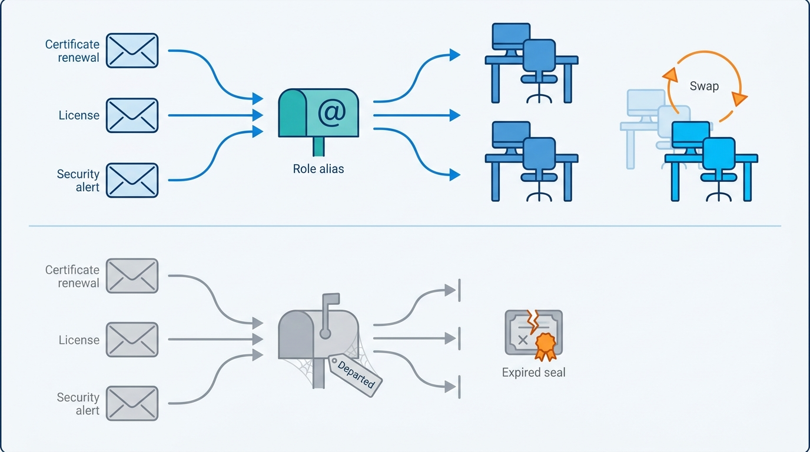
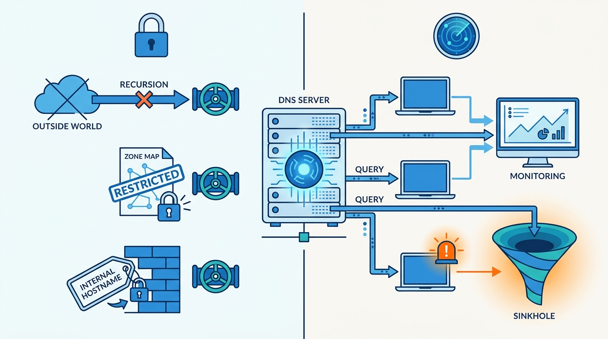
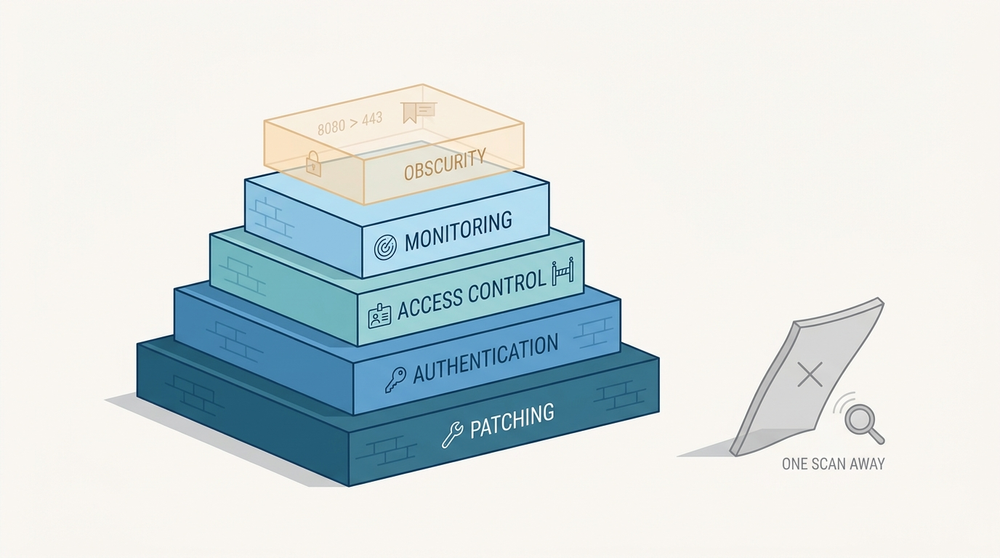

> **Status**: DRAFT
>
> **Principle**: The last mile of a security program is the unglamorous one — the services everyone depends on and nobody watches. In my organization, **email infrastructure is provably well-configured**: no open relay, relay restricted to authorized domains and users, hostname and forward/reverse DNS consistent, blocklists checked, spam and phishing filtering confirmed. **Operational mail survives personnel changes** — certificates, licenses, and security alerts route to role-based aliases and shared groups, never to one person's inbox. **DNS is operated as a security control**: recursion restricted, internal and external DNS separated, zone transfers limited to trusted servers, passive monitoring and sinkholing considered, and DNSSEC deployed only when its benefits clearly outweigh its complexity and risk. **Obscurity is only ever an additional layer**, and **the team's learning is standing work**, because the threat model does not stand still. The test I hold the extra mile to: **obscurity measures never stand in for patching, authentication, access control, and monitoring.**

## Statement

When my organization goes beyond the baseline, this is what the extra mile is held to.

**Email infrastructure is provably correct.**

- **No open relay, ever.** The mail server relays only for authorized domains and users, and the configuration is confirmed, not assumed.
- **Identity is consistent end to end.** The SMTP HELO/EHLO hostname correctly identifies the server, the hostname matches public DNS, reverse DNS (PTR) is valid, and forward and reverse records agree.
- **Reputation is checked.** The server and its IP are checked against common blocklists, other common misconfigurations are reviewed with standard tooling, and spam and phishing filtering is enabled and properly configured.

**Operational mail outlives individuals.**

- **Role-based aliases over personal inboxes.** Licensing, certificates, renewals, and security alerts route to shared aliases and groups — with group nesting where it simplifies distribution — so important operational mail keeps reaching the right team after personnel changes.
- **The make-or-buy question is answered honestly.** Whether operating an internal mail server is worth the administrative and security overhead is a reviewed decision; a managed provider is the answer when we cannot securely maintain our own.

**Figure 1:** *Operational mail reaches a function, not a person: role-based aliases keep renewals and alerts arriving after every personnel change.*

**DNS is operated as a security control.**

- **Recursion is a privilege, not a default.** Recursive queries are disabled on authoritative servers that do not need them, recursive access is restricted to authorized internal systems, and public systems cannot needlessly query internal DNS.
- **Internal and external DNS are separate worlds.** They are split where practical, internet-facing systems use appropriate external resolvers, and internal-only hostnames stay unexposed.
- **Zones do not leak.** Zone transfers (AXFR) are restricted to trusted name servers, verified by attempting unauthorized retrieval, and records are reviewed for unnecessary disclosure of internal infrastructure.
- **DNS doubles as a sensor.** Passive DNS monitoring is considered — queries, responses, and errors collected for central analysis, reviewed for newly registered and suspicious domains, feeding malware detection and incident investigation. A DNS sinkhole or Response Policy Zone is considered for known-malicious domains, with the domain list maintained and sinkhole events monitored for infected internal systems.
- **DNSSEC is an engineering decision.** It is evaluated carefully — complexity, operational risk, and DDoS-amplification exposure included — and deployed only when its benefits clearly outweigh the added risk and management burden, never because it appears more secure.

**Obscurity is an extra layer, never a control.**

- Nonstandard ports for administrative services, renamed default accounts, and service banners that do not volunteer versions are legitimate supplements. But: changing a port does not secure a vulnerable service, blocking internet scanners is not a strategy, equipment labels do not need to advertise function, nothing internet-facing ships before vulnerability testing, and **hidden names, ports, or services never substitute for patching, authentication, access control, and monitoring**.

**The team's learning is standing work.**

- The security team reads — the chapter names its shelf, from incident-response and SOC-building handbooks to awareness-program guides; follows reputable sources such as CISA, Krebs on Security, Mandiant, and the SANS Internet Storm Center; tracks newly disclosed vulnerabilities affecting our technologies; uses podcasts to stay current; keeps CISA and NIST NVD resources, malware-analysis and threat-intelligence references, and OSINT tooling at hand; considers CTFs for skill development; and periodically prunes its sources.

**The final review is run.** Email provably not an open relay; mail DNS and hostname settings correct; critical mail on resilient role-based groups; recursion restricted; internal and external DNS separated; zone transfers limited; DNS activity monitored; sinkholing considered or implemented; obscurity never a primary control; internet-facing systems tested before deployment; and the team's learning process alive.

## How to Read This

This record closes the **Assess and Improve** section — and the journal's tour through the *Defensive Security Handbook*. It is grounded in the book's Extra Mile chapter: the collection of hardening steps, continuity habits, and professional disciplines that do not fit neatly into any earlier chapter but decide whether the program is finished or merely mostly done. Where [[network-security]] secures the transport, this record secures two services that ride on it and that everything else quietly assumes — mail and DNS — and then fixes two habits of mind: obscurity kept in its place, and a team that keeps learning. The full working checklist, including the chapter's Final Review, lives in the **Checklist** tab; the **TL;DR** tab carries the management summary and the **Conversation** tab the dialog.

## Rationale

**The extra mile is where quiet failures live.** Mail and DNS are the two services with the worst ratio of importance to attention: every alert, invoice, certificate renewal, and login flow depends on them, yet neither pages anyone while it is merely misconfigured. A wrong PTR record or a stale blocklist entry costs deliverability for weeks before anyone connects the symptoms; an over-permissive resolver serves attackers silently for years. These systems do not announce their failures — which is exactly why their correctness must be proven on a checklist rather than inferred from the absence of complaints.

**An open relay is someone else's attack launched on my reputation.** A mail server that relays for anyone becomes spam infrastructure within days of being discovered, and the damage lands on my domain: blocklisted IPs, rejected legitimate mail, and a reputation that takes far longer to rebuild than the configuration took to fix. The identity chain matters for the same reason — HELO hostname, forward DNS, and PTR record agreeing is how the rest of the internet distinguishes my mail server from a spoofing attempt. Deliverability is a security property wearing an operations costume.

**Mail routed to a person is a single point of failure with a notice period.** The certificate that expires into a departed employee's inbox is a folk tale because it keeps happening. Role-based aliases and shared groups are continuity engineering: the license renewal, the vendor security advisory, and the 2 a.m. alert reach a *function*, and the function outlives every individual who fills it. The same honesty applies one level up — if operating our own mail infrastructure securely costs more attention than we can actually pay, the professional answer is a managed provider, not pride.

**DNS sees everything, which makes it both a leak and a sensor.** As a leak: open recursion invites abuse and amplification, permissive zone transfers hand an attacker a complete map of the estate, and internal hostnames exposed in public records narrate the infrastructure to anyone who asks. As a sensor: nearly every piece of malware resolves a name, so passive DNS monitoring and a sinkhole turn the same ubiquity into detection — the sinkhole log is a self-reporting list of infected machines. Running DNS as a security control means closing the leak and wiring up the sensor, and both feed the estate in [[logging-and-monitoring]].

**Figure 2:** *DNS sees everything: run as a control, it stops leaking the estate's map — and the same ubiquity, wired as a sensor, makes infected machines report themselves.*

**DNSSEC is a trade-off, not a virtue.** The chapter is unusual and right in refusing the checkbox: DNSSEC adds real infrastructure complexity, real operational risk — a botched key rollover takes the whole domain down — and larger responses that can increase DDoS-amplification exposure. Deploying it "because it appears more secure" is security decoration. The record demands the sober version: deploy when the benefits clearly outweigh the burden for our actual threat model, and decline honestly otherwise.

**Obscurity buys minutes; controls buy safety — and the order matters.** Moving SSH off port 22 and quieting banners genuinely cuts scanner noise and slows opportunistic sweeps — worth having, as seasoning. The failure mode is promotion: the moment a hidden port or renamed account is doing a control's job, the system is one `nmap` flag away from undefended. The record keeps the hierarchy explicit — patching, authentication, access control, and monitoring are the meal; obscurity is only ever the seasoning — and backs it with the hard gate that nothing internet-facing ships before vulnerability testing.

**Figure 3:** *The meal and the seasoning: obscurity is a legitimate thin top layer — the moment it stands alone, one scan flag away from undefended.*

**A security team that stops learning defends last year's threat model.** Attacker techniques, disclosed vulnerabilities, and defensive tooling all move monthly; a team whose knowledge is frozen at its last training budget is aging out of relevance in real time. That is why the reading list, the news sources, the podcasts, the NVD tracking, and the CTFs are checklist items rather than personality traits — the learning is institutional, scheduled, and pruned, not left to whoever happens to be curious.

## What This Means in Practice

| What this record says | What it does **not** say |
| --- | --- |
| The mail server provably relays only for authorized domains and users, with consistent HELO, DNS, and PTR records. | Mail configuration is a solved, set-and-forget problem — reputation and records are re-checked, not remembered. |
| Certificates, licenses, and security alerts route to role-based aliases and shared groups. | Individuals stop receiving operational mail — the function owns the mail; people fill the function. |
| We honestly review whether running our own mail infrastructure is worth the overhead. | Everyone must migrate to a managed provider — the record demands the honest review, not a particular answer. |
| DNS recursion is restricted, internal and external DNS are separated, and zone transfers are limited and verified. | Internal DNS data is classified as secret — it is simply not published without a reason. |
| Passive DNS monitoring and sinkholing are considered, and sinkhole events are watched for infected hosts. | Every organization must run a sinkhole — considered means evaluated against our estate, with the decision recorded. |
| DNSSEC is deployed only when benefits clearly outweigh complexity, operational risk, and amplification exposure. | DNSSEC is bad — it is a tool whose adoption must be earned by the threat model, not by the acronym. |
| Nonstandard ports, renamed accounts, and quiet banners may supplement real controls. | Obscurity is worthless — it is a legitimate extra layer, and only ever that. |
| The team's ongoing learning — sources, books, podcasts, NVD tracking — is scheduled, standing work. | Learning is an individual hobby — it is an institutional process with pruned, trusted sources. |

Concretely: mail and DNS in my organization get the same review rigor as any production service — the Final Review in the Checklist tab is run, not skimmed — and the first question about any obscurity measure is *"what real control is standing behind this?"* If the answer is none, we have found a gap, not a defense.

## Anti-Patterns

- **The relay discovered by a blocklist.** The open relay nobody tested for, found by spammers first — and announced to the organization by weeks of bounced legitimate mail.
- **The certificate that expired into a void.** The renewal notice faithfully delivered to an inbox deactivated eight months ago; the outage arrives precisely on schedule.
- **The all-answering resolver.** Recursion open to the world — free infrastructure for amplification attacks and a standing invitation to cache abuse.
- **The zone transfer to anyone who asks.** AXFR unrestricted, handing any curious client a complete, annotated map of the internal estate.
- **The checkbox DNSSEC.** Signed zones deployed for the audit slide, keys never rotated, no monitoring — new fragility purchased in the name of appearing secure.
- **The hidden-port fortress.** SSH on port 2222 standing in for patching and MFA — defeated by the second flag of a port scan and defended by nothing after that.
- **The billboard label.** Systems and equipment named to advertise their function — `payroll-db-prod` narrating exactly where the crown jewels sit.
- **The team frozen in its certification year.** No reading, no feeds, no CTFs — confidently defending the threat landscape as it stood when the last certificate was framed.

## Related Records

- [[network-security]] — the transport and perimeter this record's services ride on; egress and firewall discipline complements resolver and relay discipline.
- [[logging-and-monitoring]] — passive DNS telemetry and sinkhole events feed the central detection estate defined there.
- [[phishing-response]] — spam and phishing filtering is confirmed here as infrastructure; campaign detection and response live there.
- [[vulnerability-management]] — nothing internet-facing ships before vulnerability testing; the standing scan-and-patch pipeline lives there.
- [[osint-purple-teaming]] — exposed internal hostnames, revealing DNS records, and scanner-visible services are exactly what its sweep would find; this record closes them first.
- [[security-program]] — the team-learning discipline here is the program-level investment in people made operational.

## Scope and Revisiting

This record is `draft`. It applies to every mail and DNS service my organization operates or delegates, to every use of obscurity measures anywhere in the estate, and to the security team's standing learning process. I revisit it if deliverability or blocklist incidents recur (the provably-correct claim failing in practice), if an operational failure traces to mail routed to an individual (the continuity commitment failing), if the DNSSEC trade-off shifts materially for our threat model, or if an audit finds an obscurity measure standing where a control should be — which is a finding against the record's core test, not a tolerable exception.

## Authoritative References

- *Defensive Security Handbook*, 2nd edition — Lee Brotherston, Amanda Berlin, and William F. Reyor III; the Extra Mile chapter, whose checklist (including its Final Review) this record distills.
- **CISA** — the advisory and resource source the chapter names for standing threat awareness.
- **NIST National Vulnerability Database** — the vulnerability-tracking reference the chapter names.
