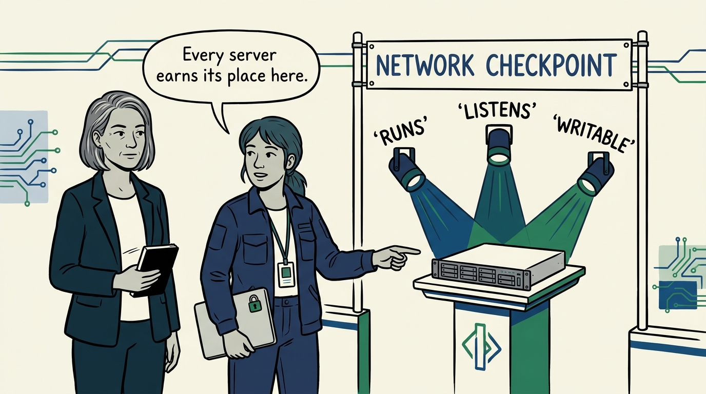
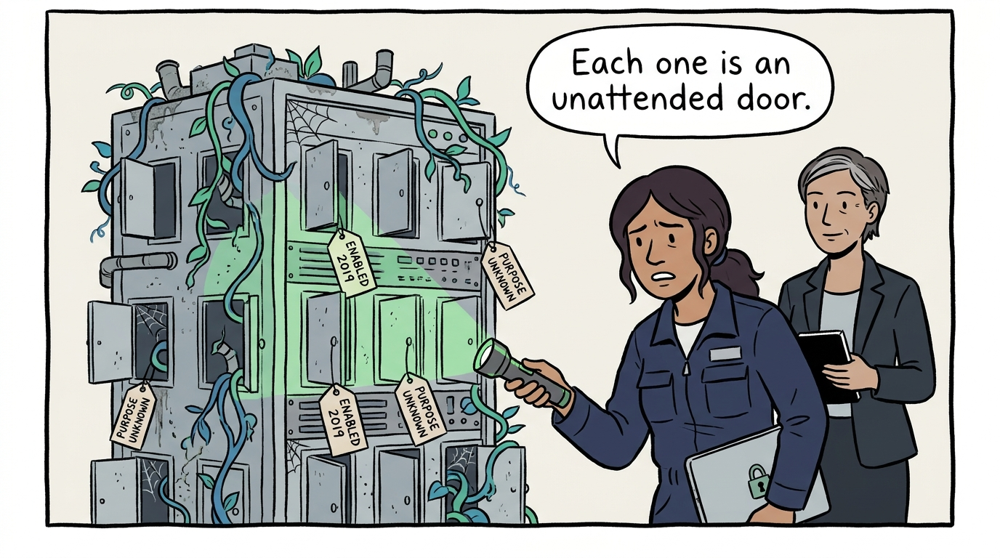
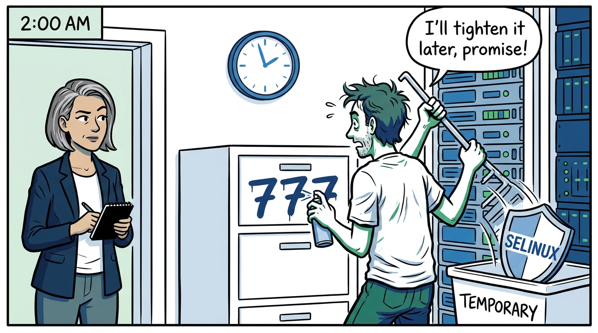
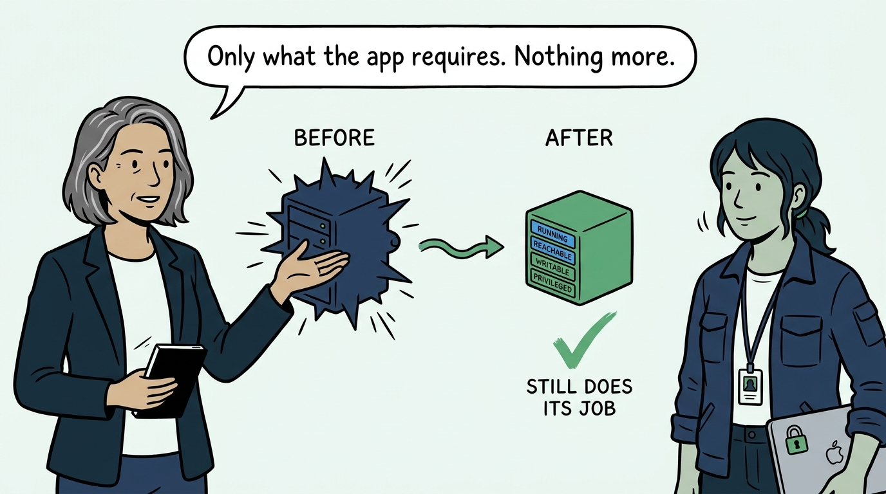
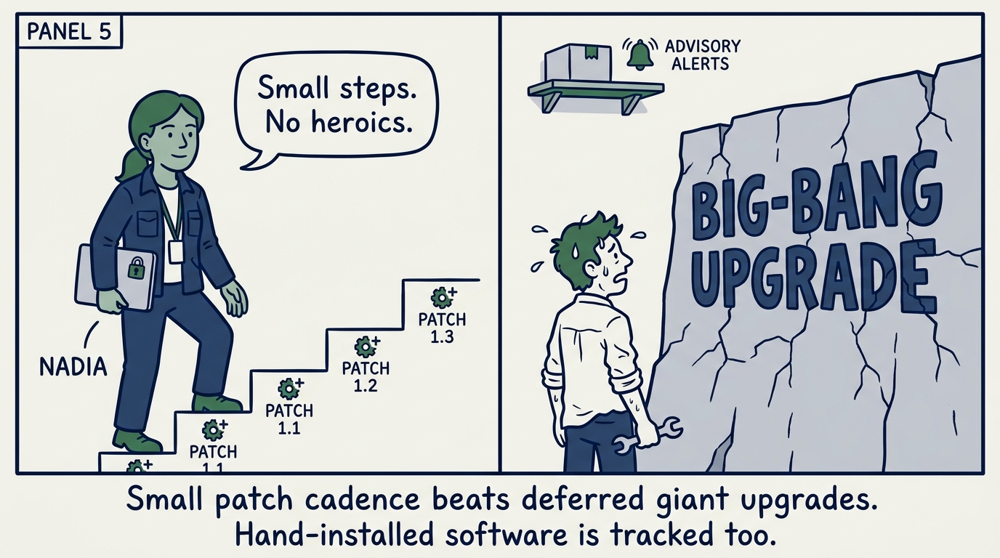
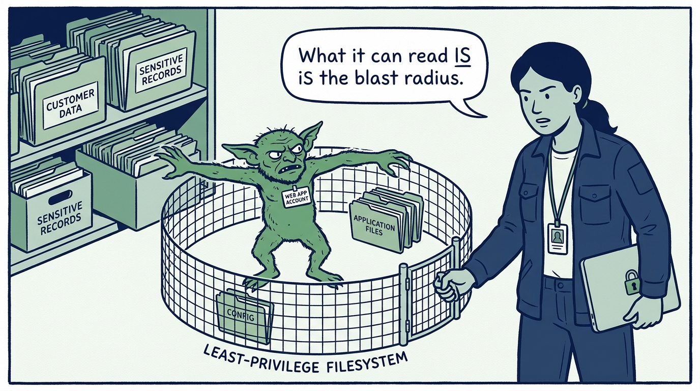
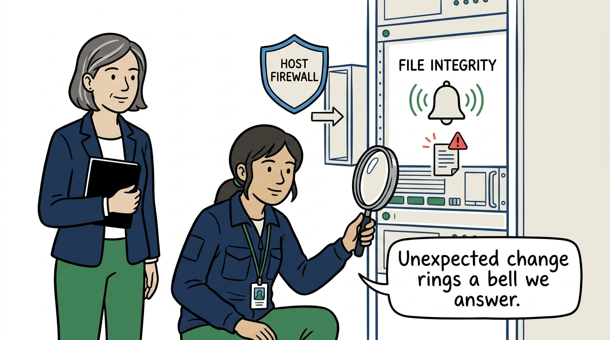
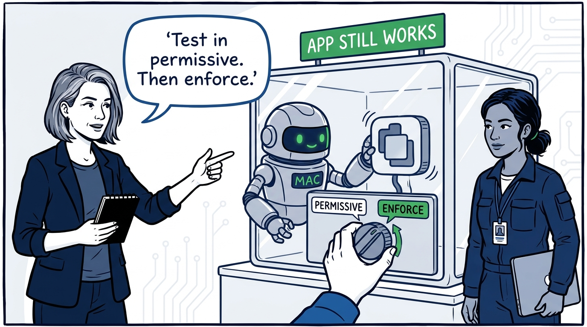
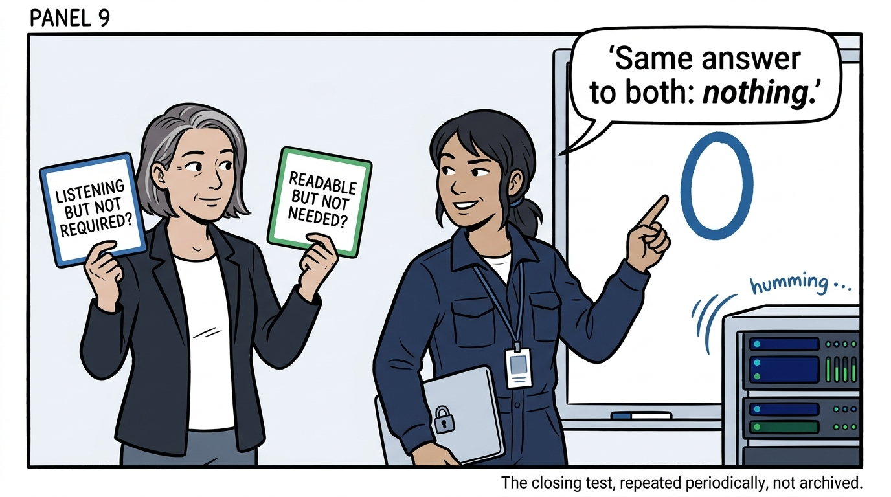

How a Unix application server earns its place on the network — in nine panels.

<!-- comic-style
{
  "cast": "VERA: a calm, seasoned engineering executive, short gray-streaked hair, dark blazer over a plain t-shirt, carries a small black notebook. NADIA: a hands-on defensive-security lead, shoulder-length dark hair tied back, navy utility jacket over a plain shirt, an access badge on a lanyard, laptop with a padlock sticker under one arm.",
  "style": "Clean two-tone explainer comic, thick ink outlines, flat colors with deep blue and green accents on a light background, generous white space, hand-lettered speech bubbles with SHORT readable text, no photorealism."
}
-->

**Panel 1:** *The hook: a server's attack surface is what runs, what listens, and what is writable — everything else is noise to remove, so every server earns its place on the network.*

**Panel 2:** *The problem: the everything daemon — services enabled years ago and never inventoried since, each an unattended door, none with a known purpose.*

**Panel 3:** *The wrong way: world-writable and working — permissions loosened to fix a deployment and never tightened, SELinux disabled as troubleshooting and never re-enabled.*

**Panel 4:** *The principle: shrink and verify — only what the application requires is running, reachable, writable, and privileged, and the server still does its job.*

**Panel 5:** *Practice: a small patching cadence beats patching heroics — deferred updates pile into the risky big-bang upgrade, and software the package manager cannot see gets its own advisory subscriptions.*

**Panel 6:** *Practice: the filesystem is least privilege made concrete — what the application account can read and write is the blast radius, so a compromised app becomes a contained nuisance, not a data breach.*

**Panel 7:** *Practice: the host defends itself — a firewall permitting only required traffic, and file-integrity monitoring against a trusted baseline whose alerts are investigated, not muted.*

**Panel 8:** *Practice: applications run isolated, non-root, and confined by mandatory access control — permissive mode during testing, then enforcement, with every restriction verified against required function so it survives the 2 a.m. rollback.*

**Panel 9:** *The closer: two questions for any server — what is listening that the app does not require, and what can its account read that it does not need? Both should answer: nothing. And the review repeats; it is never archived.*
