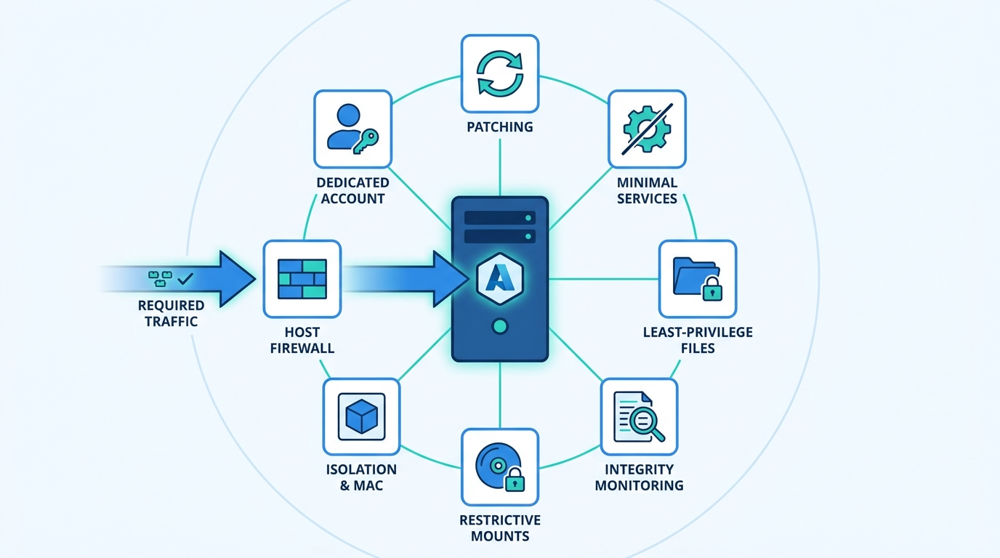
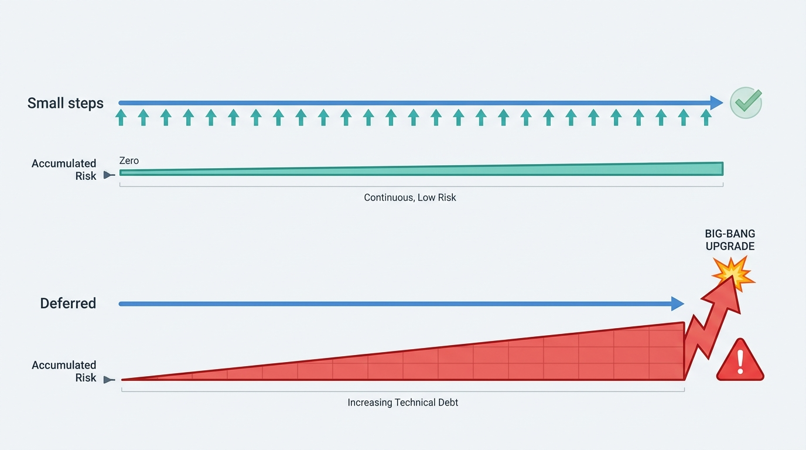
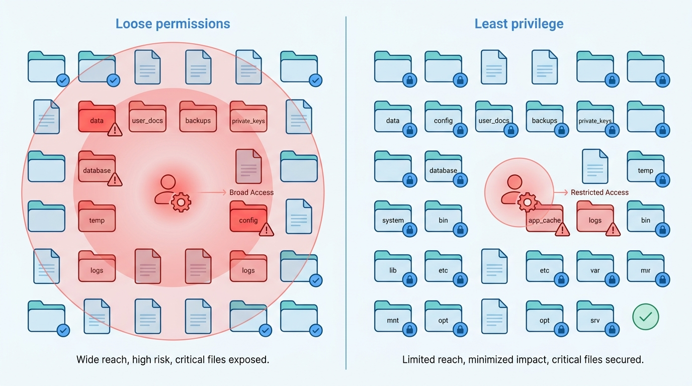

> **Status**: DRAFT
>
> **Principle**: Every Unix application server in my organization **earns its place on the network**: fully patched on a **small-step cadence**, running **only the services it exists to run**, with a **filesystem held to least privilege**, a **host firewall that permits only required traffic**, **file-integrity monitoring** that makes unexpected change visible, **restrictive mount options** on every partition that can take them, applications **isolated and running as dedicated non-root accounts**, and **mandatory access control enabled where the platform supports it**. And because a control that breaks the application gets rolled back at two in the morning, **every restriction is verified against required functionality**, exceptions are recorded, and the hardening review is repeated — not archived. The test I hold every server to: **only what the application requires is running, reachable, writable, and privileged — and the server still does its job**.

## Statement

This is the hardening bar every Unix application server in my organization is held to.

**Figure 1:** *The hardening bar at a glance: only what the application requires is running, reachable, writable, and privileged — and every control is verified against function.*

**Patching is continuous and small-stepped.**

- The operating system and **all third-party applications and packages** stay current, through the package manager wherever possible — repositories updated before upgrades, available updates reviewed before applying. Software installed outside the package manager is **tracked separately, with security-advisory subscriptions**. Important patches are tested before production, major OS upgrades carry a rollback or recovery plan, and **update intervals stay small so large, disruptive upgrades stay rare**.

**Nothing runs without a reason.**

- Running services and processes are inventoried, each enabled service has a known purpose, the unneeded are **disabled and prevented from starting at reboot**, required services are verified after configuration changes, and the server is **periodically rechecked for newly enabled services** — through the system's standard service-management mechanism, `systemctl` where applicable.

**The filesystem is least privilege made concrete.**

- Ownership and group membership of sensitive files are verified; unnecessary world-readable, world-writable, and execute permissions are removed; the system `umask` gives new files restrictive defaults; **application-service accounts — web-server users included — cannot read data they do not require**; SUID/SGID binaries are identified, justified or stripped, with special attention to privileged binaries outside normal system directories; and **unexpected permission changes are searched for regularly**.

**The host defends itself.**

- A host-based firewall permits **only the traffic the server's function requires**, blocks unnecessary inbound connections, and **restricts administrative services to trusted networks or addresses** where possible. Rules are reviewed for obsolete entries, verified after application or network changes, and confirmed not to break required application traffic.

**Unexpected change is visible.**

- A file-integrity monitoring solution watches critical OS files, application configuration, and web/application directories against a **trusted baseline**; alerts fire on unexpected change, **unexplained alerts are investigated promptly**, and integrity alerts feed the existing monitoring and logging systems.

**Mounts are restrictive by default.**

- Sensitive or high-risk filesystem areas sit on their own partitions where practical; `/etc/fstab` is reviewed; `nodev`, `nosuid`, `noexec`, and `ro` are applied where device files, SUID execution, executables, or writes are not needed — and every mount-option change is **verified after remount or reboot and tested against the applications**.

**Applications are isolated and never needlessly root.**

- Where an application can be isolated from the rest of the filesystem, it is — `chroot`, containers, jails, or another isolation mechanism — with the isolated environment stripped to minimal files and utilities, the application **not running as root unless absolutely required**, and **`chroot` never treated as a complete security boundary on its own**. Function is tested after isolation.
- Where the platform supports **mandatory access control** — SELinux, AppArmor, TrustedBSD — it is enabled where practical, with least-privilege policies confining application processes to required files, devices, ports, and system functions; policy violations and audit logs are reviewed; permissive/audit mode is used during testing before full enforcement; and **policies are re-reviewed as the application changes**.

**Accounts are dedicated and minimal.**

- Each application runs under a **dedicated non-root account** with limited filesystem access and no interactive login unless required; administrative privileges such as `sudo` are restricted; unused accounts and groups are removed; and group memberships are reviewed for excessive privilege.

**Hardening is verified — and repeated.**

- After hardening, the application **still performs its required business functions**; the server survives a reboot with all necessary services returning; listening ports are scanned for surprises; system and application logs are reviewed; firewall, filesystem, permission, and access-control restrictions are tested. All security-related configuration changes are documented, **approved exceptions are recorded**, critical configuration files are backed up — and the hardening review is **repeated periodically and after major application, OS, or infrastructure changes**.

## How to Read This

This record sits in the **Hardening the Estate** section alongside [[windows-infrastructure]] — the same discipline, applied to the other half of the server fleet, one host at a time. It is grounded in the Unix Application Server Security chapter of the *Defensive Security Handbook* (Brotherston, Berlin, Reyor). The chapter names concrete mechanisms — `systemctl`, `umask`, `fstab` mount options, `chroot`, `sudo`, SELinux, AppArmor, TrustedBSD — and the **Checklist** tab keeps every one of them verbatim; this article states the commitments at the capability level, with those mechanisms as the worked example, because the commitments (minimal surface, least-privilege filesystem, self-defending host, visible change, contained applications, verified function) hold on any Unix or Linux. The management summary lives in the **TL;DR** tab and the conversation in the **Conversation** tab.

## Rationale

**An application server's attack surface is what runs, what listens, and what is writable.** Unlike the Windows estate, where the graph is the story, a Unix application server is usually a single-purpose machine exposed to real traffic — which makes its defense wonderfully concrete. Every daemon that runs, every port that listens, and every file the application account can write is surface; everything else is noise to remove. That is why the record's first moves are subtraction: remove what has no purpose, and patch what remains. A service that is not running cannot be exploited, and the periodic recheck exists because services have a way of coming back.

**A small patching cadence beats patching heroics.** The chapter's quietest instruction is one of its best: keep update intervals small so large, disruptive upgrades are less likely. Organizations that defer updates accumulate a debt that eventually only a risky big-bang upgrade can pay — which is exactly the upgrade that breaks things, which is exactly the experience that makes them defer longer. Small steps, tested patches, rollback plans for the major jumps, and — critically — **tracking the software the package manager cannot see**, because the hand-installed application with no advisory subscription is the one that stays vulnerable for years. The estate-wide cadence and exception discipline live in [[vulnerability-management]].

**Figure 2:** *A small patching cadence beats patching heroics: frequent low-risk steps keep the debt flat that deferral pays back with a disruptive big-bang upgrade.*

**Least privilege on the filesystem is where a breach stops spreading.** Most application compromises begin as the application account — a web-server user executing injected code. What that account can read and write *is* the blast radius. A filesystem where the application cannot read data it does not require, where world-writable permissions have been hunted down, where the `umask` makes new files restrictive by default, and where SUID binaries outside system directories are treated as the red flags they are — that filesystem converts a compromised application into a contained nuisance instead of a data breach. This is the record's center of gravity, and the regular search for unexpected permission changes is what keeps it true after day one.

**Figure 3:** *What the application account can read and write is the blast radius: least privilege on the filesystem turns a compromised application into a contained nuisance.*

**Detection on the host assumes prevention will fail.** File-integrity monitoring is the control that pays out precisely when everything above it has already lost: the attacker who got in, escalated, and modified a binary or a configuration file trips the baseline comparison. But FIM only works as a discipline — a *trusted* baseline, alerts investigated promptly rather than muted, and integration into the monitoring the organization actually watches, per [[logging-and-monitoring]]. An integrity alert nobody investigates is a breach notification nobody read.

**Isolation and mandatory access control turn a compromised application into a contained one.** Discretionary permissions govern what the application account may touch; MAC governs what the application *process* may do even after it is subverted — which files, devices, ports, and system functions, enforced by the kernel. The record's honesty matters here in both directions: `chroot` alone is not a security boundary and must not be treated as one, and SELinux-class controls are demanding enough that the chapter prescribes the workable path — permissive mode during testing, then enforcement, then policy reviews as the application evolves. The worst outcome is not a strict policy; it is the reflexive `setenforce 0` that becomes permanent.

**A control that breaks the application will be rolled back at 2 a.m. — so verification is part of the control.** The chapter closes every hardening thread the same way: test it. The application still performs its business functions; the server reboots clean; the firewall change did not sever required traffic; the mount options did not break the app. This is not softness — it is what makes the hardening durable, because an unverified restriction that takes production down gets reverted in the middle of the night, usually along with three others, and never reinstated. The record prefers a recorded, approved exception to a silent regression — and it schedules the review to recur, because a server hardened once and never again is a server drifting back to soft.

## What This Means in Practice

| What this record says | What it does **not** say |
| --- | --- |
| The OS and all third-party software stay current, on a small-step cadence, through the package manager where possible. | Every update applies untested — important patches are tested, and major upgrades carry rollback plans. |
| Only services with a known purpose run, and the server is rechecked periodically. | A minimal server is built once — minimalism is maintained, because services come back. |
| Application accounts cannot read data they do not require; world-writable permissions are removed. | Permissions are tightened until the app breaks — every restriction is tested against required function. |
| A host firewall permits only required traffic, with admin services restricted to trusted networks. | The network firewall is enough — the host defends itself even when the network layer fails. |
| File-integrity monitoring runs against a trusted baseline, and unexplained alerts are investigated. | Installing a FIM tool is the control — the investigation habit is. |
| Applications are isolated and non-root; MAC is enabled where the platform supports it. | `chroot` is a security boundary, or SELinux must be enforcing on day one — permissive-then-enforce is the sanctioned path. |
| Exceptions are approved and recorded; the hardening review repeats after major changes. | Hardening is a project — it is a cycle. |

Concretely: every new Unix application server in my organization passes this record's final review before taking production traffic, and every existing one re-passes it after major application, OS, or infrastructure changes. The two questions I ask of any server: *what is listening that the application does not require?* and *what can the application account read that it does not need?* Both should have the same answer — nothing.

## Anti-Patterns

- **The pet server.** Hand-built, hand-patched when someone remembers, configuration drifted so far from any baseline that nobody dares touch it — irreplaceable and indefensible in equal measure.
- **The everything daemon.** Services enabled by default in 2019 and never inventoried since; each one an unattended door, none with a known purpose.
- **World-writable and working.** Permissions loosened to `777` to fix a deployment problem, never tightened again — the temporary fix that became the permanent hole.
- **`setenforce 0` as troubleshooting.** SELinux disabled as the first debugging step and never re-enabled — the kernel-level control traded away for one afternoon's convenience.
- **The hand-installed orphan.** The application installed outside the package manager, with no advisory subscription and no tracking — patched never, vulnerable for years.
- **Chroot theater.** Isolation treated as a complete security boundary because the directory changed — the chapter says plainly it is not one on its own.
- **The muted integrity alert.** FIM installed for the audit, alerts routed to a folder nobody reads — a breach notification system with the ringer off.
- **Hardened once.** The server that passed review at commissioning and was never reviewed again — every subsequent deploy, upgrade, and hotfix quietly widening the surface.

## Related Records

- [[windows-infrastructure]] — the sibling record: the same hardening discipline for the directory-centered half of the estate.
- [[endpoints]] — least privilege, minimal software, and integrity discipline applied to the machines people actually sit at.
- [[vulnerability-management]] — the estate-wide scanning, patching cadence, and exception process this record's per-server discipline feeds.
- [[network-security]] — the network-level controls the host firewall backstops; defense assumes either layer can fail.
- [[logging-and-monitoring]] — where integrity alerts, port-scan results, and server logs are actually watched.
- [[databases]] — the data layer these application servers front; its hardening record continues where this one stops.

## Scope and Revisiting

This record is `draft`. It applies to every Unix and Linux server my organization runs an application on — physical, virtual, or cloud instance — proportionate to exposure, with internet-facing servers held to the full bar without exception. I revisit it if the fleet's shape changes materially (a wholesale move to immutable images or containers, where hardening shifts from servers to build pipelines), if unexplained integrity or permission-change findings recur without investigation (the visibility claim failing in practice), or if exception records start accumulating faster than they are retired — a hardening bar that leaks exceptions is a bar being quietly lowered.

## Authoritative References

- *Defensive Security Handbook*, 2nd edition (Lee Brotherston, Amanda Berlin, and William F. Reyor III) — the Unix Application Server Security chapter, whose checklist this record distills.
