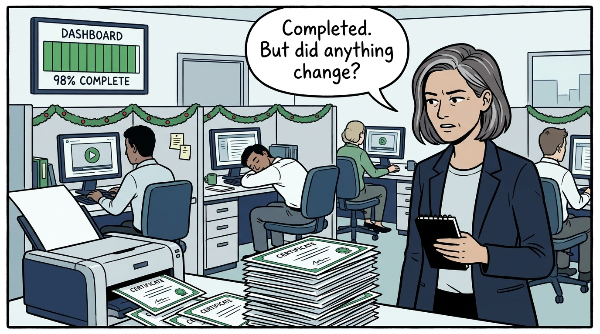
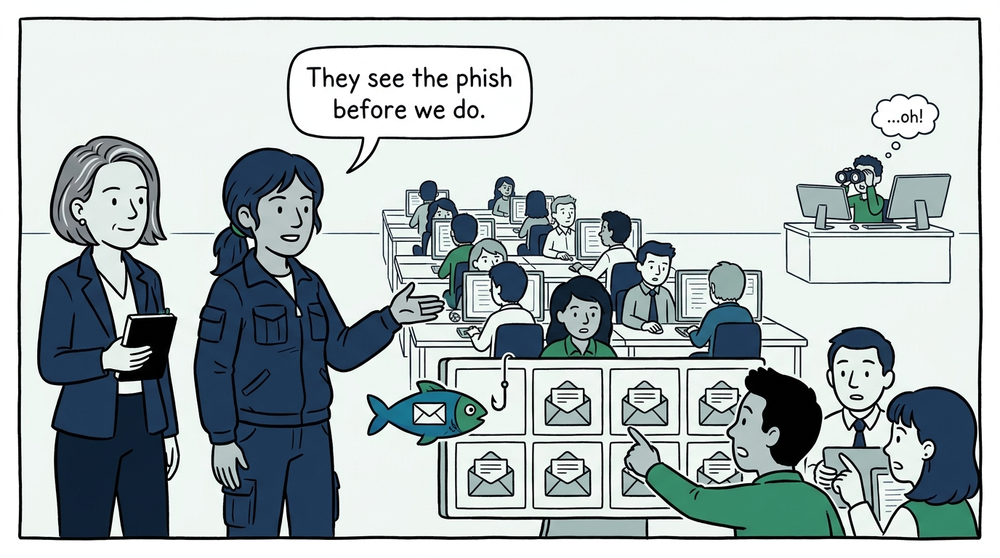
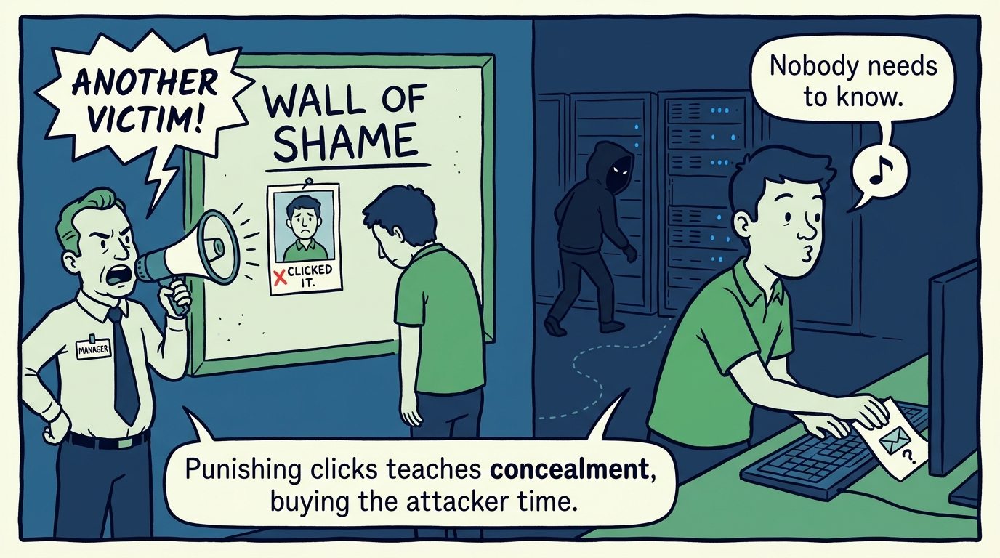
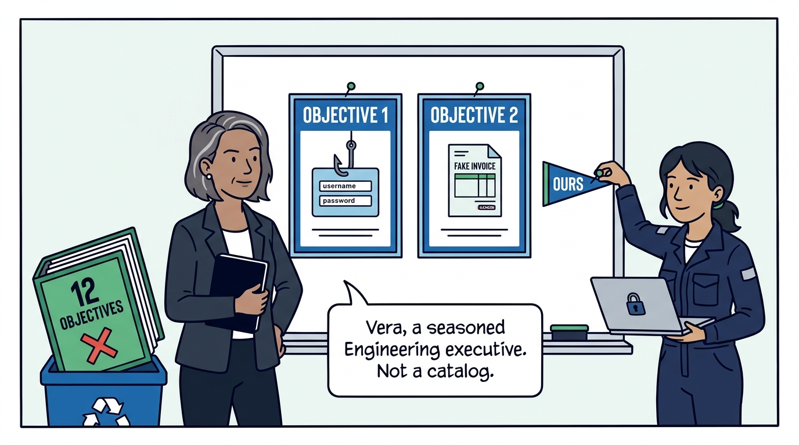
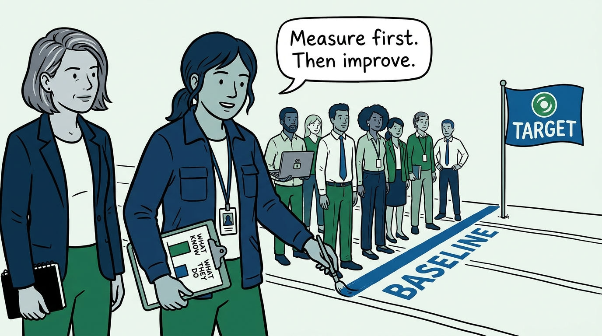
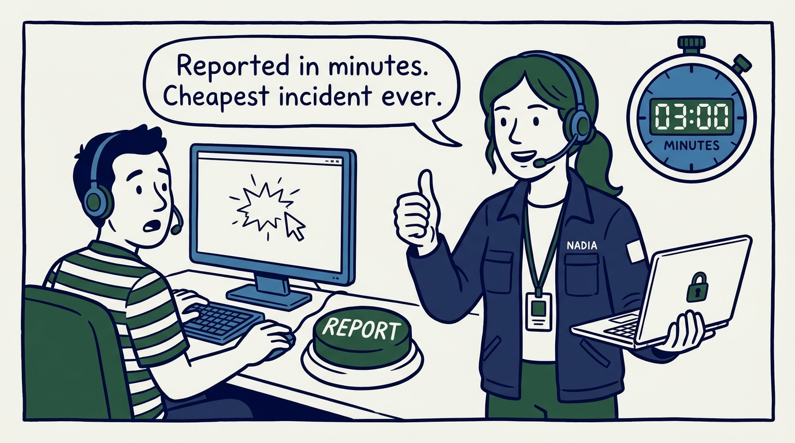
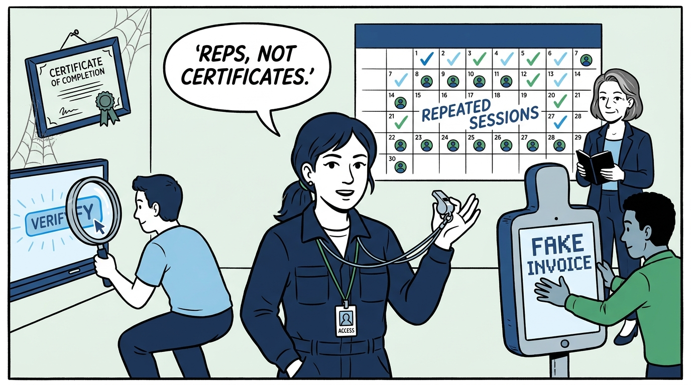
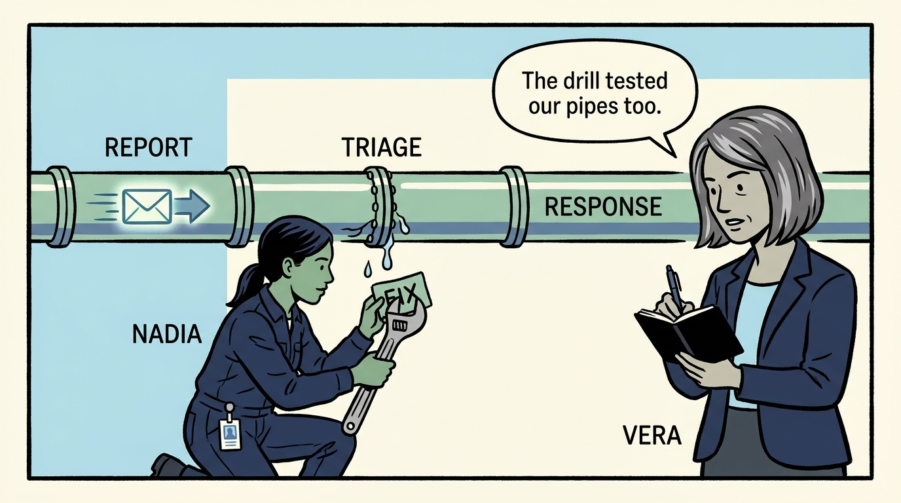
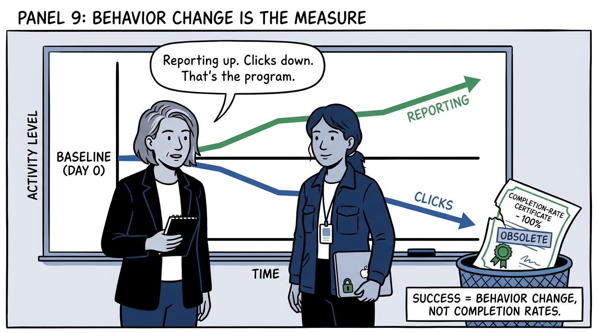

Why security awareness is engineered like a control — baseline first, no blame, behavior over certificates — in nine panels.

<!-- comic-style
{
  "cast": "VERA: a calm, seasoned engineering executive, short gray-streaked hair, dark blazer over a plain t-shirt, carries a small black notebook. NADIA: a hands-on defensive-security lead, shoulder-length dark hair tied back, navy utility jacket over a plain shirt, an access badge on a lanyard, laptop with a padlock sticker under one arm.",
  "style": "Clean two-tone explainer comic, thick ink outlines, flat colors with deep blue and green accents on a light background, generous white space, hand-lettered speech bubbles with SHORT readable text, no photorealism."
}
-->

**Panel 1:** *The hook: the annual compliance module — forty-five minutes in December, a certificate, and no measurable change in behavior.*

**Panel 2:** *The problem framed right: the people who receive the phish see it before any analyst does — a trained workforce is a detection sensor at every mailbox.*

**Panel 3:** *The wrong way: punish the click and the next click goes unreported — the attacker gets hours or days of quiet instead of minutes.*

**Panel 4:** *The principle: people are a security control, and controls get engineered — one or two clear objectives, tailored to the threats we actually face, with executive backing.*

**Panel 5:** *The baseline comes before the program: measure what users currently know and do — otherwise the program can demonstrate activity, but never improvement.*

**Panel 6:** *Reporting is the easy option and never punished — even after the click — because the cheapest incident is the one reported in minutes by the person it happened to.*

**Panel 7:** *Training builds habits, not certificates: spaced repetition, realistic examples that resemble real threats, and lessons framed in each person's everyday work.*

**Panel 8:** *The exercise tests us as much as them: every simulation rehearses the reporting path and response runbook — and the gaps found flow back into the procedures.*

**Panel 9:** *The closer: the test the program is held to — behavior change measured against the baseline, reporting up and clicks down; completion rates appear nowhere in that conversation.*
