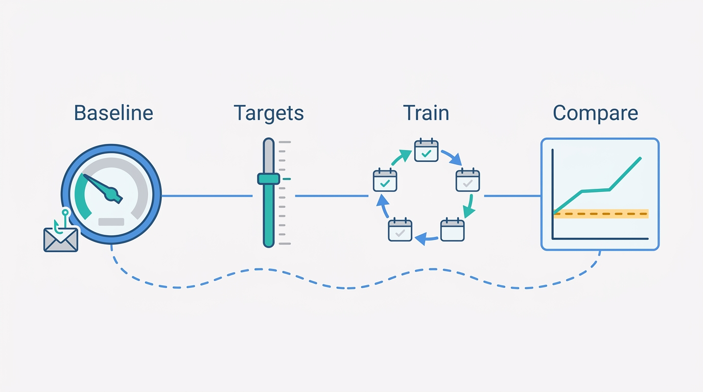
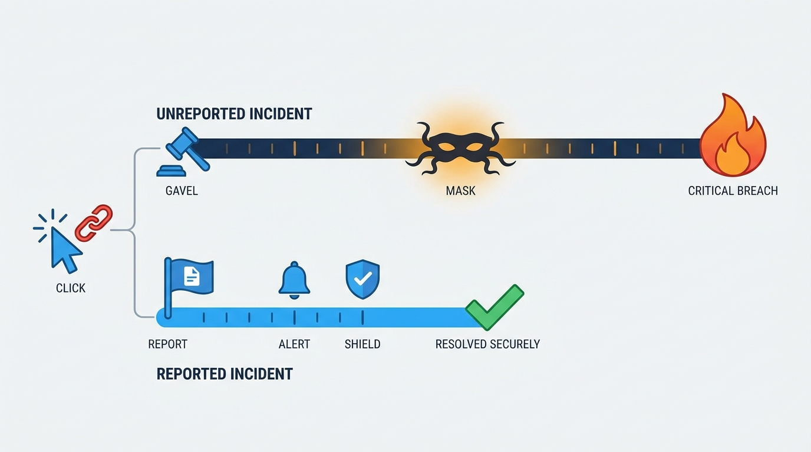
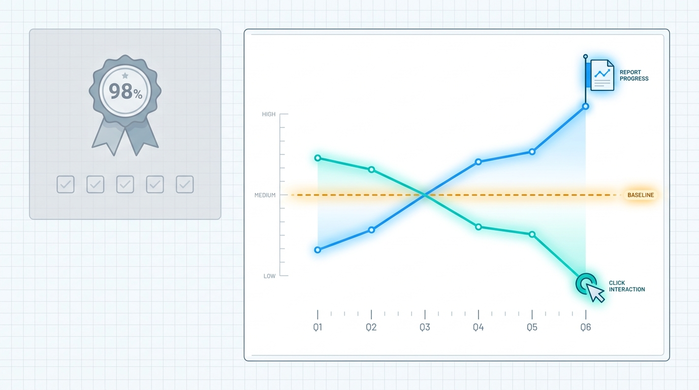

> **Status**: DRAFT
>
> **Principle**: My organization treats its people as a security control, and controls get engineered, not lectured. **Security awareness is an ongoing process, not a once-a-year compliance exercise**: one or two clear objectives, tailored to our specific risks, with executive support and cultural fit. **The baseline comes before the program** — we measure what users currently know and do, and set improvement targets against it. **Training is repetition, spaced learning, and realistic exercises** tied to everyday work; **reporting is simple, and reporting is never punished** — even after a click — because the cheapest incident is the one reported in minutes. **Awareness exercises double as tests of incident response**, and the metrics loop runs continuously: reporting up, click rates down, topics adjusted to the threats we actually face. The test I hold the program to: **behavior change measured against the baseline, not course-completion rates**.

## Statement

When my organization runs security education, this is the program it is held to.

**The program has few, clear objectives — and they are ours.**

- One or two clear, achievable security-awareness objectives, not a catalog.
- Training tailored to my organization's specific risks and threat landscape, with executive support and alignment with organizational culture.
- Security awareness treated as an ongoing process, not a once-a-year compliance exercise — reinforced regularly through repetition and spaced learning, with realistic hands-on exercises such as phishing simulations, and lessons taught in terms of users' everyday work.

**The baseline comes before the program.**

- Users' current security knowledge and behavior are measured before launch, through realistic exercises that identify common weaknesses.
- How users currently react to phishing, suspicious links, and unusual requests is assessed — and the baseline results set measurable improvement targets.

**Figure 1:** *The baseline comes before the program: what users know and do is measured first, targets are set against it, and every later claim of improvement is compared to that starting line.*

**Rules are clear and reporting is the easy option.**

- Program rules are clear, concise, and consistent with organizational policies and culture, with input from employees and stakeholders at different levels.
- What to do on encountering suspicious activity is explicitly explained, and reporting suspicious emails or incidents is simple and accessible.

**Training builds habits, not certificates.**

- Key lessons are reinforced through repeated practice: hovering over and verifying links before clicking; recognizing suspicious emails, requests, and social-engineering tactics.
- Users are encouraged to report mistakes and suspicious activity quickly; examples closely resemble real-world threats; computer-based training is supplemented with interactive awareness activities.

**Reinforcement is positive — fear and shame are off the table.**

- It is explicit that users will not be punished for reporting a mistake, and reporting is encouraged even when a user has already clicked a malicious link.
- Good security behavior and participation are rewarded; gamification, competitions, recognition, and small incentives are considered; the learning environment is supportive.

**Education and incident response test each other.**

- What users should do after identifying — or falling for — an attack is defined.
- Existing incident-response procedures are tested during awareness exercises; gaps, inconsistencies, and inefficiencies are identified; procedures and policies are updated from lessons learned.

**Success is measured against the baseline, continuously.**

- The metrics are tracked: simulated phishing emails sent, opened, and clicked; credentials submitted; phishing attempts reported and suspicious emails not reported; training access; changes in reporting and click rates over time; progress toward the program's goals.
- Current results are compared against the original baseline: reporting of suspicious activity rising, successful phishing and malware incidents falling, risky behavior declining — reviewed periodically, never judged from a single assessment.
- Training topics are adjusted to emerging threats and performance data, and program objectives are updated as the organization's security maturity improves.

## How to Read This

This record sits in **The Security Program** section of the journal — the human layer of the program, alongside [[policies]] and [[standards-and-procedures]], which govern the documents people are trained on. It is grounded in the User Education chapter of the *Defensive Security Handbook* (Brotherston, Berlin, and Reyor), whose checklist is titled Security Education and treats awareness as a program to be engineered and measured, not a module to be completed. The full working checklist — program design, baseline, reinforcement, metrics, and the final review — lives in the **Checklist** tab; the management summary is in the **TL;DR** tab and the conversation in the **Conversation** tab.

## Rationale

**Users are a security control, not a liability to be minimized.** The people who receive the phish see it before any analyst does. A workforce trained to recognize suspicious requests and equipped with a one-click reporting path is a detection sensor deployed at every mailbox — the widest coverage any control in my estate will ever have. Treating users as the problem produces exactly the users you feared; treating them as a control produces reports, and reports are how [[phishing-response]] gets its head start.

**The baseline turns training from ritual into engineering.** A program launched without measuring current knowledge and behavior can never demonstrate improvement — it can only demonstrate activity. Measuring first, through realistic exercises rather than quizzes, does two things: it reveals the weaknesses that are actually ours (not the vendor catalog's), and it sets targets that mean something. Every later claim the program makes — reporting up, clicks down — is only credible against that starting line.

**Few objectives beat many.** One or two clear, achievable objectives force the program to decide what matters this year — credential phishing, say, or unusual payment requests — and give every exercise, message, and metric a common direction. A program with twelve objectives has none; it is a curriculum, and curricula get completed, not absorbed.

**Fear teaches concealment, and concealment is the expensive failure mode.** Punish the click and the next click goes unreported — the attacker gets hours or days of quiet instead of minutes. That is why the record is absolute about positive reinforcement: no punishment for reporting a mistake, reporting encouraged *even after* the malicious link was clicked, good behavior rewarded, and a supportive environment instead of fear or shame. The cheapest incident my organization will ever have is the one reported in minutes by the person it happened to.

**Figure 2:** *Fear teaches concealment: punish the click and the next one goes unreported for days — the cheapest incident is the one reported in minutes by the person it happened to.*

**Repetition beats the annual module because that is how habits form.** The once-a-year compliance module changes nothing except a completion dashboard; spaced, repeated, hands-on practice — with examples that closely resemble the threats we actually receive — is what changes what people do when nobody is watching. And the lessons must be framed in users' everyday work: an accountant learns invoice fraud, an engineer learns credential phishing, because relevance is what makes practice stick.

**The exercise tests us as much as them.** Every phishing simulation is also a live rehearsal of the reporting path, the triage queue, and the response runbook. Running awareness exercises against the real [[incident-response]] machinery is the cheapest integration test the response program will ever get — and the record requires that the gaps found this way flow back into updated procedures, not just updated slide decks.

**Behavior change is the only honest metric.** Completion rates measure attendance. The record's metrics — click rates, credential submissions, reporting rates, unreported suspicious emails, all trended against the baseline over multiple assessments — measure whether the organization actually behaves differently. A program that reports completion percentages to the board is reporting the cost, not the outcome.

**Figure 3:** *Behavior change is the only honest metric: reporting up, clicks down, trended against the baseline — completion rates measure attendance, not outcome.*

## What This Means in Practice

| What this record says | What it does **not** say |
| --- | --- |
| Security awareness is an ongoing, reinforced program with one or two clear objectives. | More training is better — an unfocused catalog is a cost center with a completion rate. |
| The baseline is measured before the program launches, and targets are set against it. | The baseline is a one-time gate — it is the reference line every later review compares against. |
| Phishing simulations and exercises closely resemble real threats. | Simulations are designed to trick and humiliate — a gotcha teaches resentment, not recognition. |
| Nobody is punished for reporting a mistake, even after clicking. | There is no accountability anywhere — willful, repeated policy violations are a management matter, outside this program. |
| Reporting suspicious activity is simple, accessible, and explicitly rewarded. | Every report must be a true positive — false positives are the acceptable price of fast detection. |
| Awareness exercises test incident-response procedures and feed lessons back. | The exercise is only about users — a failed reporting path is our defect, not theirs. |
| Success is behavior change against the baseline, reviewed periodically. | One good assessment ends the work — topics and objectives keep moving with the threats and our maturity. |

Concretely: my organization's awareness program reports to me on two lines — the reporting-rate trend and the click-rate trend, both against the original baseline — and the first question after every simulation is *"did the reporting path and response procedures work?"* Completion rates appear nowhere in that conversation.

## Anti-Patterns

- **The annual compliance module.** Forty-five minutes in December, a certificate, and no measurable change in behavior — the program exists to satisfy an auditor, not to stop a phish.
- **The gotcha simulation.** Phishing tests engineered to maximize clicks — fake bonus announcements, cruel timing — that produce resentment and concealment instead of recognition and reporting.
- **Completion-rate theater.** Reporting 98% completion to the board while click rates and reporting rates go unmeasured — attendance dressed up as outcome.
- **Punishing the click.** Naming, shaming, or disciplining users who fall for a simulation or a real phish — guaranteeing the next real click goes unreported for days.
- **The generic catalog.** Off-the-shelf training untouched by our actual threat landscape — users learn about threats we do not face, in scenarios they will never see.
- **Metrics without a baseline.** Improvement claims with no starting line — the program can show motion but never progress.
- **The untested reporting path.** Users told to "report suspicious emails" through a path nobody has exercised — the simulation succeeds, the report goes nowhere, and the lesson learned is that reporting is pointless.
- **The static curriculum.** The same topics, the same templates, year after year — while the threats moved on and the organization's maturity made the material insulting.

## Related Records

- [[phishing-response]] — the operational flow when a real phish lands; this record trains the sensors that feed it.
- [[incident-response]] — the machinery that awareness exercises rehearse and improve; lessons flow both ways.
- [[security-program]] — the program that commissions the education effort and gives it executive backing.
- [[policies]] — the rules users are trained on; education makes policy lived rather than merely published.
- [[standards-and-procedures]] — the documentation users are pointed at; this record builds the habit of consulting it.
- [[osint-purple-teaming]] — the adversarial view of what attackers can learn about us, which shapes realistic exercise design.

## Scope and Revisiting

This record is `draft`. It applies to the security education of everyone in my organization — employees and contractors within our systems — and as the audit bar for the awareness program we already run. I revisit it if the metrics loop shows reporting rates flat or falling against the baseline (the program is not working, and repetition of a failing program is not a strategy), if a real incident reveals that users hid a mistake (the no-blame commitment failing in practice), or if the threat landscape shifts enough that the program's one or two objectives are no longer the right ones.

## Authoritative References

- *Defensive Security Handbook*, 2nd edition (Lee Brotherston, Amanda Berlin, William F. Reyor III; O'Reilly) — the User Education chapter, whose Security Education checklist (including the final review) this record distills.
