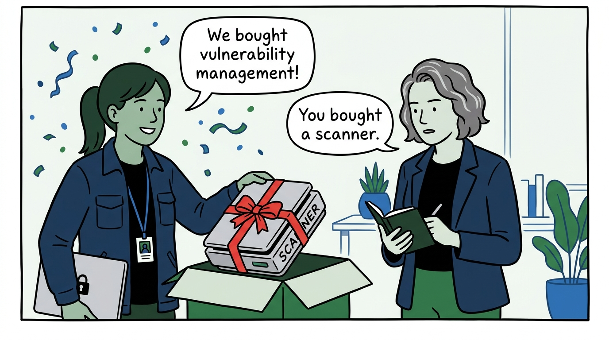
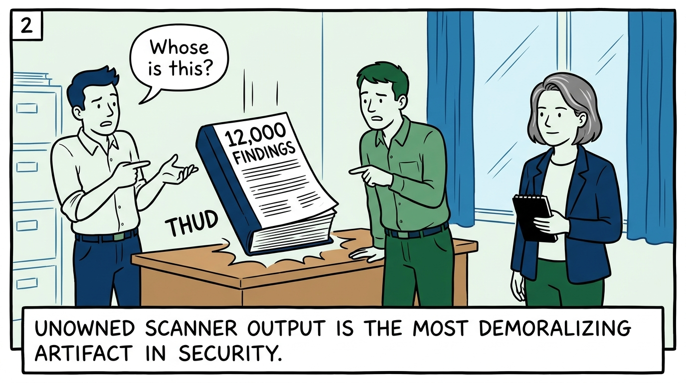
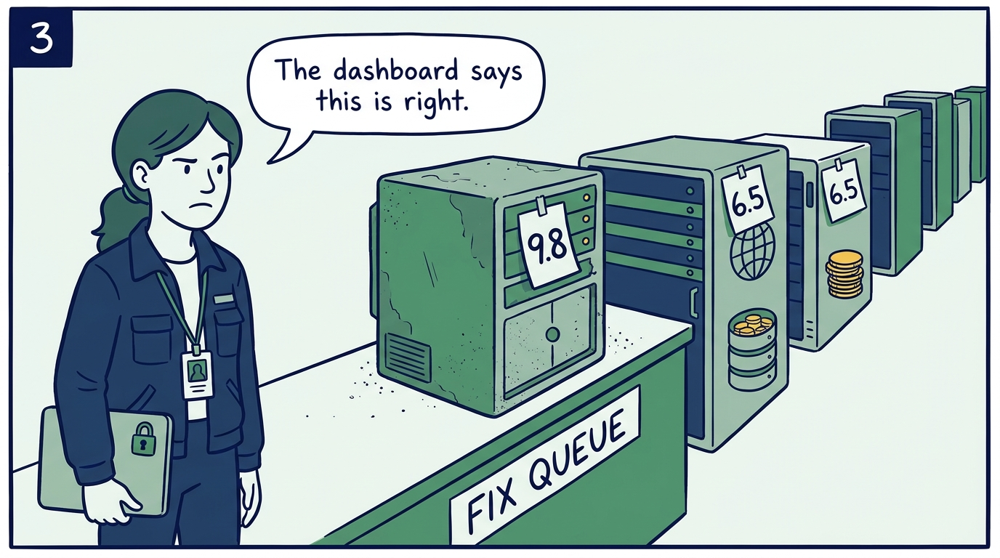
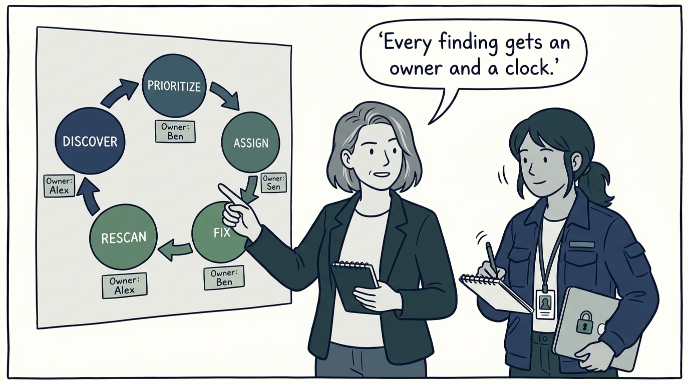
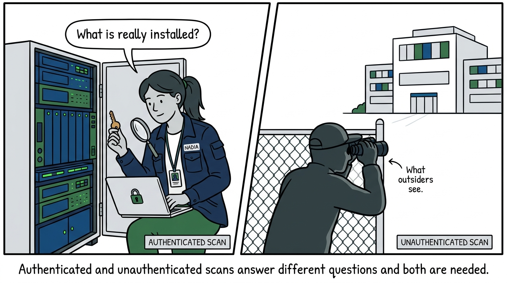
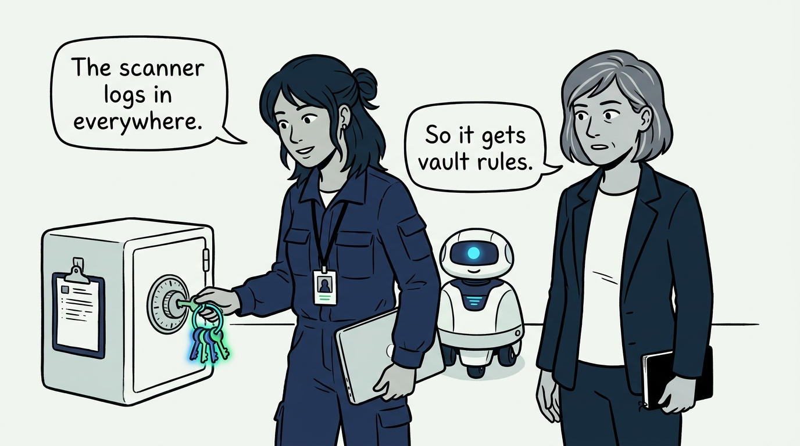
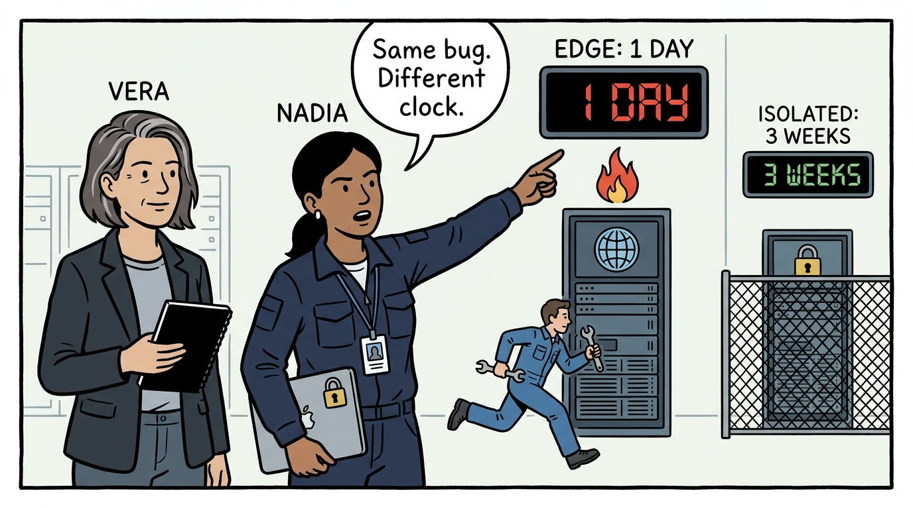
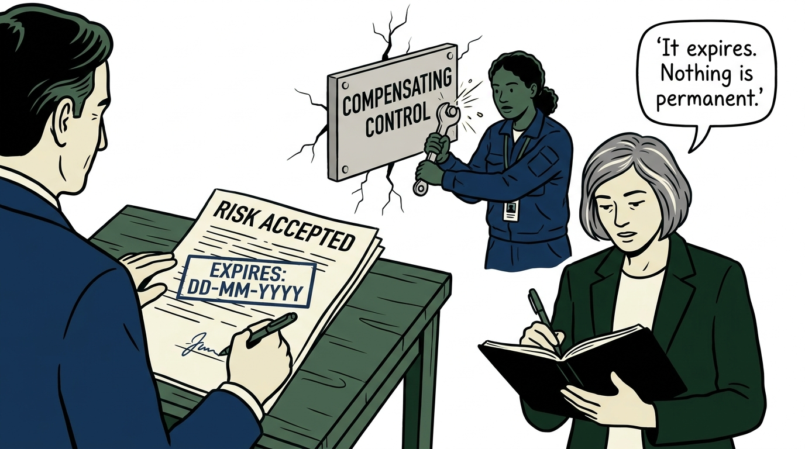
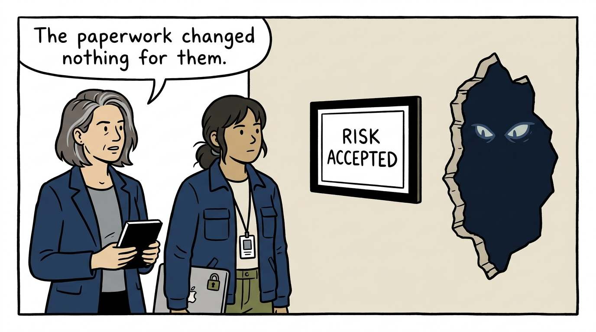

Why vulnerability management is a program with a clock, not a scanner with a license — in nine panels.

<!-- comic-style
{
  "cast": "VERA: a calm, seasoned engineering executive, short gray-streaked hair, dark blazer over a plain t-shirt, carries a small black notebook. NADIA: a hands-on defensive-security lead, shoulder-length dark hair tied back, navy utility jacket over a plain shirt, an access badge on a lanyard, laptop with a padlock sticker under one arm.",
  "style": "Clean two-tone explainer comic, thick ink outlines, flat colors with deep blue and green accents on a light background, generous white space, hand-lettered speech bubbles with SHORT readable text, no photorealism."
}
-->

**Panel 1:** *The hook: a scanner subscription is a tool with a license — vulnerability management is a program with owners.*

**Panel 2:** *The problem: the thousand-page handoff — raw findings with no owner, no priority, and no journey to done.*

**Panel 3:** *The wrong way: score-only triage — the isolated lab box outranks the internet-facing system, and everyone can feel it is wrong.*

**Panel 4:** *The principle: a formal program — detection through remediation, named owners at every station, running on a schedule, forever.*

**Panel 5:** *Practice: mix the scans — authenticated for what is truly installed, unauthenticated for the attacker's view, and never trust a banner alone.*

**Panel 6:** *Practice: the scanner's keys — least privilege, enabled only in approved windows, logged and reviewed, so the program never becomes the vulnerability.*

**Panel 7:** *Practice: SLAs by severity and exposure — 'fix it soon' is not a commitment; 'critical, internet-facing, one day' is, and overdue criticals escalate.*

**Panel 8:** *The exception: risk acceptance done honestly — a named senior owner, compensating controls, and an expiry date that forces the question again.*

**Panel 9:** *The closer: accepting a risk does not remove the vulnerability — the attacker's options are unchanged by our paperwork.*
