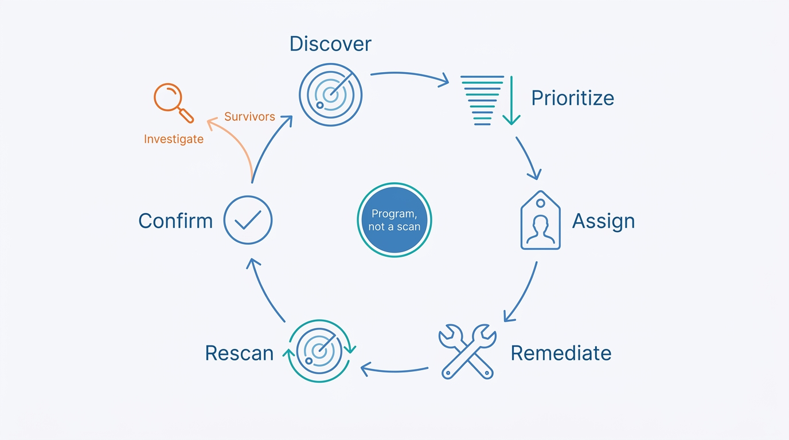
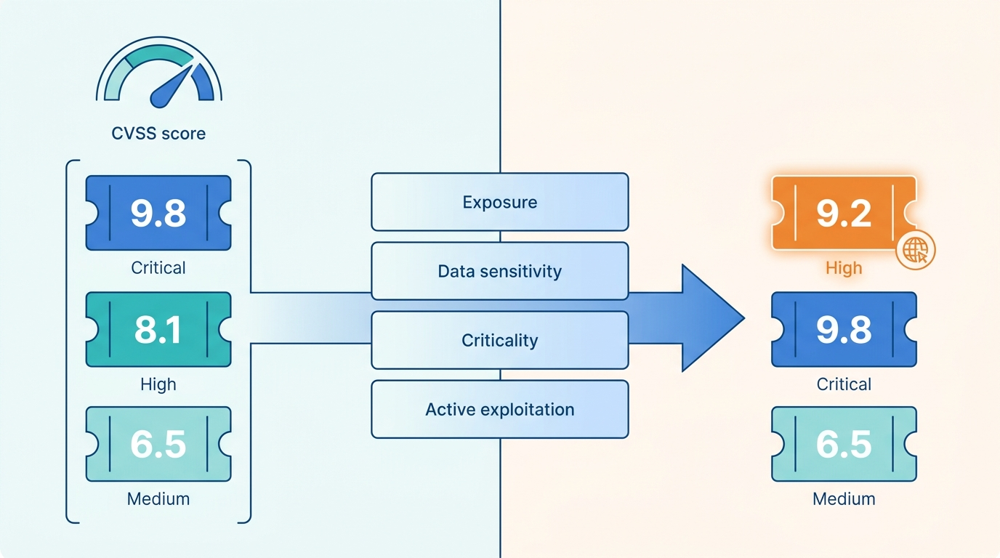
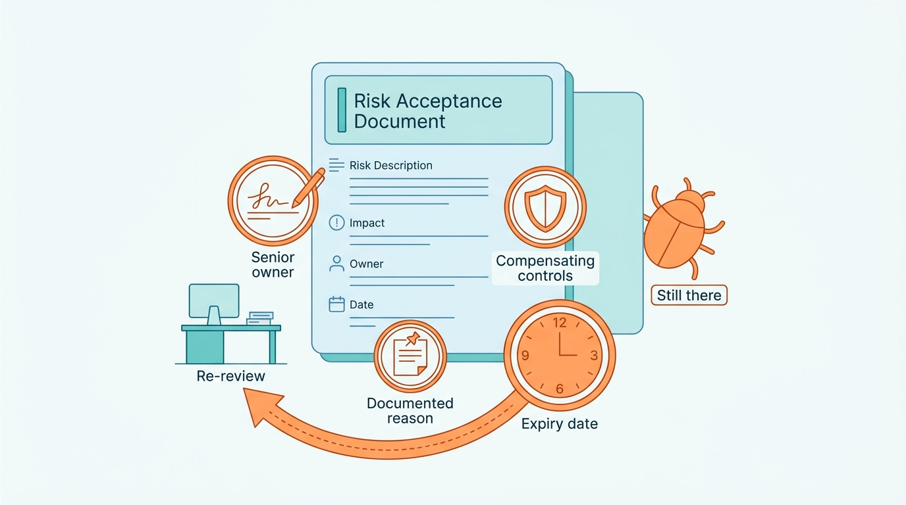

> **Status**: DRAFT
>
> **Principle**: In my organization, **vulnerability management is a program, not a scan** — a formal process with named owners that runs from detection through remediation, on a schedule, forever. **Scans are deliberately mixed**: authenticated where accurate software and configuration truth matters, unauthenticated where the attacker's view matters, and never trusted on banners alone. **Severity scores start the conversation; context finishes it** — data sensitivity, exposure class, business criticality, and live exploitation decide the order, and **remediation runs against SLAs by severity and exposure**, tracked as a KPI and escalated when criticals go overdue. **Risk acceptance is senior-approved, documented, compensated, and always expiring** — never permanent — because the chapter's reminder is my organization's rule: **accepting a risk does not remove the vulnerability.**

## Statement

When my organization manages vulnerabilities, this is the bar the program is held to.

**It is a program with owners, not a tool with a license.**

- A **formal vulnerability management process** exists, with documented policies, procedures, roles, and responsibilities, and named owners for discovery, remediation, tracking, and reporting.
- The program covers **detection through remediation** — not just scanning — and assessments run on an ongoing schedule, never as one-time events.

**Scanning is deliberate, credentialed, and safe.**

- **Authenticated and unauthenticated scans each have a decided place**: authenticated where accurate software, patch, and configuration information is required; unauthenticated to see what an external, credential-less attacker sees; both where coverage demands it. Service banners and reported versions are never trusted alone, and questionable results are validated for false positives *and* false negatives.
- **Scanning credentials are a privileged asset**: dedicated accounts with only the privileges required, protected authentication material, enabled only during approved scan windows where possible, disabled otherwise, with account activity logged and login times and source IPs reviewed for suspicious use.
- **Scanning does no harm**: legacy and fragile systems are identified first, scanners tested against sensitive systems before broad deployment, lower-impact scans used where appropriate, disruptive scans scheduled into approved maintenance windows, coordinated with system owners, with a rollback or recovery plan ready.

**Tools are selected against the estate, not the demo.**

- Tool choice is judged on **coverage of the technologies we actually run**, the gaps left across operating systems, applications, networks, and devices, the automation provided, the skill required to operate it, scope fit, and whether it detects missing patches, configuration weaknesses, and web-application issues where required.
- **Open-source options are weighed honestly** — Nmap-based discovery and unauthenticated assessment, tools like Flan Scan, osquery for endpoint software and configuration inventory, compared against CVE/NVD data — and adopted where they genuinely cover the environment.
- Automated scanners are **combined with deeper manual or penetration testing**, not treated as its substitute.

**The backlog is worked down, then the cycle never stops.**

- **Initialization expects a large backlog** and plans for it: findings grouped by owning team and technology, remediation batches formed, cross-cutting vulnerabilities patched through standardized procedures, fixes bundled into planned maintenance windows to minimize repeated testing and reboots, cycles repeated until the backlog is manageable.
- **Business-as-usual is a loop**: continuous discovery through scheduled scans, monitoring of vendor announcements and OS/software security releases, prioritization of new findings, assignment to responsible teams, tracking to completion, **rescan after remediation**, confirmation that resolved findings stay resolved, and investigation of anything that survives a remediation attempt.

**Figure 1:** *Business-as-usual is a loop, not an event: findings travel from discovery to confirmed remediation, and anything that survives a fix gets investigated.*

**Severity starts the ranking; context decides it.**

- Every vulnerability gets a recorded severity — **CVSS or an appropriate vendor rating** — and none is prioritized on that score alone.
- Context is added deliberately: **sensitivity of the data** on the affected system, **how many hosts** are affected, **business criticality**, **exposure class** — isolated, internal, partner-facing, or internet-facing, with priority rising with attacker exposure — **exploitation complexity and preconditions**, whether **user interaction** is required, whether **active exploitation** is known or likely, and the potential **business impact** of success.

**Remediation runs against the clock.**

- **SLAs are set by severity and exposure**, target times documented, SLA compliance tracked as a KPI, and **overdue critical vulnerabilities escalated**. The chapter's example targets — critical internet-facing fixed in a day, low isolated in three weeks — are the shape of the matrix; my organization maintains its own, and the full example lives in the Checklist tab.

**Risk acceptance is the exception, and it expires.**

- Acceptance is used **only when remediation is not practical within the required timeframe**, with the reason and blocking dependencies documented, **compensating controls** identified where possible, approval from an appropriately senior risk owner, and the accepting person recorded.
- **Every acceptance carries an expiration date** — permanent or indefinite acceptance does not exist. Accepted risks are reviewed periodically, reassessed before expiry, remediated when circumstances allow, and re-approved only deliberately. **Accepting a risk does not remove the vulnerability.**

**The program is measured, and the measurements change things.**

- Tracked: open vulnerabilities by severity, remediation times, SLA breaches, recurring vulnerabilities and configuration problems, accepted risks and their expiration dates, whether scanning coverage includes all relevant systems, and scanner effectiveness and coverage gaps — with **trends feeding improvements in patching, configuration management, and operational process**.

## How to Read This

This record opens the **Assess and Improve** section of the journal: the estate has been hardened record by record — [[windows-infrastructure]], [[unix-servers]], [[endpoints]], [[databases]], [[cloud-infrastructure]] — and this section is the continuous loop that finds where reality fell short and closes the gap. It is grounded in the Vulnerability Management chapter of the *Defensive Security Handbook* (Brotherston, Berlin, and Reyor). The full working checklist — every step from establishing the program through measuring it, including the example remediation-target matrix — lives in the **Checklist** tab; the management summary is in the **TL;DR** tab and the conversation in the **Conversation** tab.

## Rationale

**A scan is a snapshot; a program is a capability.** The chapter's first move is the one most organizations skip: process, roles, and ownership before tooling. A scanner without named owners for discovery, remediation, tracking, and reporting produces the most demoralizing artifact in security — the thousand-page PDF nobody is responsible for. The program framing makes the finding's journey the unit of work: detected, prioritized, assigned, fixed, rescanned, confirmed. Anything less is measurement theater.

**The attacker does not log in, and neither does one of my scans.** Authenticated and unauthenticated scanning answer different questions — *what is actually installed* versus *what does an outsider see* — and using only one produces a confident half-truth. The same honesty applies inside a single scan: banners lie, reported versions lie, and a result that decides real remediation work gets validated both ways, for the false positive that wastes a team's window and the false negative that quietly stays exploitable.

**The scanner is one of the most privileged accounts in the estate — treat it like one.** An authenticated scanner holds credentials to nearly everything, which makes it a first-class target: compromise the scanner and you inherit its keys. That is why the record's scan-credential discipline is not bureaucracy — least privilege, windows-only enablement, disabled at rest, logged, and reviewed for suspicious logins. A vulnerability program that itself becomes the vulnerability is not a paradox; it is negligence.

**Scanning that breaks production teaches the organization to fear the program.** One knocked-over legacy system buys years of "don't scan that." The safe-scanning discipline — fragile systems identified first, low-impact scans, maintenance windows, owner coordination, rollback plans — is what keeps the program's license to operate. The goal is a program teams schedule around, not one they route around.

**Severity without context misallocates the scarcest resource — remediation attention.** CVSS answers "how bad is this in general"; it cannot answer "how bad is this *here*." A critical on an isolated lab machine and a medium on an internet-facing system holding sensitive data are not in the score's order. Layering exposure class, data sensitivity, criticality, and live exploitation over the score is how the fix queue matches the actual risk queue — and it is why the record refuses single-number triage in both directions.

**Figure 2:** *The score starts the conversation; context finishes it — exposure, data sensitivity, criticality, and live exploitation reorder the fix queue.*

**SLAs turn intent into accountability.** "Fix it soon" is not a commitment; "critical, internet-facing, one day" is. Documented targets by severity and exposure give remediation teams an unambiguous clock, give the program a KPI that means something, and give escalation a trigger that is not a mood. The matrix also does quieter work: it makes the cost of exposure visible — the same vulnerability is a one-day emergency at the edge and a seven-day task on an isolated segment, which is an argument [[network-segmentation]] gets to collect on.

**Risk acceptance without an expiry date is just risk denial with paperwork.** There are legitimate reasons a fix cannot land in the SLA — dependencies, fragile platforms, business timing. The record's discipline keeps acceptance honest: documented reasons, compensating controls, a senior owner whose name is on it, and an expiration that forces the question to be asked again. The chapter's closing reminder is the reason for all of it — accepting a risk does not remove the vulnerability. The attacker's options are unchanged by our paperwork.

**Figure 3:** *Acceptance is an expiring exception, not a fix: senior-owned, compensated, documented — and the vulnerability is still there when the clock runs out.*

**What gets measured gets fixed upstream.** Counting open findings is bookkeeping; tracking trends — recurring vulnerabilities, repeated configuration weaknesses, chronic SLA breaches on one platform — is diagnosis. The program's highest-value output is not any single fix but the pattern that says *our patching process is broken here* or *this configuration keeps regressing* — the signal that improves patching, configuration management, and operations so next quarter's backlog is structurally smaller.

## What This Means in Practice

| What this record says | What it does **not** say |
| --- | --- |
| A formal program with named owners covers detection through remediation. | Buying a scanner constitutes a program, or security owns everyone's remediation work. |
| Authenticated and unauthenticated scans are both used, each where it answers the right question. | One scan type fits all, or banner-reported versions can be trusted. |
| Scanner credentials are least-privilege, window-limited, logged, and reviewed. | The scanner runs as a domain administrator around the clock because it is convenient. |
| Disruptive scans are coordinated, windowed, and backed by rollback plans. | Fragile systems are exempt from scanning forever — safety is a method, not an exemption. |
| CVSS or vendor severity is recorded for every finding — and context decides the order. | The score alone sets priority, or severity ratings can be skipped as long as we "know our systems." |
| Remediation SLAs are set by severity and exposure, tracked, and escalated. | Every finding is an emergency, or SLA breaches are a reporting footnote. |
| Risk acceptance is senior-approved, compensated, documented, and expiring. | A risk register entry is a fix, or acceptance can be permanent. |
| Rescans confirm fixes; survivors get investigated. | A closed ticket is proof of remediation. |

Concretely: every scan finding in my organization has an owner, a severity, a context-adjusted priority, and a clock. The first review question about the program is not *"how many vulnerabilities did we find?"* but *"what fraction of criticals beat their SLA last quarter, which risks are expiring this month, and what recurring pattern are we fixing upstream?"*

## Anti-Patterns

- **The annual scan.** A once-a-year assessment for the auditor — twelve months of new vulnerabilities discovered in one indigestible lump, then forgotten for another twelve.
- **The thousand-page handoff.** Raw scanner output emailed to engineering as-is — ungrouped, unprioritized, unowned — and treated as remediation having occurred.
- **Score-only triage.** The queue sorted by CVSS alone: the isolated lab box outranks the internet-facing system with sensitive data, and everyone can feel that it is wrong while the dashboard says it is right.
- **The immortal acceptance.** A risk accepted in 2021, owner since departed, compensating controls never built — permanent by inertia, invisible by design.
- **The domain-admin scanner.** Scan credentials with sweeping privileges, always enabled, never reviewed — the vulnerability program running as the estate's most attractive target.
- **The scan that cried outage.** Nobody warned the owners, the legacy system fell over, and the program spent its credibility buying a decade of "don't scan that subnet."
- **Fixed, trust me.** Remediation closed on the ticket's word, never rescanned — the vulnerability still there, now wearing a green checkmark.
- **The trendless dashboard.** Counts reported quarterly with no memory — the same vulnerability class recurring forever because nobody is charged with fixing the process that keeps producing it.

## Related Records

- [[asset-management]] — you cannot scan what you do not know exists; coverage completeness is judged against the inventory.
- [[secure-software-development]] — finding vulnerabilities in the code we write, before they reach the estate this program scans.
- [[osint-purple-teaming]] — the deeper adversarial testing this record says scanners should be combined with.
- [[windows-infrastructure]] — the patching and hardening mechanics this program's SLAs put a clock on, Windows side.
- [[unix-servers]] — the same, Unix side.
- [[network-segmentation]] — exposure class drives the SLA matrix; segmentation is what moves a system into a slower, saner remediation lane.
- [[compliance]] — scan cadence, SLAs, and risk-acceptance records are exactly what assessors ask to see.

## Scope and Revisiting

This record is `draft`. It applies to the entire estate my organization operates — servers, endpoints, network devices, databases, and cloud — as the bar for the vulnerability management program. I revisit it if SLA compliance stays chronically red on any severity class (the targets are wrong or the remediation capacity is — either way the record must say so), if the accepted-risk register grows or ages beyond what periodic review actually reads, if scanning coverage falls behind the asset inventory, or if the threat landscape shifts the exposure math — for instance, active-exploitation intelligence becoming reliable enough to drive SLAs more directly than severity does.

## Authoritative References

- *Defensive Security Handbook*, 2nd edition (Lee Brotherston, Amanda Berlin, and William F. Reyor III; O'Reilly) — the Vulnerability Management chapter, whose checklist (including the example remediation-target matrix) this record distills.
- **CVSS** — the Common Vulnerability Scoring System, the severity baseline the chapter names.
- **CVE / NVD** — the vulnerability identifier and database ecosystem the chapter names for comparing discovered software versions.
