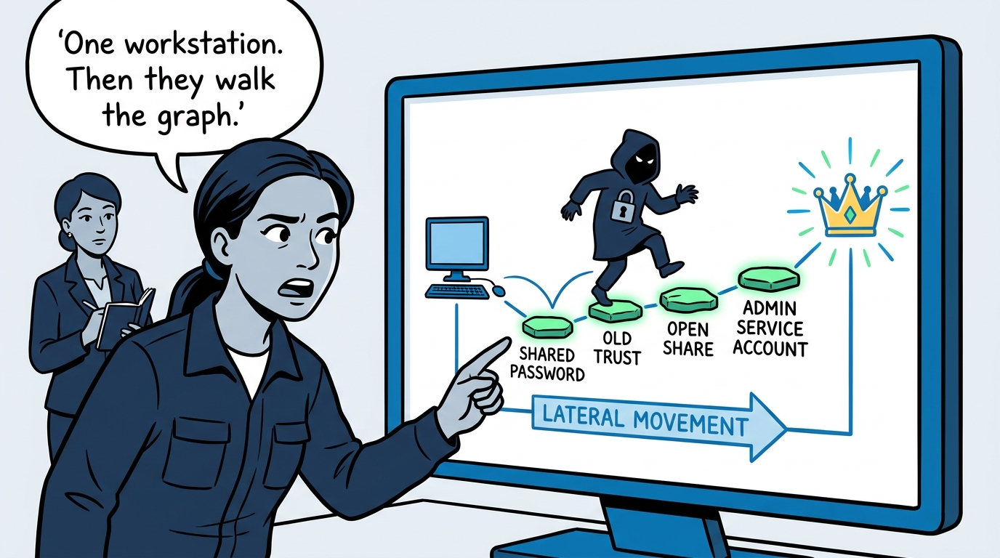
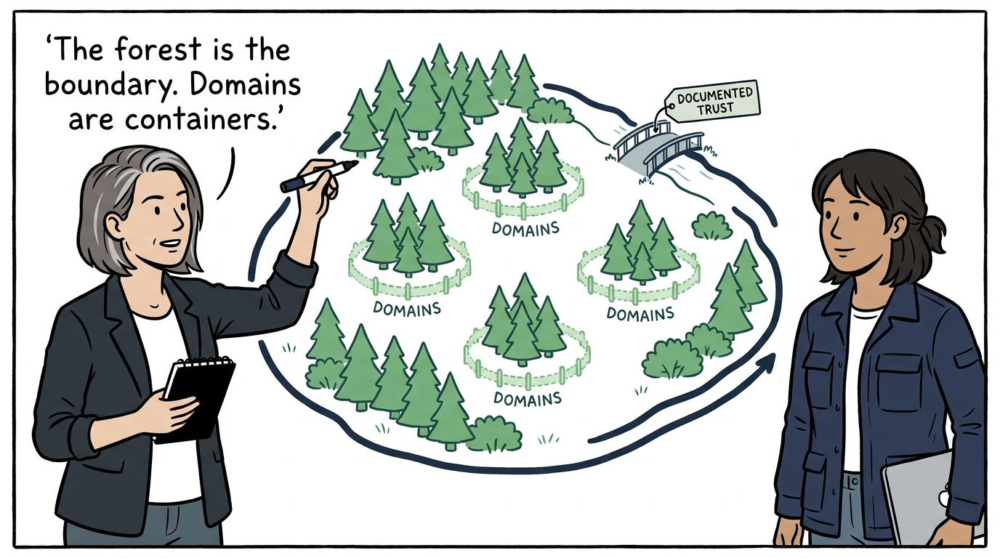
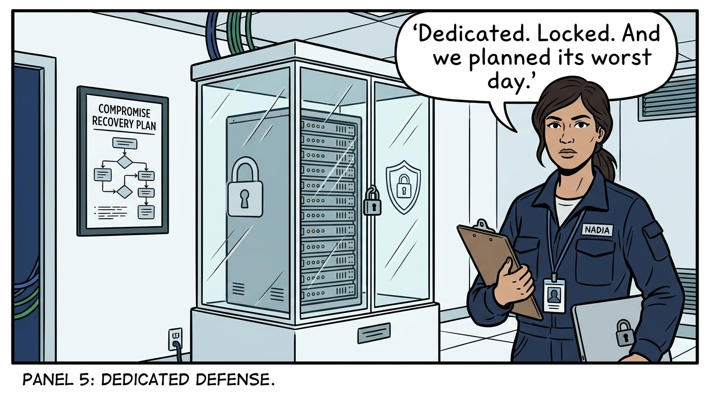
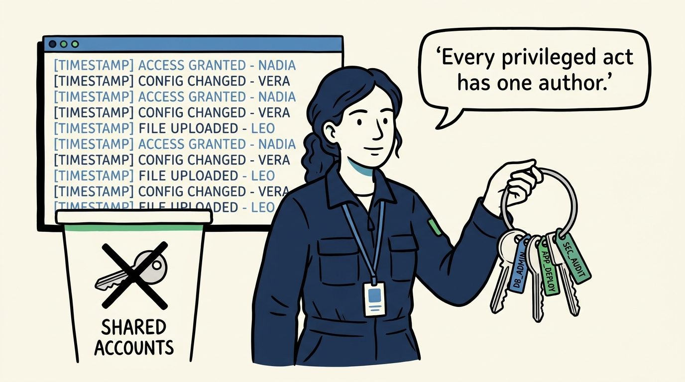
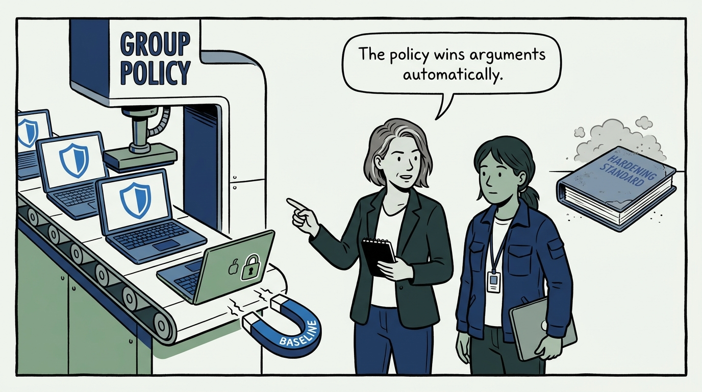
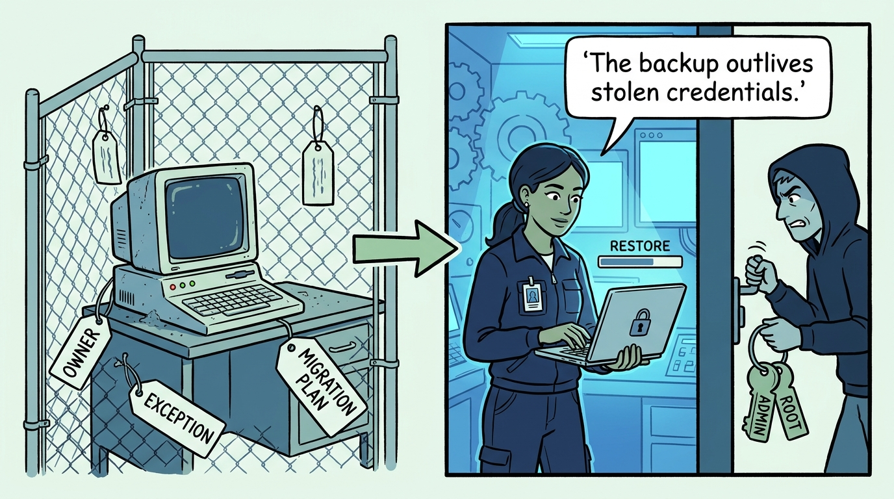
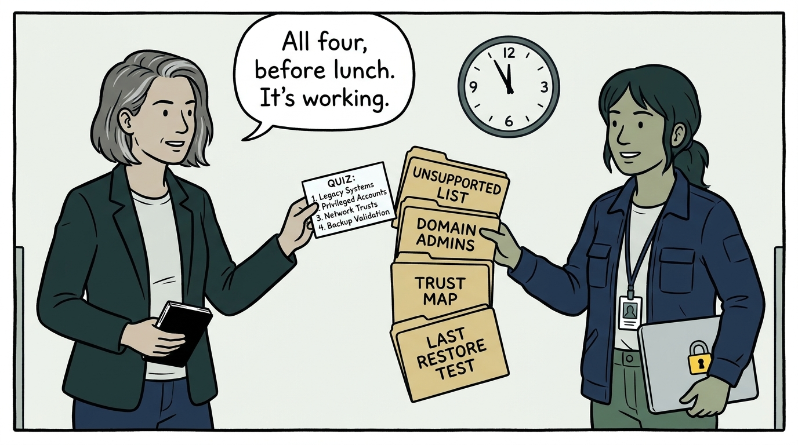

Why a Windows estate is one security system with the forest as its boundary — in nine panels.

<!-- comic-style
{
  "cast": "VERA: a calm, seasoned engineering executive, short gray-streaked hair, dark blazer over a plain t-shirt, carries a small black notebook. NADIA: a hands-on defensive-security lead, shoulder-length dark hair tied back, navy utility jacket over a plain shirt, an access badge on a lanyard, laptop with a padlock sticker under one arm.",
  "style": "Clean two-tone explainer comic, thick ink outlines, flat colors with deep blue and green accents on a light background, generous white space, hand-lettered speech bubbles with SHORT readable text, no photorealism."
}
-->

**Panel 1:** *The hook: a Windows estate is one security system, not a fleet of servers — authentication, trust, and policy connect every machine to every other.*

**Panel 2:** *The problem: an attacker who lands on one workstation walks the graph — shared local passwords, forgotten trusts, writable shares, over-privileged service accounts.*

**Panel 3:** *The wrong way: the dual-purpose domain controller — the estate's root of trust carrying the estate's everyday attack surface.*

**Panel 4:** *The principle: the forest is the security boundary, domains are containers — and every trust through the wall is documented, minimized, and removed when it stops earning its risk.*

**Panel 5:** *Practice: domain controllers get crown-jewel treatment — dedicated, physically secured, encrypted, logon-restricted, with a tested compromise plan that honestly contemplates forest rebuild.*

**Panel 6:** *Practice: privilege minimization is an attribution guarantee — minimal Domain Admins, unique managed local passwords, dedicated service accounts, no shared identities.*

**Panel 7:** *Practice: a baseline that is not enforced is a preference — Group Policy built on recognized baselines pulls machines back from drift, and new systems land managed from birth.*

**Panel 8:** *The cost: legacy is a signed risk decision — named, isolated, owned — and recovery assumes the credentials are gone: tested AD restores from backups ordinary admin compromise cannot touch.*

**Panel 9:** *The closer: the record's health check — the unsupported-systems list, Domain Admins membership, the trust map, and the last restore-test date, each producible within a day.*
