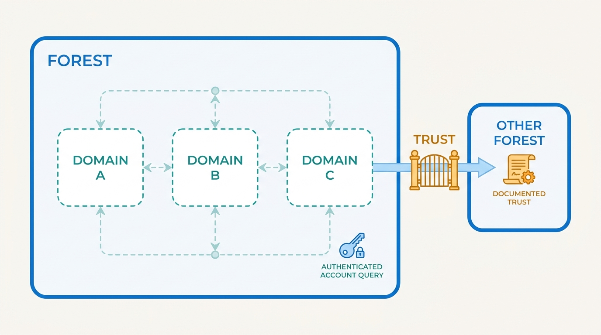
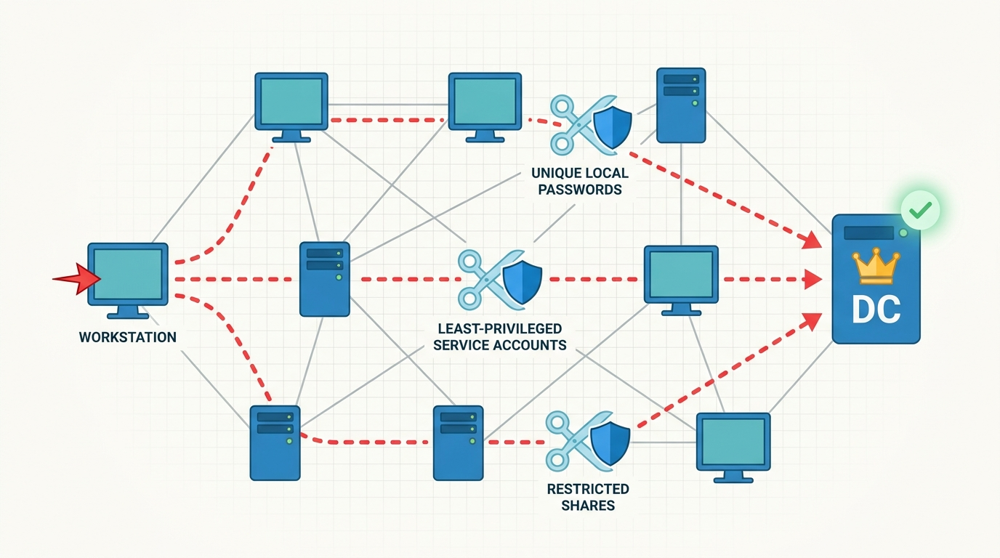
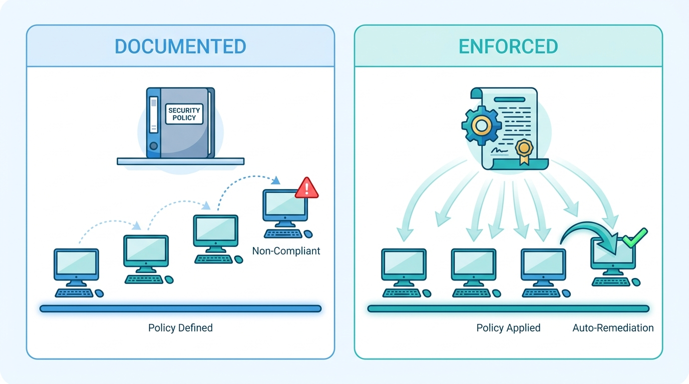

> **Status**: DRAFT
>
> **Principle**: My organization runs its Windows estate as **one security system, not a fleet of servers** — and the real boundary of that system is the **Active Directory forest**, not the domain. **Nothing unsupported stays on the network without an approved exception and isolation**; patching is centrally managed for Windows *and* the third-party software attackers actually exploit; **domain controllers are the crown jewels** — dedicated, physically secured, never dual-purpose, with a tested plan for their compromise; **privilege is minimized, individually attributable, and monitored** — unique local administrator passwords on every endpoint, dedicated non-interactive service accounts, no shared identities; and **the security baseline is enforced through Group Policy**, built on recognized baselines, so a machine cannot drift out of it unnoticed. The test I hold the estate to: **every privileged action is attributable to a named person, and a compromised domain controller has a documented, tested path back**.

## Statement

This is the bar I hold my organization's Windows infrastructure to, from the oldest legacy box to the forest root.

**Nothing unsupported without an owner and an exception.**

- Unsupported Windows versions are upgraded; systems that cannot be upgraded because of legacy or vendor-dependent applications are **identified, removed where possible, and isolated on dedicated VLANs or an air-gapped network where not**; their business risk is documented, communicated to business and technical stakeholders, and paired with a replacement or migration plan.

**Patching is central — and covers what attackers actually exploit.**

- A centralized update platform (WSUS, Configuration Manager, or equivalent) applies Windows security updates promptly **and patches the commonly exploited third-party software** — browsers, Java, PDF applications. Installed software is inventoried, the unnecessary removed, the unpatchable tracked and wrapped in compensating controls.

**Shares expose only what they must.**

- SMB and file shares are inventoried, scanned for unexpected exposure, reviewed for sensitive information, and pruned; permissions — **both share and NTFS** — are restricted to the users and groups that need them, and re-audited periodically.

**The forest is the security boundary; domains are containers.**

- The Active Directory forest is treated as a major security boundary; **individual domains are not** — they are structural and administrative containers, and directory information is assumed queryable by any authenticated account. Every cross-forest and cross-domain trust is documented, understood by stakeholders, and minimized: unneeded trusts removed, one-way trusts preferred, SID filtering and selective authentication applied where warranted, and hybrid or cloud-connected directories covered by appropriate authentication controls.

**Figure 1:** *The forest is the boundary; domains are containers — and every trust is a documented, minimized gate through that boundary.*

**Domain controllers are the crown jewels.**

- Domain controllers are **dedicated, high-value assets** — never workstations, never dual-purpose servers. Physical access is restricted (dedicated racks or cages; read-only domain controllers for less secure locations, still physically protected); TPM and drive encryption protect their storage; interactive logons and administrative access are restricted; and **a documented response and recovery plan exists for their compromise** — with the honest understanding that a serious one may mean rebuilding the forest.

**Directory structure serves administration and policy — nothing else.**

- FSMO role placement is documented, deliberate, reviewed after infrastructure changes, and covered by transfer/seizure procedures. OUs are designed around clear administrative and policy requirements, delegate rights at the right scope, and are pruned of obsolete containers and privileges. Group nesting follows a consistent model — users into global groups, global into domain local, domain local onto resource ACLs, universal groups where multi-domain reach requires — with stale and unresolved SIDs cleaned up.

**Privilege is minimized, dedicated, and attributable.**

- **Domain Admins membership is minimized** and all privileged groups are reviewed; nobody keeps permanent admin rights they do not require, and no application gets administrator access because that is easier than determining what it actually needs. Privileged activity is logged and monitored, and administrators use separate admin and normal-user accounts.
- **Service accounts are dedicated, least-privileged, non-interactive**, consistently named, documented, monitored, and removed when no longer required.
- **Local administrator passwords are unique and managed** — Microsoft LAPS or an equivalent approved solution — with retrieval restricted, use audited, and exempt systems reviewed.
- **Shared accounts are eliminated wherever possible**; the unavoidable ones are documented with their business justification, closely monitored, and periodically re-challenged.

**The baseline is enforced through Group Policy.**

- Windows security settings are centrally enforced through GPOs that are named to a standard, documented, tested before broad deployment, minimized against conflict, and permission-restricted. **Recognized security baselines — applicable NIST or Microsoft recommendations — are the starting point**; legacy protocols and weak settings are disabled through policy; core protections are duplicated in local policy so a machine temporarily off the domain stays protected; and GPOs are audited regularly for obsolete or duplicate settings.
- **New systems land managed**: newly joined computers are redirected out of default containers into controlled OUs, receive baseline GPOs immediately, and their placement and policy application are verified.

**The estate is watched — and recoverable.**

- Windows and Active Directory security logging is enabled and collected centrally; privileged accounts, privileged-group changes, unusual authentication, trust changes, GPO changes, service-account activity, and unusual SMB access are monitored — and **logs are reviewed, not just collected**.
- Physical access to critical Windows infrastructure is restricted; **tested backups of Active Directory exist, restoration is exercised regularly, recovery procedures assume privileged credentials are compromised, and backup systems are protected from ordinary administrative compromise**. Current network and AD architecture documentation is maintained.

## How to Read This

This record sits in the **Hardening the Estate** section, between [[physical-security]] — which protects the rooms and racks the domain controllers live in — and [[unix-servers]] and [[endpoints]], which harden the rest of the fleet. It is grounded in the Microsoft Windows Infrastructure chapter of the *Defensive Security Handbook* (Brotherston, Berlin, Reyor). The chapter is necessarily concrete — Active Directory, Group Policy, LAPS, FSMO roles — and the **Checklist** tab keeps every one of those specifics verbatim; this article states the commitments at the capability level, with the Microsoft mechanisms as the worked example, because the commitments (one boundary, crown-jewel controllers, attributable privilege, enforced baselines) would hold under any directory-centered estate. The management summary lives in the **TL;DR** tab and the conversation in the **Conversation** tab.

## Rationale

**A Windows estate is one system, and attackers treat it that way.** Active Directory connects every machine to every other through authentication, trust, and policy — which means the estate's real attack surface is the graph, not the individual servers. An attacker who lands on one workstation walks the graph: shared local admin passwords, over-privileged service accounts, forgotten trusts, writable shares. That is why this record refuses to talk about "hardening servers" one at a time and instead fixes the system-level properties — the boundary, the privilege model, the baseline, the watchtower.

**Figure 2:** *Attackers walk the graph, not the server list — unique local passwords, least-privileged service accounts, and pruned shares cut the edges.*

**The forest is the boundary because the domain never was.** The chapter is blunt about a mistake organizations keep making: treating domains as security boundaries. Directory information is queryable by any authenticated account, and domain separation alone protects nothing highly sensitive. Accepting that reframes trust management as boundary management: every cross-forest trust is a hole in the perimeter, so each one is documented, justified to stakeholders, made one-way where possible, filtered and restricted where warranted — and removed the moment it stops earning its risk. Hybrid and cloud-connected directories extend the same boundary and get the same scrutiny, which is where this record meets [[cloud-infrastructure]] and [[authentication]].

**Whoever controls a domain controller controls every account — so it gets crown-jewel treatment.** A domain controller is not a server that happens to be important; it is the root of trust for the entire estate. Hence the absolutes: never a workstation, never dual-purpose, physically secured per [[physical-security]], encrypted at rest, logon-restricted. And hence the most sobering commitment in the record: a documented, tested plan for DC compromise, written with the honest understanding that a serious compromise may mean rebuilding the forest. Planning for that outcome before it happens is the difference between a hard month and an existential one — the estate-level instance of [[disaster-recovery]].

**Privilege minimization is really an attribution guarantee.** Minimal Domain Admins, separate admin accounts, dedicated service accounts, no shared identities, LAPS-managed local passwords — these controls share one purpose: when something privileged happens, a named person did it. Shared accounts destroy attribution; a single reused local administrator password turns one compromised endpoint into all of them; a service account that people also log in with is both. The record does not ask for less administration — it asks that every administrative act have exactly one author, because that is what monitoring, forensics, and accountability all stand on.

**A baseline that is not enforced is a preference.** The difference between a hardening standard in a binder and a GPO is that the GPO wins arguments automatically: machines drift back to the baseline instead of away from it. Building on recognized baselines — NIST, Microsoft — means not deriving hundreds of settings from first principles; testing GPOs before broad deployment and auditing them for conflicts keeps the enforcement mechanism itself trustworthy; and putting core protections in local policy means a laptop off the domain does not silently shed its armor. The default-container rule is the same idea at birth: a machine should never exist, even briefly, outside the baseline.

**Figure 3:** *A baseline that is not enforced is a preference: Group Policy wins the argument automatically, pulling drift back instead of letting it accumulate.*

**Legacy is a risk decision, not a default.** Every estate has the system that cannot be upgraded — the vendor application, the production line dependency. The record does not pretend these away; it forces them into the open: named, isolated on their own VLANs or air-gapped, their risk documented and communicated to the business, with a migration plan and an approved exception. The unacceptable state is the quiet one — the unsupported machine on the flat network that nobody signed for. [[vulnerability-management]] carries the same exception discipline estate-wide.

**Recovery must assume the credentials are gone.** The final commitments — central logging that is actually reviewed, monitoring of exactly the things attackers change (privileged groups, trusts, GPOs), tested AD backups, and backup systems protected from ordinary administrative compromise — form one argument: the estate must be able to detect the attack that got in and recover from the attack that won. A backup an attacker with admin credentials can encrypt or delete is not a backup; a restoration procedure never exercised is a hope. Detection at this depth feeds [[logging-and-monitoring]]; the recovery discipline is [[disaster-recovery]] applied to the directory itself.

## What This Means in Practice

| What this record says | What it does **not** say |
| --- | --- |
| Unsupported systems leave the network, or stay isolated under a documented, approved exception with a migration plan. | Legacy systems are forbidden — they are named, isolated, and owned. |
| Patching is centrally managed and includes commonly exploited third-party software. | Every patch deploys instantly everywhere — promptness with tracking, not recklessness. |
| The forest is the security boundary; trusts are documented, minimized, and restricted. | Multi-domain or multi-forest designs are wrong — they must simply be treated as what they are. |
| Domain controllers are dedicated, physically secured, and covered by a tested compromise-recovery plan. | DCs merely need good passwords — their compromise is planned for, up to forest rebuild. |
| Privilege is minimized and individually attributable: LAPS, dedicated service accounts, no shared identities. | Administration gets harder — it gets authored; unavoidable shared accounts are documented and monitored. |
| The baseline is enforced through Group Policy, starting from recognized NIST/Microsoft baselines. | Baselines are adopted wholesale without testing — GPO changes are tested before broad deployment. |
| Logs are collected centrally and reviewed; AD backups are tested and protected from admin compromise. | Collecting logs is monitoring — unreviewed logs and unexercised restores count as absent. |

Concretely: my organization can produce, on request, the list of unsupported systems and their exceptions, the Domain Admins membership and why each member is there, the trust map, and the date of the last successful AD restoration test. If any of those four takes more than a day to produce, this record is failing in practice.

## Anti-Patterns

- **The dual-purpose domain controller.** The DC that is also the file server, print server, or someone's RDP jump box — the estate's root of trust carrying the estate's everyday attack surface.
- **The eternal Domain Admin.** Everyone who ever needed elevated rights, still in the group — membership grows monotonically because removal requires a conversation nobody starts.
- **One password to rule them all.** The same local administrator password on every endpoint; one compromised machine silently becomes all of them. LAPS exists precisely to kill this.
- **The service account that is a person.** Service accounts used for interactive logons, or admins doing daily work with privileged identities — attribution and least privilege both destroyed in one habit.
- **The trust nobody remembers.** A bidirectional forest trust created for a migration that finished years ago, undocumented, unfiltered, and quietly extending the security boundary to an estate nobody audits.
- **The GPO graveyard.** Hundreds of unnamed, undocumented, conflicting GPOs where nobody can predict what a machine actually receives — the enforcement mechanism itself no longer trusted.
- **The XP machine on the flat network.** The unsupported system everyone knows about and nobody signed for — no isolation, no exception, no owner, no plan.
- **The backup the attacker can reach.** AD backups administrable with the same credentials the attacker just stole — recoverability that evaporates exactly when it is needed.

## Related Records

- [[physical-security]] — the racks, cages, and remote-office enclosures that make "restrict physical access to domain controllers" real.
- [[unix-servers]] — the same hardening discipline applied to the other half of the server estate.
- [[endpoints]] — the workstations this infrastructure authenticates and polices; LAPS and baseline GPOs land there.
- [[authentication]] — the identity layer above the directory: password policy, MFA, and credential hygiene.
- [[vulnerability-management]] — the estate-wide patching, scanning, and exception cadence this record's update discipline plugs into.
- [[logging-and-monitoring]] — where the centrally collected AD security logs are actually watched.
- [[disaster-recovery]] — the tested-restore discipline that DC compromise planning and protected backups instantiate.

## Scope and Revisiting

This record is `draft`. It applies to every Active Directory forest, domain-joined system, and hybrid directory my organization operates. I revisit it if the directory architecture changes materially (a merger bringing new forests and trusts, a move to cloud-primary identity where the forest stops being the operative boundary), if an audit finds privileged actions that cannot be attributed to a named person (the attribution claim failing in practice), or if an AD restoration test fails or is silently skipped — an untested recovery path is the one failure mode this record refuses to tolerate.

## Authoritative References

- *Defensive Security Handbook*, 2nd edition (Lee Brotherston, Amanda Berlin, and William F. Reyor III) — the Microsoft Windows Infrastructure chapter, whose checklist this record distills.
- Applicable NIST and Microsoft security baselines and recommendations — named by the chapter as the starting point for Group Policy security settings.
