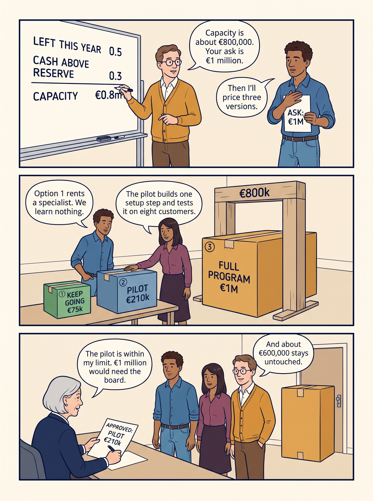

# Comic pages pilot: 04-obligations-before-budget

*comic-pages-v1: each image is one page of three stacked full-width strips; dialogue, labels and amounts are drawn in the image; the caption under the image is short and carries the first-use explanations the spec requires.*

A positive earnings figure does not establish the cash available for a new initiative. Seven pages follow Alex’s €1 million request: from the earnings figure down to the cash that is left, through the payments the company must make and the ones it chooses, past two ways the numbers mislead and one way time runs out, to three priced options, one approval and the dates that follow it.

Alex leads technology, Sam leads finance, Priya leads product and Ines is the chief executive of Larkspur, a fictional company. All are fictional. Pages 3, 4 and 5 step away from Larkspur’s figures; each opens by stating its own. EBITDA is earnings before interest, taxes, depreciation and amortization. The last two spread an asset’s cost over the years it is used. EBITDA is a profit measure, not a bank balance.

## Page 1: Profit is not cash

**Strip 1.** Alex strides into Sam's office, cheerful, holding up a one-page report. Sam sits at a desk. On the desk stands ONE single tall tower of exactly ten large, thick gold blocks stacked one on top of another, like gold bricks, each block the same size. There is only one tower.

- **Alex:** “We earned €10 million. Can I have €1 million?”
- **Sam:** “That's profit, not cash. Watch what comes out of it.”
- *In the picture:* `EBITDA €10.0m`

**Strip 2.** A long desk seen from the front. Sam stands behind the desk at the left, Alex beside him, his smile fading. Sam has taken the tower apart. Three open trays stand in a row on the desk and hold the thick gold bars he removed, already lying inside them: a column of exactly 4 bars in the first tray, exactly 1 bar in the second tray, a column of exactly 2 bars in the third tray. The three columns have clearly different heights: 4, 1, 2. Further right on the desk, only a column of exactly 2 bars of the tower remains. At the far right of the strip, standing on the floor apart from the desk, a customer in plain grey clothes hugs one gold bar against their chest with one arm and holds up a sheet of paper in the other hand; that bar has not reached the desk. Sam points across the desk at the customer. Every bar is the same size, so the amounts can be counted. Bars are always stacked flat in ONE single vertical column, one bar per layer, never side by side and never in a pyramid, so each column can be counted.

- *Narration:* All figures in € millions.
- **Sam:** “Interest. Tax. Planned investment. And one bar our customers still owe us.”
- *In the picture:* `INTEREST −4.0` · `TAX −1.0` · `INVESTMENT −2.0` · `STILL LEFT: 2.0` · `UNPAID INVOICES −1.0`

**Strip 3.** The right end of the same desk. One open tray holds exactly one whole thick gold bar with one thin half-height bar lying flat on top of it, nothing else. Beside the tray, all that remains on the desk is one single thin half-height bar, clearly half as thick as the whole bar in the tray. Alex, at the left, bends down to look at it, surprised. Sam, at the right, stands calmly with a clipboard.

- **Alex:** “Ten became half a million?”
- **Sam:** “Yes. And we still have to check the payment dates.”
- *In the picture:* `LOAN REPAYMENT −1.5` · `LEFT: 0.5`

**Caption under the image:** Fictional Larkspur model, in € millions. EBITDA, a profit measure, is 10.0. Interest, the charge for borrowing, takes 4.0; tax takes 1.0; planned investment in assets, things the company will use for years, takes 2.0. Another 1.0 is sales already counted in the earnings that customers have not paid yet: they owed €2 million at the start of the year and €3 million at the end, so only the €1 million increase is deducted. Repaying part of the loan takes 1.5, which leaves 0.5. Payroll is already inside EBITDA.

## Page 2: Payments the company must make, and payments it chooses

**Strip 1.** Alex stands at the LEFT of the strip, gesturing toward the right as if to take something back. Sam stands at the RIGHT of the strip beside a steel cabinet with a large padlock hanging on its open door. Three large gold bars already lie on the cabinet's shelves, one bar per shelf, each with a word printed on its side, fully visible and not covered by any hand. Sam rests one hand on the cabinet door. Alex's bubble is on the left above Alex; Sam's bubble is on the right above Sam.

- **Alex:** “Then cut one of those lines.”
- **Sam:** “These move only if the lender or the law allows it.”
- *In the picture:* `MUST PAY` · `INTEREST` · `LOAN REPAYMENT` · `TAX`

**Strip 2.** Next to the steel cabinet stands an open wooden shelf with no door. Sam sets two large gold bars on it, each with words printed on its side. Alex looks interested and points at the shelf.

- **Sam:** “These are decisions, unless a contract already fixes them.”
- *In the picture:* `WE CHOOSE` · `PLANNED INVESTMENT` · `PAYOUTS TO OWNERS`

**Strip 3.** Alex points through a glass wall at three engineers in plain grey clothes working at their desks. Sam, beside him, points the other way at a tall tower of ten gold bars standing on a desk.

- **Alex:** “And my engineers' salaries?”
- **Sam:** “Already paid before the €10 million. Nothing below it pays them.”
- *In the picture:* `PAYROLL: INSIDE EBITDA`

**Caption under the image:** Interest, loan repayment and tax move only under the loan’s terms or the law. Planned investment and payouts to owners are decisions, unless an agreement already fixes them. Ordinary payroll is inside EBITDA, so no line below it pays salaries.

## Page 3: Accounting changes the picture, not the work

**Strip 1.** Alex waves a one-page report happily. Sam raises one eyebrow and holds up a finger.

- *Narration:* Take €1 million of development work.
- **Alex:** “Our EBITDA improved by a million!”
- **Sam:** “Did the work change, or the accounting?”

**Strip 2.** Two identical scoreboards stand side by side. Under EACH scoreboard the same three engineers in plain grey clothes sit at the same desks doing the same work, and the same open cashbox has the same coins leaving it. Only the top number differs between the boards.

- *Narration:* Same engineers. Same work. € millions.
- *In the picture:* `EXPENSED` · `EBITDA 9.0` · `CASH PAID −1.0` · `CAPITALIZED` · `EBITDA 10.0` · `CASH PAID −1.0`

**Strip 3.** Sam holds a thick rulebook against his chest. Alex looks at his report again, now thoughtful.

- **Sam:** “The rules decide the column. The cash leaves either way.”
- **Alex:** “So it isn't new money.”
- *In the picture:* `IAS 38`

**Caption under the image:** An expense is a cost that reduces this year’s profit. An asset is something expected to benefit the company for years, so its cost enters profit over several years. Recording development spending as an asset, called capitalization, changes when the cost enters profit, not the cash paid. The accounting rules (IAS 38), not management’s preference, decide the treatment. The 9.0 and 10.0 are illustrative amounts, not Larkspur’s figures.

## Page 4: Debt changes the consequences of being wrong

**Strip 1.** Sam stands beside a large wall dial, like a big thermostat, with a needle pointing to the left mark. Below the dial hangs a payment slip.

- *Narration:* Now suppose €60 million of floating-rate debt.
- **Sam:** “A floating rate moves with the market.”
- *In the picture:* `RATE` · `6%` · `INTEREST €3.6m`

**Strip 2.** The same dial, the needle now swung to the right mark. The payment slip below it has grown longer. Alex stares at it, alarmed; Sam stays calm.

- **Alex:** “Nothing changed inside the company!”
- **Sam:** “The bill still grew by €1.8 million.”
- *In the picture:* `RATE` · `9%` · `INTEREST €5.4m`

**Strip 3.** A heavy gold block sits on top of a project plan on a table, pinning it down. Ines stands at the head of the table; Alex stands beside her holding a marker and a notepad.

- **Ines:** “Which work continues if sales fall short?”
- **Alex:** “And which commitments can't we unwind? I'll add both to the plan.”
- *In the picture:* `+€1.8m` · `TECH PLAN`

**Caption under the image:** A floating-rate loan has an interest rate that moves with the market. On €60 million of such debt, a move from 6% to 9% adds €1.8 million of interest a year, more than a whole technology initiative, and it can arrive while sales weaken. A plan needs a funded path for the downside, because conditions in the loan agreement can give lenders extra rights when earnings slip. These are round numbers, not Larkspur’s €4.0 million of interest.

## Page 5: Without debt, a company can still run out of time

**Strip 1.** Sam unrolls a long floor mat printed with twelve numbered month tiles, 1 to 12, stretching across the floor from left to right. A cashbox stands at the start of the mat.

- *Narration:* Suppose instead: no debt, €3 million in the bank.
- **Sam:** “We spend €250,000 a month more than we collect.”
- *In the picture:* `CASH €3m` · `BURN €250k A MONTH` · `MONTH 12`

**Strip 2.** The same mat, shorter now. Tiles 1 to 8 are whole. Tile 9 is cut in half: only its left half remains, with the numeral 9 sliced through, and the mat ends there in a jagged red edge. Nothing of the mat exists after that half tile. Beyond it is bare floor, a clear gap, and then a flag standing alone further right. Alex pushes a trolley stacked with new office chairs onto the start of the mat. Sam stands near the jagged edge and points at it.

- **Alex:** “The hires pay off later.”
- **Sam:** “Cash ends before the funding we hope for.”
- *In the picture:* `NEW HIRES +€100k A MONTH` · `CASH ENDS: 8.6 MONTHS` · `FUNDING: MONTH 9`

**Strip 3.** A close view of the early part of the mat. The mat runs straight across the whole strip as one intact band of pale green tiles, entering at the left border and leaving at the right border. Exactly five tiles are in view, numbered 3, 4, 5, 6 and 7, all whole and undamaged, with no red anywhere. Sam and Alex kneel on either side of tile 5 and together plant a bright green marker post into tile 5.

- **Alex:** “An investor's interest is not cash received.”
- **Sam:** “So we decide before it gets expensive to reverse.”
- *In the picture:* `DECIDE HERE`

**Caption under the image:** With no debt and €3 million in the bank, cash lasts 12 months at €250,000 of monthly net burn, the cash spent beyond what is collected. Hires adding €100,000 a month cut that to about 8.6 months, just short of funding expected in month nine, so the decision date goes before the commitments become expensive to reverse. The amounts are fictional.

## Page 6: Three priced options

**Strip 1.** Sam writes a short sum on a whiteboard. Alex holds a sheet of paper against his chest and looks at the board.

- **Sam:** “Capacity is about €800,000. Your ask is €1 million.”
- **Alex:** “Then I'll price three versions.”
- *In the picture:* `LEFT THIS YEAR 0.5` · `CASH ABOVE RESERVE 0.3` · `CAPACITY €0.8m` · `ASK: €1M`

**Strip 2.** Three cardboard boxes, each with a price tag, and a wooden doorway-shaped measuring frame standing on the floor. The small box and the medium box sit on a low table on the near side of the frame; each is clearly much smaller than the opening. The very large box is jammed in the frame's opening: it is wider than the opening, so it is stuck halfway and cannot pass. Priya rests a hand on the medium box; Alex stands by the small one and glances at the stuck box.

- **Alex:** “Option 1 rents a specialist. We learn nothing.”
- **Priya:** “The pilot builds one setup step and tests it on eight customers.”
- *In the picture:* `1 KEEP GOING €75k` · `2 PILOT €210k` · `3 FULL PROGRAM €1M` · `€800k`

**Strip 3.** Ines sits at her desk and signs a single sheet. Alex, Priya and Sam stand in front of the desk. The very large box stands unopened by the door.

- **Ines:** “The pilot is within my limit. €1 million would need the board.”
- **Sam:** “And about €600,000 stays untouched.”
- *In the picture:* `APPROVED: PILOT €210k`

**Caption under the image:** Fictional assumption for this page: after interest, tax, loan repayment, planned investment and the operating reserve the board protects, Larkspur’s forecast leaves about €800,000 across the year that the company could commit. That is the 0.5 left on the first page plus 0.3 of cash above the reserve. It is forecast capacity, subject to checking the dates on which cash arrives and leaves, and it is separate from the runway page’s €3 million scenario. Alex wants €1 million to automate part of the manual setup of new customers. Keeping going with a contract specialist costs €75,000. A pilot, a small trial of one reusable setup step, costs €210,000: €180,000 to build it and €30,000 of first-year maintenance. The full program costs €1 million. Ines, the chief executive, approves the pilot within the spending limit the board delegated to her; about €600,000 stays untouched.

## Page 7: Evidence, decision and money are separate dates

**Strip 1.** Priya stands at a long wall timeline with four large pins on it, evenly spaced left to right, and points at the third pin.

- *Narration:* Today: about 80 staff hours to set up a customer. Target: 50.
- **Priya:** “On day 90 I report the average for eight customers.”
- *In the picture:* `DAY 0 APPROVE` · `DAY 35 STEP IN USE` · `DAY 90 MEASURE` · `DAY 100 BOARD`

**Strip 2.** Priya and Alex stand beside a large semicircular gauge with three colored zones, green on the left, amber in the middle, red on the right, and a needle resting at the far left, not yet moved.

- **Priya:** “We agreed what each result means before we started.”
- *In the picture:* `HOURS PER CUSTOMER` · `BELOW 60: ASK FOR REVIEW` · `60–70: FIX DATA FIRST` · `ABOVE 70: FALL BACK`

**Strip 3.** Ines sits at a long table with three board members in plain grey clothes. On the table stands a locked cashbox with a padlock. Alex, standing, lowers the hand he had stretched toward it.

- **Ines:** “Day 100 decides the next step. It releases no new money.”
- **Alex:** “Evidence first. Then a priced request.”
- *In the picture:* `SECOND STAGE`

**Caption under the image:** Reviewing evidence, authorizing work and releasing money are separate events. Day 90 is evidence; at day 100 the board chooses the next step and releases no second-stage money; a later gate at about month six, if scheduled, decides whether a priced second stage may even be requested. The thresholds also depend on customers paying on plan.
