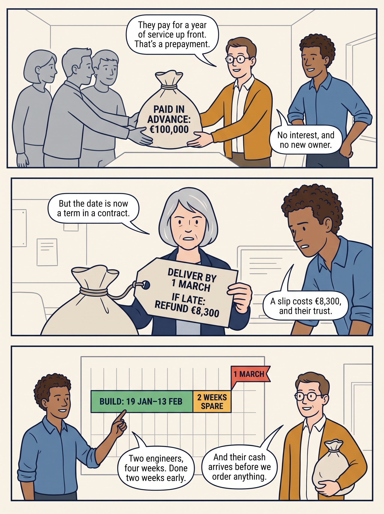

<!-- comic-style
{
  "cast": "MORGAN: a thoughtful investor technology adviser with short dark hair and a green jacket, used in the fund scenarios. ALEX: a practical CTO, a brown-skinned man with short, tight dark curls close to his head and blue rolled-up sleeves. SAM: a CFO, a man with short brown hair, round glasses and an amber cardigan. PRIYA: a product leader with straight dark hair and plum sleeves. INES: a CEO with short grey hair and a navy jacket. All are fictional; none represents a person in a real case.",
  "style": "Clean editorial explainer comic pages, each one image of three stacked full-width strips: navy ink outlines, restrained green, blue and amber accents on warm ivory, generous space, expressive people and simple physical props. Dialogue, short labels and the supplied amounts are lettered in the artwork, exactly as scripted. Money bags, coins and banknotes are plain and undecorated; the euro sign appears only inside supplied text, and arrows, documents and screens carry plain lines, never lettering. No photorealism, logos, titles or unsupplied text. Keep the same character appearances throughout the journal.",
  "reference": "_research/comic-cast-20260913.jpeg",
  "identity": {
    "Morgan": "MORGAN is a light-skinned WOMAN with a short, straight, JET-BLACK bob cut level with her jaw and a straight fringe across her forehead (never brown hair, never a side parting), and a bright green jacket over a white top, first person in the reference; her face must match the reference sheet exactly.",
    "Alex": "ALEX is a medium-brown-skinned MAN with a masculine face, broad shoulders and a straight masculine build, SHORT tight dark curls close to his head (not a large afro), a blue rolled-sleeve shirt and blue jeans, second person in the reference; fill his face, neck and hands with the same brown skin color in every strip.",
    "Sam": "SAM is a light-skinned MAN with a masculine face and SHORT brown hair cropped above his ears (never a bob, never chin-length hair, never a woman), round glasses and an amber cardigan over a white shirt, third person in the reference.",
    "Priya": "PRIYA is a brown-skinned WOMAN with straight shoulder-length dark hair and a plum blouse, fourth person in the reference.",
    "Ines": "INES is a light-skinned OLDER WOMAN with a short GREY bob (grey hair, never dark) and a navy jacket, fifth person in the reference."
  },
  "short": {
    "Morgan": "a light-skinned woman with a jet-black jaw-length bob and fringe, in a bright green jacket",
    "Alex": "a brown-skinned man with short tight dark curls, in a blue rolled-sleeve shirt",
    "Sam": "a light-skinned man with short brown hair and round glasses, in an amber cardigan over a collared white shirt",
    "Priya": "a brown-skinned woman with straight shoulder-length dark hair, in a plum blouse",
    "Ines": "an older light-skinned woman with a short grey bob, in a navy jacket"
  }
}
-->

**Comic.** Product and engineering leaders usually meet money as a budget: an amount they may spend. Seven pages follow Larkspur’s fictional €100,000 need through three offers, from customers, a bank and an investor, to show what the funding terms add: when the money may be spent, who must approve it, and what the company must deliver, repay or give up.

Alex leads technology, Sam leads finance and Ines is the chief executive of Larkspur, a fictional company at its smallest and earliest stage in this book. All are fictional, and so is every figure.

<!-- comic-page
{
  "id": "01-what-comes-with-the-money",
  "title": "What comes with the money?",
  "asset": "assets/images/00-customers-lenders-investors/comic-page-01-what-comes-with-the-money.jpeg",
  "aspect_ratio": "3:4",
  "cast": [
    "Alex",
    "Sam",
    "Ines"
  ],
  "strips": [
    {
      "scene": "Alex stands at the left beside a large wall calendar with one date circled in red. Sam stands at the right holding a clipboard. Between them, three customers in plain grey clothes wait with folded arms, looking at the calendar.",
      "labels": [
        "1 MARCH",
        "NEEDED: €100,000"
      ],
      "label_notes": "1 MARCH is the circled date on the calendar; NEEDED: €100,000 is printed large on Sam's clipboard, facing the reader.",
      "bubbles": [
        {
          "who": "Alex",
          "text": "Three customers want the dispatch feature by 1 March."
        },
        {
          "who": "Sam",
          "text": "Building it takes €100,000 we don't have."
        }
      ]
    },
    {
      "scene": "Sam, at the left, tips a small glass jar onto a desk; only a few coins roll out. Alex, at the right, looks at the coins and scratches his head.",
      "labels": [
        "LEFT EACH MONTH: €1,500"
      ],
      "label_notes": "The label is a paper label stuck on the glass jar, facing the reader.",
      "bubbles": [
        {
          "who": "Sam",
          "text": "Subscriptions pay today's costs. About €1,500 a month is left."
        },
        {
          "who": "Alex",
          "text": "So someone else has to fund it."
        }
      ]
    },
    {
      "scene": "Three identical money bags stand in a row on a table, each with a large blank paper tag tied to its neck on a string, the tags face down. Ines, at the left, lifts the string of the first bag with one finger. Alex and Sam stand at the right, looking at the tags.",
      "labels": [
        "CUSTOMERS",
        "BANK",
        "INVESTOR",
        "€100,000 EACH"
      ],
      "label_notes": "CUSTOMERS, BANK and INVESTOR are printed on the three bags, left to right; €100,000 EACH is a card standing on the table in front of the bags.",
      "bubbles": [
        {
          "who": "Ines",
          "text": "Same amount, three times. Ask what comes tied to each."
        }
      ]
    }
  ],
  "alt": "Comic page in three strips: Alex and Sam face three waiting customers and a calendar marked 1 March, needing €100,000; Sam empties a jar that leaves only €1,500 a month; Ines lifts the blank tag tied to the first of three €100,000 money bags marked customers, bank and investor.",
  "caption": "Larkspur is fictional and so is every figure. It is a small software company owned by its founders, the people who started it. The dispatch feature assigns jobs to field workers and sends each a schedule. Customer payments, borrowing, money from owners and selling an asset, something the company owns, are four common sources of cash; Larkspur has no spare asset worth €100,000, so three remain. The habit to keep: ask how much cash arrives, and what obligation or ownership change arrives with it.",
  "generation": {
    "model": "gemini-3-pro-image-preview",
    "reference": "_research/comic-cast-20260913.jpeg",
    "sha256": "a4e39799549bebffbbfdde8e05da4aeacfd507abf953e86e865dad89363bb935"
  },
  "status": "generated"
}
-->

**Page 1: What comes with the money?.** Larkspur is fictional and so is every figure. It is a small software company owned by its founders, the people who started it. The dispatch feature assigns jobs to field workers and sends each a schedule. Customer payments, borrowing, money from owners and selling an asset, something the company owns, are four common sources of cash; Larkspur has no spare asset worth €100,000, so three remain. The habit to keep: ask how much cash arrives, and what obligation or ownership change arrives with it.

- *Strip 1.* **Alex:** “Three customers want the dispatch feature by 1 March.” **Sam:** “Building it takes €100,000 we don't have.”
- *Strip 2.* **Sam:** “Subscriptions pay today's costs. About €1,500 a month is left.” **Alex:** “So someone else has to fund it.”
- *Strip 3.* **Ines:** “Same amount, three times. Ask what comes tied to each.”

<!-- comic-page
{
  "id": "02-prepayment-a-date-becomes-a-promise",
  "title": "The customers’ money: a date becomes a promise",
  "asset": "assets/images/00-customers-lenders-investors/comic-page-02-prepayment-a-date-becomes-a-promise.jpeg",
  "aspect_ratio": "3:4",
  "cast": [
    "Sam",
    "Alex",
    "Ines"
  ],
  "strips": [
    {
      "scene": "Exactly three customers in plain grey clothes stand side by side at the left and together push one plain, undecorated cloth money bag across a table toward Sam, who stands in the middle. Alex stands at the right, pleased. The only lettering on the bag is the supplied label.",
      "labels": [
        "PAID IN ADVANCE: €100,000"
      ],
      "label_notes": "The label is printed on the money bag, facing the reader.",
      "bubbles": [
        {
          "who": "Sam",
          "text": "They pay for a year of service up front. That's a prepayment."
        },
        {
          "who": "Alex",
          "text": "No interest, and no new owner."
        }
      ]
    },
    {
      "scene": "Ines, at the left, holds up the paper tag that is tied to the money bag and reads it; the tag is large and faces the reader. Alex, at the right, leans in to read it too, his smile gone.",
      "labels": [
        "DELIVER BY 1 MARCH",
        "IF LATE: REFUND €8,300"
      ],
      "label_notes": "Both lines are printed on the large paper tag, one above the other.",
      "bubbles": [
        {
          "who": "Ines",
          "text": "But the date is now a term in a contract."
        },
        {
          "who": "Alex",
          "text": "A slip costs €8,300, and their trust."
        }
      ]
    },
    {
      "scene": "A wall planner showing only one long green bar, a short amber block after it, and a red flag at the end; the rest of the planner is an empty grid of plain lines. Alex, at the left, points at the green bar. Sam, at the right, nods, holding a plain, undecorated cloth money bag under his arm.",
      "labels": [
        "BUILD: 19 JAN–13 FEB",
        "2 WEEKS SPARE",
        "1 MARCH"
      ],
      "label_notes": "BUILD: 19 JAN–13 FEB is printed on the green bar, 2 WEEKS SPARE on the amber block, 1 MARCH on the red flag, in that left-to-right order.",
      "bubbles": [
        {
          "who": "Alex",
          "text": "Two engineers, four weeks. Done two weeks early."
        },
        {
          "who": "Sam",
          "text": "And their cash arrives before we order anything."
        }
      ]
    }
  ],
  "alt": "Comic page in three strips: three customers hand Sam a bag of €100,000 paid in advance; Ines reads the tag tied to it, deliver by 1 March or refund €8,300; Alex shows a plan that builds from 19 January to 13 February with two weeks spare before 1 March.",
  "caption": "A prepayment is money a customer pays before the service is delivered. Here three customers pay Larkspur’s standard yearly price in advance, €100,000 in all, for a year of service that includes the new feature. The contract promises the feature by 1 March and one month of service back if it is late, about €8,300 across the three customers, which Larkspur would pay from its €10,000 reserve for overruns.",
  "generation": {
    "model": "gemini-3-pro-image-preview",
    "reference": "_research/comic-cast-20260913.jpeg",
    "sha256": "0085901930b222130ae0ff75a323552bf44bce0629db423038ad1f62a3acfc3a"
  },
  "status": "generated"
}
-->

**Page 2: The customers’ money: a date becomes a promise.** A prepayment is money a customer pays before the service is delivered. Here three customers pay Larkspur’s standard yearly price in advance, €100,000 in all, for a year of service that includes the new feature. The contract promises the feature by 1 March and one month of service back if it is late, about €8,300 across the three customers, which Larkspur would pay from its €10,000 reserve for overruns.

- *Strip 1.* **Sam:** “They pay for a year of service up front. That's a prepayment.” **Alex:** “No interest, and no new owner.”
- *Strip 2.* **Ines:** “But the date is now a term in a contract.” **Alex:** “A slip costs €8,300, and their trust.”
- *Strip 3.* **Alex:** “Two engineers, four weeks. Done two weeks early.” **Sam:** “And their cash arrives before we order anything.”

<!-- comic-page
{
  "id": "03-loan-a-monthly-claim",
  "title": "The bank’s money: a fixed monthly claim",
  "asset": "assets/images/00-customers-lenders-investors/comic-page-03-loan-a-monthly-claim.jpeg",
  "aspect_ratio": "3:4",
  "cast": [
    "Sam",
    "Alex",
    "Ines"
  ],
  "strips": [
    {
      "scene": "A banker in a plain grey suit, at the left, sets a money bag on a table; a large paper tag tied to the bag faces the reader. Sam stands in the middle reading the tag; Alex stands at the right.",
      "narration": "A bank loan: €100,000 at 6% a year, 36 monthly payments.",
      "labels": [
        "REPAY €3,040 A MONTH"
      ],
      "label_notes": "The label is printed on the large paper tag tied to the bag.",
      "bubbles": [
        {
          "who": "Sam",
          "text": "Debt must be repaid, plus interest, the charge for borrowing."
        },
        {
          "who": "Alex",
          "text": "And repayments start next month."
        }
      ]
    },
    {
      "scene": "On a table stand two columns of coins side by side: a tall column at the left and a column exactly half as tall at the right, each with a card in front of it. A third card lies between them. Sam, at the left, measures the tall column with a ruler. Alex, at the right, frowns.",
      "labels": [
        "REPAYMENT €3,040",
        "LEFT OVER €1,500",
        "SHORT €1,540"
      ],
      "label_notes": "REPAYMENT €3,040 is the card in front of the tall column; LEFT OVER €1,500 is the card in front of the short column; SHORT €1,540 is the card lying between them.",
      "bubbles": [
        {
          "who": "Sam",
          "text": "Each payment is twice what we have left over."
        },
        {
          "who": "Alex",
          "text": "And with a loan, customers pay only after launch."
        }
      ]
    },
    {
      "scene": "Sam, at the left, hugs a glass jar of coins protectively against his cardigan. Ines, in the middle, pushes the bank's money bag away across the table with one hand. On the wall at the far right, above and clear of everyone's heads, hangs a large wall calendar with two dates circled; nobody stands in front of it and both of its printed lines are fully visible.",
      "labels": [
        "RESERVE €10,000",
        "END FEBRUARY: FIRST PAYMENT",
        "31 MARCH: CUSTOMERS PAY"
      ],
      "label_notes": "RESERVE €10,000 is a paper label on the jar; the other two are printed beside the two circled dates on the calendar, the February one above the March one.",
      "bubbles": [
        {
          "who": "Sam",
          "text": "My rule: no fixed payment today's income can't cover."
        },
        {
          "who": "Ines",
          "text": "Then the loan is out."
        }
      ]
    }
  ],
  "alt": "Comic page in three strips: a banker sets down a €100,000 bag tagged repay €3,040 a month; a tall coin column marked repayment €3,040 stands beside one half its height marked left over €1,500, short €1,540; Sam guards the €10,000 reserve jar while Ines pushes the bank’s bag away.",
  "caption": "The loan keeps ownership intact and costs about €9,500 of interest over three years, but its €3,040 a month is twice the €1,500 that Larkspur’s existing subscriptions leave. Under this route the customers would pay ordinary subscriptions, invoiced when the feature goes live and due by 31 March, so the first repayments would come out of the €10,000 reserve kept for overruns. The repayments would continue for three years even if a customer paid late or walked away.",
  "generation": {
    "model": "gemini-3-pro-image-preview",
    "reference": "_research/comic-cast-20260913.jpeg",
    "sha256": "6fb51367569569e1b6af9be2579941101062714185af7f2e969c1986c22c0322"
  },
  "status": "generated"
}
-->

**Page 3: The bank’s money: a fixed monthly claim.** The loan keeps ownership intact and costs about €9,500 of interest over three years, but its €3,040 a month is twice the €1,500 that Larkspur’s existing subscriptions leave. Under this route the customers would pay ordinary subscriptions, invoiced when the feature goes live and due by 31 March, so the first repayments would come out of the €10,000 reserve kept for overruns. The repayments would continue for three years even if a customer paid late or walked away.

- *Strip 1.* *Narration:* A bank loan: €100,000 at 6% a year, 36 monthly payments. **Sam:** “Debt must be repaid, plus interest, the charge for borrowing.” **Alex:** “And repayments start next month.”
- *Strip 2.* **Sam:** “Each payment is twice what we have left over.” **Alex:** “And with a loan, customers pay only after launch.”
- *Strip 3.* **Sam:** “My rule: no fixed payment today's income can't cover.” **Ines:** “Then the loan is out.”

<!-- comic-page
{
  "id": "04-shares-a-new-owner",
  "title": "The investor’s money: a new owner",
  "asset": "assets/images/00-customers-lenders-investors/comic-page-04-shares-a-new-owner.jpeg",
  "aspect_ratio": "3:4",
  "cast": [
    "Sam",
    "Alex",
    "Ines"
  ],
  "strips": [
    {
      "scene": "A round cake on a table, cut so that one thin slice, about a tenth of the cake, sits on a separate small plate in front of an investor in a plain grey suit at the left, who has set a plain cloth money bag on the table. The large remaining cake has a small flag stuck in it. Sam stands in the middle, Alex at the right.",
      "narration": "New shares: an investor pays €100,000 for 111 new shares.",
      "labels": [
        "FOUNDERS: 1,000 SHARES",
        "INVESTOR: 111 SHARES",
        "ABOUT 10%",
        "€100,000"
      ],
      "label_notes": "FOUNDERS: 1,000 SHARES is the flag in the large cake; INVESTOR: 111 SHARES is a small flag in the thin slice; ABOUT 10% is a card beside the small plate. €100,000 is printed on the money bag.",
      "bubbles": [
        {
          "who": "Sam",
          "text": "Equity is ownership. There is nothing to repay."
        },
        {
          "who": "Alex",
          "text": "So what comes tied to it?"
        }
      ]
    },
    {
      "scene": "A board table with four chairs; a fifth, new chair is being pulled up to it by the investor in the plain grey suit. A large rubber stamp stands on the table. Ines, at the left, watches with crossed arms. Sam, at the right, stands with both hands in his cardigan pockets.",
      "labels": [
        "BOARD SEAT",
        "CONSENT ABOVE €50,000"
      ],
      "label_notes": "BOARD SEAT is a card hanging on the back of the new chair; CONSENT ABOVE €50,000 is printed on the side of the large rubber stamp.",
      "bubbles": [
        {
          "who": "Ines",
          "text": "A board seat, and a say over big unplanned spending."
        },
        {
          "who": "Sam",
          "text": "Those rights outlast this feature."
        }
      ]
    },
    {
      "scene": "A whiteboard split into an upper lane and a lower lane, each lane drawn in simple marker lines. In the upper lane one plain solid amber arrow runs from a small stick-figure investor to a small outline drawing of an office building. In the lower lane an identical plain solid amber arrow runs from a small stick-figure investor to a small stick-figure person with raised arms. The only lettering on the whiteboard is the two lane headings and the word under each investor figure. Sam, at the left, points at the upper lane with a marker. Alex, at the right, points at the lower lane.",
      "labels": [
        "NEW SHARES: COMPANY GETS CASH",
        "EXISTING SHARES: SELLER GETS CASH",
        "INVESTOR",
        "INVESTOR"
      ],
      "label_notes": "NEW SHARES: COMPANY GETS CASH is the heading of the upper lane; EXISTING SHARES: SELLER GETS CASH is the heading of the lower lane. INVESTOR is printed under each of the two small investor figures.",
      "bubbles": [
        {
          "who": "Sam",
          "text": "Only newly issued shares put money into the company."
        },
        {
          "who": "Alex",
          "text": "Buying a founder's shares pays the founder."
        }
      ]
    }
  ],
  "alt": "Comic page in three strips: an investor pays €100,000 and takes a thin slice of cake marked 111 shares, about 10%, beside the founders’ 1,000 shares; the investor pulls a new chair marked board seat up to the board table beside a stamp marked consent above €50,000; a whiteboard shows new shares sending cash to the company and existing shares sending cash to the seller.",
  "caption": "A share is a unit of company ownership. Larkspur has 1,000 identical shares; 111 new ones would give the investor 111 of 1,111, about 10%. With them come a seat on the board of directors, the small group that oversees the company for its shareholders, a consent right, meaning Larkspur must ask permission, over spending above €50,000 outside the approved plan, and the expectation that the company will eventually be sold. A change of owner funds the company only when the money reaches the company.",
  "generation": {
    "model": "gemini-3-pro-image-preview",
    "reference": "_research/comic-cast-20260913.jpeg",
    "sha256": "309577c1314105b690eb30f332bcc56ac61f3e4aa6ba1d1ce012febdb3a928da"
  },
  "status": "generated"
}
-->

**Page 4: The investor’s money: a new owner.** A share is a unit of company ownership. Larkspur has 1,000 identical shares; 111 new ones would give the investor 111 of 1,111, about 10%. With them come a seat on the board of directors, the small group that oversees the company for its shareholders, a consent right, meaning Larkspur must ask permission, over spending above €50,000 outside the approved plan, and the expectation that the company will eventually be sold. A change of owner funds the company only when the money reaches the company.

- *Strip 1.* *Narration:* New shares: an investor pays €100,000 for 111 new shares. **Sam:** “Equity is ownership. There is nothing to repay.” **Alex:** “So what comes tied to it?”
- *Strip 2.* **Ines:** “A board seat, and a say over big unplanned spending.” **Sam:** “Those rights outlast this feature.”
- *Strip 3.* **Sam:** “Only newly issued shares put money into the company.” **Alex:** “Buying a founder's shares pays the founder.”

<!-- comic-page
{
  "id": "05-the-choice",
  "title": "The choice, and who may make it",
  "asset": "assets/images/00-customers-lenders-investors/comic-page-05-the-choice.jpeg",
  "aspect_ratio": "3:4",
  "cast": [
    "Sam",
    "Ines"
  ],
  "strips": [
    {
      "scene": "The three money bags stand in a row on a table, each with its large paper tag now turned to face the reader. Sam, at the left, gestures along the row. Ines, at the right, rests her hand on the first bag.",
      "labels": [
        "DELIVER BY 1 MARCH",
        "REPAY €3,040 A MONTH",
        "10% AND A BOARD SEAT"
      ],
      "label_notes": "One tag per bag, in this left-to-right order: DELIVER BY 1 MARCH on the first bag, REPAY €3,040 A MONTH on the second, 10% AND A BOARD SEAT on the third.",
      "bubbles": [
        {
          "who": "Sam",
          "text": "Same €100,000. Three different promises."
        },
        {
          "who": "Ines",
          "text": "The prepayment: the cheapest money and the tightest promise."
        }
      ]
    },
    {
      "scene": "Sam, at the left, slides the second money bag off the end of the table. Ines, at the right, lifts the third money bag and puts it on a high shelf behind her. The first bag stays alone in the middle of the table.",
      "bubbles": [
        {
          "who": "Sam",
          "text": "The loan rests on money we haven't collected."
        },
        {
          "who": "Ines",
          "text": "And I'll keep the shares for a bigger expansion."
        }
      ]
    },
    {
      "scene": "Ines stands at the left end of a long table and speaks to three board members in plain grey clothes seated along it. An open minute book lies on the table in front of them. Sam sits at the right end taking notes.",
      "narration": "15 January. The board meets.",
      "labels": [
        "MINUTES: BOARD SUPPORTS"
      ],
      "label_notes": "The label is the heading on the open page of the minute book, facing the reader.",
      "bubbles": [
        {
          "who": "Ines",
          "text": "Customer contracts I can sign alone. A loan or new shares need you."
        }
      ]
    }
  ],
  "alt": "Comic page in three strips: three €100,000 bags show their tags, deliver by 1 March, repay €3,040 a month, and 10% and a board seat; Sam slides the loan off the table and Ines shelves the shares, leaving the customers’ bag; on 15 January Ines tells the board she can sign customer contracts alone while a loan or new shares would need the board.",
  "caption": "The three customers pay the standard price with no discount, so the prepayment costs Larkspur the engineers’ time and one risk, the one-month refund. The loan would cost about €9,500 of interest; the shares 10% of the company and the rights that come with it. Authority follows the financing: under Larkspur’s articles, its rulebook, borrowing and issuing shares are board decisions, while ordinary customer contracts sit within the permission the board has given Ines, the chief executive. Because these contracts turn a date into a refund obligation, she takes the comparison to the board first, and its minutes, the written record of the meeting, note its support.",
  "generation": {
    "model": "gemini-3-pro-image-preview",
    "reference": "_research/comic-cast-20260913.jpeg",
    "sha256": "d6a81b882615fd77fdeafb97d6580edfbb5d138ba6df9a8923b6e0e4540b2ee3"
  },
  "status": "generated"
}
-->

**Page 5: The choice, and who may make it.** The three customers pay the standard price with no discount, so the prepayment costs Larkspur the engineers’ time and one risk, the one-month refund. The loan would cost about €9,500 of interest; the shares 10% of the company and the rights that come with it. Authority follows the financing: under Larkspur’s articles, its rulebook, borrowing and issuing shares are board decisions, while ordinary customer contracts sit within the permission the board has given Ines, the chief executive. Because these contracts turn a date into a refund obligation, she takes the comparison to the board first, and its minutes, the written record of the meeting, note its support.

- *Strip 1.* **Sam:** “Same €100,000. Three different promises.” **Ines:** “The prepayment: the cheapest money and the tightest promise.”
- *Strip 2.* **Sam:** “The loan rests on money we haven't collected.” **Ines:** “And I'll keep the shares for a bigger expansion.”
- *Strip 3.* *Narration:* 15 January. The board meets. **Ines:** “Customer contracts I can sign alone. A loan or new shares need you.”

<!-- comic-page
{
  "id": "06-nothing-promised-until-signed",
  "title": "Nothing is promised until Ines signs",
  "asset": "assets/images/00-customers-lenders-investors/comic-page-06-nothing-promised-until-signed.jpeg",
  "aspect_ratio": "3:4",
  "cast": [
    "Sam",
    "Alex",
    "Ines"
  ],
  "strips": [
    {
      "scene": "Sam, at the left, fans out three signed order sheets in his hand. Alex, at the right, holds up an estimate card. Behind them a pinboard carries two large cards, each with a green tick beside it.",
      "narration": "The same day: two checks before anyone signs.",
      "labels": [
        "SIGNED ORDERS: 3 OF 3",
        "8 ENGINEER-WEEKS, LIMIT 12",
        "ESTIMATE"
      ],
      "label_notes": "The two labels are the two large cards on the pinboard, one above the other. ESTIMATE is the heading of the card Alex holds.",
      "bubbles": [
        {
          "who": "Sam",
          "text": "Three signed orders. The cash covers the work."
        },
        {
          "who": "Alex",
          "text": "Eight engineer-weeks. Above twelve, we'd replan the date first."
        }
      ]
    },
    {
      "scene": "A whiteboard with a short sum written on it in three lines. Sam, at the left, taps the last line with a marker. Ines, at the right, holds up one finger in caution.",
      "narration": "If only two customers had signed:",
      "labels": [
        "2 ORDERS: €66,667",
        "LOAN: €35,000",
        "€1,065 A MONTH"
      ],
      "label_notes": "The three labels are the three lines on the whiteboard, top to bottom.",
      "bubbles": [
        {
          "who": "Sam",
          "text": "A €35,000 loan would fit inside our €1,500 a month."
        },
        {
          "who": "Ines",
          "text": "Only if the board approves. Otherwise we shrink the plan."
        }
      ]
    },
    {
      "scene": "Ines, at the left, sits at a desk and signs the top sheet of three order sheets; the sheet's heading faces the reader. A desk calendar stands beside her hand. Alex, at the right, is already turning to leave with a laptop under his arm.",
      "labels": [
        "16 JANUARY",
        "DELIVER BY 1 MARCH"
      ],
      "label_notes": "16 JANUARY is the page of the desk calendar; DELIVER BY 1 MARCH is the heading of the order sheet Ines signs.",
      "bubbles": [
        {
          "who": "Ines",
          "text": "Signed. From today, 1 March is a promise."
        },
        {
          "who": "Alex",
          "text": "Two engineers start on Monday."
        }
      ]
    }
  ],
  "alt": "Comic page in three strips: on a pinboard two checks are ticked, signed orders 3 of 3 and 8 engineer-weeks with a limit of 12; a whiteboard shows that two orders of €66,667 plus a €35,000 loan at €1,065 a month would fit, if the board approves; on 16 January Ines signs the order that promises delivery by 1 March and Alex leaves to start the work.",
  "caption": "Each customer signs an order that binds Larkspur only when Ines countersigns it, adding the company’s signature. An engineer-week is one engineer’s work for one week; twelve is the most that still fits before 1 March. Fewer than three orders, or an estimate above twelve, and she signs nothing until the plan fits. With two orders, a small loan the board approves keeps the planned feature and date, because €1,065 a month fits inside the €1,500 left over. With one order or none, no affordable loan closes the gap, so Larkspur offers a smaller first version or waits. The engineers start either way: their salaries need no new cash.",
  "generation": {
    "model": "gemini-3-pro-image-preview",
    "reference": "_research/comic-cast-20260913.jpeg",
    "sha256": "e67a5f83db0539cf9238f755a035cca28ad3fb4b33e3a4f4f780a6701ae9ae9c"
  },
  "status": "generated"
}
-->

**Page 6: Nothing is promised until Ines signs.** Each customer signs an order that binds Larkspur only when Ines countersigns it, adding the company’s signature. An engineer-week is one engineer’s work for one week; twelve is the most that still fits before 1 March. Fewer than three orders, or an estimate above twelve, and she signs nothing until the plan fits. With two orders, a small loan the board approves keeps the planned feature and date, because €1,065 a month fits inside the €1,500 left over. With one order or none, no affordable loan closes the gap, so Larkspur offers a smaller first version or waits. The engineers start either way: their salaries need no new cash.

- *Strip 1.* *Narration:* The same day: two checks before anyone signs. **Sam:** “Three signed orders. The cash covers the work.” **Alex:** “Eight engineer-weeks. Above twelve, we'd replan the date first.”
- *Strip 2.* *Narration:* If only two customers had signed: **Sam:** “A €35,000 loan would fit inside our €1,500 a month.” **Ines:** “Only if the board approves. Otherwise we shrink the plan.”
- *Strip 3.* **Ines:** “Signed. From today, 1 March is a promise.” **Alex:** “Two engineers start on Monday.”

<!-- comic-page
{
  "id": "07-read-the-tag",
  "title": "Read the tag before you promise",
  "asset": "assets/images/00-customers-lenders-investors/comic-page-07-read-the-tag.jpeg",
  "aspect_ratio": "3:4",
  "cast": [
    "Alex",
    "Sam",
    "Ines"
  ],
  "strips": [
    {
      "scene": "Alex, at the left, holds up a single budget sheet. Sam, at the right, holds up one large paper tag by its string, right beside the sheet, so the sheet and the tag are side by side. Sam's other hand is empty.",
      "labels": [
        "BUDGET: €100,000",
        "DELIVER BY 1 MARCH"
      ],
      "label_notes": "BUDGET: €100,000 is the heading of the sheet Alex holds; DELIVER BY 1 MARCH is printed on the tag Sam holds.",
      "bubbles": [
        {
          "who": "Alex",
          "text": "A budget tells me how much I may spend."
        },
        {
          "who": "Sam",
          "text": "The terms say when, who approves, and what we owe."
        }
      ]
    },
    {
      "scene": "A market counter with a sign above it. Across the counter two investors in plain grey clothes swap a sheet of paper that carries only a round gold seal and plain ruled lines for a handful of coins. Alex, at the right, holds a closed company cashbox and points at its lid. Sam, at the left, points at the two investors.",
      "narration": "In a company listed on a stock exchange:",
      "labels": [
        "STOCK EXCHANGE",
        "COMPANY CASH: UNCHANGED"
      ],
      "label_notes": "STOCK EXCHANGE is the sign above the counter; COMPANY CASH: UNCHANGED is printed on the lid of the closed cashbox Alex holds.",
      "bubbles": [
        {
          "who": "Sam",
          "text": "Investors trading shares pay each other, not the company."
        },
        {
          "who": "Alex",
          "text": "So a trade puts no new cash in the business."
        }
      ]
    },
    {
      "scene": "Ines, at the left, holds up one giant cheque with both hands. The amount is the only lettering on the cheque; every other line on it is an empty ruled line. Alex, at the right, looks up at it with raised eyebrows, one hand on his chin.",
      "labels": [
        "€100 MILLION"
      ],
      "label_notes": "The label is the amount printed large on the giant cheque.",
      "bubbles": [
        {
          "who": "Ines",
          "text": "Next: a €100 million announcement. Who actually receives the money?"
        },
        {
          "who": "Alex",
          "text": "And who can authorize spending it?"
        }
      ]
    }
  ],
  "alt": "Comic page in three strips: Alex holds a €100,000 budget sheet beside the tag that says deliver by 1 March; at a stock exchange two investors swap a share for coins while the company’s cashbox stays closed and unchanged; Ines holds up a giant €100 million cheque and asks who actually receives the money.",
  "caption": "A budget gives the amount; the funding terms give the timing, the approvals and what the company must deliver, repay or give up. A stock exchange is an organized market where investors buy and sell shares, and a public company is one whose shares anyone can buy there. Those trades change who owns the company without funding it. A private company’s shares do not trade on such a market, but its rulebook and the agreements between its shareholders still say who may approve the work. The next chapter asks the same two questions of a €100 million announcement.",
  "generation": {
    "model": "gemini-3-pro-image-preview",
    "reference": "_research/comic-cast-20260913.jpeg",
    "sha256": "c5cc2ff6086697b6655b7fb7a46d90e26ebe28e0bb7fa64db053b0a4edddd3e8"
  },
  "status": "generated"
}
-->

**Page 7: Read the tag before you promise.** A budget gives the amount; the funding terms give the timing, the approvals and what the company must deliver, repay or give up. A stock exchange is an organized market where investors buy and sell shares, and a public company is one whose shares anyone can buy there. Those trades change who owns the company without funding it. A private company’s shares do not trade on such a market, but its rulebook and the agreements between its shareholders still say who may approve the work. The next chapter asks the same two questions of a €100 million announcement.

- *Strip 1.* **Alex:** “A budget tells me how much I may spend.” **Sam:** “The terms say when, who approves, and what we owe.”
- *Strip 2.* *Narration:* In a company listed on a stock exchange: **Sam:** “Investors trading shares pay each other, not the company.” **Alex:** “So a trade puts no new cash in the business.”
- *Strip 3.* **Ines:** “Next: a €100 million announcement. Who actually receives the money?” **Alex:** “And who can authorize spending it?”
