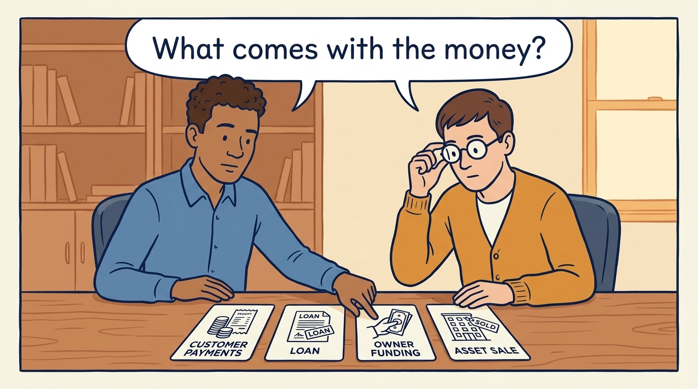
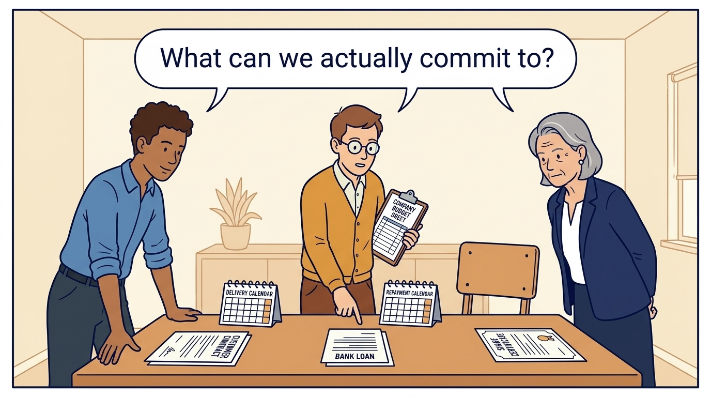

<!-- comic-style
{
  "cast": "MORGAN: a thoughtful investor technology adviser with short dark hair and a green jacket, used in the fund scenarios. ALEX: a practical CTO with curly hair and blue rolled-up sleeves. SAM: a CFO with round glasses and an amber cardigan. PRIYA: a product leader with straight dark hair and plum sleeves. INES: a CEO with short grey hair and a navy jacket. All are fictional; none represents a person in a real case.",
  "style": "Clean editorial explainer comic, dark ink outlines, restrained green, blue, and amber accents on warm white, generous space, readable short speech bubbles, expressive people and simple physical metaphors. No photorealism, logos, dense charts, or title text. Keep the same character appearances throughout the journal."
}
-->

**Comic.** Product and engineering leaders usually meet money as a budget: an amount they may spend. The panels follow Larkspur's fictional €100,000 need to show what the funding terms add: when the money may be spent, who must approve it, and what the company must deliver, repay or give up in return.

Morgan advises investors in the later scenarios where an investment fund, a pool of money that invests on behalf of others, owns part of Larkspur. Alex leads technology, Priya leads product, Sam leads finance and Ines is the chief executive. All are fictional. Comparative scenarios use separate assumptions. Historical cases are discussed through documents; the scenes do not reenact real events.

<!-- comic-panel
{
  "id": "01-scene",
  "status": "generated",
  "asset": "assets/images/00-customers-lenders-investors/comic-01-scene.jpeg",
  "aspect_ratio": "16:9",
  "prompt": "Panel 1 of an explainer comic. Alex and Sam compare customer payments, a loan, owner funding and an asset sale on four cards. Use one speech bubble with the exact words: \"What comes with the money?\" Convey: Larkspur needs €100,000. Customer payments, a loan, owners’ money and the sale of an asset, something the company owns, are four common sources. Each arrives with a different obligation. Other sources also exist, such as grants, money awarded for a specified purpose.",
  "alt": "Comic panel: Alex and Sam compare customer payments, a loan, owner funding and an asset sale on four cards.",
  "caption": "Larkspur needs €100,000. Customer payments, a loan, owners’ money and the sale of an asset, something the company owns, are four common sources. Each arrives with a different obligation. Other sources also exist, such as grants, money awarded for a specified purpose.",
  "generation": {
    "model": "gemini-3-pro-image-preview",
    "reference_id": "owned-cast-20260913",
    "sha256": "3e154000bf946501d3eb98b0494070a6d1a40384d1b799fd891ecb59cbfb39ea"
  }
}
-->

**Panel 1:** Larkspur needs €100,000. Customer payments, a loan, owners’ money and the sale of an asset, something the company owns, are four common sources. Each arrives with a different obligation. Other sources also exist, such as grants, money awarded for a specified purpose.

*Dialogue:* “What comes with the money?”

<!-- comic-panel
{
  "id": "02-scene",
  "status": "generated",
  "asset": "assets/images/00-customers-lenders-investors/comic-02-scene.jpeg",
  "aspect_ratio": "16:9",
  "prompt": "Panel 2 of an explainer comic. Sam traces one payment to a company issuing shares and another to a founder selling existing shares. Use one speech bubble with the exact words: \"Who receives this payment?\" Convey: A share is a unit of ownership. Buying new shares from the company can fund the company; buying the existing shares of a founder, someone who started the company, pays the founder.",
  "alt": "Comic panel: Sam traces one payment to a company issuing shares and another to a founder selling existing shares.",
  "caption": "A share is a unit of ownership. Buying new shares from the company can fund the company; buying the existing shares of a founder, someone who started the company, pays the founder.",
  "generation": {
    "model": "gemini-3-pro-image-preview",
    "reference_id": "owned-cast-20260913",
    "sha256": "e650b8b43df11cd7f045608cb336288613610e9e89ef542fdbdb8309e1e53a65"
  }
}
-->

**Panel 2:** A share is a unit of ownership. Buying new shares from the company can fund the company; buying the existing shares of a founder, someone who started the company, pays the founder.

*Dialogue:* “Who receives this payment?”

<!-- comic-panel
{
  "id": "03-scene",
  "status": "generated",
  "asset": "assets/images/00-customers-lenders-investors/comic-03-scene.jpeg",
  "aspect_ratio": "16:9",
  "prompt": "Panel 3 of an explainer comic. Morgan shows two investors trading a share through an exchange while the company account remains separate. Use one speech bubble with the exact words: \"The seller gets the money.\" Convey: A stock exchange is a market for trading shares. Investors buying existing shares normally pay the seller, rather than the company.",
  "alt": "Comic panel: Morgan shows two investors trading a share through an exchange while the company account remains separate.",
  "caption": "A stock exchange is a market for trading shares. Investors buying existing shares normally pay the seller, rather than the company.",
  "generation": {
    "model": "gemini-3-pro-image-preview",
    "reference_id": "owned-cast-20260913",
    "sha256": "7f807dc3d3a39a71ca81c191dfba49341fe184bf82d0fa64e1cc09742479d9cd"
  }
}
-->

**Panel 3:** A stock exchange is a market for trading shares. Investors buying existing shares normally pay the seller, rather than the company.

*Dialogue:* “The seller gets the money.”

<!-- comic-panel
{
  "id": "04-scene",
  "status": "generated",
  "asset": "assets/images/00-customers-lenders-investors/comic-04-scene.jpeg",
  "aspect_ratio": "16:9",
  "prompt": "Panel 4 of an explainer comic. Alex places a company report, a share-price chart and a bank balance side by side. Use one speech bubble with the exact words: \"These tell us different things.\" Convey: Public companies, whose shares anyone can buy on a stock exchange, publish financial information under the rules that apply to them. A share price is what investors pay one another for a share. Reported profit is income minus expenses recorded for a period, not cash received minus cash paid. Neither says how much cash the company has in the bank to spend.",
  "alt": "Comic panel: Alex places a company report, a share-price chart and a bank balance side by side.",
  "caption": "Public companies, whose shares anyone can buy on a stock exchange, publish financial information under the rules that apply to them. A share price is what investors pay one another for a share. Reported profit is income minus expenses recorded for a period, not cash received minus cash paid. Neither says how much cash the company has in the bank to spend.",
  "generation": {
    "model": "gemini-3-pro-image-preview",
    "reference_id": "owned-cast-20260913",
    "sha256": "ba598073a1c44c6b3155490f8c451c6e6bca6a40013eb93526f27dc9355ce501"
  }
}
-->

**Panel 4:** Public companies, whose shares anyone can buy on a stock exchange, publish financial information under the rules that apply to them. A share price is what investors pay one another for a share. Reported profit is income minus expenses recorded for a period, not cash received minus cash paid. Neither says how much cash the company has in the bank to spend.

*Dialogue:* “These tell us different things.”

<!-- comic-panel
{
  "id": "05-scene",
  "status": "generated",
  "asset": "assets/images/00-customers-lenders-investors/comic-05-scene.jpeg",
  "aspect_ratio": "16:9",
  "prompt": "Panel 5 of an explainer comic. Three owners review their private company’s decision agreement with Alex. Use one speech bubble with the exact words: \"Who may approve the work?\" Convey: A private company’s shares do not trade on a public stock market. Its owners still set decision rules, in the company’s rulebook and in agreements between the shareholders, and those documents say who may approve the work.",
  "alt": "Comic panel: Three owners review their private company’s decision agreement with Alex.",
  "caption": "A private company’s shares do not trade on a public stock market. Its owners still set decision rules, in the company’s rulebook and in agreements between the shareholders, and those documents say who may approve the work.",
  "generation": {
    "model": "gemini-3-pro-image-preview",
    "reference_id": "owned-cast-20260913",
    "sha256": "047aef9491805dda0f0cdba897420e7f37ec88450ed2f14760bce3ab48ad76ee"
  }
}
-->

**Panel 5:** A private company’s shares do not trade on a public stock market. Its owners still set decision rules, in the company’s rulebook and in agreements between the shareholders, and those documents say who may approve the work.

*Dialogue:* “Who may approve the work?”

<!-- comic-panel
{
  "id": "06-scene",
  "status": "generated",
  "asset": "assets/images/00-customers-lenders-investors/comic-06-scene.jpeg",
  "aspect_ratio": "16:9",
  "prompt": "Panel 6 of an explainer comic. Ines, Alex and Sam compare three offer cards on a table: a customer contract beside a calendar, a bank loan beside a repayment calendar, and a share certificate beside an empty board chair; Sam holds the company budget sheet. Use one speech bubble with the exact words: \"What can we actually commit to?\" Convey: For the same €100,000, three offers. A customer prepayment, cash paid before the service is delivered, fixes the delivery date in a contract: if the feature is late, each customer gets one month’s service refunded. A loan starts monthly repayments from the following month, whether or not customers have paid. New shares give an investor a seat on the board, the small group that oversees the company for its shareholders, and a say over large unplanned spending, rights that last long after this feature. Larkspur chose the prepayment: the feature fits the date, the customers’ cash funds it, and the cost of a slip is that refund and the customers’ trust. The loan failed Sam’s rule: Larkspur’s existing income cannot cover a fixed monthly repayment, so the loan would rest on money not yet collected. The share issue was declined because its rights outlast the feature. The board recorded its support. Ines, the chief executive, signed within the permission the board had given her. If fewer than three customers sign, she signs nothing until the plan fits. Two customers plus a small loan the board approves, with the loan and both orders signed by the cutoff date, keep the planned version and date. If the work would take more than the twelve engineer-weeks allowed, the date is replanned before any order is signed. Otherwise the version is reworked to what the signed customers’ cash funds.",
  "alt": "Comic panel: Ines, Alex and Sam compare three offer cards, a customer contract, a bank loan and a share certificate, while Sam holds the company budget sheet.",
  "caption": "For the same €100,000, three offers. A customer prepayment, cash paid before the service is delivered, fixes the delivery date in a contract: if the feature is late, each customer gets one month’s service refunded. A loan starts monthly repayments from the following month, whether or not customers have paid. New shares give an investor a seat on the board, the small group that oversees the company for its shareholders, and a say over large unplanned spending, rights that last long after this feature. Larkspur chose the prepayment: the feature fits the date, the customers’ cash funds it, and the cost of a slip is that refund and the customers’ trust. The loan failed Sam’s rule: Larkspur’s existing income cannot cover a fixed monthly repayment, so the loan would rest on money not yet collected. The share issue was declined because its rights outlast the feature. The board recorded its support. Ines, the chief executive, signed within the permission the board had given her. If fewer than three customers sign, she signs nothing until the plan fits. Two customers plus a small loan the board approves, with the loan and both orders signed by the cutoff date, keep the planned version and date. If the work would take more than the twelve engineer-weeks allowed, the date is replanned before any order is signed. Otherwise the version is reworked to what the signed customers’ cash funds.",
  "generation": {
    "model": "gemini-3-pro-image-preview",
    "reference_id": "owned-cast-20260913",
    "sha256": "9d85fef32fda744fd49c9eabc08a8237c3bb69f6a4735be8b886ab6c3e89b68d"
  }
}
-->

**Panel 6:** For the same €100,000, three offers. A customer prepayment, cash paid before the service is delivered, fixes the delivery date in a contract: if the feature is late, each customer gets one month’s service refunded. A loan starts monthly repayments from the following month, whether or not customers have paid. New shares give an investor a seat on the board, the small group that oversees the company for its shareholders, and a say over large unplanned spending, rights that last long after this feature.

Larkspur chose the prepayment: the feature fits the date, the customers’ cash funds it, and the cost of a slip is that refund and the customers’ trust. The loan failed Sam’s rule: Larkspur’s existing income cannot cover a fixed monthly repayment, so the loan would rest on money not yet collected. The share issue was declined because its rights outlast the feature. The board recorded its support. Ines, the chief executive, signed within the permission the board had given her.

If fewer than three customers sign, she signs nothing until the plan fits. Two customers plus a small loan the board approves, with the loan and both orders signed by the cutoff date, keep the planned version and date. If the work would take more than the twelve engineer-weeks allowed, the date is replanned before any order is signed. Otherwise the version is reworked to what the signed customers’ cash funds.

*Dialogue:* “What can we actually commit to?”
