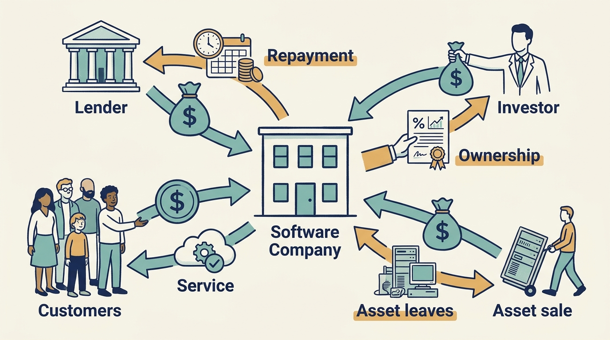
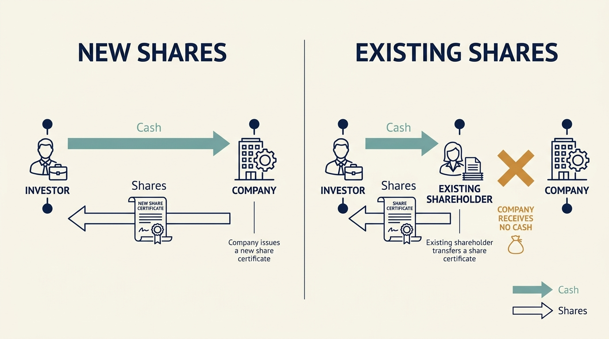

> **IN THIS SECTION, YOU WILL:** Learn what customers, lenders and shareholders each expect in return for their money, and follow one €100,000 need through all three routes to a decision.

> **WHY IS THIS IMPORTANT FOR YOU:** Every commitment you make to a team is paid for by someone who expects something back; if you do not know what, you cannot know which promises the company can keep.

> **WHY INVESTORS CARE ABOUT THIS:** Investors want their money to be the kind the company treats as ownership with rights, not as a loan to be repaid or a prepayment to be worked off; and they price the difference in every negotiation.

> **KEY POINTS:**
>
> * Where money comes from affects **what the company must do in return**. Customers expect a product or service, lenders expect repayment, and shareholders receive ownership rights.
> * Buying a share means **buying part of a company**. Only newly issued shares put money into the company; buying existing shares pays the seller.
> * A budget tells you how much you may spend. **The funding terms tell you when you may spend it, which approvals you need and what the company must deliver in return.** Establish the actual arrangement before turning funding or a change of owner into a product commitment.

 
A company needs cash to pay people, buy supplies and develop its products. Customers may eventually cover those costs, but the company can need money before they pay. Someone must fund that gap.

**Financing** means arranging the money a business needs. The source matters because each arrangement brings different costs, expectations and rights. Start by tracing the cash and identifying what the company promises in return.

Product and engineering leaders usually meet money as a budget: an amount they may spend. A budget tells you how much you may spend. The funding terms help explain when you may spend it, which approvals you need and what obligations the company must meet. Affordability depends on both. This chapter follows one need through three funding routes so that the terms become as visible as the amount.

## Larkspur Needs €100,000

Larkspur, the fictional scheduling-software company used throughout this book, has sold its product to a group of customers who want a new dispatch feature by 1 March. Finishing it and paying the team until those customers pay will take about €100,000 that Larkspur does not have. Ines, the CEO, Sam, the CFO, and Alex, the CTO, have to decide where the money comes from. Every figure in this example is fictional.

The useful habit is to ask two questions together: **how much cash arrives**, and **what obligation or ownership change comes with it**? The four routes below all answer the first question with €100,000. They answer the second differently.

## Four Common Ways Cash Reaches a Business

**Customer payments.** Customers pay for the software, perhaps before a full year's service has been delivered. The company must provide what it promised and may have refund obligations. After paying the costs of serving customers, it can use any remaining cash to fund further work. For Larkspur, a prepayment would turn the 1 March feature date into a contractual promise.

**Borrowing.** A lender, such as a bank, provides a loan. **Debt** means borrowing that must be repaid. The amount borrowed is the **principal**; **interest** is the charge for using that money. The loan agreement sets repayment dates and other conditions. A loan doesn't ordinarily give the lender company shares, but its conditions can restrict company decisions. For Larkspur, repayments would start before the feature earns anything.

**Money from owners.** A founder or another investor contributes money in exchange for ownership. **Equity** means an ownership interest. Unlike a loan, it generally has no fixed repayment schedule. The shareholder can gain if the investment becomes more valuable, and can lose the money invested. For Larkspur, a new shareholder would gain rights over future decisions, not only over this feature.

**Selling an asset.** An **asset** is something the company owns or controls that can provide economic benefit, such as equipment or a business division. Selling an unused building raises cash once. Selling a product line also gives up the future income and capabilities that came with it. Larkspur has no spare asset worth €100,000, so this route drops out of its comparison.

These are four common routes, not an exhaustive list. **Grants**, awards of money for specified purposes, can fund eligible activities under specific conditions. The US Small Business Administration describes grants for areas such as scientific research and development. [S56: SBA grant overview](https://www.sba.gov/loans/additional-funding-opportunities/grants/)

**Figure 1:** *Each source of cash changes what the company must deliver, repay, share or give up.*

## What a Share Represents

A **share** is a unit of company ownership. If a company has 1,000 identical shares and you own 10, you own 1% of those shares. Different classes of shares can carry different voting and payment rights, so the percentage is only the starting point.

Shareholders may receive **dividends**, payments made to shareholders under the company's arrangements, or get money by selling their shares. Neither a payment nor a rise in the share price is guaranteed. Investor.gov explains these basic features and the differences between share classes. [S54: Investor.gov stock basics](https://www.investor.gov/introduction-investing/investing-basics/investment-products/stocks)

There is a crucial difference between buying newly issued shares and buying existing ones. If an investor buys new shares from the company, the company receives the money. If the investor buys a founder's existing shares, the founder receives it. Both change ownership; **only the first directly supplies new company funding**.

**Figure 2:** *A change in ownership supplies new company funding only when money reaches the company.*

## Public and Private Ownership, Briefly

A **stock exchange** is an organized market where investors buy and sell shares. A **publicly traded company** has shares available for public trading; in this book, “public company” usually means that familiar arrangement. Once shares are listed, investors trading them normally pay one another. Each trade changes who owns the company; it doesn't put fresh cash into the business. Public companies also publish financial information under the rules that apply to them, which is why much of the evidence in this book comes from listed companies or from private companies with public reporting obligations. [S55: Investor.gov public-company reporting](https://www.investor.gov/introduction-investing/investing-basics/how-stock-markets-work/public-companies) The [[glossary]] covers the initial public offering, audited statements and the reporting categories in more detail.

A **private company** doesn't have shares traded on a public stock market. Its shareholders might include founders, families, employees or investment funds. It can still have many shareholders, complex ownership arrangements and significant reporting obligations. Private ownership alone tells you little about how patient or involved those shareholders will be.

In either setting, a **board of directors** oversees the company within its authority, and executives manage the business. Which decisions each can make depends on the relevant rules and agreements. Part II examines those responsibilities.

## Investor Labels Are Orientation, Not Terms

External investors can supply money for learning, expansion, ownership transfer or a commercial relationship. The labels below help you recognize an arrangement. The actual agreement tells you what it requires.

| Label | Typical arrangement | What to check |
| --- | --- | --- |
| **Venture capital** | Minority investment in a young business, often in successive rounds | Whether further funding depends on evidence the product plan must produce |
| **Growth equity** (expansion capital) | Funding for an established business entering markets or developing products; existing shareholders may keep control | Which rights and funding commitments the agreement actually contains |
| **Private equity**, **buyout** | Equity investment outside public markets; a buyout purchases control, and a **leveraged buyout** uses substantial borrowing | How much of the company's cash must service borrowing before it can fund work |
| **Corporate venture capital**, corporate ownership | Investment by a larger operating business, often with a commercial connection; buying the whole company is a different transaction from taking a minority stake | Which group entity funds future work and how the local plan fits the parent's operations |

The British Business Bank describes the venture, expansion and corporate arrangements; the SEC's guide includes both controlling and minority investments under private equity. [S58: Venture capital](https://www.british-business-bank.co.uk/business-guidance/guidance-articles/finance/venture-capital) [S59: Expansion capital](https://www.british-business-bank.co.uk/business-guidance/guidance-articles/finance/expansion-capital) [S60: Corporate venture capital](https://www.british-business-bank.co.uk/business-guidance/guidance-articles/finance/corporate-venture-capital) [S01: SEC private equity guide](https://www.investor.gov/introduction-investing/investing-basics/investment-products/private-investment-funds/private-equity)

Whichever label applies, the leadership consequence is a question to investigate, not a conclusion to assume from the label. [[raise-what-you-need]] compares these arrangements against the work a company actually needs to fund.

## The Same €100,000, Three Ways

Back to Larkspur. Sam has three credible offers. Each supplies the same amount; each changes what Larkspur must promise.

| Route | Who supplies the cash | What Larkspur promises | The obligation that changes the delivery promise |
| --- | --- | --- | --- |
| **Customer prepayment** | Three customers pay €100,000 in advance for a year's service that includes the new feature | Deliver the feature by 1 March; refund one month's service if it is late | The feature date becomes a contract term. Slipping it costs cash and customer trust, not only an apology |
| **Bank loan** | A bank lends €100,000 over three years at an illustrative 6% | Repay about €3,000 a month starting next month; take on no further borrowing without the bank's consent | Repayments begin before the feature earns anything. The plan must show cash for salaries and repayments at the same time |
| **New shares** | An investor pays €100,000 for 111 newly issued shares, about 10% of the enlarged company | Give the investor a board seat, a consent right over spending above €50,000 outside the approved plan, and the expectation of an eventual sale | The roadmap gains a second approver, and it will be judged on growth toward a sale, not only on this feature |

The prepayment is the cheapest money and the tightest promise. The loan keeps ownership intact but adds a fixed monthly claim on cash. The new shares add no repayment but add a shareholder whose rights outlast the feature.

**The decision.** Ines, Sam and Alex choose the customer prepayment. Alex estimates the feature at eight engineer-weeks from a team of four, which fits before 1 March with margin, and the refund clause is limited to one month's service. Under Larkspur's articles, customer contracts that commit service beyond a year need board approval; the board approves the three contracts and Ines signs them. They reject the loan because repayments would start before the new customers' payments arrive and would leave too little cash for salaries if one payment slipped. They reject the share issue because it gives up 10% and a consent right to meet a need that customers are willing to fund; Ines wants to keep that option for a larger expansion. Two pieces of evidence would reopen the decision: if fewer than three customers sign by 15 January, or if Alex's estimate rises above twelve engineer-weeks, the loan becomes the fallback and the delivery date moves before any contract is signed.

A note on vocabulary. The mix of debt and equity used to finance a business is its **capital structure**. Customer receipts such as this prepayment are part of the company's cash flows, not a third category alongside debt and equity in that definition. [S57: Damodaran, capital structure](https://people.stern.nyu.edu/adamodar/pdfiles/cf2E/capstru.pdf)

## Carry the Funding Question Into the Next Chapter

A technology proposal needs both a useful outcome and a way to pay for the work. Understanding financing helps you discuss the timing, obligations and decisions behind that funding.

Larkspur's €100,000 was small enough for three people to trace in an afternoon. The next chapter starts from a €100 million investment announcement and asks the same two questions at that scale: who actually receives the money, and which body can authorize its use? [[announcement-is-not-a-budget]] follows those questions through the organizations a larger transaction involves.

## Questions to Consider

1. *Where does the cash your company is spending today come from: customer payments, borrowing, shareholders' equity, asset sales or grants? What does each source oblige the company to deliver, repay or give up?*
2. *Which of your delivery promises are contract terms, repayment schedules or investor conditions rather than internal plans, and does your roadmap show them as such?*
3. *If your company issued new shares tomorrow, which of your plans would change? If a founder sold existing shares instead, which would not?*
4. *What do you know for certain about your shareholders' rights, expectations and time horizon, and what have you been assuming from a label such as “venture”, “private equity” or “corporate”?*

## To Probe Further

- **[Principles of Corporate Finance](https://www.mheducation.com/highered/product/principles-of-corporate-finance-brealey.html)** — Richard Brealey, Stewart Myers, Franklin Allen and Alex Edmans, McGraw Hill, 2025 release. *Start here. Chapters 13 and 14 walk through the same funding routes this chapter sketches, including who actually receives the money when a company issues shares or lists.*
- **[Capital Structure](https://www.aeaweb.org/articles?id=10.1257/jep.15.2.81)** — Stewart C. Myers, Journal of Economic Perspectives, 2001. *Go deeper. A free, non-technical review of three competing theories of why companies choose debt or equity. Myers concludes there is no universal theory, so read it for the conditions under which a company borrows rather than issues shares, not as proof that loans are always preferred.*
- **[The Capital Structure Decisions of New Firms](https://www.nber.org/papers/w16272)** — Alicia Robb and David Robinson, National Bureau of Economic Research working paper, 2010. *Survey evidence from the Kauffman Firm Survey of US firms in their first year: new firms relied heavily on external debt such as bank loans, often borrowed on the founder's personal credit, and less on friends-and-family money. A corrective to the assumption that a young company's first money comes from investors buying shares.*
- **[2026 Report on Employer Firms: Findings from the 2025 Small Business Credit Survey](https://www.fedsmallbusiness.org/reports/survey/2026/2026-report-on-employer-firms)** — Federal Reserve Banks, 2026. *Annual survey numbers on which financing products US small firms actually use, so you can test the chapter's four routes against firms that never announce a round.*
